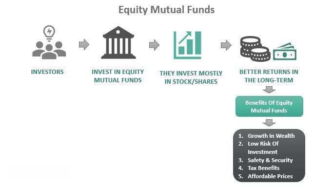

Market timing is a critical concept within the investment sphere, fundamentally influencing strategies employed by mutual fund managers and individual investors alike. It involves making decisions about buying or selling financial assets by predicting future market movements, a process that aims to maximize returns. This practice becomes significantly more sophisticated and relevant when considered alongside algorithmic trading, which utilizes computational algorithms to execute trades at speeds and efficiencies unattainable by humans. Understanding how market timing can affect mutual fund investments, especially as algorithmic trading becomes increasingly prevalent, is essential for modern investors seeking to optimize their portfolios.

This article will examine mutual fund timing and various market timing strategies, focusing on their implications for investment outcomes. We will explore how these strategies can either enhance or impair investment returns and evaluate the methodologies investors employ to achieve optimal outcomes. Additionally, we will assess the intricate relationship between market timing strategies and algorithmic trading, highlighting both their advantages and limitations in contemporary financial markets.



In today's rapidly evolving financial landscape, informed investors need to be aware of how algorithmic trading impacts market dynamics and timing strategies. Such understanding is imperative to navigate potential challenges and seize opportunities for risk-adjusted returns. By examining the synergy between market timing and algorithmic trading, investors can gain insights that propel informed and strategic investment decisions.

## Table of Contents

## What is Market Timing?

Market timing involves predicting future market movements to decide the best times to buy or sell securities. This investment strategy seeks to capitalize on short-term market fluctuations rather than adhering to a long-term investment plan. The primary goal is to enter or exit the market at precise moments to maximize returns.

A core aspect of market timing is the reliance on forecasting future price movements. Investors utilize various methodologies for prediction, such as technical analysis, which examines past market data, or [fundamental analysis](/wiki/fundamental-analysis), which focuses on economic indicators and company performance. However, achieving accurate predictions is challenging due to the inherently unpredictable nature of financial markets.

The efficacy of market timing is a topic of considerable debate among investors and financial analysts. Proponents argue that with the right tools and insights, market timing can yield significant profits. However, critics assert that consistently timing the market successfully is nearly impossible due to its complexity and volatility, advocating instead for long-term investment strategies like buy-and-hold.

The buy-and-hold strategy involves purchasing securities and maintaining possession over extended periods, regardless of market fluctuations. This approach rests on the assumption that markets will generally rise over time, thus ensuring profitability for patient investors. In contrast, market timing requires active management and frequent trading, leading to increased transaction costs and tax liabilities.

Empirical evidence on market timing remains mixed, reflecting both the potential advantages and inherent difficulties. While some studies suggest the possibility of outperforming the market through precise entry and [exit](/wiki/exit-strategy), others highlight the unpredictability of markets, thereby favoring more passive investment strategies. This divide underscores the importance of investor expertise and the integration of sophisticated tools when pursuing market timing strategies.

## Mutual Fund Timing Explained

Mutual fund timing is a specific strategy within the broader concept of market timing, targeted at mutual funds. The primary objective of mutual fund timing is to capitalize on short-term discrepancies that may arise between a mutual fund's net asset value (NAV) and the price of its underlying assets. This strategy takes advantage of the fact that while mutual funds are priced once a day at the close of trading, the underlying securities may experience price changes throughout the day. By anticipating these changes, investors can potentially realize gains.

Despite being legal, mutual fund timing is often met with criticism and is actively discouraged by fund managers. The practice can lead to increased operational costs for the mutual fund. These costs include the need to maintain higher cash reserves to accommodate quick withdrawals and additional transactions, which can undermine the returns for longer-term investors. Moreover, frequent trading may incur higher transaction fees, further impacting fund performance.

The integrity of mutual fund timing hinges upon strict adherence to the fund's established policies and is contingent on equal treatment for all investors. However, issues can arise if some investors are given preferential treatment, allowing them to execute trades based on non-public or late-breaking information. This undermines the fairness of the market and could lead to regulatory scrutiny. To mitigate these risks, many mutual funds have implemented policies such as frequent-trading fees or penalties and redemption charges to dissuade short-term trading.

In summary, while mutual fund timing can be a potentially lucrative strategy, it comes with inherent risks and challenges. The successful implementation of this strategy depends significantly on maintaining ethical practices and adhering to established policies, as deviations can detrimentally affect both the fund performance and its investors.

## Investment Strategies in Mutual Funds

Mutual fund managers utilize a variety of investment strategies to optimize returns, with market timing being a key component among these strategies. The strategic approaches can be broadly categorized into two: the top-down approach and the bottom-up approach.

The top-down approach involves analyzing macroeconomic indicators to predict market trends. This strategy starts by examining the economic environment, including factors like GDP growth rates, inflation, interest rates, and geopolitical events, to identify attractive sectors or industries. From this broader analysis, fund managers then select specific stocks or securities within these sectors that are likely to benefit from anticipated macroeconomic trends. This approach is advantageous in periods of economic predictability, where broad market movements can be more accurately forecast. However, it often requires significant expertise and access to comprehensive economic data to gauge the complex interplay of global financial factors effectively.

Conversely, the bottom-up approach focuses more on individual company performance regardless of broader market conditions. This strategy entails detailed analysis of company fundamentals such as earnings, revenue growth, management quality, competitive position, and balance sheet strength. Managers employing this strategy often believe that high-quality companies can outperform the market regardless of the economic context. This approach is beneficial in volatile or unpredictable economic environments where specific companies may present investment opportunities not immediately apparent from macro-level analyses.

Each strategy has its unique set of challenges and opportunities, often influenced by the prevailing market environment. The top-down approach might face difficulties in accurately forecasting macroeconomic shifts or handling sector-specific shocks that were unforeseen. In contrast, the bottom-up approach might overlook broader market risks or sector-level declines that can adversely impact even the strongest companies. Fund managers often choose a hybrid strategy, integrating elements from both approaches to balance the risks and exploit opportunities effectively.

The choice and execution of these strategies often depend on the manager's outlook, expertise, and the fund's investment objectives. With the rise of advanced technologies, some mutual funds are increasingly incorporating elements of [algorithmic trading](/wiki/algorithmic-trading) and quantitative analysis into their strategies, enhancing traditional methods with more precise data-driven insights.

## The Role of Algorithmic Trading

Algorithmic trading has transformed market dynamics by automating trade execution through the use of complex computational algorithms. These algorithms are designed to capitalize on market efficiencies, executing trades at a speed and frequency unachievable by human traders alone. The primary advantage of algorithmic trading is its ability to process vast quantities of market data rapidly, resulting in extremely precise timing of trades. This precision can lead to more efficient execution, reducing transaction costs and potentially increasing profitability.

At the core of algorithmic trading are advanced mathematical models capable of analyzing market data and executing transactions without human intervention. These algorithms can react to market changes within milliseconds, allowing them to exploit short-lived trading opportunities that may be invisible to manual traders. Below is a simple Python snippet demonstrating a basic structure of algorithmic trading logic:

```python
def simple_moving_average(price_list, period):
    if len(price_list) < period:
        return None
    return sum(price_list[-period:]) / period

def trading_signal(prices, short_period, long_period):
    short_sma = simple_moving_average(prices, short_period)
    long_sma = simple_moving_average(prices, long_period)
    if short_sma and long_sma:
        if short_sma > long_sma:
            return "BUY"
        elif short_sma < long_sma:
            return "SELL"
    return "HOLD"

# Example price data
prices = [110, 112, 114, 115, 117, 119, 116, 118, 120, 121]

# Generate trading signal
signal = trading_signal(prices, 3, 5)
print(f"Trading Signal: {signal}")
```

Algorithmic trading influences market timing by potentially increasing market [liquidity](/wiki/liquidity-risk-premium) as it often involves high-frequency trading ([HFT](/wiki/high-frequency-trading-strategies)), which contributes to the flow of trading volumes. However, this comes with the risk of heightened market [volatility](/wiki/volatility-trading-strategies), especially during periods of abnormal trading activity precipitated by concentrated algorithms acting on similar signals. 

The introduction of algorithmic trading poses challenges to traditional investors who may not have access to similar technological resources. At the same time, it offers new opportunities for market advantage by enabling strategies that harness small, fleeting price discrepancies across markets. Investors and fund managers who adapt by integrating algorithmic strategies can gain a competitive edge.

Overall, algorithmic trading exemplifies the intersection of technology and finance, illustrating how automation and data processing capabilities can be leveraged for strategic trading decisions. As financial markets continue to evolve, the role of algorithmic trading in shaping market behavior is likely to expand, underscoring the importance for investors to understand and navigate this digital landscape.

## Challenges and Risks

Algorithmic trading has revolutionized the financial markets by offering unparalleled efficiency and speed. However, this advancement also brings a host of challenges and risks. One major concern is technological failure. Algorithmic systems, which rely heavily on complex code and robust infrastructure, are susceptible to glitches or errors. A minor coding mistake can lead to significant financial losses due to the rapid pace at which trades are executed. Additionally, system downtimes or connectivity issues can result in missed trading opportunities or execution at unfavorable prices.

Another critical risk is market manipulation. High-frequency trading, a subset of algorithmic trading, can be used to exploit market inefficiencies, but it also raises ethical and legal questions. Tactics such as "spoofing," where traders place fake orders to influence market prices, undermine market integrity. This behavior misleads other investors about the true supply and demand, resulting in distorted market outcomes.

In response to these risks, regulatory bodies are continually updating frameworks to enhance market surveillance and prevent abusive practices. For example, the U.S. Securities and Exchange Commission (SEC) and the Commodity Futures Trading Commission (CFTC) have implemented measures to detect and penalize manipulative strategies. European markets are governed by the Markets in Financial Instruments Directive II (MiFID II), which imposes stringent requirements on algorithmic trading activities, including the need for firms to ensure their algorithms are thoroughly tested and monitored.

Market participants must carefully balance the advantages of algorithmic trading with its challenges. To navigate these complexities, traders and firms employ robust risk management strategies. Comprehensive monitoring systems help detect anomalies, while circuit breakers and kill switches can halt trading activity during crisis scenarios.

Ensuring compliance and maintaining fair practices are paramount. Firms often invest in secure, scalable infrastructure and adopt rigorous testing protocols to verify the accuracy and reliability of their trading algorithms. Moreover, transparency in algorithmic operations and effective communication with regulatory authorities help foster trust and reduce the risk of regulatory non-compliance.

In summary, while algorithmic trading offers significant benefits, it requires careful management to mitigate the associated risks. By prioritizing technology integrity, abiding by regulatory standards, and fostering a culture of transparency, market participants can harness algorithmic trading's potential while safeguarding market stability and fairness.

## Future Trends in Market Timing and Algo Trading

Advancements in [artificial intelligence](/wiki/ai-artificial-intelligence) (AI) and [machine learning](/wiki/machine-learning) are progressively shaping the future of market timing and algorithmic trading. These technologies promise to provide unprecedented accuracy in forecasting market movements by harnessing vast datasets and employing sophisticated analytical techniques. AI models, particularly those developed through [deep learning](/wiki/deep-learning), have demonstrated the ability to identify complex patterns and relationships within financial data, which are often imperceptible to human analysts. This enhanced predictive capability allows for more refined strategies in market timing, enabling investors to better anticipate fluctuations and optimize their investment decisions.

Machine learning algorithms, especially in supervised learning, are capable of training on historical data to predict future trends effectively. By continuously updating with new data, these models enhance their accuracy and adaptability, which is crucial for navigating dynamic market conditions. For instance, algorithms can be designed to detect nuanced shifts in trading volumes, price movements, or macroeconomic indicators, inciting prompt trading responses that capitalize on these insights.

As technology develops, mutual funds face the imperative to integrate such AI-driven tools to remain competitive and deliver optimal returns. This may involve restructuring investment approaches, upskilling staff to deploy and manage AI systems, or adopting hybrid strategies that blend human expertise with algorithmic precision. The incorporation of AI and machine learning in trading also encourages the expansion of [alternative data](/wiki/best-alternative-data) sources, including social media sentiment analysis and satellite imagery, which further enrich the decision-making process.

Moreover, AI-powered algorithms can enhance risk management practices by better identifying potential market threats and allowing fund managers to hedge investments more effectively. This includes the ability to simulate various market scenarios and assess their impact on portfolios, thereby offering strategic insights into risk mitigation.

In conclusion, the continuous evolution of AI and machine learning technologies holds significant potential for transforming market timing and algorithmic trading strategies. Mutual funds and investors that effectively leverage these innovations stand to gain considerable competitive advantage, improved precision in market analysis, and, ultimately, maximized returns on investment.

## Conclusion

Market timing, when integrated with algorithmic trading, offers a dual-edged advantage for mutual fund investors. The precise timing of trades, facilitated by algorithmic systems, holds the potential to maximize investment returns significantly. However, this potential is contingent on a deep understanding of both market dynamics and the intricacies of algorithmic systems, making careful execution paramount.

As algorithmic trading advances, driven by innovations in technology such as artificial intelligence and machine learning, the landscape continually shifts. These advancements promise increasingly accurate market predictions and refined strategies but require investors and fund managers to remain vigilant and adaptable. This adaptability is crucial to navigating the evolving complexities and ensuring compliance with regulatory standards.

Effectively leveraging market timing strategies in conjunction with algorithmic trading can lead to enhanced profitability by optimizing entry and exit points through data-driven decisions. Furthermore, the use of sophisticated algorithms can help minimize risk, offering a more controlled approach to investing in the volatile financial markets. Ultimately, the strategic fusion of market timing and algorithmic capabilities can provide a competitive edge, fostering both growth and stability in the investment portfolio.

## References & Further Reading

[1]: Bergstra, J., Bardenet, R., Bengio, Y., & Kégl, B. (2011). ["Algorithms for Hyper-Parameter Optimization."](https://proceedings.neurips.cc/paper/2011/file/86e8f7ab32cfd12577bc2619bc635690-Paper.pdf) Advances in Neural Information Processing Systems 24.

[2]: ["Advances in Financial Machine Learning"](https://www.amazon.com/Advances-Financial-Machine-Learning-Marcos/dp/1119482089) by Marcos Lopez de Prado

[3]: ["Evidence-Based Technical Analysis: Applying the Scientific Method and Statistical Inference to Trading Signals"](https://www.amazon.com/Evidence-Based-Technical-Analysis-Scientific-Statistical/dp/0470008741) by David Aronson

[4]: ["Machine Learning for Algorithmic Trading"](https://github.com/stefan-jansen/machine-learning-for-trading) by Stefan Jansen

[5]: ["Quantitative Trading: How to Build Your Own Algorithmic Trading Business"](https://www.amazon.com/Quantitative-Trading-Build-Algorithmic-Business/dp/1119800064) by Ernest P. Chan