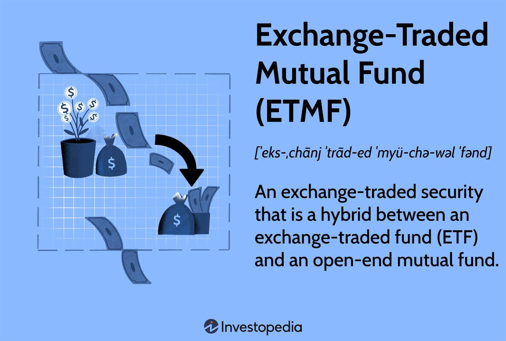

In the complex financial ecosystem, understanding the various components involved in trading and investment management is essential. The intricacies of trade settlement, mutual funds, the clearing process, and algorithmic trading form the backbone of modern financial markets. Each of these elements plays a critical role, supporting and enhancing the efficiency and functionality of the market system.

Trade settlement ensures the accurate and timely execution of transactions, a crucial component in maintaining market confidence and operational effectiveness. On the other hand, mutual funds facilitate diversified investment opportunities, enabling individual investors to partake in expertly managed portfolios with minimal effort and risk exposure. The clearing process acts as a safeguard, reducing counterparty risk and assuring that all market transactions are completed securely. Meanwhile, algorithmic trading represents technological advancement, offering rapid execution and data analysis capabilities that were previously unattainable.

Understanding these processes is crucial for investors, traders, and financial professionals to navigate the market effectively. With tight interdependencies among these components, a comprehensive grasp of their functions and interactions is imperative. This article aims to present a clear and thorough overview of these financial operations, focusing on how they collectively sustain global markets. We invite you to explore each facet, refining your understanding and awareness of these integral financial operations.

## Table of Contents

## Understanding Trade Settlement

Trade settlement represents the final stage of a trading process, where the transfer of securities from the seller to the buyer is executed, and the corresponding payment is made. This critical function ensures the integrity and financial soundness of securities transactions.

The trade settlement process involves a series of coordinated procedures designed to ensure accuracy and timeliness. Initially, both the buyer and seller must confirm the details of the trade, a practice known as trade confirmation. Following this, the trade is entered into the systems of both parties involved — often facilitated by financial intermediaries such as brokers or custodians.

One of the cornerstones of the settlement process is the "T+2" settlement cycle, widely adopted in many global markets. The term "T+2" signifies that the settlement occurs two business days after the trade date (designated as T). This timeframe is designed to allow sufficient time for all the necessary administrative and logistical tasks, such as validation of trade details and the movement of securities and funds through the appropriate channels.

Efficient settlement mechanisms are essential for maintaining market stability. Failures in trade settlement can result in significant financial risks and market inefficiencies, such as increased borrowing costs or [liquidity](/wiki/liquidity-risk-premium) constraints. When a trade fails to settle, it can disrupt the cash flow and operational plans of the parties involved, possibly leading to cascading effects on the broader financial system.

Technological advancements have made significant strides in improving the settlement process, reducing the time it takes and minimizing the risk of errors. Innovations such as electronic trading platforms, automated clearing systems, and real-time data analytics have streamlined operations, enhancing the efficiency and reliability of trade settlements. Blockchain technology, for example, is being explored as a means to create immutable records of transactions and expedite the settlement process through smart contracts, which automatically execute the terms of an agreement once predefined conditions are met.

As the financial industry continues to evolve with technology, continuous improvement and adaptation of the settlement process are vital to support the growing complexity and speed of financial transactions while safeguarding market participants from systemic risks.

## The Role of Mutual Funds

Mutual funds serve as a vital conduit for individual and institutional investors by pooling capital to invest in a diversified assortment of securities such as stocks, bonds, and other assets. This diversification reduces individual investment risk and provides investors who may not have the expertise, time, or resources to create and manage a portfolio themselves, access to professionally managed portfolios.

In the financial ecosystem, mutual funds contribute significantly to market liquidity. By accumulating funds from a vast number of participants, mutual funds enable significant buying and selling activities which can stabilize markets and reduce [volatility](/wiki/volatility-trading-strategies). Their presence ensures that capital is continuously injected into the financial markets, often making them integral to the economic health of the securities market.

Purchasing and redeeming shares in mutual funds is a process distinct from trading individual stocks. When investors buy shares in a mutual fund, their money is pooled with that of other shareholders, and mutual fund managers allocate this pooled capital according to the fund's investment strategy. The value of these shares is not determined by real-time trading but is instead calculated at the end of each trading day when the net asset value (NAV) of the mutual fund is computed. This is a marked difference from the near-instantaneous settlements characteristic of stock trading.

The unique settlement process of mutual funds further distinguishes them from individual stock trades. When an investor buys or sells mutual fund shares, the transaction settles based on the T+1 settlement cycle, which means that the settlement occurs one business day after the trade date. This timing can impact an investor’s portfolio management and requires careful planning to ensure liquidity needs are met.

Regulatory frameworks and market dynamics play critical roles in the operation of mutual funds. Agencies like the Securities and Exchange Commission (SEC) in the United States enforce rules that govern mutual funds, ensuring transparency, fair treatment of investors, and systematic risk mitigation through regulations such as disclosure requirements and diversification mandates. Additionally, market conditions, interest rates, and economic policies can influence mutual fund operations, impacting their settlement processes and overall market strategies.

In conclusion, mutual funds are pivotal financial instruments that democratize investment by allowing investors to participate in diversified portfolios managed by professionals. They contribute to market stability and liquidity while presenting unique operational processes essential for investors to understand to optimize their financial strategies.

## Clearing Process in Financial Markets

The clearing process in financial markets is a fundamental aspect of ensuring that trades are completed accurately and efficiently after execution. At the heart of this process are clearinghouses, which serve as intermediaries between buyers and sellers. These entities play a pivotal role in minimizing counterparty risk, a potential default risk that occurs when one party in a transaction fails to meet their contractual obligations. By acting as a central point in the trade process, clearinghouses guarantee that both parties fulfill their commitments, thereby reinforcing market stability and efficiency.

Clearinghouses manage a variety of instruments, including equities, derivatives, and bonds, each with its own distinct clearing process. The complexity of clearing procedures varies based on the instrument. For instance, derivative clearing involves managing collateral and margin requirements due to the high leverage typically involved. Conversely, equity clearing may focus more on transferring ownership titles and ensuring timely settlement within a specified settlement cycle, often T+2.

The advent of technology has significantly impacted the clearing process. Innovations such as blockchain technology are transforming traditional clearing systems by enhancing transparency and speed. Blockchain, with its decentralized ledger capabilities, can provide real-time clearing and settlement, reducing the time and cost associated with traditional methods. This technology enables greater transparency by providing an immutable and accessible record of transactions, which can be particularly advantageous for clearinghouses as they strive to enhance the trust and integrity of financial markets.

In summary, the clearing process is an integral part of financial market operations, with clearinghouses centralizing and mitigating counterparty risk. The introduction of blockchain technology and other technological advancements promises to streamline these processes further, providing more transparent and efficient clearing systems. As the finance industry progresses, such innovations are crucial for maintaining market resilience and efficiency.

## Algo Trading: The New Frontier

Algorithmic trading, commonly known as algo trading, leverages computer algorithms to execute trading decisions, enhancing speed and efficiency in financial markets. These algorithms process vast quantities of market data, facilitating buy or sell orders based on predetermined criteria, often without direct human intervention. Algoritmic trading enables rapid trade execution, minimizing the impact of market fluctuations on trading strategies.

The rise of algo trading is evident among institutional investors, such as hedge funds and investment banks, who utilize these strategies to manage substantial portfolios. They benefit from the ability to execute complex trading strategies that would be impractical manually due to the sheer data [volume](/wiki/volume-trading-strategy) and speed required. However, algo trading is also gaining popularity among retail traders, supported by advancements in technology and accessibility to sophisticated trading platforms.

Despite its merits, [algorithmic trading](/wiki/algorithmic-trading) is not without risks. The speed and volume of trades facilitated by these algorithms can contribute to increased market volatility. Notably, events like the "Flash Crash" of May 6, 2010, highlight how algorithms can accelerate market movements, leading to sharp, short-lived fluctuations. Such incidents underscore the potential systemic threats posed by algorithmic trading if left unchecked.

Managing these risks necessitates robust regulations and technological safeguards. Regulatory bodies, like the Securities and Exchange Commission (SEC) in the United States and the European Securities and Markets Authority (ESMA) in Europe, have developed frameworks to oversee algorithmic trading activities. These guidelines aim to maintain market integrity and prevent abuse, such as market manipulation or excessive risk-taking.

Moreover, implementing technological measures, including circuit breakers and kill switches, provides a fail-safe against erratic algorithm behavior. These mechanisms can halt trading in extreme conditions, ensuring market stability. As algorithmic trading continues to evolve, market participants must remain vigilant to its potential pitfalls, balancing innovation with prudence to sustain an efficient, stable financial ecosystem.

## Interconnections Between These Components

Trade settlement, mutual funds, clearing processes, and algorithmic trading are integral components of the financial market ecosystem, interlinked in ways that ensure market stability and efficiency. An understanding of their interconnectedness reveals much about the dynamic landscape of modern finance.

Improving settlement systems can significantly enhance the performance and reliability of mutual fund transactions. Settlement systems are designed to ensure that the exchange of securities and payments between transacting parties occurs smoothly. For mutual funds, which involve pooling money from many investors to purchase a diverse portfolio of assets, efficient settlement is vital to maintain liquidity and meet investor obligations promptly. When settlement processes are streamlined, mutual funds can operate more reliably, effectively managing investor contributions and redemptions without delays that could impact performance.

Effective clearing mechanisms are crucial in reducing systemic risk and ensuring the seamless operation of algorithmic trading. Clearinghouses, acting as intermediaries, verify and finalize transactions post-execution. They mitigate counterparty risk, guaranteeing that both buyer and seller meet their trade commitments. In the context of algorithmic trading, which relies on executing high volumes of transactions at rapid speeds, the clearing process must be robust to prevent potential disruptions. Advanced clearing solutions can keep pace with algorithmic trading demands, thus minimizing systemic vulnerabilities and enhancing market resilience.

Moreover, mutual funds frequently employ algorithmic strategies to handle large volumes of trades. These strategies enable funds to optimize returns, leveraging algorithms to make investment decisions based on complex data analyses. Algorithms can also assist in minimizing costs associated with trading, such as timing trades to take advantage of market conditions. By integrating algorithmic trading methodologies, mutual funds can fine-tune their trading activities, ensuring that they are both efficient and aligned with their investment objectives.

Understanding these interconnections provides valuable insights into the mechanics of modern financial markets. Each component—trade settlement, mutual funds, clearing processes, and algorithmic trading—contributes to the broader financial system's infrastructure. Together, they enhance market efficiency, liquidity, and stability, essential for supporting economic growth and investor confidence. As technological and regulatory developments shape these systems, staying informed about their interactions allows investors and financial professionals to navigate the complexities of today's markets effectively.

## Conclusion

In the rapidly evolving financial landscape, the processes of trade settlement, mutual funds operation, clearing, and algorithmic trading form the backbone of financial market infrastructure. Each of these components plays an integral role in supporting global economic growth and ensuring market stability. Trade settlement ensures that securities transactions are completed with accuracy and timeliness, reducing the risk of market inefficiencies. Mutual funds provide liquidity and investment opportunities to a broad range of investors, promoting financial inclusivity and portfolio diversification.

The clearing process is crucial for maintaining confidence in financial markets by confirming and finalizing trades, reducing counterparty risk, and ensuring the fulfillment of contracts. Similarly, algorithmic trading has introduced new dimensions of speed and efficiency in executing trades, though it also necessitates stringent risk management and regulatory oversight to mitigate potential systemic issues.

For market participants, it is vital to stay informed about technological advancements and evolving regulations that impact these fundamental processes. By doing so, investors and financial professionals can navigate the complexities of modern finance more effectively, leveraging these mechanisms to optimize their strategies and outcomes. Additionally, the financial community must remain committed to innovation and continuous adaptation to foster sustainable and efficient market operations in the face of ongoing change. This commitment not only bolsters the resilience of financial systems but also enhances their capacity to support long-term economic stability and growth.

## References & Further Reading

[1]: ["Clearing and Settlement in the World's Securities Markets"](https://www.sec.gov/newsroom/press-releases/2023-247) by David Loader

[2]: Liu, Y. (2016). ["Algorithmic and High-Frequency Trading"](https://assets.cambridge.org/97811070/91146/frontmatter/9781107091146_frontmatter.pdf) by Álvaro Cartea, Sebastian Jaimungal, & José Penalva

[3]: ["Mutual Funds: Risk and Performance Analysis for Decision Making"](https://papers.ssrn.com/sol3/papers.cfm?abstract_id=2026563) by John A. Haslem

[4]: "The Role of Technology in Trading: Algo Trading." Retrieved from [Investopedia](https://www.cliffsnotes.com/study-notes/21239137)

[5]: Bank for International Settlements. (2016). ["Principles for Financial Market Infrastructures"](https://www.bis.org/cpmi/info_pfmi.htm)

[6]: Securities and Exchange Commission. ["Investor Bulletin: Mutual Funds"](https://www.sec.gov/resources-for-investors/investor-alerts-bulletins/investor-bulletin-characteristics-mutual-funds-exchange-traded-funds-etfs)

[7]: Hull, J. C. (2017). ["Options, Futures, and Other Derivatives"](https://www.semanticscholar.org/paper/Options%2C-Futures%2C-and-Other-Derivatives-Hull/89bdee500c8623864fc9eb7a471546aa713acc44)

[8]: Najarian, J., & Najarian, P. (2013). ["How We Trade Options: Building Wealth, Creating Income and Reducing Risk"](https://archive.org/details/howwetradeoption0000naja)