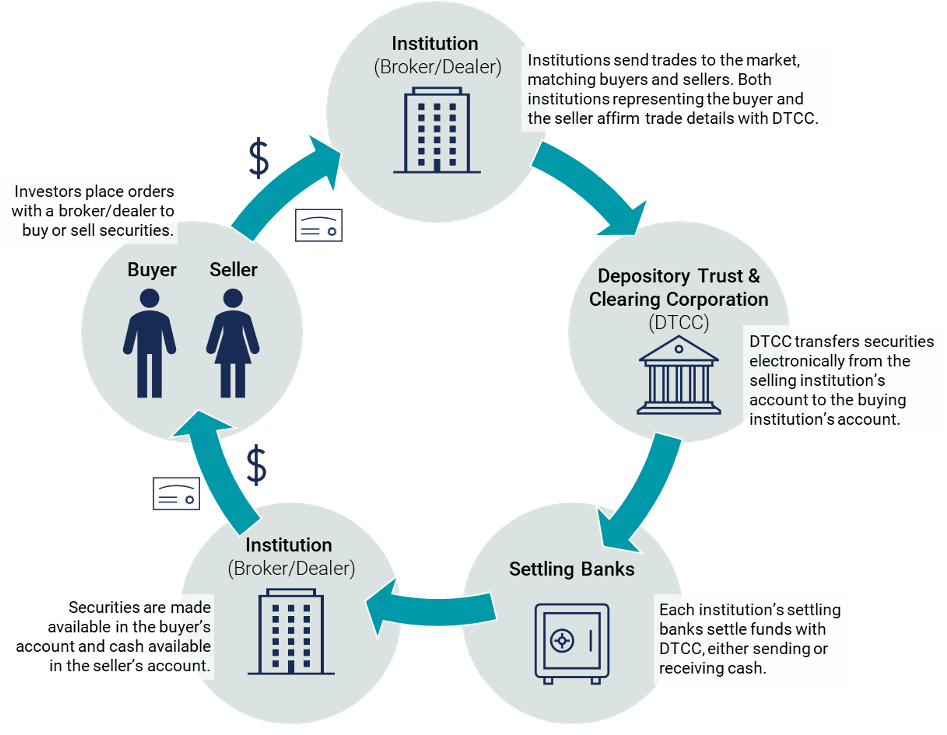

## Table of Contents

## What is a mutual fund?

A mutual fund is a type of investment where many people put their money together to buy a variety of stocks, bonds, or other assets. It's like a big basket where everyone's money is mixed and managed by a professional. This makes it easier for people to invest in a diverse range of things without having to pick each one themselves.

When you invest in a mutual fund, you buy shares of the fund. The value of your shares goes up or down based on how well the investments in the fund are doing. This can be a good way to grow your money over time, but it also comes with risks because the value can go down as well as up. Mutual funds are popular because they offer a simple way to invest in a broad range of assets, which can help spread out the risk.

## What does trade clearing and settlement mean in the context of mutual funds?

Trade clearing and settlement in the context of mutual funds is the process that happens after you buy or sell shares of a mutual fund. When you place an order to buy or sell, it doesn't happen instantly. Instead, the trade needs to be cleared and settled. Clearing means making sure all the details of the trade are correct and that both the buyer and seller agree on the terms. Settlement is when the actual exchange happens: the buyer pays the money, and the seller gives up the shares.

This process is important to make sure everything is done fairly and correctly. For mutual funds, clearing usually happens quickly, often on the same day the trade is made. Settlement, however, can take a few days. In the U.S., for example, it typically takes two business days after the trade date for the settlement to be complete. During this time, the money and shares are moved between accounts, and once everything is settled, the trade is final.

## How does the process of trade clearing work for mutual funds?

When you buy or sell mutual fund shares, the process of trade clearing makes sure everything is correct before the trade is final. It's like checking all the details of your order to make sure you and the other person agree on what's being bought and sold. This step is important to avoid mistakes and to make sure the trade is fair. For mutual funds, clearing usually happens quickly, often on the same day you make the trade.

During clearing, the mutual fund company or the broker checks the trade details. They look at things like the number of shares, the price, and the date of the trade. If everything matches up and there are no issues, the trade moves on to the next step, which is settlement. Clearing helps keep the trading process smooth and trustworthy for everyone involved.

## What are the steps involved in the settlement of mutual fund trades?

Settlement is what happens after the trade is cleared. It's when the actual exchange of money and shares takes place. When you buy mutual fund shares, you need to pay for them, and when you sell, you need to give up your shares. This process usually takes a few days to complete. In the U.S., it typically takes two business days after the trade date for the settlement to happen. During this time, the money moves from your account to the seller's account, and the shares move from the seller to your account.

Once the settlement is done, the trade is final. This means you officially own the shares if you bought them, or you no longer own them if you sold them. The mutual fund company or the broker makes sure all the money and shares are moved correctly. This step is important because it makes sure everyone gets what they are supposed to get from the trade. After settlement, you can see the updated balance in your account, showing the new shares you bought or the money you got from selling.

## What is the typical timeline for clearing and settling mutual fund trades?

When you buy or sell mutual fund shares, the process starts with clearing. Clearing is when the mutual fund company or broker checks all the details of your trade to make sure everything is correct. This includes checking the number of shares, the price, and the date of the trade. Clearing usually happens quickly, often on the same day you make the trade. This step is important to make sure the trade is fair and there are no mistakes.

After clearing, the next step is settlement. Settlement is when the actual exchange of money and shares happens. If you're buying shares, you pay the money, and if you're selling, you give up your shares. In the U.S., settlement typically takes two business days after the trade date. During this time, the money and shares are moved between accounts. Once everything is settled, the trade is final, and you can see the updated balance in your account showing the new shares you bought or the money you got from selling.

## What are the roles of different parties involved in mutual fund trade clearing and settlement?

In the process of clearing and settling mutual fund trades, different parties play important roles. The investor is the person who wants to buy or sell mutual fund shares. They place the order with a broker or directly with the mutual fund company. The broker or mutual fund company then takes on the role of making sure the trade happens correctly. They check all the details of the trade during the clearing process to make sure everything matches up and there are no mistakes.

Once the trade is cleared, the settlement process begins. The mutual fund company or the broker works with a clearinghouse or a custodian to move the money and shares between accounts. The clearinghouse acts like a middleman to make sure the trade is fair and that both the buyer and seller get what they are supposed to get. The custodian holds the shares and manages the transfer of assets. After the settlement is complete, the investor's account is updated to show the new shares they bought or the money they received from selling.

## What are the common risks associated with mutual fund trade clearing and settlement?

When you buy or sell mutual fund shares, there are some risks that can happen during the clearing and settlement process. One risk is that there might be a mistake in the trade details. If the number of shares, the price, or the date of the trade is wrong, it can cause problems. Another risk is that the money or shares might not be moved correctly during settlement. If the money doesn't go to the right place, or if the shares don't get transferred properly, it can delay the trade or cause other issues.

Another risk is that something might happen to the other party involved in the trade. If the person you're buying from or selling to can't complete their part of the deal, it can cause problems. This is why clearinghouses and custodians are important. They help make sure the trade is fair and that both the buyer and seller get what they are supposed to get. Even with these safeguards, there's always a small chance that something could go wrong, so it's good to be aware of these risks when trading mutual fund shares.

## How do regulations impact mutual fund trade clearing and settlement processes?

Regulations play a big role in how mutual fund trade clearing and settlement processes work. They help make sure that trades are fair and safe for everyone. In the U.S., rules from the Securities and Exchange Commission (SEC) and other groups set standards for how trades should be cleared and settled. These rules say things like how long it should take to settle a trade and what information needs to be checked during clearing. They also make sure that the people who handle the trades, like brokers and clearinghouses, do their jobs correctly.

These regulations help lower the risks that can come up during clearing and settlement. For example, they make sure that money and shares are moved correctly and that there are ways to fix problems if they happen. By following these rules, the mutual fund industry can keep things running smoothly and protect investors. This means that when you buy or sell mutual fund shares, you can feel more confident that the process will be fair and that you'll get what you're supposed to get.

## What technologies are used to facilitate mutual fund trade clearing and settlement?

Technology plays a big role in making mutual fund trade clearing and settlement easier and faster. Computers and special software help keep track of all the trades and make sure everything is done correctly. When you buy or sell mutual fund shares, the information about your trade goes into a computer system. This system checks all the details, like the number of shares and the price, to make sure everything matches up. It also helps move the money and shares between accounts during settlement. This makes the whole process quicker and less likely to have mistakes.

Another important technology is the use of electronic communication networks (ECNs). These networks let brokers and mutual fund companies talk to each other and share information quickly. They help make sure that trades are cleared and settled on time. Also, many mutual fund companies use automated systems to handle the clearing and settlement process. These systems can work around the clock, which means trades can be processed even when the markets are closed. This helps keep everything running smoothly and makes it easier for investors to buy and sell shares.

## How do international mutual fund trades differ in terms of clearing and settlement?

When you buy or sell mutual fund shares from another country, the clearing and settlement process can be different from what happens in your own country. In the U.S., it usually takes two business days to settle a trade, but in other countries, it might take longer or shorter. Each country has its own rules and systems for handling trades, so the process can be more complicated. You might need to work with different brokers or clearinghouses that know how to handle trades in that country. This can add extra steps and time to the process.

Also, when you trade international mutual funds, you have to think about things like different time zones and holidays. If the market you're trading in is closed because of a holiday, it can delay the clearing and settlement. Currency exchange is another thing to consider. If you're buying or selling shares in a different currency, the money has to be changed before it can be moved. This can add more steps and risks to the process. Even though it can be more complicated, technology and special services help make international mutual fund trades smoother and safer.

## What are the best practices for managing mutual fund trade clearing and settlement?

To manage mutual fund trade clearing and settlement well, it's important to keep good records of all your trades. Write down the details like the number of shares, the price, and the date of the trade. This helps make sure everything is correct during the clearing process. Also, work with a good broker or mutual fund company that knows how to handle trades well. They can help make sure the trade is cleared and settled on time. It's also a good idea to check your account regularly to make sure the money and shares are moved correctly during settlement.

Another important thing is to understand the rules and timelines for clearing and settlement. In the U.S., it usually takes two business days to settle a trade, but it can be different in other countries. Knowing these rules can help you plan your trades better and avoid surprises. If you're trading international mutual funds, be aware of things like different time zones, holidays, and currency exchange. Using technology and working with experienced brokers can help make the process smoother and safer. By following these best practices, you can manage mutual fund trade clearing and settlement more effectively.

## What future trends might affect mutual fund trade clearing and settlement?

In the future, technology will likely play a bigger role in making mutual fund trade clearing and settlement faster and easier. Computers and special software are already used to keep track of trades and move money and shares between accounts. But new technology like blockchain could make things even better. Blockchain is like a digital record book that everyone can see and trust. It could help make clearing and settlement happen almost instantly, instead of taking a few days. This would make trading mutual funds quicker and safer for everyone.

Another trend that might affect mutual fund trade clearing and settlement is more rules from governments and other groups. As more people invest in mutual funds, there might be new rules to make sure trades are fair and safe. These rules could change how long it takes to clear and settle trades, or they might require new ways to check the details of trades. Keeping up with these changes will be important for brokers and mutual fund companies. They will need to use new technology and follow the new rules to keep everything running smoothly for investors.

## References & Further Reading

[1]: ["Clearing and Settlement in the World's Securities Markets"](https://www.sec.gov/newsroom/press-releases/2023-247) by David Loader

[2]: Liu, Y. (2016). ["Algorithmic and High-Frequency Trading"](https://assets.cambridge.org/97811070/91146/frontmatter/9781107091146_frontmatter.pdf) by Álvaro Cartea, Sebastian Jaimungal, & José Penalva

[3]: ["Mutual Funds: Risk and Performance Analysis for Decision Making"](https://papers.ssrn.com/sol3/papers.cfm?abstract_id=2026563) by John A. Haslem

[4]: "The Role of Technology in Trading: Algo Trading." Retrieved from [Investopedia](https://www.cliffsnotes.com/study-notes/21239137)

[5]: Bank for International Settlements. (2016). ["Principles for Financial Market Infrastructures"](https://www.bis.org/cpmi/info_pfmi.htm)

[6]: Securities and Exchange Commission. ["Investor Bulletin: Mutual Funds"](https://www.sec.gov/resources-for-investors/investor-alerts-bulletins/investor-bulletin-characteristics-mutual-funds-exchange-traded-funds-etfs)

[7]: Hull, J. C. (2017). ["Options, Futures, and Other Derivatives"](https://www.semanticscholar.org/paper/Options%2C-Futures%2C-and-Other-Derivatives-Hull/89bdee500c8623864fc9eb7a471546aa713acc44)

[8]: Najarian, J., & Najarian, P. (2013). ["How We Trade Options: Building Wealth, Creating Income and Reducing Risk"](https://archive.org/details/howwetradeoption0000naja)