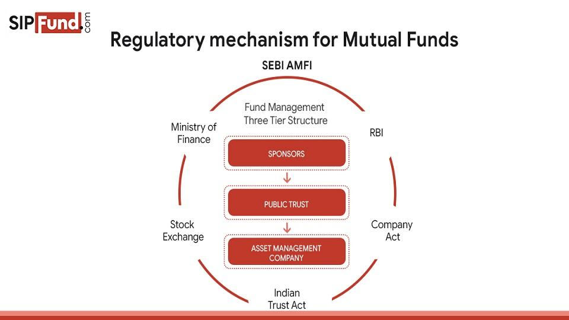

## Table of Contents

## What are mutual funds and why are they regulated?

Mutual funds are a type of investment where many people pool their money together to buy a variety of stocks, bonds, or other assets. This makes it easier for people to invest because they don't have to pick individual stocks themselves. Instead, a professional manager handles the buying and selling of the investments within the fund. This can be a good option for people who want to grow their money but don't have the time or knowledge to manage their investments on their own.

Mutual funds are regulated by government agencies, like the Securities and Exchange Commission (SEC) in the United States, to protect investors. Regulation helps make sure that the people running the mutual funds are honest and follow the rules. It also ensures that investors get clear and accurate information about the fund's performance and fees. Without regulation, there could be more risk of fraud or mismanagement, which could harm investors and shake their trust in the financial system.

## What is the primary purpose of mutual fund trading regulations?

The main goal of mutual fund trading regulations is to keep investors safe and make sure the market is fair. These rules help stop bad behavior like fraud and make sure that everyone follows the same guidelines. This way, people can trust that their money is being handled properly and that they're getting a fair deal.

Regulations also make sure that investors get all the important information they need. This includes details about how the fund is doing, what fees they might have to pay, and any risks involved. By having clear rules, investors can make better choices about where to put their money, and they can feel more confident that the mutual fund is being managed in a way that looks out for their best interests.

## Who are the main regulatory bodies overseeing mutual fund trading?

In the United States, the main regulatory body for mutual funds is the Securities and Exchange Commission (SEC). The SEC makes rules to protect people who invest in mutual funds. They check that the people running the funds are honest and that investors get clear information about how the fund is doing and what fees they might have to pay.

In other countries, different groups do similar work. For example, in the United Kingdom, the Financial Conduct Authority (FCA) oversees mutual funds. They make sure that the funds follow the rules and that investors are treated fairly. These regulatory bodies help keep the investment world safe and trustworthy for everyone.

## What are the key regulations that govern mutual fund trading?

The main rules that govern mutual fund trading are set by the Securities and Exchange Commission (SEC) in the United States. One important rule is the Investment Company Act of 1940, which makes sure that mutual funds are managed in a way that protects investors. This law says that funds have to be honest about what they're doing with the money and how much they're charging in fees. It also makes sure that the people running the fund aren't doing anything that could hurt the investors.

Another key regulation is the Securities Act of 1933 and the Securities Exchange Act of 1934. These laws make sure that mutual funds give investors all the important information they need before they buy into a fund. This includes details about the fund's goals, risks, and costs. The rules also stop people from lying or leaving out important information when they're selling mutual funds. By having these rules, the government helps make sure that the mutual fund market is fair and safe for everyone who wants to invest.

## How do mutual fund trading regulations protect investors?

Mutual fund trading regulations protect investors by making sure that the people running the funds are honest and follow the rules. The Securities and Exchange Commission (SEC) in the United States keeps a close eye on mutual funds to stop any bad behavior like fraud. This means that the people managing the funds can't lie or hide important information from investors. By having these rules, investors can trust that their money is being handled properly and that the fund managers are looking out for their best interests.

These regulations also make sure that investors get all the important information they need before they decide to invest. This includes details about how the fund is doing, what fees they might have to pay, and any risks involved. By having clear and accurate information, investors can make better choices about where to put their money. This helps them feel more confident that they're making smart decisions and that the mutual fund market is fair and safe for everyone.

## What are the compliance requirements for mutual fund managers?

Mutual fund managers have to follow a lot of rules to make sure they're doing things the right way. They need to be honest and tell investors everything important about the fund, like how it's doing, what fees they might have to pay, and any risks involved. This is all part of the rules set by the Securities and Exchange Commission (SEC) in the United States. The SEC makes sure that managers aren't doing anything sneaky or dishonest that could hurt investors. By following these rules, managers help keep the market fair and safe for everyone who wants to invest.

Another big part of what managers have to do is keep good records and report things regularly. They need to keep track of all the money coming in and going out of the fund, and they have to send reports to the SEC to show that they're following the rules. This helps the SEC check that everything is being done correctly. Managers also have to make sure they're not mixing their own money with the fund's money, which is called keeping things separate. By doing all these things, managers help make sure that investors can trust them and feel good about where they're putting their money.

## How do regulations affect the buying and selling of mutual fund shares?

Regulations make sure that buying and selling mutual fund shares is fair and safe for everyone. When you want to buy or sell shares, the rules say that the fund has to tell you the price of the shares at the end of each day. This is called the net asset value (NAV), and it's based on how much the investments in the fund are worth. By having a clear price every day, you know exactly what you're paying or getting when you trade your shares. This helps stop people from cheating or making secret deals that could hurt other investors.

The rules also make sure that everyone gets treated the same when they buy or sell shares. For example, if a lot of people want to sell their shares at the same time, the fund has to handle all those orders fairly. They can't pick and choose who gets to sell first. This is important because it keeps things fair and stops one person from getting a better deal than someone else. By following these rules, mutual funds help make sure that the market works well and that investors can trust the system.

## What are the penalties for non-compliance with mutual fund trading regulations?

If mutual fund managers don't follow the rules, they can get into big trouble. The Securities and Exchange Commission (SEC) in the United States can make them pay fines, which are like penalties for breaking the rules. These fines can be a lot of money, and they're meant to stop managers from doing anything wrong. Sometimes, if the managers did something really bad, they might even have to go to court and could end up in jail. This shows how serious it is to follow the rules and keep investors safe.

The SEC can also stop managers from working in the industry if they break the rules. This means they can't manage any more funds, which can be a big deal for their careers. The SEC might also make the managers give back any money they made by breaking the rules. This is called disgorgement, and it's another way to make sure that doing the wrong thing doesn't pay off. By having these penalties, the rules help keep the mutual fund market honest and fair for everyone.

## How have mutual fund trading regulations evolved over the past decade?

Over the past decade, mutual fund trading regulations have changed a lot to keep up with new technology and to make things safer for investors. One big change is the focus on making everything more clear and open. The SEC now wants mutual funds to tell investors more about what's going on with their money, like how much they're paying in fees and how the fund is doing. This helps people make better choices about where to put their money. Also, the rules about how funds can advertise and share information have gotten stricter. This is to stop funds from saying things that aren't true and to make sure investors get honest information.

Another important change is how the rules now deal with new ways of trading, like doing everything online. The SEC has made new rules to make sure that buying and selling mutual fund shares through apps or websites is safe and fair. They've also worked on stopping bad behavior, like people trying to cheat the system by quickly buying and selling shares to make a quick profit. This is called market timing, and the new rules help stop it from happening. Overall, these changes show that the rules are always getting better to protect investors and keep the market fair for everyone.

## What are the international differences in mutual fund trading regulations?

Mutual fund trading regulations can be different in different countries. In the United States, the Securities and Exchange Commission (SEC) makes the rules to keep investors safe. They focus a lot on making sure funds tell the truth about what they're doing with the money and how much they're charging in fees. In the United Kingdom, the Financial Conduct Authority (FCA) does a similar job. They also want to make sure that funds are honest and that investors get all the important information they need. But the rules can be a bit different, like how much detail funds have to give about their investments or how often they have to report things.

In Europe, the European Union has its own set of rules called the Undertakings for Collective Investment in Transferable Securities (UCITS) directive. This helps make sure that mutual funds in different European countries follow similar rules, which makes it easier for people to invest across borders. In Asia, countries like Japan and Singapore have their own regulators, like the Financial Services Agency (FSA) in Japan and the Monetary Authority of Singapore (MAS). These regulators make rules that fit their own markets, but they also try to keep up with global standards to make investing safer and more trustworthy for everyone.

## How do advanced trading strategies comply with mutual fund regulations?

Advanced trading strategies, like using computers to buy and sell shares quickly, have to follow the same rules as everyone else when it comes to mutual funds. These rules are made by groups like the Securities and Exchange Commission (SEC) in the United States. The main idea is to make sure that everyone is treated fairly and that no one can cheat the system. For example, if someone wants to use a computer program to trade a lot of shares in a short time, they have to make sure they're not doing anything that could hurt other investors, like trying to change the price of the shares in a sneaky way.

The rules also say that mutual funds have to tell investors everything important about what they're doing. This means that if a fund is using advanced trading strategies, they have to explain it clearly so people know what's going on with their money. The fund managers have to keep good records and report everything to the regulators to show they're following the rules. By doing this, they help make sure that the market stays fair and that investors can trust that their money is being handled the right way.

## What future trends might influence mutual fund trading regulations?

In the future, new technology like [artificial intelligence](/wiki/ai-artificial-intelligence) and blockchain might change how mutual fund trading works. These technologies could make buying and selling shares faster and easier. But they also bring new risks, like people using computers to cheat the system. Because of this, the rules might need to change to keep up. Regulators might make new laws to stop people from using these technologies in bad ways and to make sure that everyone is still treated fairly.

Another big trend is that more people are investing in things like environmental, social, and governance ([ESG](/wiki/esg-investing)) funds. These funds focus on companies that are good for the planet or treat their workers well. As more people care about these issues, the rules might change to make sure that these funds are really doing what they say they're doing. Regulators might want to make sure that these funds are honest about their investments and that they're not just saying they're good for the environment without actually doing anything. This way, investors can trust that their money is being used in a way that matches their values.

## References & Further Reading

[1]: ["Decoding Financial Trading Systems"](https://www.quantifiedstrategies.com/trading-system/) by Joseph P. Pardo

[2]: Brogaard, J., Hendershott, T., & Riordan, R. (2014). ["High-frequency trading and price discovery."](https://www.jstor.org/stable/24465658) Review of Financial Studies, 27(8), 2267–2306.

[3]: Chordia, T., Roll, R., & Subrahmanyam, A. (2008). ["Liquidity and Market Efficiency."](https://www.sciencedirect.com/science/article/pii/S0304405X07001833) Journal of Financial Economics, 87(2), 249-268.

[4]: ["The Art of Computer Programming, Volume 3: Sorting and Searching"](https://www.amazon.com/Art-Computer-Programming-Searching-Information/dp/020103803X) by Donald E. Knuth

[5]: Hasbrouck, J., & Saar, G. (2013). ["Low-latency trading."](https://papers.ssrn.com/sol3/papers.cfm?abstract_id=1695460) Review of Financial Studies, 26(9), 2345-2384.

[6]: "Regulation of Exchanges and Alternative Trading Systems: A Comparative Analysis" by Howell E. Jackson and Paul G. Mahoney, [Harvard University Press](https://hls.harvard.edu/faculty/howell-e-jackson/)

[7]: Malkiel, B. G. (1999). ["A Random Walk Down Wall Street: The Time-tested Strategy for Successful Investing."](https://www.amazon.com/Random-Walk-Down-Wall-Street/dp/0393358380) W.W. Norton & Company.

[8]: Kirilenko, A. A., Kyle, A. S., Samadi, M., & Tuzun, T. (2017). ["The Flash Crash: High‐Frequency Trading in an Electronic Market."](https://www.jstor.org/stable/26652722) Journal of Finance, 72(3), 967-998.