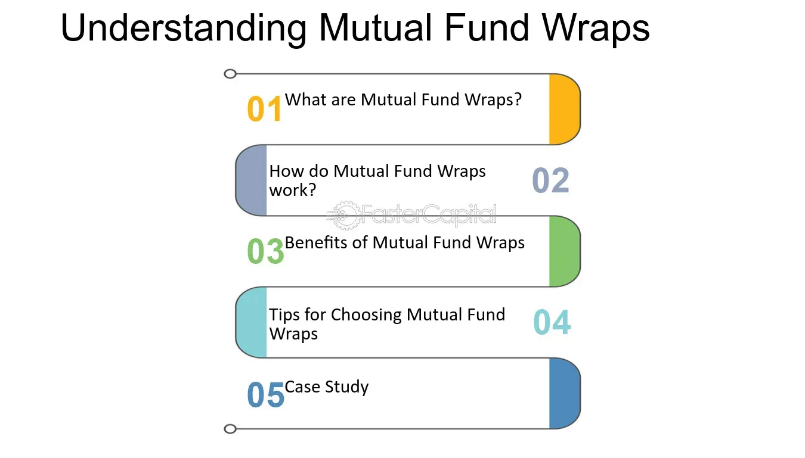

## Table of Contents

## What is a mutual fund wrap?

A mutual fund wrap, also known as a wrap account, is a type of investment account where an investor pays a single fee for a bundle of services. These services usually include investment advice, management of the portfolio, and the buying and selling of mutual funds. The idea behind a wrap account is to simplify the investment process for the investor by having everything managed by a professional.

Wrap accounts are popular because they offer convenience and can be tailored to an investor's specific needs and goals. Instead of paying separate fees for different services, the investor pays one fee, which is typically a percentage of the assets in the account. This can make it easier to understand and manage costs. However, it's important for investors to compare the total costs and benefits of a wrap account with other investment options to make sure it's the best choice for them.

## How does a mutual fund wrap differ from a traditional mutual fund?

A mutual fund wrap and a traditional mutual fund are different in how they are managed and how fees are charged. A traditional mutual fund is a type of investment where many people pool their money to buy a variety of stocks, bonds, or other assets. You buy shares in the fund, and the fund's value goes up or down based on how well the investments inside it do. You usually pay a fee, called an expense ratio, which covers the costs of managing the fund.

On the other hand, a mutual fund wrap is more like a package deal. When you invest in a mutual fund wrap, you're not just buying into one fund; you're getting a whole set of services. This includes professional advice on which funds to pick, managing your portfolio, and even buying and selling the funds for you. Instead of paying separate fees for each service, you pay one fee, which is a percentage of the money you have in the account. This can make things simpler and more convenient, but it's important to check if the total cost is worth it compared to other options.

## What are the benefits of investing in a mutual fund wrap?

One big benefit of investing in a mutual fund wrap is that it makes things easier for you. Instead of having to pick and manage your own investments, a professional does it for you. They choose which mutual funds to buy and sell, and they keep an eye on how your money is doing. This can save you a lot of time and stress, especially if you're not sure about how to invest on your own.

Another benefit is that you only pay one fee for everything. With a mutual fund wrap, you don't have to worry about paying separate fees for advice, management, and trading. The fee is usually a small percentage of the money you have in the account. This can make it easier to understand your costs and can sometimes be cheaper than paying for each service separately. Just make sure to compare the total cost with other options to see if it's the best choice for you.

## What are the potential drawbacks of mutual fund wraps?

One potential drawback of mutual fund wraps is that they can be more expensive than other investment options. Even though you pay just one fee for everything, that fee might be higher than what you'd pay if you bought mutual funds on your own and paid for advice separately. It's important to look at the total cost and compare it with other ways of investing to make sure you're getting a good deal.

Another issue is that you might not have as much control over your investments. When you invest in a mutual fund wrap, a professional manages your money and makes the decisions about which funds to buy and sell. If you like to be involved in choosing your investments or if you have specific ideas about what you want to invest in, a mutual fund wrap might not be the best fit for you.

## How are fees structured in a mutual fund wrap?

In a mutual fund wrap, you pay one fee for all the services you get. This fee is usually a percentage of the money you have in the account. For example, if you have $10,000 in your account and the fee is 1%, you'll pay $100 a year. This fee covers everything, like choosing which mutual funds to buy, managing your portfolio, and trading the funds.

Sometimes, this fee might seem simple, but it can add up. It's important to check if the total cost of the wrap account is more than what you'd pay if you bought mutual funds on your own and paid for advice separately. The fee might be higher because it includes all those services, so make sure to compare the costs with other options to see if it's worth it for you.

## What types of investors are mutual fund wraps best suited for?

Mutual fund wraps are best suited for investors who want a simple and easy way to invest their money. If you don't have a lot of time to pick and manage your own investments, a mutual fund wrap can be a good choice. A professional will choose which mutual funds to buy and sell, and they will manage your portfolio for you. This can take a lot of the stress out of investing, especially if you're new to it or don't want to spend time learning about different investments.

Another group of investors who might like mutual fund wraps are those who value convenience over cost. With a mutual fund wrap, you pay one fee for everything, which can make it easier to understand your costs. But, this fee might be higher than if you bought mutual funds on your own and paid for advice separately. So, if you're okay with paying a bit more for the convenience of having everything managed for you, a mutual fund wrap could be a good fit.

## How does the asset allocation work within a mutual fund wrap?

In a mutual fund wrap, asset allocation is managed by a professional who decides how to spread your money across different types of investments. They might put some of your money into stocks, some into bonds, and some into other kinds of funds. The goal is to create a mix that matches your goals and how much risk you're willing to take. The professional keeps an eye on your portfolio and makes changes as needed to keep it in line with your plan.

This kind of management can be really helpful if you don't want to spend time figuring out how to divide your money. The professional does all the work for you, making sure your investments are spread out in a way that makes sense for you. But remember, you're paying for this service, so it's important to check if the fee you're paying is worth it compared to doing it yourself or using a different kind of investment account.

## Can you rebalance a mutual fund wrap, and if so, how?

Yes, you can rebalance a mutual fund wrap. Rebalancing means adjusting your investments to keep them in line with your goals and how much risk you want to take. In a mutual fund wrap, a professional does this for you. They look at your portfolio and make changes to make sure the mix of stocks, bonds, and other funds stays the way you want it.

The professional might sell some funds that have grown a lot and buy more of others that haven't done as well. This keeps your investments balanced. You don't have to do anything; the professional takes care of it all. But remember, you're paying a fee for this service, so make sure it's worth it for you.

## What role does a financial advisor play in managing a mutual fund wrap?

A financial advisor plays a big role in managing a mutual fund wrap. They are the ones who choose which mutual funds to put your money into. They look at your goals and how much risk you want to take, and then they pick the right mix of funds for you. The advisor also keeps an eye on your investments and makes changes when needed to make sure your portfolio stays balanced and on track.

The advisor does all the work of buying and selling the funds for you. This means you don't have to spend time figuring out which funds to buy or when to sell them. The advisor handles everything, making it easy for you. But remember, you pay a fee for this service, so it's important to check if the cost is worth it for you.

## How do tax considerations affect investments in mutual fund wraps?

When you invest in a mutual fund wrap, taxes can play a big role. The financial advisor who manages your wrap account might buy and sell funds throughout the year. Every time they sell a fund that has gone up in value, you might have to pay capital gains tax on the profit. This can happen even if you haven't taken any money out of your account. So, the advisor's choices can affect how much tax you owe each year.

It's also important to think about where you keep your mutual fund wrap. If it's in a regular investment account, you'll have to pay taxes on any gains each year. But if it's in a tax-advantaged account like an IRA or 401(k), you might be able to delay paying taxes until you take the money out. Talking to a tax advisor can help you understand how your mutual fund wrap will affect your taxes and how to make the most of your investments.

## What are the performance metrics to look at when evaluating a mutual fund wrap?

When you want to see how well your mutual fund wrap is doing, you should look at a few key things. One important thing is the return on your investment. This tells you how much your money has grown over time. You can compare the return of your wrap account to other investments or to a benchmark like the S&P 500 to see if it's doing well. Another thing to check is the risk level. This shows how much your investment might go up and down. A good way to measure risk is by looking at the standard deviation of your returns. If your wrap account is doing better than similar investments with the same amount of risk, that's a good sign.

You should also pay attention to the fees you're paying. The fee for a mutual fund wrap is usually a percentage of the money in your account, and it can add up over time. Make sure the fee is worth what you're getting. If the performance of your wrap account is good and the fee is reasonable, it might be a good choice. But if the fees are high and the performance isn't great, you might want to look at other options. Talking to your financial advisor can help you understand these metrics better and make sure your investment is on the right track.

## How do regulatory requirements impact the operation and offerings of mutual fund wraps?

Regulatory requirements play a big role in how mutual fund wraps work and what they can offer. In the United States, for example, the Securities and Exchange Commission (SEC) and the Financial Industry Regulatory Authority (FINRA) set rules that companies offering mutual fund wraps have to follow. These rules are there to protect investors and make sure that everyone is playing fair. Companies have to be clear about the fees they charge and give investors all the information they need to make good choices. They also have to make sure that the people managing the wrap accounts are qualified and follow the rules.

These regulations can affect what kinds of investments are available in a mutual fund wrap. For example, some investments might be too risky or not allowed under the rules. This means that the financial advisor managing your wrap account has to pick funds that fit within these limits. It's good for investors because it helps keep things safe, but it can also mean fewer choices. So, when you're thinking about a mutual fund wrap, it's important to understand how these rules might affect what you can invest in and how your account is managed.

## References & Further Reading

[1]: Bergstra, J., Bardenet, R., Bengio, Y., & Kégl, B. (2011). ["Algorithms for Hyper-Parameter Optimization."](https://dl.acm.org/doi/10.5555/2986459.2986743) Advances in Neural Information Processing Systems 24.

[2]: ["Advances in Financial Machine Learning"](https://www.amazon.com/Advances-Financial-Machine-Learning-Marcos/dp/1119482089) by Marcos Lopez de Prado

[3]: ["Evidence-Based Technical Analysis: Applying the Scientific Method and Statistical Inference to Trading Signals"](https://www.amazon.com/Evidence-Based-Technical-Analysis-Scientific-Statistical/dp/0470008741) by David Aronson

[4]: ["Machine Learning for Algorithmic Trading"](https://github.com/stefan-jansen/machine-learning-for-trading) by Stefan Jansen

[5]: ["Quantitative Trading: How to Build Your Own Algorithmic Trading Business"](https://www.amazon.com/Quantitative-Trading-Build-Algorithmic-Business/dp/1119800064) by Ernest P. Chan