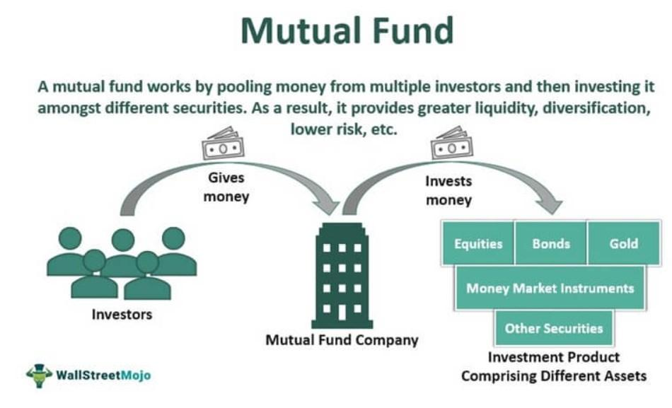

## Table of Contents

## What is a mutual fund?

A mutual fund is a type of investment where many people pool their money together to buy a variety of stocks, bonds, or other assets. It's like a big basket where everyone puts in some money, and a professional manager decides what to buy with it. This makes it easier for people who don't have a lot of money or time to invest in a diverse range of assets on their own.

When you invest in a mutual fund, you buy shares of the fund, and the value of your shares goes up or down based on how well the investments in the fund are doing. Mutual funds can be a good way to spread out your risk because they invest in many different things. This means if one investment does poorly, it might be balanced out by others that do well.

## What is mutual fund yield?

Mutual fund yield is a measure of the income you get from a mutual fund, usually shown as a percentage. It tells you how much money the fund is earning from things like interest and dividends, compared to the price of the fund's shares. Think of it like the interest you earn on a savings account, but for a mutual fund.

The yield is important because it helps you understand how much money you might get back from your investment each year, without selling your shares. If a mutual fund has a high yield, it means it's earning a lot of money from its investments, which can be good if you're looking for regular income. But remember, a high yield doesn't always mean the fund is a good investment overall, because the value of the fund's shares can still go up or down.

## How is mutual fund yield calculated?

Mutual fund yield is calculated by taking the income the fund earns from interest and dividends over a certain period, usually a year, and dividing it by the fund's net asset value (NAV). The NAV is the total value of all the investments in the fund minus any liabilities, divided by the number of shares outstanding. This gives you a percentage that shows how much income the fund is generating relative to its price.

For example, if a mutual fund earns $5 in income over a year and its NAV is $100, the yield would be 5% ($5 divided by $100). This means that for every $100 invested in the fund, you would get $5 in income over the year. It's important to remember that yield only shows the income part of the return and doesn't include any gains or losses from changes in the fund's NAV.

## What factors affect the yield of a mutual fund?

The yield of a mutual fund can change because of different things. One big thing is the types of investments the fund has. If it has a lot of bonds that pay high interest, the yield might be higher. But if it has more stocks that pay dividends, the yield might be lower because stocks usually don't pay as much as bonds. Also, if the fund manager decides to buy or sell different investments, that can change the yield too.

Another thing that can affect the yield is how much the fund costs to run. These costs, called expense ratios, are taken out of the fund's income before it's shared with investors. So if the costs are high, the yield will be lower because there's less money left over for investors. Economic conditions can also play a role. If interest rates go up, bonds might pay more interest, which can boost the fund's yield. But if the economy is doing badly, companies might cut their dividends, which can lower the yield.

Overall, the yield of a mutual fund is not just one number. It can go up or down because of what the fund invests in, how much it costs to run, and what's happening in the economy. So, when you're thinking about investing in a mutual fund, it's good to look at all these things to understand what might happen to the yield.

## Why is mutual fund yield important for investors?

Mutual fund yield is important for investors because it tells them how much money they can expect to earn from their investment without selling their shares. It's like knowing how much interest you'll get from a savings account. If you're looking for regular income, like if you're retired, a high yield can help you get more money each year. This can make a big difference in planning your finances because you'll know how much money you can count on coming in.

But, it's also important to remember that yield is just one part of the picture. A high yield might sound good, but if the value of the fund's investments goes down a lot, you could still lose money overall. So, while yield is helpful for understanding the income part of your investment, you should also look at other things like how the fund's value changes over time and how much it costs to invest in the fund. This way, you get a fuller picture of whether the mutual fund is a good choice for you.

## How does mutual fund yield differ from total return?

Mutual fund yield and total return are two different ways to look at how well a mutual fund is doing. Yield shows you how much money you get from the fund each year just from interest and dividends, without selling your shares. It's like the regular income you might get from a savings account. So, if you're interested in getting a steady stream of money from your investment, yield is really important to know.

Total return, on the other hand, looks at everything. It includes the yield, but it also adds in any money you make or lose from changes in the fund's value. If the price of the fund's shares goes up, that's part of the total return. If it goes down, that's included too. So, total return gives you a complete picture of how your investment is doing, both from the income it generates and from any gains or losses in its value.

## Can you explain the difference between yield and dividend in mutual funds?

Yield and dividend are two terms that come up a lot when you're looking at mutual funds, but they're not the same thing. Yield is like the total interest or income you get from a mutual fund each year. It's shown as a percentage and it includes all the money the fund gets from things like interest on bonds and dividends from stocks. So, if you want to know how much regular money you might get from your investment without selling your shares, yield is the number to look at.

Dividend, on the other hand, is just the part of the yield that comes from the stocks in the mutual fund. When a company makes money, it might share some of it with its shareholders as a dividend. So, if the mutual fund owns stocks that pay dividends, it will get that money and then pass it along to you. The dividend is just one piece of the yield, and it doesn't include the interest from bonds or other types of income the fund might get.

## What are the types of yields in mutual funds?

In mutual funds, there are different types of yields that help you understand how much money you might get from your investment. One type is the "distribution yield," which looks at how much money the fund has paid out to investors over the last year, including dividends and interest. This can give you a good idea of the regular income you might get from the fund. Another type is the "SEC yield," which is a bit more official. It's calculated by the U.S. Securities and Exchange Commission and shows the income the fund earns from its investments after expenses, based on the last 30 days. This yield is good for comparing different funds because it's calculated the same way for everyone.

Another important type of yield is the "yield to maturity," which is mostly used for bond funds. It shows the total interest you would earn if you held the bonds in the fund until they mature. This can help you understand the long-term income you might get from a bond fund. Each of these yields gives you a different piece of information about the fund's performance, so knowing about them can help you pick the right mutual fund for your needs.

## How can investors use yield to compare different mutual funds?

Investors can use yield to compare different mutual funds by looking at how much income each fund is giving them each year. Yield is like the interest you get from a savings account, but for mutual funds. If you want regular money from your investments without selling your shares, you should compare the yields of different funds. A fund with a higher yield might give you more money each year, which can be good if you need income to live on. But remember, a high yield doesn't always mean the fund is better overall, because the value of the fund can still go up or down.

When comparing yields, it's also important to look at different types of yields. For example, the SEC yield is a good way to compare funds because it's calculated the same way for all funds. It shows the income the fund earns from its investments after expenses, based on the last 30 days. Distribution yield, on the other hand, looks at how much money the fund has paid out to investors over the last year. By looking at both types of yields, you can get a better idea of which fund might be better for your needs. Just make sure to think about other things too, like the fund's total return and how much it costs to invest in it.

## What are the limitations of using yield as a performance metric for mutual funds?

Using yield as a way to measure how well a mutual fund is doing has some problems. Yield only shows the money you get each year from interest and dividends, but it doesn't tell you anything about how the value of the fund's shares might go up or down. If the value of the fund goes down a lot, you could still lose money even if the yield is high. So, looking at yield alone might make you think a fund is doing better than it really is.

Also, yield doesn't take into account the costs of running the fund, like expense ratios. These costs are taken out of the fund's income before it's given to you, so a high yield might not mean you're getting a lot of money in the end. And sometimes, a fund might try to make its yield look higher by doing things that aren't good for the long term, like selling off investments to pay out more money. So, while yield is useful for seeing how much regular income you might get, it's not the whole story and you should look at other things like total return and costs too.

## How does the reinvestment of dividends impact the yield of a mutual fund?

When you reinvest the dividends you get from a mutual fund, it doesn't change the yield of the fund itself. Yield is all about how much money the fund makes from interest and dividends each year compared to its price. So, if the fund keeps making the same amount of money, the yield stays the same no matter what you do with your dividends. 

But, if you reinvest your dividends, it can make your investment grow over time. When you reinvest, you use the dividend money to buy more shares of the fund. Even though the yield of the fund doesn't change, you'll have more shares, so you'll get more dividend money in the future. This can help your investment grow faster because you're earning money on more and more shares.

## Can you provide an example of how to calculate and interpret the yield of a specific mutual fund?

Let's say you have a mutual fund called ABC Growth Fund. The fund has a net asset value (NAV) of $50 per share, and over the last year, it paid out $2 in dividends and interest to each share. To calculate the yield, you take the total income per share ($2) and divide it by the NAV ($50). So, the yield for ABC Growth Fund would be $2 divided by $50, which equals 4%. This means that for every $50 you have invested in the fund, you get $2 in income each year.

Understanding this yield is important if you want to know how much regular money you can expect from your investment without selling your shares. A 4% yield might be good or bad depending on what you're looking for and what other funds are offering. But remember, the yield only tells you about the income part of your investment. If the value of the ABC Growth Fund goes up or down, that's not included in the yield. So, while a 4% yield can help you plan for regular income, you should also look at how the fund's value changes over time to get the full picture of its performance.

## What is the understanding of mutual fund yields?

Mutual fund yield represents the income distributed to investors from dividends and interest, expressed as a percentage of the fund's current market price. It provides a snapshot of a fund's potential income-generating capability, which is especially relevant for income-focused investors. 

To calculate mutual fund yield, the income generated from dividends and interest payments over a specified period is divided by the fund's net asset value (NAV) at the start of that period. The formula can be expressed as:

$$
\text{Mutual Fund Yield} = \left( \frac{\text{Dividends} + \text{Interest}}{\text{NAV at the beginning of the period}} \right) \times 100
$$

It is important to distinguish between different types of yields, such as the SEC yield and the total return, to accurately assess a fund’s performance. 

The SEC yield is a standardized measure developed by the U.S. Securities and Exchange Commission (SEC) to provide a consistent, annualized measure of a bond fund's income. It is based on a 30-day period and uses a specific formula to calculate the income, which assumes the fund's expenses, excluding fee waivers, are deducted during this period. Thus, the SEC yield provides a more realistic picture of the interest income that investors might expect over time.

In contrast, the total return encompasses a more comprehensive calculation, accounting not only for income generated from dividends and interest but also for capital gains. It reflects the aggregate change in a fund's value, including distributions and appreciation of the underlying securities. This holistic measure provides investors with a complete picture of the fund's performance over a given period, typically showing results as a percentage increase or decrease in the fund’s NAV.

Understanding the difference between SEC yield and total return is crucial for investors when evaluating mutual fund performance. While the SEC yield focuses on income, the total return offers insights into comprehensive performance, reflecting both income and growth. Income-focused investors may prioritize the yield for its relevance to cash flow, but considering the total return can provide added context regarding overall fund growth and long-term profitability.

## What Lies Beyond Yields in Investment Returns?

Mutual fund yields provide valuable insight into the income generated by a fund through dividends and interest. However, to fully assess a mutual fund's performance, investors need to consider the total return, which encompasses all components of a fund's performance. Total return includes not only yield but also capital gains, which are the profits realized from the sale of securities within the fund's portfolio.

Total return is mathematically expressed as:

$$
\text{Total Return} = \frac{\text{(End Value of Investment - Initial Value of Investment) + Dividends + Interest}}{\text{Initial Value of Investment}} \times 100
$$

By considering dividend distributions, interest, and capital gains, total return offers a comprehensive picture of how effectively a fund has performed over a specific period. Unlike mutual fund yield, which solely focuses on the income aspect, total return reflects the overall profitability and growth of the investment.

Investors should weigh both yield and total return when evaluating mutual fund options. Yield provides immediate insights into the income-generating potential of a fund, making it especially relevant for income-focused investors. On the other hand, total return allows investors to gauge the overall success and growth trajectory of their investments, providing a broader context for decision-making.

It is important for investors to recognize that a high yield does not necessarily equate to superior fund performance. For example, a high-yield fund may distribute substantial income but experience a decline in asset value, leading to a lower total return. Conversely, a lower-yield fund might achieve higher capital gains, resulting in a more favorable total return. 

Therefore, when selecting mutual funds, investors should analyze both yield and total return to align their choices with their financial goals, be it income generation or capital appreciation. By doing so, they ensure a balanced approach to maximizing returns and safeguarding their investments against market [volatility](/wiki/volatility-trading-strategies).

## What is the Case Study about Algorithmic Trading in Mutual Funds?

In recent years, algorithmic trading has become an increasingly prevalent tool among mutual fund managers seeking to optimize their strategies and improve returns. This hypothetical case study illustrates the potential outcomes, risks, and rewards of integrating algorithmic trading with mutual fund management.

### Hypothetical Scenario

Consider a mutual fund focused on large-cap U.S. equities, traditionally managed through a discretionary approach. The fund's manager decides to integrate an algorithmic trading component to enhance the timing of trades and optimize entry and exit points based on market data analysis.

### Algorithm Design

The fund's newly implemented algorithm considers several factors:

1. **Market Indicators**: It uses moving averages (MA) and relative strength indicators (RSI) to identify optimal buy and sell signals.
$$
   \text{Buy Signal: } \text{MA}_{\text{short-term}} > \text{MA}_{\text{long-term}} \land \text{RSI} < 30

$$
$$
   \text{Sell Signal: } \text{MA}_{\text{short-term}} < \text{MA}_{\text{long-term}} \land \text{RSI} > 70

$$

2. **Volatility Measurements**: By incorporating volatility indices like the VIX, the algorithm adjusts trading volumes to mitigate potential risks under volatile market conditions.

3. **News Sentiment Analysis**: Natural language processing techniques gauge market sentiment from news sources and social media to anticipate short-term market movements.

### Potential Outcomes

By deploying this algorithm, the mutual fund aims to achieve several outcomes:

- **Enhanced Returns**: Precise entry and exit points allow the fund to capitalize on short-term price movements, increasing returns.
- **Risk Mitigation**: Automated trading reduces human error and leverages quantitative risk management strategies.

### Risks Involved

Despite the advantages, several risks are inherent in the process:

- **Model Overfitting**: The algorithm may perform well in historical data but fail to adapt to unforeseen market conditions, resulting in potential losses.
- **System Failures**: Reliance on technology means that technical issues or unforeseen bugs can disrupt trading operations.
- **Regulatory Concerns**: Algorithms must comply with financial regulations, necessitating rigorous testing and validation to avoid legal complications.

### Rewards

When effectively managed, algorithmic trading can provide mutual funds with:

- **Operational Efficiency**: Automating routine tasks reduces the administrative burden, allowing fund managers to focus on strategic decision-making.
- **Real-Time Data Utilization**: Instantaneous processing of massive datasets enables the fund to swiftly respond to market changes.

### Conclusion of the Case Study

The integration of algorithmic trading into mutual fund operations presents both lucrative opportunities and complex challenges. While the potential for improved returns and enhanced efficiency is substantial, managers must judiciously address risks such as model robustness and regulatory compliance to fully harness the benefits of this sophisticated trading technique.

## References & Further Reading

[1]: Bergstra, J., Bardenet, R., Bengio, Y., & Kégl, B. (2011). ["Algorithms for Hyper-Parameter Optimization."](https://papers.nips.cc/paper/4443-algorithms-for-hyper-parameter-optimization) Advances in Neural Information Processing Systems 24.

[2]: Lopez de Prado, M. (2018). ["Advances in Financial Machine Learning."](https://books.google.com/books/about/Advances_in_Financial_Machine_Learning.html?id=oU9KDwAAQBAJ) John Wiley & Sons.

[3]: Aronson, D. R. (2007). ["Evidence-Based Technical Analysis: Applying the Scientific Method and Statistical Inference to Trading Signals."](https://onlinelibrary.wiley.com/doi/book/10.1002/9781118268315) John Wiley & Sons.

[4]: Jansen, S. (2018). ["Machine Learning for Algorithmic Trading: Predictive models to extract signals from market and alternative data for systematic trading strategies with Python."](https://www.amazon.com/Machine-Learning-Algorithmic-Trading-alternative/dp/1839217715) Packt Publishing.

[5]: Chan, E. (2008). ["Quantitative Trading: How to Build Your Own Algorithmic Trading Business."](https://github.com/ftvision/quant_trading_echan_book) John Wiley & Sons.