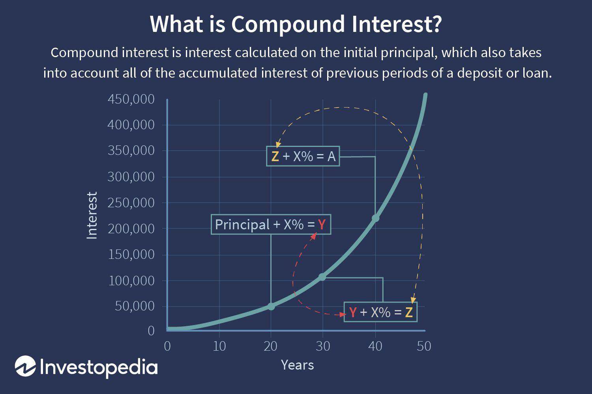

## Table of Contents

## What is a mutual fund?

A mutual fund is a type of investment where many people pool their money together to buy a variety of stocks, bonds, or other assets. This is managed by a professional who decides what to buy and sell. It's like a big basket where everyone's money goes in, and the professional takes care of it. By investing in a mutual fund, you own a small part of all the things in the basket.

Mutual funds are popular because they let you invest in many different things at once, which can lower your risk. Instead of picking individual stocks or bonds yourself, you can rely on the expertise of the fund manager. This makes it easier for people who don't have the time or knowledge to manage their investments on their own. Plus, you can start with a small amount of money, making it accessible to more people.

## How does compound interest work?

Compound interest is like a snowball that gets bigger as it rolls down a hill. When you earn interest on your money, that interest gets added to your original amount. Then, the next time interest is calculated, you earn interest on the new, bigger amount. This means your money grows faster over time because you're earning interest on interest.

Let's say you put $100 in a savings account that gives you 5% interest every year. After the first year, you'll have $105. In the second year, you'll earn 5% interest on $105, not just the original $100. So, you'll get $5.25 in interest, making your total $110.25. This keeps happening, and over many years, your money can grow a lot more than if you just earned simple interest, where you only get interest on the original amount.

## What are the benefits of investing in mutual funds?

Investing in mutual funds has many benefits. One big advantage is that they let you spread your money across many different investments. This is called diversification, and it helps lower your risk. Instead of putting all your money into one stock or bond, you own a small piece of many different things. This way, if one investment does badly, it won't hurt your whole portfolio as much. It's like not putting all your eggs in one basket.

Another benefit is that mutual funds are managed by professionals. These experts spend their time researching and [picking](/wiki/asset-class-picking) the best investments for the fund. This can be really helpful if you don't have the time or knowledge to manage your own investments. Plus, you can start investing in mutual funds with a small amount of money, making it easier for more people to get started. Over time, as you add more money to your mutual fund, you can benefit from the power of compound interest, helping your savings grow even more.

## How can compound interest affect the growth of mutual fund investments?

Compound interest can make your mutual fund investments grow faster over time. When you invest in a mutual fund, the money you put in earns interest or returns. This interest gets added to your original investment, and then the next time interest is calculated, you earn interest on the new, bigger amount. It's like a snowball that gets bigger as it rolls down a hill. The longer you keep your money in the mutual fund, the more time compound interest has to work its magic, making your investment grow more than if you just earned simple interest.

For example, if you invest $1,000 in a mutual fund that earns an average of 5% a year, after the first year, you'll have $1,050. In the second year, you'll earn 5% on $1,050, not just the original $1,000. This means you'll get $52.50 in interest for the second year, making your total $1,102.50. Over many years, this effect can really add up, turning your initial investment into a much larger sum. This is why starting early and leaving your money in the mutual fund for a long time can be so powerful.

## What are the different types of mutual funds available for investment?

There are several types of mutual funds, and each one is designed for different goals and levels of risk. One type is equity funds, which mainly invest in stocks. These can be good for people who want to grow their money over the long term but are okay with more ups and downs. Another type is bond funds, which focus on bonds. These are usually less risky than stock funds and can be good for people who want a steady income and less chance of losing money. There are also balanced funds, which mix stocks and bonds to give you a bit of both growth and safety.

Another kind of mutual fund is money market funds, which invest in very safe, short-term things like government securities. These are good for people who want to keep their money safe and easy to get to. Then there are index funds, which try to match the performance of a specific market index, like the S&P 500. They are often cheaper to own because they don't need a lot of managing. Finally, there are sector funds, which focus on a specific part of the economy, like technology or health care. These can be riskier but might give you bigger rewards if that sector does well.

Each type of mutual fund has its own way of working and its own level of risk and reward. By understanding what you want from your investment and how much risk you're okay with, you can pick the right kind of mutual fund for you. Whether you want to grow your money over time, get a steady income, or keep your money safe, there's a mutual fund that can help you reach your goals.

## How often is interest compounded in mutual funds?

In mutual funds, interest or returns are usually compounded daily or monthly. This means that every day or every month, the interest earned is added to your investment, and the next time interest is calculated, it's based on the new, bigger amount. This helps your money grow faster over time because you're earning interest on interest.

The exact frequency of compounding can depend on the specific mutual fund you invest in. Some funds might compound interest quarterly or even yearly, but daily or monthly compounding is more common. It's a good idea to check the details of the mutual fund you're interested in to see how often the interest is compounded, as this can affect how quickly your investment grows.

## What is the impact of fees and expenses on the compound interest earned in mutual funds?

Fees and expenses can make a big difference in how much money you earn from compound interest in mutual funds. When you invest in a mutual fund, you might have to pay fees like management fees, which are the costs of having a professional manage your money. These fees come out of your investment, so they reduce the amount of money that can earn interest. Over time, even small fees can add up and eat into the compound interest you would have earned, making your investment grow slower than it could have.

For example, if you invest $10,000 in a mutual fund that earns 5% a year but has a 1% annual fee, that fee will take $100 out of your investment every year. This means you're only earning interest on $9,900 instead of the full $10,000. Over many years, this can make a big difference in how much your money grows. It's important to look at the fees when choosing a mutual fund because lower fees can help you keep more of your compound interest, letting your money grow faster.

## How can one calculate the future value of a mutual fund investment using compound interest?

To calculate the future value of a mutual fund investment using compound interest, you can use a formula called the compound interest formula. The formula is: Future Value = P(1 + r/n)^(nt), where P is the amount of money you start with, r is the yearly interest rate (as a decimal), n is the number of times the interest is compounded each year, and t is the number of years you keep your money in the fund. For example, if you invest $1,000 at a 5% annual interest rate compounded monthly for 10 years, you would plug in P = 1000, r = 0.05, n = 12, and t = 10. This would give you a future value of about $1,647.01.

It's important to remember that mutual funds can have fees and expenses that affect how much money you earn. These fees can reduce the amount of money that earns interest, so you might need to adjust the interest rate in the formula to account for them. For instance, if the mutual fund has a 1% annual fee, you would use an effective interest rate of 4% (5% - 1%) in your calculation. This would change the future value to about $1,488.86 after 10 years. By understanding and using this formula, you can get a good idea of how much your mutual fund investment might grow over time.

## What strategies can be used to maximize compound interest in mutual funds?

To maximize compound interest in mutual funds, one of the best strategies is to start investing early. The sooner you put your money into a mutual fund, the more time it has to grow through compound interest. Think of it like planting a seed; the earlier you plant it, the bigger the tree will be when it's time to harvest. Also, try to keep your money in the mutual fund for as long as you can. The longer your money stays invested, the more time compound interest has to work its magic, making your investment grow even faster.

Another important strategy is to invest regularly. By adding more money to your mutual fund on a regular basis, you're giving compound interest more to work with. It's like adding more fuel to the fire, making it burn brighter and hotter. Also, pay attention to the fees and expenses of the mutual fund. Lower fees mean more of your money stays in the fund to earn compound interest. By choosing mutual funds with low fees, you can keep more of your returns and let compound interest do its job even better.

## How do tax considerations influence the effectiveness of compound interest in mutual funds?

Taxes can affect how much money you make from compound interest in mutual funds. When you earn money from your investments, you might have to pay taxes on those earnings. This can lower the amount of money that stays in your mutual fund to earn more interest. For example, if you earn $100 in interest and have to pay $15 in taxes, only $85 is left to compound. Over time, this can make a big difference in how much your investment grows. That's why it's important to think about taxes when you're investing in mutual funds.

One way to help with taxes is to invest in tax-advantaged accounts like IRAs or 401(k)s. These accounts let your money grow without having to pay taxes on the earnings each year. This means more of your money can stay in the mutual fund and keep earning compound interest. By using these kinds of accounts, you can keep more of your returns and let compound interest work better for you. It's a good idea to talk to a financial advisor to see which tax strategies might work best for your situation.

## What are the risks associated with relying on compound interest in mutual fund investments?

Relying on compound interest in mutual fund investments comes with some risks. One big risk is that the value of your mutual fund can go up and down. If the market goes down, the value of your investment can drop, and you might not earn as much interest as you hoped. This is called market risk, and it can slow down the power of compound interest. If you need to take money out of your mutual fund when the market is down, you might end up with less than you started with.

Another risk is inflation. Over time, the cost of things can go up, which means the money you earn from compound interest might not be worth as much in the future. If the interest rate on your mutual fund is lower than the rate of inflation, your investment might not grow enough to keep up with rising prices. It's important to think about both market risk and inflation when you're planning to rely on compound interest in mutual funds.

## How do advanced investment techniques, like dollar-cost averaging, interact with compound interest in mutual funds?

Dollar-cost averaging is a smart way to invest in mutual funds that can work well with compound interest. When you use dollar-cost averaging, you put the same amount of money into your mutual fund at regular times, like every month. This means you buy more shares when the price is low and fewer shares when the price is high. Over time, this can help lower your average cost per share. By doing this, you're giving compound interest more money to work with, because you're adding to your investment regularly. This can help your investment grow faster, as the interest earned on your money keeps building on itself.

However, dollar-cost averaging doesn't remove all the risks of investing. The value of your mutual fund can still go up and down because of market changes. If the market goes down a lot, you might end up buying shares at higher prices than they're worth later on. But, if you keep investing regularly and leave your money in the mutual fund for a long time, the power of compound interest can still help your investment grow. By combining dollar-cost averaging with the long-term growth from compound interest, you can build a strong investment strategy that helps you reach your financial goals.

## What is the Power of Compound Interest?

Compound interest significantly amplifies investment returns by calculating interest on both the initial principal and the accumulated interest from previous periods. This process results in exponential growth, highlighting the advantage of early investment and consistent contributions. The formula for compound interest is:

$$
A = P \times \left(1 + \frac{r}{n}\right)^{nt}
$$

Where:
- $A$ is the amount of money accumulated after n years, including interest.
- $P$ is the principal amount (initial investment).
- $r$ is the annual interest rate (in decimal form).
- $n$ is the number of times that interest is compounded per year.
- $t$ is the time the money is invested for in years.

The power of compound interest lies in its ability to grow wealth faster than simple interest, fostering an investment environment where early and regular contributions magnify the returns. For example, if an investor deposits $1,000 at an annual [interest rate](/wiki/interest-rate-trading-strategies) of 5% compounded annually, after 10 years, the investment will grow to:

$$
A = 1000 \times \left(1 + \frac{0.05}{1}\right)^{1\times 10} = 1000 \times 1.62889 = 1628.89
$$

Compared to simple interest, where the calculation would be: 

$$
A = P \times (1 + rt) = 1000 \times (1 + 0.05 \times 10) = 1500
$$

This highlights the additional $128.89 gained through compounding, accentuating the benefits of compound interest.

The frequency of compounding further influences returns. More frequent compounding intervals, such as quarterly or monthly, can result in higher returns compared to annual compounding. Consider an annual interest rate of 5% on the same $1,000 if compounded quarterly:

$$
A = 1000 \times \left(1 + \frac{0.05}{4}\right)^{4\times 10} = 1000 \times 1.64531 = 1645.31
$$

This example shows how compounding quarterly rather than annually increases the accumulated amount to $1,645.31, further benefiting the investor.

Reinvesting dividends and distributions from mutual funds can also enhance the compounding effect. Mutual funds often distribute profits to investors through dividends, and reinvesting these dividends means that they start generating returns as well, enhancing the compound growth.

Understanding compound interest is crucial for investors aiming to build long-term wealth. By leveraging its exponential growth mechanism, investors can maximize returns and effectively meet their financial goals.

## How can one integrate mutual funds, compound interest, and algo trading?

Integrating mutual funds, compound interest, and [algorithmic trading](/wiki/algorithmic-trading) can create a robust investment strategy that capitalizes on the distinctive advantages each element offers. Mutual funds provide diversification, reducing risk exposure by pooling together various asset classes. This diversification supports a stable growth platform on which compound interest can work effectively, as this method of [earning](/wiki/earning-announcement) interest on both the initial principal and accumulated interest over time can significantly enhance wealth accumulation. Algorithmic trading, on the other hand, introduces precision and efficiency, allowing investors to exploit transient market opportunities that manual trading might miss.

### Mutual Funds for Diversification

Mutual funds diversify an investor's portfolio by spreading investments across a wide range of financial instruments such as stocks, bonds, and other securities. This diversification mitigates risk, as the performance of individual securities often balances out across the entire portfolio. For instance, if one stock underperforms, gains in other stocks or bonds within the mutual fund could offset these losses. This balanced approach creates a reliable foundation for compounding to exert its full potential.

### The Multiplier Effect of Compound Interest

Compound interest fundamentally amplifies investment returns by leveraging the power of time and reinvestment. According to the formula for compound interest:

$$
A = P \left(1 + \frac{r}{n}\right)^{nt}
$$

where:
- $A$ is the amount of money accumulated after n years, including interest.
- $P$ is the principal amount (initial investment).
- $r$ is the annual interest rate (decimal).
- $n$ is the number of times interest applied per time period.
- $t$ is the time in years.

Through mutual funds, dividends and distributions can be reinvested, enhancing the compounding effect. Over time, this process can dramatically increase the value of an investment without requiring additional capital input from the investor.

### Algorithmic Trading for Opportunistic Gains

Algorithmic trading involves the use of sophisticated algorithms to execute trades based on predefined criteria, including timing, price, or trading [volume](/wiki/volume-trading-strategy). This automation eliminates human emotions, which often lead to irrational decision-making, and instead relies on advanced mathematical models and computing power to make data-driven decisions with precision and speed.

Consider a scenario where an algorithm is programmed to execute trades based on historical pattern recognition. When specific market conditions are met, the algorithm finds small but frequent [arbitrage](/wiki/arbitrage) opportunities that, when summed, result in substantial returns. Integrating such strategies with a diversified mutual fund can increase overall profitability by adding an additional layer of active management that instinctively reacts to market changes.

### Synergistic Strategies for Enhanced Returns

Backtesting simulations have shown that strategies combining mutual funds with algorithmic trading and compound interest often outperform those relying on a single method. For example, one might backtest using historical data to determine the effectiveness of an algorithm designed to trade mutual fund shares:

```python
import pandas as pd

# Example: Backtesting a trading strategy
def algorithmic_strategy(data):
    signals = []
    for i in range(1, len(data)):
        if data['SMA-20'][i] > data['SMA-50'][i]:
            signals.append('Buy')
        else:
            signals.append('Hold')
    return signals

data = pd.DataFrame({
    'Close': [/* Historical mutual fund data */],
    'SMA-20': [/* 20-day moving average data */],
    'SMA-50': [/* 50-day moving average data */]
})

data['Signal'] = algorithmic_strategy(data)
```

This code shows a simple moving average crossover strategy, demonstrating how historical data can inform future trading actions. Analyzing results from such backtests can guide investors on possible returns and risks involved in different market conditions.

### Practical Tips for Investors

For investors considering this integrated approach, it is essential to remain informed about their chosen mutual funds' compositions and management strategies. Continuous learning about advancements in algorithmic trading technology and software is also advised. Finally, adopting a disciplined approach to reinvesting returns in mutual funds will maximize the compounding effect, thereby substantially enhancing long-term returns.

## What are the Frequently Asked Questions?

### What are the main types of mutual funds available for investors?

Mutual funds are broadly categorized to accommodate different investment goals, risk tolerance, and time horizons. The main types include:

1. **Equity Funds**: These invest primarily in stocks and aim for capital appreciation. They can focus on specific sectors or have a diversified approach.

2. **Fixed-Income Funds**: Also known as bond funds, these invest in government, municipal, or corporate bonds and aim to generate regular income for investors.

3. **Balanced Funds**: These offer a mix of stocks and bonds, providing a balance between growth and income. They are designed for investors seeking moderate growth with reduced risk.

4. **Index Funds**: These aim to replicate the performance of a specific index, such as the S&P 500, by holding the same stocks in the same proportions.

5. **Money Market Funds**: These invest in short-term, high-quality debt securities and provide a safer investment with lower returns, suitable for short-term financial goals.

6. **Sector Funds**: These focus on specific sectors of the economy, like technology or healthcare, allowing investors to take advantage of growth in specific industries.

### How does compound interest differ from simple interest?

Compound interest is calculated on the initial principal as well as on the accumulated interest from previous periods. This means the investment grows at an exponential rate. The formula for compound interest is:

$$
A = P \left(1 + \frac{r}{n}\right)^{nt}
$$

Where $A$ is the future value of the investment, $P$ is the principal investment amount, $r$ is the annual interest rate, $n$ is the number of times that interest is compounded per year, and $t$ is the number of years the money is invested for.

Simple interest, on the other hand, is calculated only on the principal amount. The formula for simple interest is:

$$
A = P(1 + rt)
$$

In simple interest, the investment grows linearly over time, which typically results in lower returns compared to compound interest over the same period.

### What are the risks associated with algorithmic trading?

Algorithmic trading, while offering many advantages, comes with several risks:

1. **Technology Failure**: Dependence on technology means that any failure in software, hardware, or connectivity can lead to significant trading errors and financial loss.

2. **Market Impact**: Large algorithmic trades can influence market prices, potentially leading to unfavorable conditions for the trader.

3. **Liquidity Risks**: Algorithms may struggle to execute trades in illiquid markets, leading to suboptimal prices or inability to complete transactions.

4. **Overfitting**: Algorithmic strategies based on historical data may not perform well in live markets due to overfitting.

5. **Regulatory Changes**: Changes in regulations can impact algorithmic strategies, necessitating constant updates and adjustments.

### How can one start integrating algorithmic trading into their investment strategy?

Integrating algorithmic trading into an investment strategy involves several steps:

1. **Education and Research**: Familiarize yourself with the basics of algorithmic trading and existing strategies. Online courses, books, and resources like QuantConnect and Alpaca are valuable starting points.

2. **Choosing a Platform**: Select a trading platform that supports algorithmic trading. Look for platforms offering comprehensive APIs, backtesting capabilities, and access to different markets.

3. **Developing Strategies**: Begin with simple strategies, such as moving averages or RSI-based trades, and gradually refine them based on market behavior analysis.

4. **Backtesting and Simulation**: Test these strategies against historical data to understand their potential performance and adjust them to optimize results.

5. **Start Small**: Implement algorithms with small capital initially to gauge their performance in live markets before scaling up.

6. **Continuous Monitoring and Adjustment**: Regularly monitor your strategies and make adjustments based on real-time performance and market changes.

### Are there any tax considerations when reinvesting dividends from mutual funds?

Yes, reinvesting dividends from mutual funds has tax implications. In many jurisdictions, dividends, whether reinvested or taken as cash, are subject to taxes:

1. **Dividend Tax**: Dividends are usually taxable in the year they are received. The rate may vary based on whether they are qualified or non-qualified dividends.

2. **Capital Gains Tax**: When mutual fund holdings are sold at a profit, capital gains tax applies. This tax rate can differ based on the duration the asset was held—short-term versus long-term capital gains.

3. **Tax-Deferred Accounts**: If you hold mutual fund investments in a tax-deferred account like an IRA, you may be able to reinvest dividends without immediate tax consequences, though withdrawals in retirement will be taxed.

Investors should consult with a tax advisor to understand the tax implications specific to their investments and jurisdiction.

## References & Further Reading

[1]: ["Advances in Financial Machine Learning"](https://www.amazon.com/Advances-Financial-Machine-Learning-Marcos/dp/1119482089) by Marcos Lopez de Prado

[2]: ["Evidence-Based Technical Analysis: Applying the Scientific Method and Statistical Inference to Trading Signals"](https://www.amazon.com/Evidence-Based-Technical-Analysis-Scientific-Statistical/dp/0470008741) by David Aronson

[3]: ["Machine Learning for Algorithmic Trading"](https://github.com/stefan-jansen/machine-learning-for-trading) by Stefan Jansen

[4]: ["Quantitative Trading: How to Build Your Own Algorithmic Trading Business"](https://www.amazon.com/Quantitative-Trading-Build-Algorithmic-Business/dp/1119800064) by Ernest P. Chan

[5]: Bergstra, J., Bardenet, R., Bengio, Y., & Kégl, B. (2011). ["Algorithms for Hyper-Parameter Optimization."](https://dl.acm.org/doi/10.5555/2986459.2986743) Advances in Neural Information Processing Systems 24.