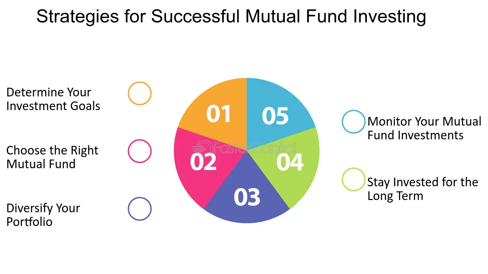

## Table of Contents

## What are mutual funds and how do they work?

Mutual funds are a type of investment where many people pool their money together to buy a variety of stocks, bonds, or other assets. This is managed by a professional who decides what to buy and sell. When you invest in a mutual fund, you are buying shares of the fund, not the individual stocks or bonds it holds. This makes it easier for you to have a diverse investment without having to pick each stock or bond yourself.

The value of your investment in a mutual fund goes up or down based on how well the assets in the fund perform. If the stocks or bonds in the fund do well, the value of the fund increases, and so does the value of your shares. If they do poorly, the value of the fund and your shares goes down. You can make money from mutual funds in two ways: by selling your shares for more than you paid for them, or by receiving dividends if the fund pays them out. Mutual funds are popular because they offer a way to invest in a broad range of assets with less risk than investing in just one or two stocks.

## What are the different types of mutual funds available to investors?

There are several types of mutual funds, each designed to meet different investment goals and risk levels. One common type is the equity fund, which mainly invests in stocks. These can focus on different sectors like technology or healthcare, or they can be more general. Another type is the fixed-income fund, which invests in bonds and other debt instruments. These are usually less risky than equity funds but also offer lower potential returns. Then there are balanced funds, which mix stocks and bonds to offer a bit of both growth and income, aiming for a middle ground in terms of risk and return.

Money market funds are another option, focusing on very short-term, low-risk investments like government securities and commercial paper. These are the safest type of mutual funds but also have the lowest returns. For those interested in specific themes or sectors, there are also sector funds and thematic funds. Sector funds invest in a particular industry, like real estate or energy, while thematic funds focus on broader trends, such as environmental sustainability. Lastly, index funds aim to replicate the performance of a specific market index, like the S&P 500, offering broad market exposure with lower fees since they are passively managed.

## How do mutual funds differ from other investment vehicles like stocks and bonds?

Mutual funds are different from stocks and bonds because they are a collection of many investments put together. When you buy a mutual fund, you are not buying one stock or one bond. Instead, you are buying a small piece of a big basket that holds many different stocks, bonds, or other assets. This basket is managed by a professional who decides what to buy and sell. This makes it easier for you to have a diverse investment without having to pick each stock or bond yourself.

Stocks, on the other hand, are shares in a single company. When you buy a stock, you own a piece of that company. The value of your stock goes up or down based on how well that company does. Bonds are like loans you give to a company or government. They promise to pay you back with interest over time. Both stocks and bonds can be riskier because they depend on the performance of one company or issuer. Mutual funds spread that risk across many investments, making them generally safer but also potentially less rewarding if one stock or bond does extremely well.

## What are the benefits of investing in mutual funds for beginners?

Investing in mutual funds can be a great choice for beginners because it's easy to get started. You don't need to know a lot about the stock market or pick individual stocks. When you invest in a mutual fund, you're buying into a big basket of different investments that are managed by a professional. This means you can have a diverse set of investments without having to do a lot of research yourself. It's like having an expert help you invest your money.

Another benefit is that mutual funds can help you spread out your risk. Instead of putting all your money into one stock or bond, which can be risky if that investment does poorly, mutual funds hold many different investments. This means if one stock or bond doesn't do well, it won't hurt your whole investment as much. Plus, mutual funds often have lower fees than buying and selling individual stocks, making them a cost-effective way to start investing.

## How can one start investing in mutual funds, and what are the initial steps?

To start investing in mutual funds, the first thing you need to do is figure out your investment goals and how much risk you're comfortable with. Do you want to grow your money over time, or are you looking for regular income? Once you know what you want, you can start looking for the right mutual fund. There are many types, like ones that invest in stocks, bonds, or a mix of both. You can do this research online, talk to a financial advisor, or use a robo-advisor service that helps pick funds for you based on your goals.

After choosing a mutual fund, you'll need to open an account with a brokerage firm or directly with the mutual fund company. This usually involves filling out some paperwork and providing personal information. Once your account is set up, you can start investing by buying shares of the mutual fund. You can do this with a lump sum of money or set up regular investments, like monthly contributions. Remember, it's a good idea to keep an eye on your investments and maybe talk to a financial advisor now and then to make sure you're on track with your goals.

## What are the key factors to consider when choosing a mutual fund?

When choosing a mutual fund, it's important to think about your investment goals. Do you want to grow your money over time, or do you need regular income? This will help you decide between different types of funds, like ones that invest in stocks for growth, or bonds for income. Also, consider how much risk you're comfortable with. Some funds are riskier but might offer higher returns, while others are safer but might grow slower.

Another key factor is the fund's performance history. Look at how the fund has done over the past few years, but remember, past performance doesn't guarantee future results. It's also good to check the fees you'll have to pay. Mutual funds charge fees for managing the fund, and lower fees can mean more money in your pocket over time. Lastly, think about the fund manager's experience and the fund's investment strategy. Does it match what you're looking for in your investment?

In the end, it's a good idea to spread your investments across different types of funds to reduce risk. This is called diversification. And don't forget, it can be helpful to talk to a financial advisor who can guide you based on your specific needs and goals.

## How do fees and expenses impact the returns on mutual fund investments?

Fees and expenses can really affect how much money you make from mutual funds. When you invest in a mutual fund, you have to pay fees to the people who manage the fund. These fees are taken out of your investment, so they can lower the amount of money you earn. For example, if a fund has a high fee, it means less of your money is working to grow over time. Over many years, even small differences in fees can add up to a big difference in your returns.

It's important to look at the expense ratio when choosing a mutual fund. The expense ratio is the percentage of your investment that goes to fees each year. A lower expense ratio means more of your money stays invested and can grow. For example, if you invest $10,000 in a fund with a 1% expense ratio, you'll pay $100 in fees each year. But if you choose a fund with a 0.5% expense ratio, you'll only pay $50 in fees, leaving more money to grow. So, paying attention to fees can help you keep more of your returns over time.

## What are some common investment strategies used with mutual funds?

One common strategy with mutual funds is called dollar-cost averaging. This means you invest a fixed amount of money into the fund at regular times, like every month. By doing this, you buy more shares when the price is low and fewer shares when the price is high. Over time, this can help lower the average cost of your investment and reduce the risk of putting all your money in at the wrong time.

Another strategy is asset allocation, which means spreading your money across different types of mutual funds, like stocks, bonds, and maybe some that focus on specific sectors. This helps you balance risk and reward. For example, if you're young and can handle more risk, you might put more money into stock funds. If you're closer to retirement and want to be safer, you might choose more bond funds. Adjusting your mix of investments over time based on your goals and how the market is doing is called rebalancing, and it's another important part of this strategy.

Lastly, some people use a strategy called growth investing, where they pick mutual funds that focus on companies expected to grow a lot in the future. These funds might be riskier but can offer higher returns. On the other hand, value investing is about finding funds that invest in companies that seem underpriced but have strong fundamentals. This can be a good way to find bargains in the market. Both strategies have their place, and which one you choose depends on your risk tolerance and investment goals.

## How can investors assess the performance and risk of a mutual fund?

To assess the performance of a mutual fund, investors should look at how the fund has done over time. This means checking its returns over the past year, three years, five years, and even longer if possible. You can compare these returns to a benchmark, like the S&P 500 for stock funds, to see if the fund is doing better or worse than the market. It's also important to look at the fund's performance in different market conditions. Did it do well when the market was up? How did it handle downturns? This gives you a better idea of how the fund might perform in the future.

When it comes to risk, investors need to understand how much the fund's value can go up and down. One way to measure this is by looking at the fund's standard deviation, which shows how much the fund's returns vary from its average. A higher standard deviation means more risk. Another thing to consider is the fund's beta, which tells you how sensitive the fund is to market movements. A beta higher than 1 means the fund is more volatile than the market, while a beta lower than 1 means it's less volatile. Also, look at the fund's holdings to see if it's spread out across many different investments or focused on just a few. A more diversified fund usually has less risk.

## What role do asset allocation and diversification play in a mutual fund investment strategy?

Asset allocation and diversification are key parts of a smart mutual fund investment strategy. Asset allocation means deciding how to spread your money across different types of investments, like stocks, bonds, and maybe some other things. This helps you balance risk and reward. For example, if you're young and can handle more risk, you might put more of your money into stock funds. If you're closer to retiring and want to be safer, you might choose more bond funds. By choosing the right mix, you can aim for the returns you want while keeping risk at a level you're comfortable with.

Diversification is about spreading your money within each type of investment to lower risk even more. Instead of putting all your money into one stock fund, you might invest in several different stock funds that focus on different sectors or regions. This way, if one sector or region does poorly, it won't hurt your whole investment as much. By using both asset allocation and diversification, you can build a mutual fund portfolio that's strong and balanced, helping you reach your financial goals while managing risk.

## How can advanced investors use mutual funds to achieve specific financial goals?

Advanced investors can use mutual funds to achieve specific financial goals by carefully selecting funds that align with their objectives. For example, if the goal is to save for retirement over the long term, an investor might choose equity funds that focus on growth. These funds invest in stocks that have the potential to increase in value over time, which can help the investor's money grow significantly. On the other hand, if the goal is to generate regular income, an investor might opt for fixed-income funds, like bond funds, which provide steady interest payments. By matching the type of mutual fund to their specific financial goal, advanced investors can tailor their investment strategy to meet their needs.

Another way advanced investors can use mutual funds is through tactical asset allocation. This involves adjusting the mix of investments in their portfolio based on short-term market conditions or economic forecasts. For instance, if an investor believes the stock market is going to do well in the near future, they might temporarily increase their allocation to equity funds. Conversely, if they expect a downturn, they might shift more money into bond funds or money market funds to protect their investment. This active management allows advanced investors to potentially enhance their returns and manage risk more effectively, helping them reach their financial goals more efficiently.

## What are the latest trends and innovations in mutual fund investment strategies?

One of the latest trends in mutual fund investment strategies is the rise of ESG (Environmental, Social, and Governance) funds. These funds focus on companies that meet certain standards for being good to the environment, treating their workers well, and having strong leadership. More and more investors want their money to help make the world a better place, so they're choosing these funds. Another trend is the use of technology, like robo-advisors, to help pick and manage mutual funds. Robo-advisors use computers to look at your goals and how much risk you can handle, then they choose the right mix of funds for you. This makes investing easier and often cheaper than working with a human advisor.

Innovations in mutual fund strategies also include the use of smart beta funds. These funds try to beat the market by using special ways to pick stocks, like focusing on companies with certain qualities, instead of just following a market index. They're kind of a mix between regular index funds and actively managed funds. Another innovation is the growing use of thematic funds, which invest in specific trends or themes, like technology or healthcare. These funds let investors bet on big changes in the world, like new technology or an aging population. Both smart beta and thematic funds give advanced investors new ways to try and get better returns.

## What are the investment strategies for mutual funds?

Investment strategies are crucial for the effective management of mutual funds, influencing both returns and risk over time. Investors face a pivotal choice between active and passive management. Active management involves hands-on decision-making where fund managers select securities to outperform a market index. In contrast, passive management aims to replicate the performance of a specific index, often leading to lower costs due to reduced transaction fees and lower turnover rates[1].

Understanding the risk-return trade-off is fundamental when targeting a mutual fund that aligns with an investor's risk tolerance and financial goals. The trade-off indicates that higher potential returns on investment usually come with increased risk, which must be assessed based on individual financial circumstances and market conditions. Tools like the Capital Asset Pricing Model (CAPM) help quantify this trade-off by estimating the expected return on investment given the systematic risk, often represented as:

$$
E(R_i) = R_f + \beta_i (E(R_m) - R_f)
$$

where $E(R_i)$ is the expected return, $R_f$ is the risk-free rate, $\beta_i$ is the beta of the investment, and $E(R_m)$ is the expected market return[2].

Portfolio diversification is an effective strategy to optimize asset allocation and minimize risk. By spreading investments across various asset classes such as equities, bonds, and money markets, investors can mitigate the impact of a poor-performing asset on their overall portfolio. Diversification reduces unsystematic risk—the risk specific to individual assets—since negative performance from one investment may be offset by positive performance from another[3].

Investment time horizon is another essential [factor](/wiki/factor-investing) influencing mutual fund strategies. Investors must decide between long-term and short-term holdings based on their financial objectives. Long-term holdings are generally associated with potential higher returns and compounding benefits but come with the risk of enduring market [volatility](/wiki/volatility-trading-strategies). Short-term holdings appeal to those seeking [liquidity](/wiki/liquidity-risk-premium) and less exposure to market fluctuations but might offer lower returns due to limited compounding periods.

By carefully considering these strategies, investors can navigate the complexity of mutual funds and tailor their approaches to meet specific investment objectives effectively.

References:
1. Statman, Meir. “Investment Strategies and Performance: The Case of Index Funds and Index-Based Investment.” Financial Analysts Journal, vol. 52, no. 1, 1996, pp. 29–36. JSTOR, www.jstor.org/stable/4479883.
2. Sharpe, William F. “Capital Asset Prices: A Theory of Market Equilibrium Under Conditions of Risk.” The Journal of Finance, vol. 19, no. 3, 1964, pp. 425–442. JSTOR, www.jstor.org/stable/2977928.
3. Elton, Edwin J. and Gruber, Martin J. “Modern Portfolio Theory and Investment Analysis.” John Wiley & Sons, 2011.

 to Algorithmic Trading

Algorithmic trading, commonly referred to as 'algo trading,' utilizes pre-defined algorithms to execute financial trading orders autonomously. By adopting electronic platforms, algorithms execute transactions at speeds and frequencies unattainable by human traders. The primary advantage of this method is its ability to enhance efficiency by optimizing both the timing and pricing of trades. This capability is particularly crucial in markets where speed can significantly influence profitability.

The algorithms are based on various strategies, among them trend-following, which capitalizes on market [momentum](/wiki/momentum) by identifying and riding trends; [arbitrage](/wiki/arbitrage), which exploits price discrepancies between markets or securities; and index fund rebalancing, ensuring that portfolio allocations remain consistent with an index's changing composition. 

One illustrative Python snippet for a simple moving average crossover strategy, a popular trend-following technique, is as follows:

```python
import numpy as np
import pandas as pd

def moving_average(prices, window):
    return prices.rolling(window=window).mean()

def moving_average_crossover_strategy(prices, short_window, long_window):
    signals = pd.DataFrame(index=prices.index)
    signals['price'] = prices
    signals['short_mavg'] = moving_average(prices, short_window)
    signals['long_mavg'] = moving_average(prices, long_window)
    signals['signal'] = 0.0
    signals['signal'][short_window:] = np.where(signals['short_mavg'][short_window:] 
                                                > signals['long_mavg'][short_window:], 1.0, 0.0)
    signals['positions'] = signals['signal'].diff()
    return signals

# Example usage
prices = pd.Series([100, 102, 104, 103, 105, 104, 106, 108, 110, 108])
signals = moving_average_crossover_strategy(prices, short_window=2, long_window=3)
print(signals)
```
This code calculates short-term and long-term moving averages and generates buy (1) or sell (0) signals based on their crossover.

The benefits of [algorithmic trading](/wiki/algorithmic-trading) extend beyond mere speed. It reduces human error, often introduced by psychological biases or fatigue, thus yielding improved trading outcomes. Additionally, by enabling high-frequency trading, algo trading significantly enhances market liquidity, allowing for smoother market operations.

Despite its advantages, algorithmic trading is not without challenges. Market volatility can necessitate rapid recalibrations of strategies, and a heavy reliance on technological infrastructure poses risks of system failures or lags. Moreover, the dependency on accurate and real-time data feeds necessitates a robust network and data management practices to ensure the reliability of trading operations. Thus, participants must navigate these technological dependencies and the inherent volatility of financial markets to harness the full potential of algorithmic trading.

## References & Further Reading

[1]: Statman, Meir. “Investment Strategies and Performance: The Case of Index Funds and Index-Based Investment.” Financial Analysts Journal, vol. 52, no. 1, 1996, pp. 29–36. JSTOR, www.jstor.org/stable/4479883.

[2]: Sharpe, William F. “Capital Asset Prices: A Theory of Market Equilibrium Under Conditions of Risk.” The Journal of Finance, vol. 19, no. 3, 1964, pp. 425–442. JSTOR, www.jstor.org/stable/2977928.

[3]: Elton, Edwin J. and Gruber, Martin J. “Modern Portfolio Theory and Investment Analysis.” John Wiley & Sons, 2011.

[4]: Bergstra, J., Bardenet, R., Bengio, Y., & Kégl, B. (2011). ["Algorithms for Hyper-Parameter Optimization."](https://dl.acm.org/doi/10.5555/2986459.2986743) Advances in Neural Information Processing Systems 24.

[5]: ["Advances in Financial Machine Learning"](https://www.amazon.com/Advances-Financial-Machine-Learning-Marcos/dp/1119482089) by Marcos Lopez de Prado

[6]: ["Evidence-Based Technical Analysis: Applying the Scientific Method and Statistical Inference to Trading Signals"](https://www.amazon.com/Evidence-Based-Technical-Analysis-Scientific-Statistical/dp/0470008741) by David Aronson

[7]: ["Machine Learning for Algorithmic Trading"](https://github.com/stefan-jansen/machine-learning-for-trading) by Stefan Jansen

[8]: ["Quantitative Trading: How to Build Your Own Algorithmic Trading Business"](https://www.amazon.com/Quantitative-Trading-Build-Algorithmic-Business/dp/0470284889) by Ernest P. Chan