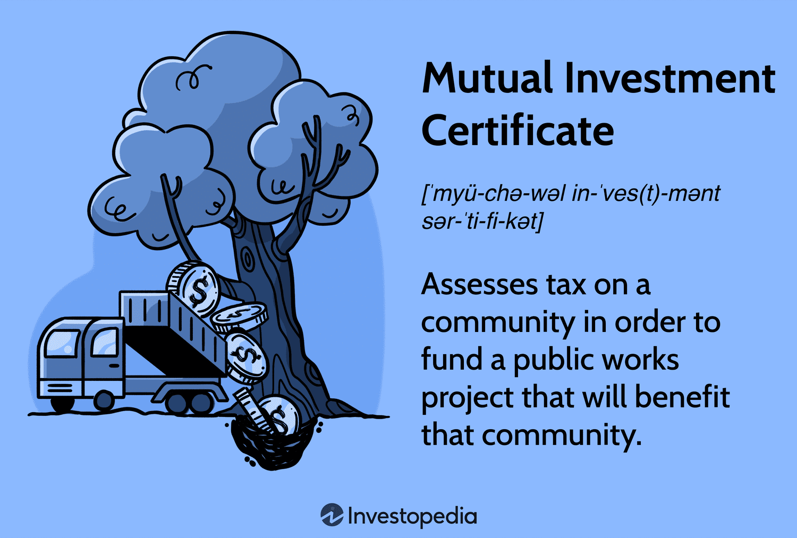

## Table of Contents

## What is a Mutual Investment Certificate?

A Mutual Investment Certificate is a type of investment where many people put their money together to buy different things like stocks, bonds, or other assets. This is done through a company that manages the money and decides what to buy. The goal is to make the money grow over time, and the people who invested can share in the profits.

These certificates are popular because they let people invest in a lot of different things without having to pick each one themselves. The company that manages the money does the hard work of choosing what to buy and when to sell. This can be good for people who don't have a lot of time or knowledge about investing, but still want to grow their savings.

## How does a Mutual Investment Certificate work?

When you buy a Mutual Investment Certificate, you are giving your money to a company that will use it to buy different investments like stocks, bonds, or other assets. This company, called a fund manager, pools the money from many people like you to make these purchases. The idea is that by spreading the money across many different investments, the risk is lower than if you were to invest in just one thing. The fund manager decides what to buy and sell, aiming to make the value of the certificate grow over time.

As the value of the investments goes up or down, so does the value of your Mutual Investment Certificate. You can usually sell your certificate back to the company or to someone else if you need your money back. The profits made from the investments are shared among all the people who own the certificates. This way, everyone benefits from the growth of the fund. It's a way for people to invest without having to pick each investment themselves, making it easier and more accessible for many people.

## What are the benefits of investing in a Mutual Investment Certificate?

One big benefit of investing in a Mutual Investment Certificate is that it lets you spread your money across many different investments. Instead of putting all your money into one stock or bond, you get a little piece of many things. This can make it safer because if one investment does badly, it won't hurt your whole investment as much. It's like not putting all your eggs in one basket.

Another benefit is that you don't have to be an expert in picking investments. The fund manager does all the hard work of deciding what to buy and sell. This can save you a lot of time and stress. It's good for people who want to grow their money but don't know a lot about investing or don't have the time to manage their investments themselves.

Lastly, Mutual Investment Certificates can be a good way to start investing with less money. You can often buy into a fund with a smaller amount than you would need to buy individual stocks or bonds. This makes investing more accessible to more people, helping them to build their savings over time.

## What are the risks associated with Mutual Investment Certificates?

One risk of investing in a Mutual Investment Certificate is that the value can go down. Even though the fund manager tries to pick good investments, sometimes the stocks, bonds, or other things they buy can lose value. If the whole market goes down, your certificate will likely go down too. This means you could lose some or all of the money you put in.

Another risk is that you have to pay fees to the fund manager for managing the investments. These fees can eat into your profits, making your returns smaller than they would be without them. It's important to understand how much you're paying in fees because over time, they can add up and affect how much money you make.

Lastly, you don't have control over what the fund manager buys or sells. If you don't like the choices they make, you can't change them. You have to trust that the manager knows what they're doing. If they make bad choices, it can hurt your investment. So, it's a good idea to do some research on the fund manager and their track record before you invest.

## How can one purchase a Mutual Investment Certificate?

To buy a Mutual Investment Certificate, you first need to pick a fund that fits your goals and how much risk you're okay with. You can look at different funds on websites or talk to a financial advisor to help you choose. Once you've picked a fund, you can buy the certificate through a broker or directly from the company that manages the fund. You'll need to fill out some forms and give them your money.

After you've bought the certificate, you'll get a record showing how many certificates you own. You can keep track of how your investment is doing by checking the value of the fund, which is usually updated every day. If you ever want to sell your certificate, you can do that through the same broker or company you bought it from. Just remember, the value of your certificate can go up or down, so it's good to keep an eye on it.

## What are the typical terms and conditions of a Mutual Investment Certificate?

When you buy a Mutual Investment Certificate, you agree to certain terms and conditions set by the fund company. These often include how much money you need to start investing, which can be different for each fund. You'll also need to know about any fees you have to pay, like management fees or sales charges. The terms will tell you how often you can buy or sell your certificates, and there might be rules about how long you need to keep your money in the fund before you can take it out.

Another important part of the terms is how the fund is managed. The company will explain how they pick the investments and what their goals are for the fund. They'll also tell you about any risks you should know about, like how the value of your certificate can go up or down. It's good to read these terms carefully so you understand what you're getting into and what to expect from your investment.

## How is the performance of a Mutual Investment Certificate measured?

The performance of a Mutual Investment Certificate is usually measured by looking at how much its value has grown over time. This is called the return on investment. People often look at the total return, which includes any money made from the investments going up in value, plus any dividends or interest the fund earns. They might compare this return to other investments or to a benchmark, like a stock market index, to see if the fund is doing well.

Another way to measure performance is by looking at the risk involved. This means seeing how much the value of the certificate goes up and down over time. A fund that goes up and down a lot is considered riskier than one that stays more steady. People use something called the standard deviation to measure this risk. By looking at both the return and the risk, investors can decide if a Mutual Investment Certificate is a good fit for them.

## What are the tax implications of investing in a Mutual Investment Certificate?

When you invest in a Mutual Investment Certificate, you need to know about the taxes you might have to pay. If the fund makes money from selling investments at a higher price than they bought them, this is called a capital gain. You might have to pay taxes on these gains, even if you don't sell your certificate. The fund company will usually give you a form at the end of the year that tells you how much you need to report on your taxes.

Also, if the fund gets dividends or interest from its investments, you might have to pay taxes on that too. Dividends are payments from companies to their shareholders, and interest is what you get from bonds. The tax rate you pay can depend on how long you've held the certificate and what kind of income it is. It's a good idea to talk to a tax advisor to understand exactly how much you'll need to pay and how to report it on your taxes.

## How does a Mutual Investment Certificate compare to other investment options like stocks or bonds?

A Mutual Investment Certificate is different from stocks and bonds because it lets you invest in a bunch of things at once. When you buy a stock, you're buying a piece of one company. If that company does well, your stock might go up in value, but if it does badly, you could lose money. A bond is like lending money to a company or the government, and they pay you back with interest. With a Mutual Investment Certificate, your money is spread across many stocks, bonds, or other things, which can make it safer because if one investment does badly, it won't hurt your whole investment as much.

Another big difference is that with a Mutual Investment Certificate, you don't have to pick the investments yourself. A fund manager does that for you, which can be good if you don't know a lot about investing or don't have time to manage your money. But, you have to pay fees to the fund manager, which can make your returns smaller. With stocks and bonds, you can pick what you want to buy and sell, but you have to do all the work yourself and take on more risk if you make bad choices.

## What are the regulatory requirements for issuing a Mutual Investment Certificate?

To issue a Mutual Investment Certificate, companies have to follow rules set by government agencies like the Securities and Exchange Commission (SEC) in the United States. These rules are there to protect people who invest their money. The company needs to write a detailed document called a prospectus that explains everything about the fund, like what it invests in, the risks involved, and the fees. This document has to be clear and honest so that people can make smart choices about where to put their money. The company also needs to register the fund with the SEC and get approval before they can start selling certificates.

Once the fund is up and running, there are more rules to follow. The company has to keep giving updates to the SEC and to the people who own the certificates. These updates include how the fund is doing and any big changes that happen. The company also has to follow rules about how they manage the money, like not taking too much risk or making sure they keep the fund's investments diverse. All these rules help make sure that the fund is managed in a fair and safe way for everyone who invests in it.

## Can Mutual Investment Certificates be used as part of a diversified investment portfolio?

Yes, Mutual Investment Certificates can be a good way to make your investment portfolio more diverse. When you buy a Mutual Investment Certificate, your money is spread across many different investments like stocks, bonds, and other assets. This means you're not putting all your eggs in one basket. If one investment does badly, it won't hurt your whole portfolio as much because you have other investments that might do well.

Using Mutual Investment Certificates in your portfolio can also help you invest in things you might not know a lot about. The fund manager picks the investments for you, so you don't have to be an expert. This can make it easier to have a mix of different types of investments, which can help lower your risk and make your money grow over time.

## What advanced strategies can be employed to maximize returns from Mutual Investment Certificates?

One way to get more from your Mutual Investment Certificates is to use a strategy called dollar-cost averaging. This means you put money into the fund at regular times, like every month, instead of all at once. By doing this, you buy more certificates when the price is low and fewer when the price is high. Over time, this can help you pay less on average for your certificates and make more money when the fund does well. It's a good way to smooth out the ups and downs of the market and grow your investment steadily.

Another strategy is to look at the fees you're paying and try to keep them low. Some funds charge a lot in fees, which can eat into your profits. By choosing funds with lower fees, more of your money stays invested and working for you. You can also think about tax strategies, like investing in funds that focus on long-term gains, which are often taxed at a lower rate than short-term gains. By being smart about fees and taxes, you can keep more of your returns and make your investment grow faster.

## What are Investment Certificates and How Can They Be Understood?

Investment certificates are financial instruments commonly offered by banks and financial institutions, designed to provide a fixed return over a specified period. These instruments are characterized by their low risk, as they typically assure a guaranteed return on the principal amount invested.

Investment certificates function similarly to traditional savings accounts but often offer higher interest rates due to their commitments over a fixed term. They are structured to provide security and predictability, making them an appealing choice for conservative investors seeking stable outcomes without exposure to significant market [volatility](/wiki/volatility-trading-strategies).

The mechanics of investment certificates generally involve a lock-in period, during which the principal remains invested. Early withdrawal is often restricted or subject to penalties, ensuring that the investor commits to the defined timeframe. At the end of this period, the investor receives the initial sum plus any accrued interest. The [interest rate](/wiki/interest-rate-trading-strategies) can vary based on the terms and conditions agreed upon at the time of purchase, and these rates can be fixed or variable. A fixed rate implies a constant return throughout the investment period, whereas a variable rate may fluctuate based on market conditions or a specified benchmark.

For example, consider an investment certificate offering a fixed annual interest rate of 3% on a principal amount of $10,000 over a period of 5 years. The return can be calculated using the formula for compound interest:

$$
A = P (1 + \frac{r}{n})^{nt}
$$

Where:
- $A$ is the amount of money accumulated after n years, including interest,
- $P$ is the principal amount ($10,000),
- $r$ is the annual interest rate (3% or 0.03),
- $n$ is the number of times that interest is compounded per year,
- $t$ is the time the money is invested for in years.

If the interest is compounded annually, then:

$$
A = 10000 (1 + \frac{0.03}{1})^{1 \times 5} = 10000 (1.03)^5 \approx \$11,592.74
$$

Thus, at the end of 5 years, the investor would receive approximately $11,592.74, combining the original principal and the interest accrued during the term.

Investment certificates can be crafted to meet various investor needs, offering terms that range from short periods like six months to several years. The flexibility in term length, along with the security of principal protection and predictable returns, makes investment certificates a compelling option. Although they trade off higher potential returns for lower risk, this trade-off aligns with the goals of investors who prioritize the preservation of capital.

## References & Further Reading

[1]: Malkiel, B. G. (2019). ["A Random Walk Down Wall Street: The Time-Tested Strategy for Successful Investing"](https://yourknowledgedigest.org/wp-content/uploads/2020/04/a-random-walk-down-wall-street.pdf). W.W. Norton & Company.

[2]: Fabozzi, F. J., & Markowitz, H. M. (Eds.). (2011). ["The Theory and Practice of Investment Management: Asset Allocation, Valuation, Portfolio Construction, and Strategies"](https://onlinelibrary.wiley.com/doi/book/10.1002/9781118267028). Wiley.

[3]: Aldridge, I. (2009). ["High-Frequency Trading: A Practical Guide to Algorithmic Strategies and Trading Systems"](https://www.ahmetbeyefendi.com/wp-content/uploads/2020/07/High-Frequency-Trading-Irene-Aldridge.pdf). Wiley.

[4]: Bodie, Z., Kane, A., & Marcus, A. J. (2014). ["Investments"](https://books.google.com/books/about/EBOOK_Investments_Global_edition.html?id=BMsvEAAAQBAJ). McGraw-Hill Education.

[5]: Hull, J. C. (2017). ["Options, Futures, and Other Derivatives"](https://www.semanticscholar.org/paper/Options%2C-Futures%2C-and-Other-Derivatives-Hull/89bdee500c8623864fc9eb7a471546aa713acc44). Pearson.