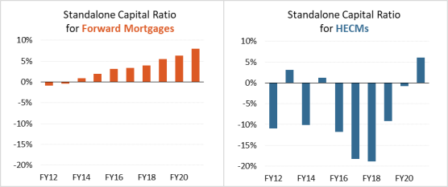

## Table of Contents

## What is the Mutual Mortgage Insurance Fund (MMIF)?

The Mutual Mortgage Insurance Fund (MMIF) is a fund managed by the Federal Housing Administration (FHA). It helps people buy homes by providing insurance to lenders. This insurance protects lenders if a borrower cannot pay back their home loan. Because of this insurance, lenders can offer loans to people who might not qualify for a regular loan. This makes it easier for more people to buy homes.

The MMIF is funded by the insurance premiums that borrowers pay. These premiums are added to the monthly mortgage payments. The money collected goes into the MMIF and is used to pay lenders if borrowers default on their loans. This system helps keep the housing market stable and supports homeownership for many families.

## Why was the Mutual Mortgage Insurance Fund created?

The Mutual Mortgage Insurance Fund (MMIF) was created to help more people buy homes. Before the MMIF, many people couldn't get loans because banks thought they were too risky. The MMIF changed this by promising to pay banks if borrowers couldn't pay back their loans. This made banks more willing to lend money to people who might not have qualified otherwise.

The MMIF is run by the Federal Housing Administration (FHA). It uses the money from insurance premiums that borrowers pay to cover any losses if someone can't pay their mortgage. This system helps keep the housing market stable and makes homeownership possible for many families who might not have been able to afford it otherwise.

## Who manages the Mutual Mortgage Insurance Fund?

The Federal Housing Administration (FHA) manages the Mutual Mortgage Insurance Fund (MMIF). The FHA is part of the U.S. Department of Housing and Urban Development (HUD). Their job is to make sure the MMIF works well and helps people buy homes.

The MMIF helps people get home loans by promising to pay banks if a borrower can't pay back their loan. This makes banks more willing to lend money to people who might not have been able to get a loan before. The money for the MMIF comes from the insurance premiums that borrowers pay, which helps keep the fund going and supports homeownership.

## How does the Mutual Mortgage Insurance Fund work?

The Mutual Mortgage Insurance Fund (MMIF) helps people buy homes by making loans safer for banks. When someone wants to buy a home but can't get a regular loan, they can get a loan insured by the MMIF. This means that if the person can't pay back the loan, the MMIF will pay the bank instead. This makes banks more willing to lend money to people who might be seen as risky borrowers.

The MMIF is run by the Federal Housing Administration (FHA), which is part of the U.S. Department of Housing and Urban Development (HUD). The money for the MMIF comes from the insurance premiums that borrowers pay. These premiums are added to the monthly mortgage payments. The MMIF uses this money to pay banks if borrowers can't pay their loans, which helps keep the housing market stable and supports homeownership for many families.

## Who benefits from the Mutual Mortgage Insurance Fund?

The Mutual Mortgage Insurance Fund (MMIF) helps people who want to buy homes but can't get regular loans. It makes it easier for them to get a loan because the MMIF promises to pay the bank if the borrower can't. This means more people can become homeowners, even if they don't have a lot of money or a perfect credit score.

Banks also benefit from the MMIF. It makes lending safer for them because they know the MMIF will cover their losses if a borrower can't pay. This encourages banks to lend money to more people, which helps keep the housing market stable. Overall, the MMIF helps both home buyers and banks by reducing the risk of lending and borrowing.

## What are the eligibility criteria for loans covered by the MMIF?

To get a loan covered by the Mutual Mortgage Insurance Fund (MMIF), you need to meet certain rules set by the Federal Housing Administration (FHA). You need to have a good credit score, but it doesn't have to be perfect. The FHA looks at your whole financial situation, including your credit history, how much debt you have, and your income. You also need to show that you can afford the monthly payments on the loan.

Another important rule is that the home you want to buy must be your main home, not a vacation home or investment property. The home must also meet certain safety and livability standards set by the FHA. If you meet all these rules, you can get a loan that's insured by the MMIF, which makes it easier to buy a home even if you can't get a regular loan.

## How is the MMIF funded?

The Mutual Mortgage Insurance Fund (MMIF) is funded by the money that people pay for their home loan insurance. When someone gets a loan that is insured by the MMIF, they have to pay an insurance premium. This premium is added to their monthly mortgage payment. The money from these premiums goes into the MMIF and is used to help pay banks if a borrower can't pay back their loan.

This system helps keep the MMIF running and makes sure there is enough money to cover any losses. By using the premiums paid by borrowers, the MMIF can support more people in buying homes and keep the housing market stable. It's a way to make sure that both home buyers and banks are protected.

## What are the risks associated with the Mutual Mortgage Insurance Fund?

One risk of the Mutual Mortgage Insurance Fund (MMIF) is that it might not have enough money to pay banks if a lot of people can't pay back their loans at the same time. This could happen if there's a big economic problem, like a housing market crash. If the MMIF runs out of money, it might need help from the government, which could affect taxpayers.

Another risk is that some people might not understand how the MMIF works. They might think it's a guarantee that they will always be able to keep their home, but it's not. The MMIF helps by paying the bank if you can't, but you could still lose your home if you don't pay your loan. It's important for people to know this so they can make good choices about buying a home.

## How does the MMIF impact mortgage interest rates?

The Mutual Mortgage Insurance Fund (MMIF) helps keep mortgage interest rates lower for people who get loans insured by it. Since the MMIF promises to pay banks if a borrower can't, it makes lending safer for banks. When banks feel safer, they don't need to charge as much interest on the loans. This means that people who get loans through the MMIF can often get lower interest rates than they would with a regular loan.

However, the MMIF also adds an insurance premium to the monthly mortgage payment. This premium helps fund the MMIF but can make the overall cost of the loan a bit higher. So, while the [interest rate](/wiki/interest-rate-trading-strategies) might be lower, the total amount paid each month could still be more because of the insurance. It's important for people to look at both the interest rate and the insurance premium when deciding if a loan insured by the MMIF is right for them.

## What is the current financial status of the Mutual Mortgage Insurance Fund?

The Mutual Mortgage Insurance Fund (MMIF) is doing well right now. As of the latest report, it has enough money to cover its costs and pay banks if people can't pay their loans. This is important because it shows the MMIF is strong and can keep helping people buy homes.

However, the MMIF's financial health can change. It depends on things like how many people are buying homes, how the economy is doing, and if a lot of people can't pay their loans at the same time. The people who run the MMIF keep a close eye on these things to make sure it stays in good shape and can keep supporting homeownership.

## How does the MMIF compare to private mortgage insurance?

The Mutual Mortgage Insurance Fund (MMIF) and private mortgage insurance (PMI) both help people buy homes by making loans safer for banks. The MMIF is run by the government through the Federal Housing Administration (FHA). It helps people who might not qualify for regular loans because it promises to pay the bank if the borrower can't. This makes it easier for more people to buy homes. On the other hand, PMI is offered by private companies. It's often used for loans where the borrower has a down payment of less than 20%. Like the MMIF, PMI also protects the bank if the borrower can't pay back the loan.

The main difference between the MMIF and PMI is who runs them and who they help. The MMIF is part of a government program, so it can help more people, especially those with lower incomes or less perfect credit. The insurance premiums for the MMIF go into a big fund that helps keep the housing market stable. PMI, on the other hand, is from private companies and might have different rules and costs. People usually can cancel PMI once they have enough equity in their home, but MMIF insurance might stay for the life of the loan if it's a certain type of loan.

## What reforms have been proposed or implemented to improve the MMIF's stability and effectiveness?

Over the years, several changes have been made to make the Mutual Mortgage Insurance Fund (MMIF) stronger and work better. One big change was raising the insurance premiums that people pay. This helps make sure there's enough money in the MMIF to pay banks if a lot of people can't pay their loans at the same time. Another change was making the rules stricter for who can get a loan insured by the MMIF. This means only people who can really afford to pay their loans get them, which helps keep the MMIF stable.

There have also been talks about other ways to improve the MMIF. Some people think the MMIF should be able to change its rules faster if the economy changes a lot. This would help the MMIF react quickly to problems and keep helping people buy homes. Also, there's been talk about making the MMIF work more closely with other government programs to help more people. These ideas are still being discussed, but they show that people want to keep making the MMIF better so it can keep supporting homeownership.

## References & Further Reading

[1]: U.S. Department of Housing and Urban Development. ["FHA Single Family Mutual Mortgage Insurance Fund Programs."](https://www.hud.gov/sites/dfiles/Housing/documents/MMIQtrlyQ32017.pdf)

[2]: Bhutta, N., Goldin, J., & Homonoff, T. (2016). ["Consumer Borrowing After Payday Loan Bans."](https://chicagounbound.uchicago.edu/jle/vol59/iss1/8/) Journal of Economic Perspectives, 30(1), 297-316.

[3]: Wang, G., & Wang, Y. (2020). ["Impact of Mortgage Rate Changes on Housing."](https://pmc.ncbi.nlm.nih.gov/articles/PMC7546956/) Journal of Housing Economics, 47.

[4]: Chatterjee, S., & Eyigungor, B. (2015). ["A Tractable Model of Housing, Breach of Contract, and Macroeconomic Risk."](https://papers.ssrn.com/sol3/papers.cfm?abstract_id=1352643) Federal Reserve Bank of San Francisco Working Paper Series.

[5]: Hull, J. C. (2012). ["Options, Futures, and Other Derivatives."](https://www.semanticscholar.org/paper/Options%2C-Futures%2C-and-Other-Derivatives-Hull/89bdee500c8623864fc9eb7a471546aa713acc44) Pearson.

[6]: Lopez, J. A., & Saidenberg, M. R. (2000). ["Evaluating Credit Risk Models."](https://www.semanticscholar.org/paper/Evaluating-Credit-Risk-Models-Lopez-Saidenberg/95a619f0d50b53d4e9ef479cee5006bcea8903ec) Staff Reports, Federal Reserve Bank of New York.

[7]: Merton, R. C. (1974). ["On the Pricing of Corporate Debt: The Risk Structure of Interest Rates."](https://onlinelibrary.wiley.com/doi/10.1111/j.1540-6261.1974.tb03058.x) Journal of Finance, 29(2), 449-470.