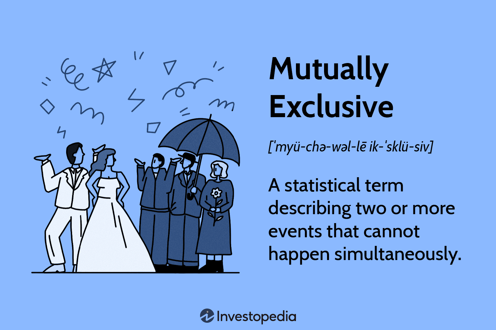

## Table of Contents

## What are mutually exclusive events?

Mutually exclusive events are things that can't happen at the same time. For example, if you flip a coin, it can land on heads or tails, but it can't be both at once. These events are called mutually exclusive because if one happens, the other cannot happen.

In probability, when events are mutually exclusive, the chance of both happening together is zero. This is important because it helps us figure out the total chance of one or the other happening. For example, if you roll a die, the chance of getting a 1 or a 2 is the sum of the chance of getting a 1 and the chance of getting a 2, because a die can't show both a 1 and a 2 at the same time.

## Can you give a simple example of mutually exclusive events?

Imagine you have a bag with red and blue marbles. You reach in and pick one marble. If you pick a red marble, you can't pick a blue marble at the same time. These are mutually exclusive events because they can't happen together.

Let's say you're rolling a regular six-sided die. You roll it once and you can get a number from 1 to 6. If you roll a 3, you can't roll a 4 on the same roll. Rolling a 3 and rolling a 4 are mutually exclusive events because only one number can show up on the die at a time.

## How do mutually exclusive events affect probability calculations?

When events are mutually exclusive, it means they can't happen at the same time. This affects how we calculate the total probability of one of them happening. For example, if you want to know the chance of rolling a 1 or a 2 on a die, you add the chance of rolling a 1 to the chance of rolling a 2. This is because if you roll a 1, you can't roll a 2 on the same roll, so these events don't overlap.

In probability terms, if A and B are mutually exclusive events, the probability of A or B happening (written as P(A or B)) is just P(A) + P(B). This rule works because the events can't happen together, so there's no need to subtract any overlap. It makes calculating probabilities simpler when you know the events are mutually exclusive.

## What is the difference between mutually exclusive and independent events?

Mutually exclusive events are events that can't happen at the same time. For example, if you flip a coin, it can land on heads or tails, but not both. If one event happens, the other can't happen. In probability, if two events are mutually exclusive, the chance of both happening together is zero. This means when you want to find the chance of one or the other happening, you just add their probabilities together.

Independent events are different. These are events where what happens with one event doesn't affect the other. For example, if you flip a coin twice, the result of the first flip doesn't change the chance of the second flip. If two events are independent, to find the chance of both happening, you multiply their probabilities. So, the main difference is that mutually exclusive events can't happen together, while independent events don't affect each other's chances of happening.

## How can you determine if two events are mutually exclusive?

To find out if two events are mutually exclusive, you need to see if they can happen at the same time. If they can't, then they are mutually exclusive. For example, if you roll a die, getting a 3 and getting a 4 can't happen on the same roll. So, these events are mutually exclusive. If you draw a card from a deck, getting a heart and getting a spade can't happen with the same card. These events are also mutually exclusive.

In math, if the chance of both events happening together is zero, then the events are mutually exclusive. This means if you want to know the chance of one or the other happening, you just add their chances together. For example, if you roll a die, the chance of getting a 1 is 1/6 and the chance of getting a 2 is also 1/6. Since these events can't happen together, the chance of getting a 1 or a 2 is 1/6 + 1/6 = 1/3.

## What is the formula for calculating the probability of mutually exclusive events?

When you want to figure out the chance of one of two things happening, and those two things can't happen at the same time, you use a simple rule. If the events are mutually exclusive, you just add their chances together. For example, if you roll a die and want to know the chance of getting a 1 or a 2, you add the chance of getting a 1 (which is 1/6) to the chance of getting a 2 (also 1/6). So, the chance of getting a 1 or a 2 is 1/6 + 1/6 = 1/3.

This rule works because if one event happens, the other can't. So, there's no overlap to worry about. In math, we write this rule as P(A or B) = P(A) + P(B), where A and B are the two mutually exclusive events. This makes calculating probabilities easier when you know the events can't happen at the same time.

## Can three or more events be mutually exclusive?

Yes, three or more events can be mutually exclusive. This means that if you have three or more things that could happen, none of them can happen at the same time. For example, if you roll a die, getting a 1, getting a 2, and getting a 3 are all mutually exclusive events because the die can only show one number at a time.

When you want to find the chance of one of these events happening, you add up their chances. So, if you want to know the chance of rolling a 1, a 2, or a 3 on a die, you add the chance of rolling a 1 (1/6) to the chance of rolling a 2 (1/6) and the chance of rolling a 3 (1/6). This gives you a total chance of 1/6 + 1/6 + 1/6 = 1/2. This rule works because none of these events can happen together, so there's no need to worry about any overlap.

## How do mutually exclusive events apply in real-world scenarios?

Mutually exclusive events are things that can't happen at the same time, and we see them a lot in everyday life. For example, think about choosing what to wear in the morning. If you decide to wear a red shirt, you can't wear a blue shirt at the same time. These choices are mutually exclusive because you can only wear one shirt. Another example is traffic lights. When the light is green, it can't be red at the same time. These are also mutually exclusive events because only one color can be on at a time.

In business, mutually exclusive events are important too. Imagine a company deciding between different marketing strategies. If they choose to focus on social media ads, they can't also focus on TV commercials at the same time because their budget and resources are limited. This choice is mutually exclusive. Understanding these events helps businesses and people make better decisions because they know that if they pick one option, they can't have the other at the same time.

## What are some common misconceptions about mutually exclusive events?

One common misconception about mutually exclusive events is that they are the same as independent events. People sometimes think that if two events can't happen at the same time, they must not affect each other's chances of happening. But that's not true. Mutually exclusive events can't happen together, but independent events don't affect each other's chances. For example, flipping a coin twice is independent because the first flip doesn't change the chance of the second flip. But choosing a red or blue shirt is mutually exclusive because you can't wear both at the same time.

Another misconception is that if two events are mutually exclusive, their chances of happening must add up to 100%. This isn't always true. For example, if you roll a die, the chance of getting a 1 or a 2 is 1/6 + 1/6 = 1/3, which is not 100%. The total chance of all possible outcomes should add up to 100%, but the chance of just two mutually exclusive events doesn't have to. It's important to remember that mutually exclusive events just can't happen at the same time, but their chances don't have to cover all possibilities.

## How do mutually exclusive events relate to the concept of a sample space?

Mutually exclusive events are events that can't happen at the same time. They relate to the concept of a sample space because the sample space is all the possible things that could happen. For example, if you roll a die, the sample space is all the numbers you could roll, like 1, 2, 3, 4, 5, and 6. If you want to know the chance of rolling a 1 or a 2, these are mutually exclusive events because you can't roll both at the same time. So, you look at the sample space to see all the possible outcomes and then add up the chances of the ones you're interested in.

Understanding the sample space helps you see why events are mutually exclusive. If you know all the possible outcomes, you can tell if two events can happen together or not. For example, if you're picking a card from a deck, the sample space includes all 52 cards. If you want to know the chance of picking a heart or a spade, these are mutually exclusive because a card can't be both a heart and a spade. By looking at the sample space, you can see that these events can't overlap, which helps you calculate their chances correctly.

## Can you explain the use of Venn diagrams in illustrating mutually exclusive events?

Venn diagrams are really helpful for showing what mutually exclusive events are. They use circles to show different things that could happen. If two events can't happen at the same time, their circles won't touch each other. For example, if you roll a die, you can't get a 1 and a 2 at the same time. So, in a Venn diagram, the circle for getting a 1 and the circle for getting a 2 would be separate, showing they are mutually exclusive.

Looking at a Venn diagram makes it easy to see that if one thing happens, the other can't. If the circles don't overlap, it means the events can't happen together. This helps people understand and work with probabilities better because they can see right away which events are mutually exclusive and which ones aren't.

## How do mutually exclusive events impact decision-making in fields like finance or insurance?

In finance, understanding mutually exclusive events helps people make better choices about where to put their money. For example, if you're thinking about investing in one stock or another, you can't buy both at the same time with the same money. Knowing this helps you compare the risks and rewards of each option and pick the one that fits your goals best. If you choose one investment, you can't have the other, so you need to think carefully about which one will help you more.

In insurance, knowing about mutually exclusive events is important too. For example, if you're buying car insurance, you might have to choose between different types of coverage, like collision or comprehensive. You can't have both at the same time with the same amount of money. This means you need to think about what's more important to you and what you can afford. Understanding that these choices can't happen together helps you make a smart decision about which insurance plan to go with.

## What is Understanding Probability Theory?

Probability theory provides a mathematical framework essential for quantifying uncertainty, making it a cornerstone in various fields, including finance and artificial intelligence. The application of probability theory is crucial for algorithmic trading as it aids in predicting the likelihood of events, thereby facilitating informed decision-making among traders.

In algorithmic trading, probability theory is utilized to estimate how likely specific market movements are to occur. This estimation is achieved through models that analyze historical data, assess current market conditions, and simulate potential future scenarios. For instance, traders might use historical price data of a stock to determine the probability of the stock price reaching a certain level within a given time frame.

Probability is defined mathematically as the measure of the likelihood that an event will occur. It ranges between 0 and 1, where 0 indicates impossibility and 1 indicates certainty. Mathematically, if A is an event, the probability of A, denoted as P(A), is calculated as:

$$
P(A) = \frac{\text{Number of favorable outcomes for event A}}{\text{Total number of possible outcomes}}
$$

For example, consider a simple scenario of a fair die roll, where the probability of rolling a number greater than 4 (i.e., rolling a 5 or 6) can be calculated as:

$$
P(\text{rolling a 5 or 6}) = \frac{2}{6} = \frac{1}{3}
$$

In [algorithmic trading](/wiki/algorithmic-trading), understanding such probabilities helps in constructing trading algorithms that predict price movements or the probability of achieving a certain return on investment.

Moreover, algorithmic traders often model complex market conditions where different probabilities need to be considered. These models incorporate concepts such as conditional probability, which calculates the likelihood of an event given that another event has occurred. This is mathematically expressed as:

$$
P(A | B) = \frac{P(A \cap B)}{P(B)}
$$

where $P(A | B)$ is the probability of event A occurring given event B has occurred, $P(A \cap B)$ is the probability of both events A and B occurring, and $P(B)$ is the probability of event B.

Conditional probability is particularly useful in scenarios where market events are dependent, such as the impact of economic indicators on stock prices. For example, if commodity prices drop due to a report released by an authoritative financial body, understanding the conditional probability can help traders adjust their positions accordingly.

In summary, probability theory not only allows market participants to evaluate the potential risks and returns associated with different trading strategies but also helps automate trading decisions through the development of sophisticated algorithms. These algorithms leverage probability models to enhance the accuracy of predictions and optimize profitability, thereby playing a critical role in the efficacy of algorithmic trading practices.

## How can probability be applied in algorithmic trading?

Algorithmic trading relies heavily on statistical and mathematical models, making probability a fundamental element in the decision-making process. Traders utilize probability to estimate the likelihood of different trading outcomes, such as price movements, based on historical data patterns. This statistical approach allows traders to quantify risk and make informed predictions about future market behaviors.

Incorporating the analysis of mutually exclusive events into algorithmic trading models can enhance the precision and robustness of these predictions. Mutually exclusive events, by definition, are events that cannot occur simultaneously. When applied to trading, this concept assists in refining algorithms to better manage risk and enhance predictability.

For example, consider the probability of a stock price either increasing or decreasing in a trading session. These two outcomes are mutually exclusive events, and understanding their probabilities helps in constructing scenarios where the trading algorithm can decide on buying or selling strategies. Quantitatively, if $P(A)$ denotes the probability of the stock price increasing and $P(B)$ the probability of it decreasing, the mutual exclusivity is expressed as:

$$
P(A \cap B) = 0
$$

Given that these events completely account for the possible outcomes of price movement in the session:

$$
P(A) + P(B) = 1
$$

In practice, traders often use historical data to estimate these probabilities. For instance, by applying logistic regression or other statistical methods, traders can derive estimates of $P(A)$ and $P(B)$. Here is a basic Python snippet using logistic regression to estimate the probability of a price increase based on historical indicators:

```python
import numpy as np
from sklearn.linear_model import LogisticRegression

# Sample historical data: features could include moving averages, volatility, etc.
X = np.array([[0.5, 1.2], [1.0, 1.5], [1.5, 1.7], [2.0, 2.2]]) # Example features
y = np.array([0, 0, 1, 1]) # 0: price decrease, 1: price increase

# Train logistic regression model
model = LogisticRegression()
model.fit(X, y)

# Predict probabilities for a new data point
new_data = np.array([[1.8, 1.8]])
predicted_probabilities = model.predict_proba(new_data)
increase_probability = predicted_probabilities[0][1]
decrease_probability = predicted_probabilities[0][0]

print(f"Probability of price increase: {increase_probability}")
print(f"Probability of price decrease: {decrease_probability}")
```

By estimating these probabilities, algorithms can adjust positions to either capitalize on potential gains or safeguard against losses, thus improving trading performance. The ability to discern which events are mutually exclusive enables traders to avoid conflicting positions, thereby better managing risk. As probability theory becomes more integrated into algorithmic strategies, the emphasis on understanding and utilizing mutually exclusive events remains critical for optimizing trading outcomes and achieving long-term success.

## References & Further Reading

[1]: Shreve, S. E. (2004). ["Stochastic Calculus for Finance I: The Binomial Asset Pricing Model."](https://link.springer.com/book/10.1007/978-0-387-22527-2) Springer.

[2]: Murphy, J. J. (1999). ["Technical Analysis of the Financial Markets: A Comprehensive Guide to Trading Methods and Applications."](https://archive.org/details/technicalanalysi0000murp) New York Institute of Finance.

[3]: Hull, J. C. (2018). ["Options, Futures, and Other Derivatives"](https://www.semanticscholar.org/paper/Options%2C-Futures%2C-and-Other-Derivatives-Hull/89bdee500c8623864fc9eb7a471546aa713acc44) (9th Edition). Pearson.

[4]: Feller, W. (1968). ["An Introduction to Probability Theory and Its Applications, Vol. 1."](https://archive.org/details/dli.ernet.5666) Wiley.

[5]: Ross, S. M. (2007). ["Introduction to Probability Models."](https://www.sciencedirect.com/book/9780124079489/introduction-to-probability-models) Academic Press.