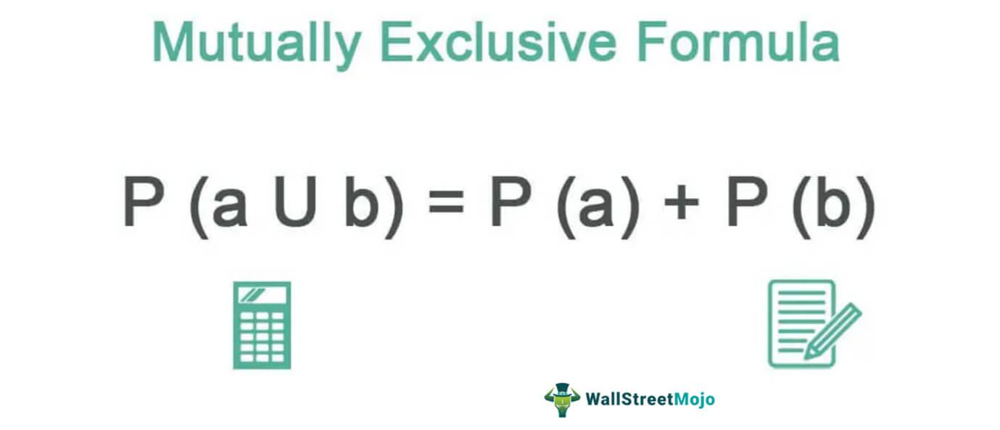

In the fast-paced world of algorithmic trading, understanding key statistical concepts is vital to developing robust trading strategies. Algorithmic trading relies heavily on quantitative analysis, where precise and reliable decision-making is essential. One fundamental concept in this domain is the idea of mutually exclusive events, which plays a crucial role in probability theory. In probability, mutually exclusive events are those that cannot occur simultaneously. Understanding this concept helps traders assess risks and manage strategies more effectively. For instance, if two market conditions are mutually exclusive, acknowledging this aspect can prevent conflicting trades that could undermine a strategy's performance.

This article explores how probability theory, particularly the concept of mutually exclusive events, applies to algorithmic trading. By comprehending these principles, traders can refine their algorithms to better anticipate market movements and navigate uncertainties. Additionally, we will illustrate these concepts with examples, providing clarity on how they can be utilized to enhance trading algorithms. Real-world applications of mutually exclusive event analysis in trading demonstrate its potential in optimizing decision-making processes, ultimately contributing to more successful trading outcomes.



## Table of Contents

## Understanding Probability Theory

Probability theory provides a mathematical framework essential for quantifying uncertainty, making it a cornerstone in various fields, including finance and artificial intelligence. The application of probability theory is crucial for algorithmic trading as it aids in predicting the likelihood of events, thereby facilitating informed decision-making among traders.

In algorithmic trading, probability theory is utilized to estimate how likely specific market movements are to occur. This estimation is achieved through models that analyze historical data, assess current market conditions, and simulate potential future scenarios. For instance, traders might use historical price data of a stock to determine the probability of the stock price reaching a certain level within a given time frame.

Probability is defined mathematically as the measure of the likelihood that an event will occur. It ranges between 0 and 1, where 0 indicates impossibility and 1 indicates certainty. Mathematically, if A is an event, the probability of A, denoted as P(A), is calculated as:

$$
P(A) = \frac{\text{Number of favorable outcomes for event A}}{\text{Total number of possible outcomes}}
$$

For example, consider a simple scenario of a fair die roll, where the probability of rolling a number greater than 4 (i.e., rolling a 5 or 6) can be calculated as:

$$
P(\text{rolling a 5 or 6}) = \frac{2}{6} = \frac{1}{3}
$$

In [algorithmic trading](/wiki/algorithmic-trading), understanding such probabilities helps in constructing trading algorithms that predict price movements or the probability of achieving a certain return on investment.

Moreover, algorithmic traders often model complex market conditions where different probabilities need to be considered. These models incorporate concepts such as conditional probability, which calculates the likelihood of an event given that another event has occurred. This is mathematically expressed as:

$$
P(A | B) = \frac{P(A \cap B)}{P(B)}
$$

where $P(A | B)$ is the probability of event A occurring given event B has occurred, $P(A \cap B)$ is the probability of both events A and B occurring, and $P(B)$ is the probability of event B.

Conditional probability is particularly useful in scenarios where market events are dependent, such as the impact of economic indicators on stock prices. For example, if commodity prices drop due to a report released by an authoritative financial body, understanding the conditional probability can help traders adjust their positions accordingly.

In summary, probability theory not only allows market participants to evaluate the potential risks and returns associated with different trading strategies but also helps automate trading decisions through the development of sophisticated algorithms. These algorithms leverage probability models to enhance the accuracy of predictions and optimize profitability, thereby playing a critical role in the efficacy of algorithmic trading practices.

## Defining Mutually Exclusive Events

Mutually exclusive events are a fundamental concept in probability theory, referring to two or more events that cannot occur simultaneously. In the context of a single experiment or trial, if one event happens, the other cannot. A classic example is the result of a single coin toss, which can result in either heads or tails, but not both. Mathematically, if $A$ and $B$ are mutually exclusive events, then the probability of both $A$ and $B$ occurring at the same time is zero, expressed as:
$$
P(A \cap B) = 0
$$

This notion is particularly important in trading, as it assists traders in making strategic decisions by recognizing situations where outcomes are mutually exclusive. In trading scenarios, identifying mutually exclusive events helps in avoiding conflicting strategies, thus allowing for a clearer decision-making process. For instance, if a trader decides to invest in two stocks but has limited resources to do so, the selection of one stock over the other becomes a mutually exclusive event. This choice subsequently highlights the concept of opportunity cost, where selecting one option inherently excludes the alternative. Understanding these dynamics enables traders to anticipate market movements more effectively and manage their portfolios by allocating resources to the most promising opportunities.

## Examples of Mutually Exclusive Events in Trading

In financial markets, traders often encounter situations where investment choices are mutually exclusive. This occurs when selecting one investment precludes the possibility of choosing another, primarily due to constraints such as limited capital or conflicting strategies. For instance, consider a scenario where a trader has a budget that permits investment in only one high-cost stock. If the trader is considering two stocks, Stock A and Stock B, the investment becomes mutually exclusive—the trader can select Stock A or Stock B, but not both due to the budget constraint.

Such decisions highlight the concept of opportunity cost, which is the potential benefit foregone by choosing one option over another. In trading, assessing opportunity cost involves evaluating the potential returns from alternative investments. For example, if Stock A has a projected return of 10% and Stock B has a projected return of 12%, choosing Stock B would result in a higher opportunity cost if Stock A is selected instead. This decision-making process is crucial because it informs traders about the trade-offs involved in investment choices and guides them in maximizing returns within the constraints posed by their resources.

Moreover, the concept of mutually exclusive events in trading can be extended beyond simple stock selection. Traders might face choices between different financial strategies that are incompatible with one another. For example, a trader may have to decide between a short-term trading strategy focusing on quick gains and a long-term investment strategy aimed at benefiting from compound interest over an extended period. If resources or time do not allow implementing both strategies simultaneously, these decisions also become mutually exclusive.

Considering mutually exclusive events in trading strategies involves evaluating risks and rewards associated with each option. This approach enables traders to optimize their decision-making processes, thus enhancing their ability to manage portfolios efficiently and effectively navigate market uncertainties.

## Applying Probability in Algorithmic Trading

Algorithmic trading relies heavily on statistical and mathematical models, making probability a fundamental element in the decision-making process. Traders utilize probability to estimate the likelihood of different trading outcomes, such as price movements, based on historical data patterns. This statistical approach allows traders to quantify risk and make informed predictions about future market behaviors.

Incorporating the analysis of mutually exclusive events into algorithmic trading models can enhance the precision and robustness of these predictions. Mutually exclusive events, by definition, are events that cannot occur simultaneously. When applied to trading, this concept assists in refining algorithms to better manage risk and enhance predictability.

For example, consider the probability of a stock price either increasing or decreasing in a trading session. These two outcomes are mutually exclusive events, and understanding their probabilities helps in constructing scenarios where the trading algorithm can decide on buying or selling strategies. Quantitatively, if $P(A)$ denotes the probability of the stock price increasing and $P(B)$ the probability of it decreasing, the mutual exclusivity is expressed as:

$$
P(A \cap B) = 0
$$

Given that these events completely account for the possible outcomes of price movement in the session:

$$
P(A) + P(B) = 1
$$

In practice, traders often use historical data to estimate these probabilities. For instance, by applying logistic regression or other statistical methods, traders can derive estimates of $P(A)$ and $P(B)$. Here is a basic Python snippet using logistic regression to estimate the probability of a price increase based on historical indicators:

```python
import numpy as np
from sklearn.linear_model import LogisticRegression

# Sample historical data: features could include moving averages, volatility, etc.
X = np.array([[0.5, 1.2], [1.0, 1.5], [1.5, 1.7], [2.0, 2.2]]) # Example features
y = np.array([0, 0, 1, 1]) # 0: price decrease, 1: price increase

# Train logistic regression model
model = LogisticRegression()
model.fit(X, y)

# Predict probabilities for a new data point
new_data = np.array([[1.8, 1.8]])
predicted_probabilities = model.predict_proba(new_data)
increase_probability = predicted_probabilities[0][1]
decrease_probability = predicted_probabilities[0][0]

print(f"Probability of price increase: {increase_probability}")
print(f"Probability of price decrease: {decrease_probability}")
```

By estimating these probabilities, algorithms can adjust positions to either capitalize on potential gains or safeguard against losses, thus improving trading performance. The ability to discern which events are mutually exclusive enables traders to avoid conflicting positions, thereby better managing risk. As probability theory becomes more integrated into algorithmic strategies, the emphasis on understanding and utilizing mutually exclusive events remains critical for optimizing trading outcomes and achieving long-term success.

## Real-World Trading Strategies Utilizing Mutually Exclusive Events

A practical approach to developing effective trading strategies involves considering mutually exclusive events and how they can impact trading outcomes. Economic indicators, such as [interest rate](/wiki/interest-rate-trading-strategies) changes, can greatly influence market dynamics. Traders can leverage the knowledge of these concepts to optimize their decision-making processes.

For instance, rising interest rates often lead to a decrease in bond prices because the fixed interest yields on existing bonds become less attractive compared to new issues that offer higher returns. Understanding that these two events are mutually exclusive — where one event's occurrence implies the non-occurrence of the other — can guide traders in making strategic portfolio adjustments.

For example, consider a scenario where a trader anticipates an impending interest rate hike. By recognizing that an increase in interest rates will likely lead to a decrease in bond prices, the trader can choose to reallocate investments from bonds to equities or other assets less affected by interest rate changes. This strategic shift can help mitigate potential losses linked to declining bond prices.

Incorporating mutually exclusive events into algorithmic trading strategies typically involves constructing models that accurately reflect these relationships. Here is a simple Python illustration of how one might simulate and assess the impact of interest rate changes on bond prices:

```python
import numpy as np
import matplotlib.pyplot as plt

# Simulated interest rates and bond prices
interest_rates = np.arange(0, 5, 0.1)
bond_prices = 100 / (1 + interest_rates)

# Plotting the relationship
plt.figure(figsize=(10, 6))
plt.plot(interest_rates, bond_prices, label='Bond Price vs Interest Rate')
plt.xlabel('Interest Rate (%)')
plt.ylabel('Bond Price')
plt.title('Impact of Interest Rate on Bond Price')
plt.legend()
plt.grid(True)
plt.show()
```

In this code, as interest rates increase, bond prices decrease, illustrating the mutually exclusive relationship. Such simulations help traders visualize potential outcomes and make informed decisions based on different economic scenarios.

By integrating these insights into their strategies, traders can enhance the versatility and effectiveness of their algorithms, fully capitalizing on the predictive power of mutually exclusive events. Understanding these concepts allows for better risk management and more strategic positioning in fast-changing financial markets.

## Conclusion

Probability theory, particularly the concept of mutually exclusive events, is essential for creating effective trading algorithms. In algorithmic trading, the ability to quantify uncertainty and anticipate market movements can significantly enhance a trader's decision-making processes. By understanding and applying probability theory, traders can estimate the likelihood of various outcomes, thereby optimizing their strategies and mitigating risks.

Mutually exclusive events, which cannot occur simultaneously, offer valuable insights in the trading domain. Recognizing such events aids in resolving conflicts in trading strategies and helps in making informed choices under uncertainty. For instance, a trader who is aware of the mutually exclusive nature of certain economic indicators, such as rising interest rates and decreasing bond prices, can leverage this knowledge to position their portfolios advantageously.

Incorporating the analysis of mutually exclusive events into algorithmic models enhances the precision of predictions. This, in turn, allows for better risk management and portfolio optimization. For example, by evaluating historical data and using probability models, traders can refine algorithms to identify patterns that may indicate potential market reversals or extreme events, which are mutually exclusive with other market conditions.

The concepts discussed underscore the importance of using probability theory to navigate the complexities of financial markets. By integrating these insights, algorithmic traders can improve their strategies, increasing the likelihood of successful trading outcomes. Consequently, understanding and utilizing probability, especially the notion of mutually exclusive events, equips traders with essential tools to manage uncertainty and risk effectively in the ever-evolving market landscape.

## References & Further Reading

[1]: Shreve, S. E. (2004). ["Stochastic Calculus for Finance I: The Binomial Asset Pricing Model."](https://link.springer.com/book/10.1007/978-0-387-22527-2) Springer.

[2]: Murphy, J. J. (1999). ["Technical Analysis of the Financial Markets: A Comprehensive Guide to Trading Methods and Applications."](https://archive.org/details/technicalanalysi0000murp) New York Institute of Finance.

[3]: Hull, J. C. (2018). ["Options, Futures, and Other Derivatives"](https://www.semanticscholar.org/paper/Options%2C-Futures%2C-and-Other-Derivatives-Hull/89bdee500c8623864fc9eb7a471546aa713acc44) (9th Edition). Pearson.

[4]: Feller, W. (1968). ["An Introduction to Probability Theory and Its Applications, Vol. 1."](https://archive.org/details/dli.ernet.5666) Wiley.

[5]: Ross, S. M. (2007). ["Introduction to Probability Models."](https://www.sciencedirect.com/book/9780124079489/introduction-to-probability-models) Academic Press.