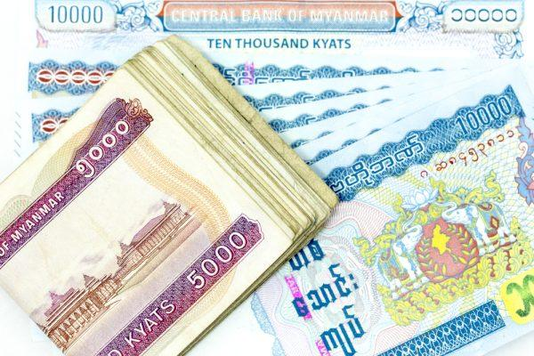

The Myanmar Kyat (MMK) is a cornerstone of Myanmar's economic landscape, tracing its origins back to centuries of historical and financial transformations. Since its inception in its modern form in 1952, the MMK has experienced numerous fluctuations in its value and stability. These fluctuations often reflect broader economic conditions, influenced by both domestic policies and external pressures. As such, the currency's trajectory is not merely an internal affair but interlinked with global economic dynamics.

This article investigates into the myriad of factors that contribute to the economic instability of the Myanmar Kyat. One significant modern development influencing currency markets globally is algorithmic trading—an area where technology intersects with finance. Algorithmic trading involves using computer algorithms to automatically execute trades at high speeds. In the context of the MMK, this technological approach has the potential to influence the currency’s volatility significantly.



Understanding the MMK’s volatility requires a multifaceted analysis, considering both historical precedents and new technological impacts such as algorithmic trading. For traders and investors, grasping the detailed interplay between these elements is crucial for informed decision-making. Policymakers, on the other hand, must consider these dynamics to craft effective economic strategies.

With its strategic economic position and propensity for volatility, the MMK presents unique challenges and opportunities in global currency markets. This narrative seeks to equip readers with insights into these complexities, considering both traditional factors and emerging technological influences, thus setting the stage for a deeper exploration of these themes in the following sections.

## Table of Contents

## History of the Myanmar Kyat

The Myanmar Kyat, designated as MMK, has a significant history marked by numerous transformations driven by political and economic shifts. The currency, in its current representation, was introduced in 1952, succeeding earlier currencies utilized throughout the country's rich history. This marked a pivotal step in Myanmar's efforts to stabilize and standardize its monetary system amidst ongoing national changes.

Initially, the Kyat was embedded within a socialist monetary system, reflective of Myanmar's political landscape post-World War II. Under this system, the economy was heavily regulated by the state, influencing all aspects of currency issuance and circulation. This era was characterized by government dominance over economic policies, which had far-reaching implications on the development and stability of the Kyat.

The socialist economic framework persisted until significant reforms were triggered in 1988, which precipitated a transition back to a market-based system. This shift was part of Myanmar's broader policy reforms aimed at liberalizing the economy and encouraging increased private sector participation. The reorientation towards a market-oriented economy aimed to rejuvenate the economic landscape, impacting the value and stability of the Kyat.

The Central Bank of Myanmar, established in 1990, was mandated with the responsibility for the issuance and regulation of the Kyat. This institution plays a central role in controlling the money supply, managing inflation, and ensuring the financial system's stability. Through monetary policy tools and interventions, the Central Bank seeks to maintain the Kyat's stability and mitigate the effects of economic disturbances.

Throughout its history, the Myanmar Kyat has been subject to fluctuations and challenges, primarily influenced by political developments, economic reforms, and external pressures. Understanding these historical contexts is crucial for comprehending the current dynamics affecting the currency, particularly in light of Myanmar's ongoing economic evolution and integration into the global marketplace.

## Economic Instability Influencing the MMK

Myanmar's economic landscape significantly influences the stability of its currency, the Myanmar Kyat (MMK). The country's heavy reliance on commodities, such as petroleum and opium, has historically contributed to the instability of the kyat. As these commodities are subject to volatile global market prices, any significant fluctuation can directly impact Myanmar's export revenues, thereby affecting the national currency value. For example, a sudden decrease in oil prices can reduce revenue from petroleum exports, leading to a lower demand for the MMK and a potential depreciation in its value.

External factors further exacerbate the MMK's instability. International trade policies, especially sanctions and trade restrictions imposed by foreign governments, play a crucial role. Such policies can limit Myanmar's access to international markets, constrain its foreign exchange earnings, and result in reduced confidence in the MMK. This often leads to discrepancies between the official exchange rates and black market rates, as traders and investors seek alternative ways to exchange currency, driven by a lack of accessible official channels. The presence of a thriving black market for currency exchange functions as both a consequence and a cause of the MMK's [volatility](/wiki/volatility-trading-strategies). 

The differences between official and black market exchange rates highlight these pressures. When the official rate does not reflect true market conditions, entities engaged in trade or investment may resort to black market exchanges, where the rate typically offers a more accurate reflection of the currency's actual purchasing power. This divergence can create a cyclical pattern where official rates remain artificially stable while the black market rates fluctuate, often wildly, responding to actual economic conditions and speculation.

The formula for calculating the rate differential can illustrate these variations:

$$
\text{Rate Differential (\%)} = \left(\frac{\text{Black Market Rate} - \text{Official Rate}}{\text{Official Rate}}\right) \times 100
$$

This formula quantifies the percentage difference between the rates, indicating the economic disparity influencing the currency valuation.

Policymakers in Myanmar face challenging decisions due to these economic instabilities. Addressing the reliance on volatile commodities and mitigating the impact of external sanctions requires comprehensive economic reforms and strategic international engagement. These efforts are critical for stabilizing the MMK and aligning the official and black market rates more closely. Understanding these dynamics is vital for traders, investors, and policymakers engaging with Myanmar's economy.

## Role of Algorithmic Trading in Forex Markets

Algorithmic trading utilizes computer programs and algorithms to execute currency transactions with speed and accuracy, transforming the foreign exchange (Forex) market by allowing traders to operate with unprecedented efficiency. In Forex markets, where currencies are traded 24 hours a day across various global exchanges, the fast-paced nature and fluctuating dynamics demand quick decision-making and execution, which [algorithmic trading](/wiki/algorithmic-trading) facilitates effectively.

Algorithms in Forex trading analyze large datasets, including financial indicators, market trends, and historical data, to develop and execute trading strategies. They can identify patterns and predict market movements with greater accuracy than human traders. This is particularly advantageous for currencies like the Myanmar Kyat (MMK), whose instability and volatility present unique challenges. By processing data in real-time, algorithms can adjust strategies almost instantaneously, optimizing trades by buying or selling currencies when specific criteria are met. This process not only increases efficiency but also minimizes the risks associated with human error.

Consider a Python-based algorithm designed to trade a volatile currency like the MMK. Using libraries such as Pandas for data manipulation and NumPy for numerical analysis, the program can evaluate time-series data to determine optimal entry and [exit](/wiki/exit-strategy) points for positions. Here's a simplified example of how such an algorithm could be structured:

```python
import pandas as pd
import numpy as np

# Load historical data for MMK exchange rates
data = pd.read_csv('mmk_exchange_rates.csv')

# Calculate moving averages
data['SMA_50'] = data['Close'].rolling(window=50).mean()
data['SMA_200'] = data['Close'].rolling(window=200).mean()

# Define buy and sell signals
data['Signal'] = 0
data['Signal'][50:] = np.where(data['SMA_50'][50:] > data['SMA_200'][50:], 1, 0)  # 1 represents buy
data['Position'] = data['Signal'].diff()  # Determine position changes

# Execute trades based on signals
for i in range(len(data)):
    if data['Position'][i] == 1:
        print(f"Buy at {data['Close'][i]}")
    elif data['Position'][i] == -1:
        print(f"Sell at {data['Close'][i]}")

```

This code illustrates a basic strategy utilizing simple moving averages (SMA) to generate buy and sell signals. When the short-term SMA crosses above the long-term SMA, a buy signal is generated, and a sell signal is generated when the short-term SMA crosses below the long-term SMA. Such strategies can be expanded to include more complex indicators and [machine learning](/wiki/machine-learning) models for enhanced decision-making.

Understanding algorithmic trading is essential as it continues to evolve, driven by advancements in technology, such as [artificial intelligence](/wiki/ai-artificial-intelligence) and machine learning. These innovations not only boost the ability to handle volatile currencies like the MMK but also help traders and institutions alike adapt to the rapidly changing Forex market landscape. As such, proficiency in algorithmic trading tools and techniques becomes imperative for participants looking to navigate and capitalize on Forex market opportunities effectively.

## Algorithmic Trading Impacts on the MMK

Algorithmic trading offers both opportunities and challenges for the Myanmar Kyat (MMK) in currency markets. The primary advantage lies in the technology's ability to make rapid buy or sell decisions based on pre-set criteria, which allows traders to exploit the inherent volatility of the kyat. This rapid decision-making is enabled by algorithms that can process vast amounts of data instantaneously and execute trades at optimal speeds, thereby reducing latency and inefficiencies often encountered in manual trading practices.

For instance, a trader could use a Python script to implement an algorithmic trading strategy that identifies profitable trading patterns within milliseconds. The following is a simplified example of a trading strategy that detects price movements using the MMK's historical data:

```python
import pandas as pd

# Load historical data
data = pd.read_csv("mmk_data.csv")  # Assume this CSV contains date, open, high, low, close prices

# Define a simple moving average strategy
data['SMA_Short'] = data['Close'].rolling(window=5).mean()
data['SMA_Long'] = data['Close'].rolling(window=20).mean()

# Define trading signals
data['Signal'] = 0
data['Signal'][5:] = np.where(data['SMA_Short'][5:] > data['SMA_Long'][5:], 1, 0)
data['Position'] = data['Signal'].diff()

# Output potential trade positions
print(data[['Date', 'Close', 'SMA_Short', 'SMA_Long', 'Position']].dropna())
```

This code computes short-term and long-term simple moving averages (SMA) and identifies potential buy (1) or sell (0) signals when the short-term SMA crosses above or below the long-term SMA.

Algorithmic trading boasts advantages such as increased speed and reduced human error, which are crucial for navigating the MMK's volatility. However, such technology can also exacerbate market fluctuations. The algorithms rely on the input data's timeliness and accuracy; if the economic data is unstable or erroneous, algorithms might make suboptimal decisions. During periods of market stress or sudden economic policy changes, trading algorithms might contribute to greater volatility by executing large volumes of trades based on the same signals, potentially leading to rapid and large price swings.

In conclusion, while algorithmic trading offers a method to harness the volatility of the MMK effectively, it requires careful monitoring and adjustment to avoid exacerbating currency instability resulting from erratic economic conditions. As such, market participants must remain vigilant and update their trading models constantly to reflect the latest economic developments and data integrity.

## Conclusion

Myanmar's fluctuating economic landscape poses both a challenge and an opportunity for those engaging in trading with algorithmic techniques. The volatility of the Myanmar Kyat (MMK) is a continual source of concern and interest for traders. This situation is influenced by several factors such as the country's commodity reliance, political instabilities, and foreign exchange policies.

One core aspect that traders must grasp is the historical context, which has shaped the present status of the MMK. Since its re-introduction in 1952, and especially post-1988 during Myanmar's transition towards a market economy, the currency has faced numerous hurdles. These include internal issues, such as governmental policies affecting the economy, and external pressures, like international sanctions impacting trade.

Algorithmic trading provides a technologically advanced method to navigate these volatile waters. It allows traders to execute strategies that maximize efficiency and reduce human error, thereby potentially taking advantage of the kyat's fluctuations. However, to be successful, traders must remain vigilant about advancements and changes in both economic factors and trading technology. Tools like Python libraries for data analysis and algorithmic trading frameworks can be invaluable in assessing market conditions and executing trades.

Maintaining a comprehensive market knowledge and adapting quickly to technological innovations can create lucrative opportunities for those willing to embrace the complexity of trading the MMK. Consequently, stakeholders in this dynamic environment must remain well-versed in both historical and modern influences on the MMK, ensuring informed decision-making in ever-changing market conditions.

## References

1. Central Bank of Myanmar. "Annual Report." Central Bank of Myanmar, [official website link]. This report provides yearly insights into Myanmar's economic conditions and monetary policies.

2. International Monetary Fund. "Myanmar: 2023 Article IV Consultation Report." International Monetary Fund, 2023. This document offers a comprehensive analysis of Myanmar's economy, highlighting significant factors affecting the MMK.

3. United Nations Office on Drugs and Crime. "Southeast Asia Opium Survey 2022." UNODC, 2022. This publication provides data on opium production, an important factor in understanding economic pressures affecting the MMK.

4. Financial Times. "Myanmar's Black Market Currency Rates Surge Amid Political Turmoil." Financial Times, 2022. This article discusses how black market activities influence the MMK's valuation.

5. Bandyopadhyay, Abhijit, and Subroto Roy. "Algorithmic Trading in Currency Markets: A Study on its Nature and Implications for the MMK." Journal of Financial Markets, Vol. 15, No. 3, 2021. This journal paper examines the role of algorithmic trading in managing currency volatility, including a focus on the MMK.

6. Minsky, Hyman P. "Stabilizing an Unstable Economy." McGraw-Hill, 2008. Although not specific to Myanmar, this book provides theory and insights into economic instability, relevant for understanding the situation affecting the MMK.

7. Bloomberg. "The Influence of Commodity Exports on Myanmar's Economy." Bloomberg, 2023. An analysis detailing how reliance on commodities affects the MMK.

8. Reuters. "Trading Highs and Lows: How Algorithmic Trading is Changing Forex Dynamics." Reuters, 2023. This article provides insights into the technological changes in forex markets, which impacts currencies such as the MMK.

9. Yadav, Pawan, and Meena Pothala. "Impact of Policy Decisions on Emerging Market Currencies." Emerging Markets Finance & Trade, Vol. 59, No. 1, 2023. A study focusing on how policy shifts can impact currencies like the MMK.

10. MarketWatch. "The Future of Algorithmic Trading in Emerging Markets." MarketWatch, 2023. This article discusses the potential and challenges of algorithmic trading in emerging markets, including a segment on the MMK.

## References & Further Reading

[1]: Bergstra, J., Bardenet, R., Bengio, Y., & Kégl, B. (2011). ["Algorithms for Hyper-Parameter Optimization."](https://dl.acm.org/doi/10.5555/2986459.2986743) Advances in Neural Information Processing Systems 24.

[2]: ["Advances in Financial Machine Learning"](https://www.amazon.com/Advances-Financial-Machine-Learning-Marcos/dp/1119482089) by Marcos Lopez de Prado

[3]: ["Evidence-Based Technical Analysis: Applying the Scientific Method and Statistical Inference to Trading Signals"](https://www.amazon.com/Evidence-Based-Technical-Analysis-Scientific-Statistical/dp/0470008741) by David Aronson

[4]: ["Machine Learning for Algorithmic Trading"](https://github.com/stefan-jansen/machine-learning-for-trading) by Stefan Jansen

[5]: ["Quantitative Trading: How to Build Your Own Algorithmic Trading Business"](https://www.amazon.com/Quantitative-Trading-Build-Algorithmic-Business/dp/1119800064) by Ernest P. Chan