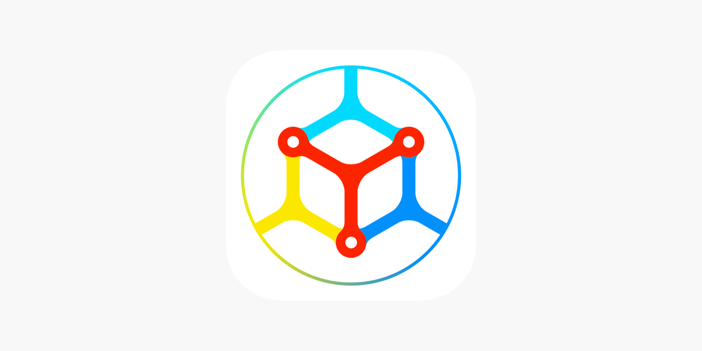

## Table of Contents

## What is Mycelium Bitcoin Wallet?

Mycelium Bitcoin Wallet is a mobile app that lets you store, send, and receive Bitcoin easily. It's designed to be safe and private, so you can use Bitcoin without worrying about your information being shared. The app works on both Android and iOS phones, making it easy for lots of people to use.

One cool thing about Mycelium is that it lets you control your own Bitcoin. This means you don't have to trust a bank or another company to keep your money safe. Instead, you manage everything right from your phone. Mycelium also has extra features like a built-in exchange, so you can trade your Bitcoin for other currencies without leaving the app.

## How do I download and install Mycelium Bitcoin Wallet?

To download and install the Mycelium Bitcoin Wallet, first decide if you want it on your Android or iOS device. If you have an Android phone, open the Google Play Store, search for "Mycelium Bitcoin Wallet," and tap on the app when it appears. Then, hit the "Install" button and wait for it to download and install on your device. For an iOS device, go to the Apple App Store, search for "Mycelium Bitcoin Wallet," and tap on the app. Then, press "Get" and follow the prompts to install it on your iPhone or iPad.

Once the app is installed, open it to start using it. You'll need to set up a new wallet by following the on-screen instructions. This usually involves creating a password and writing down a recovery phrase that you'll need to keep safe. After setting up your wallet, you can start sending and receiving Bitcoin. Remember to always keep your recovery phrase in a secure place, as it's essential for getting your Bitcoin back if something happens to your phone.

## Is Mycelium Bitcoin Wallet free to use?

Yes, Mycelium Bitcoin Wallet is free to download and use. You don't have to pay anything to get the app from the Google Play Store or the Apple App Store. Once you have it on your phone, you can start using it right away to send and receive Bitcoin without any fees from Mycelium.

However, there might be some costs involved when you use the wallet. For example, if you send Bitcoin to someone else, you might have to pay a small transaction fee to the Bitcoin network. Also, if you use the built-in exchange feature to trade your Bitcoin for other currencies, there could be fees from the exchange service. But these fees don't come from Mycelium; they come from the services you use within the app.

## What are the key features of Mycelium Bitcoin Wallet?

Mycelium Bitcoin Wallet has many cool features that make it easy and safe to use Bitcoin. One big feature is that it lets you keep control of your Bitcoin. This means you don't need to trust a bank or another company to hold your money. You manage everything right from your phone. Mycelium also has a special feature called "Hardware Wallet Integration," which lets you use devices like Ledger or Trezor to keep your Bitcoin even safer. 

Another great thing about Mycelium is its built-in exchange feature. This lets you trade your Bitcoin for other currencies without leaving the app. It's really handy if you want to switch your Bitcoin to dollars or euros. Plus, Mycelium has a feature called "Local Trader," which helps you find people nearby who want to buy or sell Bitcoin, making it easier to trade with people you can meet in person.

## How do I set up a new wallet in Mycelium?

To set up a new wallet in Mycelium, first open the app on your phone. You'll see a button that says "Create a New Wallet." Tap on it, and then you'll need to create a password. Make sure it's a strong one that you won't forget. After setting your password, Mycelium will show you a recovery phrase. This is a list of words that you need to write down and keep safe. It's super important because it's the only way to get your Bitcoin back if something happens to your phone.

Once you've written down the recovery phrase, you'll be asked to confirm it by entering the words in the right order. This makes sure you've got it right. After confirming the recovery phrase, your new wallet is all set up. Now you can start using it to send and receive Bitcoin. Remember to keep your recovery phrase in a secure place, like a safe or a locked drawer, and never share it with anyone.

## Can I use Mycelium Bitcoin Wallet for other cryptocurrencies besides Bitcoin?

Mycelium Bitcoin Wallet is mainly for Bitcoin. It doesn't support other cryptocurrencies like Ethereum or Litecoin. If you want to use other cryptocurrencies, you'll need to find a different wallet that supports them.

The focus on Bitcoin means Mycelium can offer a lot of special features just for Bitcoin users, like easy trading and hardware wallet integration. But if you're looking to manage different types of cryptocurrencies all in one place, Mycelium might not be the best choice for you.

## How does Mycelium ensure the security of my Bitcoin?

Mycelium keeps your Bitcoin safe by letting you control your own money. When you set up a wallet, you get a recovery phrase that you need to write down and keep in a safe place. This phrase is super important because it's the only way to get your Bitcoin back if something happens to your phone. Mycelium doesn't store your recovery phrase or your Bitcoin on their servers, so even if their system gets hacked, your Bitcoin stays safe with you.

Another way Mycelium helps keep your Bitcoin secure is by working with hardware wallets like Ledger and Trezor. These are special devices that store your Bitcoin offline, making it much harder for hackers to steal your money. Mycelium's app can connect to these devices, letting you manage your Bitcoin from your phone while keeping it safe on the hardware wallet. This combination of control and hardware protection makes Mycelium a secure choice for storing your Bitcoin.

## What are the transaction fees associated with using Mycelium Bitcoin Wallet?

When you use Mycelium Bitcoin Wallet to send Bitcoin, you might have to pay a small fee. This fee doesn't go to Mycelium, but to the Bitcoin network. It helps make sure your transaction gets processed quickly. The fee can change depending on how busy the network is and how fast you want your transaction to go through. Mycelium lets you choose the fee, so you can decide if you want to pay more for a faster transaction or less if you're okay with waiting a bit longer.

Mycelium itself doesn't charge you any fees for using the wallet. So, you can download and use the app for free. But if you use the built-in exchange feature to trade your Bitcoin for other currencies, there might be fees from the exchange service. These fees are set by the exchange, not by Mycelium. So, while using Mycelium is free, you should be aware of any fees that might come up when you send Bitcoin or use other services within the app.

## How can I backup and restore my Mycelium wallet?

To backup your Mycelium wallet, you need to write down the recovery phrase when you set up your wallet. This phrase is a list of words that you should keep in a safe place, like a locked drawer or a safe. It's really important because if something happens to your phone, you can use this phrase to get your Bitcoin back. Mycelium doesn't keep your recovery phrase on their servers, so you're the only one who can access your Bitcoin with this phrase.

If you need to restore your Mycelium wallet, you can do it by installing the app on a new phone or after resetting your current one. When you open the app, choose the option to "Restore Wallet" and enter the recovery phrase you wrote down. Make sure you enter the words in the right order. Once you've entered the phrase correctly, your wallet will be restored, and you'll have access to your Bitcoin again. Always keep your recovery phrase safe and never share it with anyone.

## What is the process for sending and receiving Bitcoin with Mycelium?

To send Bitcoin with Mycelium, first open the app and go to the "Send" section. You'll see a place to enter the amount of Bitcoin you want to send and the address of the person you're sending it to. You can scan a QR code if the person has one, or you can type in their Bitcoin address manually. Before you hit send, Mycelium will show you the transaction fee. You can choose how much you want to pay, depending on how fast you want the transaction to go through. Once you're happy with everything, press "Send," and your Bitcoin will be on its way.

Receiving Bitcoin with Mycelium is even easier. Open the app and go to the "Receive" section. Here, you'll see your Bitcoin address and a QR code. You can share this address or QR code with the person who wants to send you Bitcoin. They can either scan the QR code or type in your address to send you Bitcoin. Once they send it, you'll see the Bitcoin show up in your Mycelium wallet. It's that simple!

## How does Mycelium integrate with hardware wallets like Ledger or Trezor?

Mycelium makes it easy to use hardware wallets like Ledger or Trezor to keep your Bitcoin safe. When you connect your hardware wallet to Mycelium, you can manage your Bitcoin from your phone while keeping it stored securely on the hardware device. This means your Bitcoin stays offline, which makes it much harder for hackers to steal it. To set it up, you just need to plug in your hardware wallet and follow the instructions in the Mycelium app. It will guide you through the process of linking your hardware wallet to your Mycelium account.

Once your hardware wallet is connected, you can send and receive Bitcoin just like you normally would with Mycelium. The big difference is that your private keys, which are needed to access your Bitcoin, stay on the hardware wallet and not on your phone. This adds an extra layer of security because even if someone gets into your phone, they can't get to your Bitcoin without the hardware wallet. Mycelium's integration with hardware wallets gives you the best of both worlds: the convenience of managing your Bitcoin on your phone and the safety of keeping it stored offline.

## What advanced features does Mycelium offer for experienced Bitcoin users?

Mycelium has some cool features for people who know a lot about Bitcoin. One of these is the "Local Trader" feature. It helps you find other people nearby who want to buy or sell Bitcoin. This can be really handy if you want to trade Bitcoin in person instead of online. Mycelium also lets you choose your own transaction fees when you send Bitcoin. This means you can decide if you want your transaction to go through fast by paying a higher fee, or if you're okay with waiting a bit longer by paying a lower fee.

Another advanced feature is the integration with hardware wallets like Ledger and Trezor. This lets you keep your Bitcoin super safe because it stays offline on the hardware device. Even though you manage everything from your phone, the private keys that control your Bitcoin are stored securely on the hardware wallet. This makes it really hard for hackers to steal your Bitcoin. Mycelium also has a built-in exchange feature, so you can trade your Bitcoin for other currencies without leaving the app. This can be useful if you want to switch your Bitcoin to dollars or euros quickly.

## References & Further Reading

[1]: Bitcoin.org. (n.d.). ["Bitcoin: A Peer-to-Peer Electronic Cash System."](https://nakamotoinstitute.org/library/bitcoin/) Satoshi Nakamoto.

[2]: Antonopoulos, A. M. (2017). ["Mastering Bitcoin: Unlocking Digital Cryptocurrencies."](https://books.google.com/books/about/Mastering_Bitcoin.html?id=IXmrBQAAQBAJ) O'Reilly Media.

[3]: Narayanan, A., Bonneau, J., Felten, E., Miller, A., & Goldfeder, S. (2016). ["Bitcoin and Cryptocurrency Technologies: A Comprehensive Introduction."](https://press.princeton.edu/books/hardcover/9780691171692/bitcoin-and-cryptocurrency-technologies) Princeton University Press.

[4]: Marcos Lopez de Prado. (2018). ["Advances in Financial Machine Learning."](https://www.amazon.com/Advances-Financial-Machine-Learning-Marcos/dp/1119482089) Wiley.

[5]: Jansen, S. (2020). ["Machine Learning for Algorithmic Trading: Predictive Models to Extract Signals from Market and Alternative Data for Systematic Trading Strategies with Python."](https://www.amazon.com/Machine-Learning-Algorithmic-Trading-alternative/dp/1839217715) Packt Publishing.

[6]: Pearson, J. (n.d.). ["How I Became a Bitcoin Millionaire in my 20s."](https://www.pearson.com/en-us/subject-catalog/p/Liang-Introduction-to-Java-Programming-and-Data-Structures-Comprehensive-Version-Plus-My-Lab-Programming-with-Pearson-e-Text-Access-Card-Package-12th-Edition/P200000003470/9780137554768) Vice.

[7]: Mycelium. (n.d.). ["Mycelium Bitcoin Wallet."](https://wallet.mycelium.com/) Official website.

[8]: Sklavos, N., & Zaharakis, I. D. (2018). ["Cryptography and Security Services: Mechanisms and Applications."](https://www.semanticscholar.org/paper/Cryptography-and-Security-in-Internet-of-Things-and-Sklavos-Zaharakis/1b848efb7526a8e9f99684a582227d3688747a7c) IGI Global.