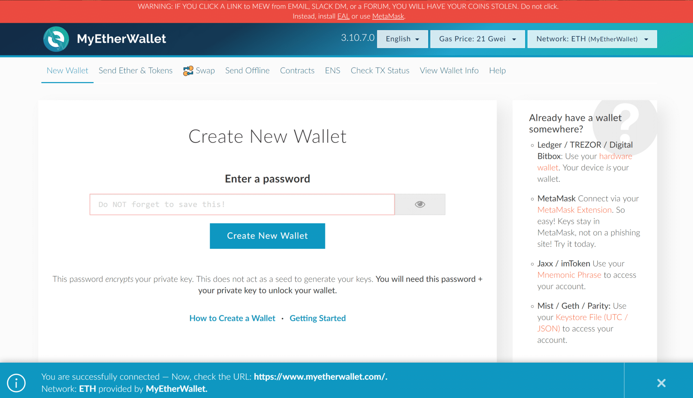

## Table of Contents

## What is MyEtherWallet and what is its primary function?

MyEtherWallet, often abbreviated as MEW, is a free, open-source, client-side interface that helps you interact with the Ethereum blockchain. It allows you to create and manage your Ethereum wallets, send and receive Ether (ETH), and interact with various Ethereum-based tokens and decentralized applications (dApps). You don't need to download any software to use MyEtherWallet; you can access it directly from your web browser.

The primary function of MyEtherWallet is to give you control over your Ethereum assets without relying on a third-party service. When you use MEW, you hold your own private keys, which means you have full control and responsibility for your funds. This is different from using a centralized exchange where the exchange holds your keys. MyEtherWallet makes it easier and safer for you to manage your Ethereum and tokens directly, enhancing your security and privacy.

## How do I create a new wallet on MyEtherWallet?

To create a new wallet on MyEtherWallet, start by going to their website. Click on the "Create a New Wallet" button. You'll be asked to enter a strong password. Make sure it's something you'll remember but hard for others to guess. After you enter your password, click "Create New Wallet." Your wallet will be created, and you'll see a file called a Keystore file. Download this file and keep it safe. You'll also get a list of 12 or 24 words called your mnemonic phrase. Write these words down on paper and store them in a secure place. Do not share these words with anyone.

Next, you'll need to access your new wallet. You can do this by clicking on "Access My Wallet" on the MyEtherWallet homepage. Choose the method you want to use to access your wallet. You can use the Keystore file and the password you created, or you can use the mnemonic phrase. If you use the Keystore file, upload the file and enter your password. If you use the mnemonic phrase, enter the words in the correct order. Once you're in, you can see your Ethereum address and start sending and receiving Ether or other tokens. Always keep your private information safe and never share it with anyone.

## What are the different ways to access MyEtherWallet?

There are several ways to access your wallet on MyEtherWallet. You can use the Keystore file and the password you created when you made your wallet. To do this, go to the MyEtherWallet website, click on "Access My Wallet," and choose the "Keystore File" option. Then, upload the Keystore file you downloaded when you created your wallet and enter the password you set. This will let you into your wallet where you can see your Ethereum address and manage your funds.

Another way to access your wallet is by using the mnemonic phrase. This is the list of 12 or 24 words you wrote down when you created your wallet. To use this method, go to the MyEtherWallet website, click on "Access My Wallet," and choose the "Mnemonic Phrase" option. Enter the words in the correct order, and you'll be able to access your wallet. This method is handy if you don't have your Keystore file with you but still need to get into your wallet.

You can also use a hardware wallet like Ledger or Trezor to access MyEtherWallet. If you have one of these devices, connect it to your computer, go to the MyEtherWallet website, click on "Access My Wallet," and choose the "Hardware" option. Follow the instructions on the screen to connect your hardware wallet and access your Ethereum funds. This method is very secure because your private keys never leave the hardware device.

## How can I send and receive Ethereum using MyEtherWallet?

To send Ethereum using MyEtherWallet, first go to their website and click on "Access My Wallet." Choose the way you want to access your wallet, like using your Keystore file and password, your mnemonic phrase, or a hardware wallet. Once you're in your wallet, click on the "Send Transaction" button. You'll see a form where you need to enter the address you want to send the Ethereum to. This is called the recipient's address. Make sure you copy and paste it correctly because if you get it wrong, your Ethereum could be lost forever. Then, enter the amount of Ethereum you want to send. You can also add a note if you want. After that, click "Send Transaction" and confirm the details. Your Ethereum will be on its way to the recipient's address.

To receive Ethereum using MyEtherWallet, you need to give the sender your Ethereum address. Go to the MyEtherWallet website, access your wallet the same way you did to send Ethereum, and look for your Ethereum address on the main page. It's a long string of letters and numbers that starts with "0x." You can copy this address and share it with the person who wants to send you Ethereum. Make sure they send it to the right address. Once they send the Ethereum, it will show up in your wallet. You can check your balance on the main page of your wallet to see if the Ethereum has arrived.

## What security measures does MyEtherWallet have in place to protect my funds?

MyEtherWallet has several security measures to keep your funds safe. One important way is that it is a client-side interface, which means your private keys and sensitive information never leave your computer. This reduces the risk of your information being stolen by hackers. MyEtherWallet also uses strong encryption to protect your data. When you create a wallet, you get a Keystore file and a mnemonic phrase. These are encrypted and can only be accessed with your password, which you should keep secret.

Another security feature is that MyEtherWallet supports hardware wallets like Ledger and Trezor. When you use a hardware wallet, your private keys are stored on the device and never shared online, making it very hard for anyone to steal them. MyEtherWallet also has a feature called "MEW CX," which is a browser extension that adds an extra layer of security by letting you interact with the Ethereum blockchain directly from your browser. This helps protect against phishing attacks and other online threats. By using these security measures, MyEtherWallet helps keep your Ethereum and other tokens safe.

## How does MyEtherWallet handle private keys and what should I know about them?

MyEtherWallet keeps your private keys safe by never sending them to their servers. When you use MyEtherWallet, your private keys stay on your own computer. This is important because your private keys are like the secret codes that let you spend your Ethereum. If someone else gets your private keys, they can take your Ethereum. So, MyEtherWallet makes sure that only you can see and use your private keys.

You should know that it's very important to keep your private keys secret and safe. When you create a wallet on MyEtherWallet, you get a Keystore file and a list of words called a mnemonic phrase. These are ways to get back to your private keys. You need to save these things in a safe place and never share them with anyone. If you lose them, you might not be able to get your Ethereum back. Always be careful and keep your private keys secure.

## Can I use MyEtherWallet to interact with Ethereum-based tokens and decentralized applications (dApps)?

Yes, you can use MyEtherWallet to interact with Ethereum-based tokens and decentralized applications, or dApps. When you use MyEtherWallet, you can see and manage different kinds of tokens that run on the Ethereum blockchain. These tokens might be for things like other cryptocurrencies, or they might be used in special projects or games. To use them, you just need to know the token's address, and MyEtherWallet will let you send and receive them just like you do with Ethereum.

MyEtherWallet also lets you connect to dApps, which are like websites or apps that work on the Ethereum blockchain. When you want to use a dApp, you can go to the dApp's website and connect your MyEtherWallet to it. This lets you do things like play games, trade tokens, or vote on decisions, all while using your Ethereum and tokens from your wallet. It's a safe way to interact with these apps because your private keys stay on your computer and don't get shared with the dApp.

## What are the fees associated with using MyEtherWallet?

When you use MyEtherWallet, you don't have to pay any fees directly to MyEtherWallet. It's a free service that lets you manage your Ethereum and other tokens on the Ethereum blockchain. But, you will have to pay something called "gas" fees when you send Ethereum or interact with tokens and dApps. Gas fees are payments you make to the Ethereum network to process your transactions. The amount of gas you need to pay can change based on how busy the network is and how complicated your transaction is.

The gas fees are paid in a small part of your Ethereum. You can choose how much gas you want to pay, but if you set it too low, your transaction might take a long time to go through or might not go through at all. If you set it too high, you might pay more than you need to. MyEtherWallet helps you by suggesting a good amount of gas to use, but you can change it if you want. Just remember, these fees go to the Ethereum network, not to MyEtherWallet.

## How can I recover my wallet if I lose access to my private key or mnemonic phrase?

If you lose your private key or mnemonic phrase, recovering your wallet can be tough. MyEtherWallet doesn't store your private information on their servers, which means they can't help you get it back if you lose it. The only way to recover your wallet is if you have a backup of your private key or mnemonic phrase. If you saved your Keystore file and remember your password, you can use those to get back into your wallet. If you wrote down your mnemonic phrase and kept it safe, you can use that to recover your wallet too.

It's really important to keep your private key and mnemonic phrase safe and secure. Always make sure to write down your mnemonic phrase on paper and store it in a safe place. Don't take a picture of it or save it on your computer because that can be risky. If you lose these, there's no way to get your Ethereum back, so take good care of them.

## What are the common pitfalls or mistakes to avoid when using MyEtherWallet?

One common mistake when using MyEtherWallet is not keeping your private key and mnemonic phrase safe. These are very important because they let you access your Ethereum. If you lose them or someone else sees them, you could lose your Ethereum. Always write down your mnemonic phrase on paper and keep it in a safe place. Don't take a picture of it or save it on your computer because that can be risky. Also, be careful not to share your private key or mnemonic phrase with anyone, even if they say they can help you.

Another pitfall is sending Ethereum to the wrong address. When you send Ethereum, you need to make sure the address you're sending to is correct. If you get even one letter or number wrong, your Ethereum could be lost forever. Always double-check the address before you send anything. Also, be careful with gas fees. If you set them too low, your transaction might take a long time or not go through at all. If you set them too high, you might pay more than you need to. MyEtherWallet suggests a good amount, but you should think about how busy the network is before you decide.

## How does MyEtherWallet compare to other Ethereum wallets like MetaMask or Ledger?

MyEtherWallet, MetaMask, and Ledger are all used to manage Ethereum and other tokens on the Ethereum blockchain, but they work a bit differently. MyEtherWallet is a free, open-source, client-side interface that you can use directly from your web browser. It doesn't store your private keys on their servers, so you have full control over your funds. This makes it great if you want to keep your keys safe and private. However, you need to be very careful with your private key and mnemonic phrase because if you lose them, there's no way to get your Ethereum back.

MetaMask is also a popular choice and works as a browser extension or a mobile app. It's user-friendly and lets you easily connect to dApps and manage your Ethereum. Like MyEtherWallet, MetaMask keeps your private keys on your device, but it's a bit easier to use because it's always there in your browser. On the other hand, Ledger is a hardware wallet, which means it's a physical device that stores your private keys offline. This makes it very secure because your keys never go online. Ledger can be used with MyEtherWallet or MetaMask to add an extra layer of security, but it costs money to buy the device.

Each of these wallets has its own strengths. MyEtherWallet is good for people who want a free, secure way to manage their Ethereum without downloading software. MetaMask is great for those who want a simple, always-available wallet for dApps. Ledger is perfect for anyone who wants the highest level of security and is willing to spend on a hardware device.

## What advanced features does MyEtherWallet offer for experienced users?

MyEtherWallet has some advanced features that can be useful for people who know a lot about Ethereum and blockchain. One of these features is the ability to interact with smart contracts directly. This means you can write and send your own custom transactions to the Ethereum blockchain. If you're good with coding, you can use this to do things that aren't possible with simple send and receive transactions. Another advanced feature is the option to use different types of Ethereum addresses, like ENS (Ethereum Name Service) addresses, which make it easier to remember and share your Ethereum address.

Another cool feature for experienced users is the ability to set custom gas prices and limits. This lets you control how quickly your transactions get processed on the Ethereum network. If you want your transaction to go through faster, you can set a higher gas price. If you want to save money, you can set it lower, but it might take longer. MyEtherWallet also supports hardware wallets like Ledger and Trezor, which add an extra layer of security for your funds. This is great for people who want to keep their private keys super safe.

## References & Further Reading

[1]: Liu, L., & Szilagyi, P. (2020). ["Algorithmic Trading and Asset Management."](https://www.researchgate.net/publication/378548435_Algorithmic_Trading_and_AI_A_Review_of_Strategies_and_Market_Impact) World Scientific.

[2]: Antonopoulos, A. M., & Wood, G. (2018). ["Mastering Ethereum: Building Smart Contracts and DApps."](https://www.amazon.com/Mastering-Ethereum-Building-Smart-Contracts/dp/1491971940) O'Reilly Media.

[3]: Narayanan, A., Bonneau, J., Felten, E., Miller, A., & Goldfeder, S. (2016). ["Bitcoin and Cryptocurrency Technologies: A Comprehensive Introduction."](https://press.princeton.edu/books/hardcover/9780691171692/bitcoin-and-cryptocurrency-technologies) Princeton University Press.

[4]: Liu, L., & Wang, K. (2021). ["Blockchain and Cryptocurrencies."](https://ieeexplore.ieee.org/document/8419306) Springer.

[5]: Mougayar, W. (2016). ["The Business Blockchain: Promise, Practice, and the Application of the Next Internet Technology."](https://books.google.com/books/about/The_Business_Blockchain.html?id=CEsPDAAAQBAJ) Wiley.