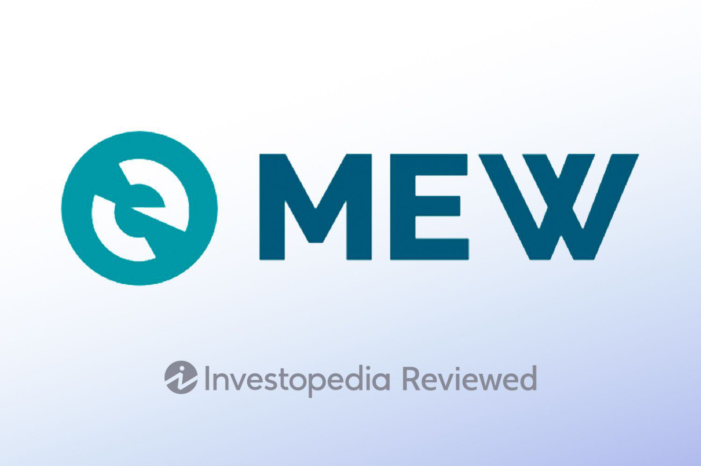

The rapid proliferation of cryptocurrency has significantly transformed the landscape of digital finance, with wallets playing an increasingly pivotal role. Cryptocurrency wallets enable users to store, send, and receive digital currencies, providing crucial infrastructure for engaging with blockchain networks. As more individuals and institutions participate in cryptocurrency markets, the demand for user-friendly and secure wallet solutions has surged. This environment has led to the development of a variety of wallets, each tailored to specific user needs and preferences, from novice users to experienced traders.

MyEtherWallet (MEW) is among the most prominent interfaces used for managing Ethereum and ERC-20 tokens. Established as a user-friendly, open-source platform, MEW distinguishes itself by acting as a flexible client-side interface, enabling users to interact directly with the Ethereum blockchain. Unlike traditional cryptocurrency wallets, which are often custodial and manage private keys on behalf of the user, MEW provides individuals with full control over their keys, enhancing security and autonomy.



The scope of this article encompasses a detailed examination of MyEtherWallet's usability, its comprehensive feature set, and the substantial benefits its interface offers. Additionally, the article will explore MEW's integration into algorithmic trading—a method of executing trades using automated and pre-programmed trading instructions. As algorithmic trading continues to grow in popularity within financial markets, MyEtherWallet's adaptability for these advanced trading strategies is becoming an important consideration for traders looking to optimize their digital asset management.

## Table of Contents

## Understanding MyEtherWallet

MyEtherWallet (MEW) serves as a free, open-source interface granting users direct access to the Ethereum blockchain. Unlike traditional cryptocurrency wallets, which often function as standalone applications that store user data and manage transactions, MyEtherWallet operates primarily as an 'in-between' platform. It facilitates users in managing their Ethereum-based assets while securely interacting directly with the Ethereum blockchain.

A significant distinction of MyEtherWallet from traditional wallets is its non-custodial nature. Traditional wallets can be custodial, where the service provider has access and control over user private keys. In contrast, with MEW, users have complete control over their private keys and wallet information, ensuring enhanced privacy and security. This attribute aligns MEW with the decentralized ethos of blockchain technology by eliminating intermediaries and relinquishing control solely to the users.

MyEtherWallet's primary role revolves around its support for Ethereum and ERC-20 tokens. By providing a user-friendly interface, it simplifies the management of Ethereum and associated assets, making it easier for users to send, receive, and store Ether (ETH) alongside various ERC-20 tokens. This capability is especially valuable given the proliferation of ERC-20 tokens, which represent a significant portion of the cryptocurrency ecosystem. MEW's integration with the Ethereum network allows for seamless interactions with smart contracts and decentralized applications (dApps), further expanding its functionality within the Ethereum landscape.

A cornerstone feature of MyEtherWallet is its open-source nature. By making its codebase publicly accessible, MEW fosters transparency and community collaboration, which are crucial for security and continuous improvement. Users can review MEW's code, identify potential vulnerabilities, and contribute to its development, ensuring a robust and secure platform.

Another key feature of MyEtherWallet is the absence of service fees, which distinguishes it from many other platforms that charge users for transactions or premium features. This user-centric approach enables cost-effective management of Ethereum-based digital assets, making it a preferred choice for both beginners and seasoned traders who seek a reliable and economical option.

In summary, MyEtherWallet differentiates itself by being a non-custodial, open-source interface that specializes in Ethereum and ERC-20 tokens. Its focus on user control, transparency, and cost-effectiveness underscores its utility as a crucial tool for efficiently managing Ethereum assets while participating in the expanding world of decentralized finance.

## Pros of Using MyEtherWallet

MyEtherWallet (MEW) stands out for its user-friendliness, making it an attractive option for both beginners and experienced traders in the world of digital finance. The interface is intuitive, allowing users to create and manage their wallets with minimal technical knowledge. This ease of use is particularly beneficial for those new to cryptocurrencies who may find the setup and navigation of digital wallets daunting. 

MyEtherWallet’s robust support for the Ethereum blockchain and ERC-20 tokens underscores its accessibility. As Ethereum continues to be a prominent platform for decentralized applications (dApps) and smart contracts, MEW’s seamless integration with Ethereum ensures that users can efficiently manage their digital assets. MEW supports the full range of ERC-20 tokens, enabling users to store, manage, and send tokens without needing multiple wallet applications.

Another significant advantage of MyEtherWallet is its compatibility with hardware wallets such as Ledger and Trezor. This feature enhances security by allowing users to store their private keys offline while interacting with the blockchain via the MEW interface. By combining the convenience of online access with the security of offline storage, MEW effectively reduces the risk of online threats such as hacking attempts. This dual-layer security approach means that even if the MEW interface is compromised, the users’ private keys remain secure within the hardware wallet, safeguarding their assets. 

Overall, MyEtherWallet's focus on ease of access, comprehensive support for Ethereum-based tokens, and enhanced security via hardware wallet compatibility makes it a favored choice for those looking to navigate the Ethereum ecosystem efficiently and securely.

## Cons and Limitations of MyEtherWallet

MyEtherWallet (MEW) stands as a popular platform for managing Ethereum and ERC-20 tokens, yet it is not without its limitations. One significant drawback is its restricted support for [cryptocurrency](/wiki/cryptocurrency) assets. Unlike some more versatile wallets that offer multi-currency support, MEW exclusively facilitates transactions involving Ethereum and its related tokens. This means users cannot store or manage Bitcoin or other altcoins directly within MyEtherWallet, posing a limitation for those seeking a unified wallet solution for a diverse portfolio.

Security concerns are another critical consideration with MyEtherWallet. While MEW operates as an interface facilitating interactions with the Ethereum blockchain, the responsibility for secure transactions largely falls on the user. The platform's design emphasizes privacy and control by allowing users to manage their private keys. However, this necessitates that users possess a strong awareness of cybersecurity practices. Any exposure or mishandling of private keys can lead to significant financial loss, reinforcing the importance of secure backups and cautious online behavior.

Additionally, MyEtherWallet lacks direct exchange features. This absence means that users wishing to trade between Ethereum and other cryptocurrencies cannot do so through the native MEW interface. Instead, users must rely on third-party exchanges to trade their Ethereum holdings for other currencies, adding an extra step and potential security risk in the process. This necessity to transition between platforms for trading operations could be inconvenient and may introduce additional transaction fees or time delays.

While MyEtherWallet offers robust support for Ethereum-based activities, potential users should be cognizant of these constraints and consider their overall cryptocurrency management needs when choosing a wallet solution.

## MyEtherWallet and Algorithmic Trading

Algorithmic trading involves using automated systems to execute trades based on predefined criteria, allowing traders to capitalize on market opportunities with precision and speed. These systems typically use algorithms to determine aspects such as timing, price, and quantity of trades. MyEtherWallet (MEW), while primarily known as an interface for interacting with the Ethereum blockchain, can play a role in this space, given its features and capabilities.

MyEtherWallet offers a way to engage with the Ethereum blockchain, supporting ERC-20 tokens without acting as a custodian. This interface role makes MEW a potential component in [algorithmic trading](/wiki/algorithmic-trading) setups focused on Ethereum assets. Traders can use MEW to manage wallets and execute trades as part of broader automated strategies.

To incorporate MEW into an algorithmic trading strategy, traders can leverage its ability to create wallets and interact with Ethereum smart contracts and decentralized applications (dApps). By integrating MEW's wallet management features with trading bots, developers can design algorithms that automatically execute trades based on parameters set within the smart contracts. For instance, a simple automated trading strategy might be set to buy or sell Ethereum or ERC-20 tokens when certain market conditions are met.

Here's an example of how a Python-based trading bot might interact with an Ethereum wallet:

```python
from web3 import Web3

# Connect to Ethereum node
w3 = Web3(Web3.HTTPProvider('http://localhost:8545'))

# Define wallet variables
wallet_address = 'your_wallet_address'
private_key = 'your_private_key'

# Sample trading algorithm
def simple_trading_bot():
    # Check current ETH price (placeholder)
    current_price = get_current_eth_price()

    # Define your trading logic
    if current_price < 2000:  # Example condition
        # Code to execute buy order
        print("Executing buy order...")
    elif current_price > 2500:
        # Code to execute sell order
        print("Executing sell order...")

def get_current_eth_price():
    # This function should interact with a real-time market data API
    return 2100  # placeholder value

# Run the bot
simple_trading_bot()
```

Key considerations when using MEW in algorithmic trading include ensuring secure management of private keys and understanding MEW's lack of custodial control. Users must safeguard their keys since MEW does not store them, making users responsible for security. Additionally, since MEW doesn't directly facilitate exchange trades, traders would need to connect with decentralized exchanges (DEXs) or integrate with platforms that support trading functions.

A potential challenge is the lack of direct API integration, which may necessitate additional setup or the use of middleware to enable seamless interaction with MEW accounts. Moreover, network latency and Ethereum gas fees could impact trading efficiency, especially for strategies that demand rapid execution.

In summary, while MyEtherWallet can be integrated into algorithmic trading strategies, traders need to consider its specific functionalities and limitations, particularly concerning security and execution capabilities. It serves as a powerful tool within a larger system tailored for Ethereum-based asset management and trade automation.

## Comparison with Other Cryptocurrency Wallets

In evaluating MyEtherWallet (MEW) relative to other cryptocurrency wallets, both hardware and software, it's essential to consider the crucial factors of security and usability. 

**Hardware Wallets: Ledger and Trezor**

Hardware wallets such as Ledger and Trezor are acclaimed for their robust security features due to their offline nature, making them largely immune to online hacks. They store private keys on a physical device, ensuring that keys never leave the device during a transaction, thus being highly secure against malware and phishing attacks. MyEtherWallet can integrate with these hardware wallets, enhancing security by allowing users to execute transactions through MEW's interface without exposing their private keys online. However, this integration demands additional steps, such as connecting the hardware wallet to a computer or mobile device, which might complicate the user experience compared to using MEW alone.

**Software and Online Wallet Comparisons**

When compared to other software and online wallets, MEW excels in its open-source nature and strong support for Ethereum and ERC-20 tokens. Software wallets like MetaMask offer similar functionalities with a focus on providing ease of use directly within web browsers, enabling users to interact with decentralized applications (dApps) seamlessly. MEW, while not offering browser extension capabilities, supports a wide array of features such as token swapping and decentralized finance (DeFi) integrations, aligning closely with the versatility offered by competitors like MetaMask.

Online wallets typically provide high accessibility due to their web-based nature, which MEW also offers. However, online wallets inherently face more significant security risks, as they often require users to rely on third-party services to store their private keys. In contrast, MEW emphasizes user-managed private keys, enhancing security but requiring users to adopt rigorous key management practices to prevent loss or theft.

**Trade-offs between Convenience and Security**

The use of MyEtherWallet presents a balance between convenience and security. Its interface is highly accessible and user-friendly, simplifying interaction with the Ethereum blockchain and supporting a range of Ethereum-based assets. However, the security of transactions significantly depends on user practices, as MEW does not inherently provide the hardware-level security of wallets like Trezor or Ledger. Users must ensure they are accessing MEW through legitimate means and safeguard their private keys rigorously.

In summary, while MyEtherWallet offers a highly efficient platform for managing Ethereum assets due to its user-directed key management model, users must weigh the convenience of its online accessibility against their responsibility for maintaining robust security practices. It provides a middle ground, merging the accessibility of software wallets with the potential security enhancements available through its compatibility with hardware wallets.

## Setting Up MyEtherWallet: A Step-by-Step Guide

Setting up and managing MyEtherWallet (MEW) involves several straightforward steps that prioritize security and ease of use. As an online wallet primarily supporting the Ethereum blockchain, MEW requires careful attention to account security and backup processes.

### Creating and Securing Your MyEtherWallet

1. **Access the MyEtherWallet Website:**
   Begin by navigating to the official MyEtherWallet website (https://www.myetherwallet.com/). Ensure the URL is correct to avoid phishing scams, a common threat in the cryptocurrency space.

2. **Create a New Wallet:**
   Click on the "Create a New Wallet" option. You can choose between several creation methods:
   - **Mnemonic Phrase:** This involves generating a 12- or 24-word seed phrase. You must write this phrase down and store it securely, as it is the only way to restore your wallet.
   - **Keystore File:** Download a password-protected file containing your private keys. This file should be kept offline and secure.

   It's crucial to understand that losing access to either the mnemonic phrase or the keystore file can result in the permanent loss of your funds.

3. **Set a Strong Password:**
   When prompted, create a strong and unique password. Use a combination of letters, numbers, and symbols. Avoid reusing passwords from other online services.

4. **Backup Your Wallet:**
   - **Mnemonic Phrase:** Store a hard copy in a secure, offline location, such as a safe. Digital backups should also be secured with encryption.
   - **Keystore File:** Store the file on a USB drive or external hard disk that is kept offline. Regularly update your storage devices to mitigate hardware failures.

5. **Secure Your Account:**
   Utilize additional security measures such as two-[factor](/wiki/factor-investing) authentication (2FA) for all related accounts (e.g., email) to protect against unauthorized access.

### Management and Best Practices

1. **Regularly Update Software:**
   Keeping your browser and antivirus software updated can prevent vulnerabilities from being exploited. The MEW platform is accessible through compatible browsers, so ensure they are updated with the latest security patches.

2. **Monitor Transactions:**
   Regularly review your transaction history within MEW to ensure all activities are authorized. This practice helps you quickly identify and respond to any unauthorized access.

3. **Use Hardware Wallets for Enhanced Security:**
   For additional security, integrate MEW with hardware wallets like Ledger or Trezor. These devices store private keys offline, providing an extra layer of protection.

4. **Stay Informed About Security Practices:**
   The cryptocurrency landscape is continually evolving. Staying updated with current security best practices and potential vulnerabilities is essential for safeguarding your assets.

5. **Educate Yourself Continually:**
   Understanding the intricacies of blockchain and cryptocurrency systems can empower you to make informed decisions about wallet management and security protocols.

By following these steps and maintaining diligent security practices, users can effectively manage their MyEtherWallet, mitigating risks while harnessing the benefits of decentralized finance platforms.

## Conclusion

MyEtherWallet (MEW) stands out as a vital Ethereum-centric tool designed to simplify the management of digital assets. Its user-friendly interface, coupled with robust support for Ethereum and ERC-20 tokens, makes it an attractive choice for both novice and experienced cryptocurrency users. The open-source nature of MEW, along with its compatibility with hardware wallets, offers enhanced security features which significantly bolster user confidence.

The platform allows users to interact seamlessly with the Ethereum blockchain without intermediary fees, maintaining a balance between accessibility and cost-effectiveness. Despite its limitations, such as the restriction to Ethereum-based tokens and the lack of direct exchange functionalities, MEW remains a strong option for users primarily focused on Ethereum. Its integration capabilities with various hardware wallets further enhance its security profile, providing an added layer of protection for digital assets.

For users interested in algorithmic trading, MEW presents a compatible option that can be incorporated into automated trading strategies. Although it brings certain challenges, particularly for those dealing with diverse portfolios beyond Ethereum, MEW's design encourages a secure, user-centered experience.

In conclusion, MyEtherWallet is a powerful tool for managing Ethereum assets, balancing security and ease of access effectively. Its specific focus on Ethereum and associated tokens caters well to enthusiasts devoted to this blockchain. Users are encouraged to employ best security practices, like backing up keys and securing wallets, to maximize the benefits of using MEW. As the crypto landscape evolves, MEW remains a robust option for users with specific Ethereum needs, emphasizing both safety and convenience.

## References & Further Reading

[1]: Liu, L., & Szilagyi, P. (2020). ["Algorithmic Trading and Asset Management."](https://www.researchgate.net/publication/378548435_Algorithmic_Trading_and_AI_A_Review_of_Strategies_and_Market_Impact) World Scientific.

[2]: Antonopoulos, A. M., & Wood, G. (2018). ["Mastering Ethereum: Building Smart Contracts and DApps."](https://www.amazon.com/Mastering-Ethereum-Building-Smart-Contracts/dp/1491971940) O'Reilly Media.

[3]: Narayanan, A., Bonneau, J., Felten, E., Miller, A., & Goldfeder, S. (2016). ["Bitcoin and Cryptocurrency Technologies: A Comprehensive Introduction."](https://press.princeton.edu/books/hardcover/9780691171692/bitcoin-and-cryptocurrency-technologies) Princeton University Press.

[4]: Liu, L., & Wang, K. (2021). ["Blockchain and Cryptocurrencies."](https://ieeexplore.ieee.org/document/8419306) Springer.

[5]: Mougayar, W. (2016). ["The Business Blockchain: Promise, Practice, and the Application of the Next Internet Technology."](https://books.google.com/books/about/The_Business_Blockchain.html?id=CEsPDAAAQBAJ) Wiley.