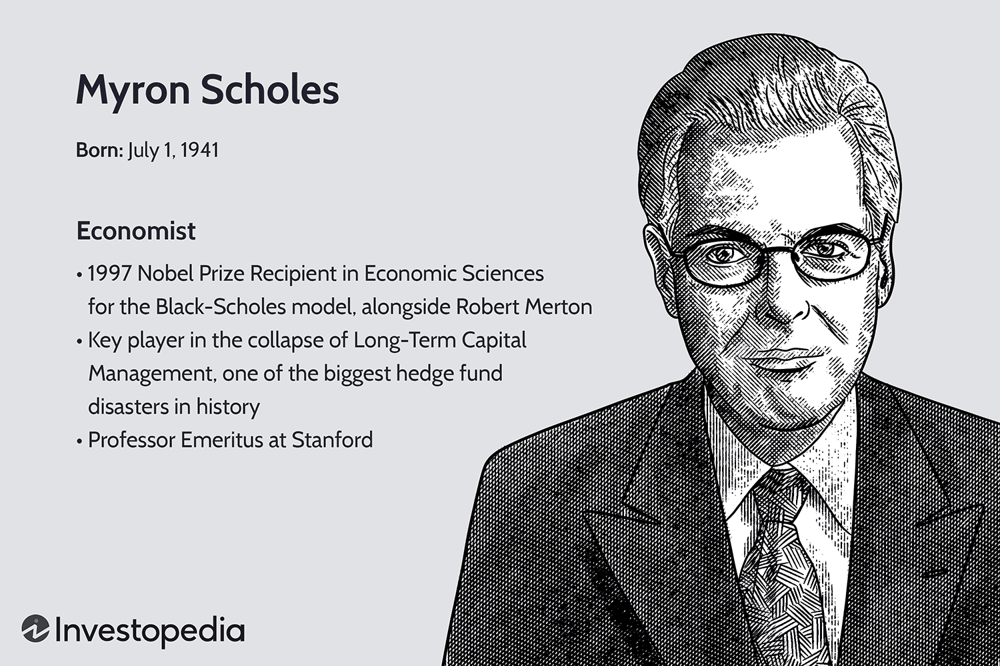

Myron Scholes is a pivotal figure in the field of finance, renowned for his extensive contributions to the understanding and application of financial economics. His most notable work, the Black-Scholes model, has had a profound and lasting impact on financial markets, particularly in the area of algorithmic trading. Scholes, a Nobel laureate, co-developed the Black-Scholes model, which introduced a new way to evaluate the pricing of options and other derivative securities.

The Black-Scholes model revolutionized the financial industry by providing a theoretical framework that allows for the accurate pricing of options. Before the introduction of this model, there was no universally accepted method to evaluate derivatives, which are financial instruments whose value is partly derived from the value of an underlying asset. The model uses various variables, such as the current stock price, the option's strike price, time to expiration, risk-free interest rate, and the volatility of the stock, to calculate the theoretical value of options.

The significance of the Black-Scholes model cannot be overstated. It facilitated the rapid development and growth of options markets worldwide by offering a straightforward method for valuing options, thus providing traders and investors with a robust tool for financial decision-making and risk management. This advancement in pricing theory laid the groundwork for the burgeoning field of quantitative finance, enabling the creation and implementation of advanced trading algorithms and strategies that form the backbone of modern algorithmic trading systems.

Algorithmic trading, which relies heavily on mathematical models and computational techniques to make trading decisions, has been significantly influenced by Scholes’ work. The precision and reliability of the Black-Scholes model serve as foundational components in the development of trading algorithms, allowing for the automation of complex trading strategies that operate at speeds impossible for human traders. The application of quantitative models like Black-Scholes in algorithmic trading has transformed financial markets, driving efficiencies and increasing liquidity.

In conclusion, the contributions of Myron Scholes have had a transformative impact on the financial world. By co-developing the Black-Scholes model, he not only provided a crucial tool for understanding derivatives pricing but also paved the way for advancements in algorithmic trading. Scholes' work continues to influence the way financial markets operate and evolve, underscoring the importance of innovation in financial economics.

## Table of Contents

## Who Is Myron Scholes?

Myron Scholes is a prominent figure in the field of finance and economics, renowned for his significant contributions to financial theory and practice. Born on July 1, 1941, in Timmins, Ontario, Canada, Scholes pursued his academic career with a focus on economics and finance. He obtained an undergraduate degree in Economics from McMaster University in Hamilton, Ontario. He then advanced to graduate studies at the University of Chicago, where he earned his MBA in 1964 and his PhD in 1969. During his time at the University of Chicago, Scholes developed a keen interest in financial economics, which laid the foundation for his future groundbreaking work.

Scholes is best known for his seminal work on the Black-Scholes model, a mathematical model for pricing options and corporate liabilities. Developed in collaboration with Fischer Black and Robert Merton, the model was first published in 1973 in the Journal of Political Economy under the title "The Pricing of Options and Corporate Liabilities". This model provided a systematic and theoretical framework for valuing European-style options, which are financial derivatives that give the holder the right to buy or sell an asset at a predetermined price on a specific date. The Black-Scholes formula is expressed as:

$$
C(S, T) = S_t N(d_1) - Xe^{-r(T-t)} N(d_2)
$$

Here, $C$ is the call option price, $S_t$ represents the current stock price, $X$ denotes the strike price, $T-t$ is the time to expiration, $r$ is the risk-free [interest rate](/wiki/interest-rate-trading-strategies), and $N(d)$ is the cumulative distribution function of a standard normal distribution. The variables $d_1$ and $d_2$ are computed as follows:

$$
d_1 = \frac{\ln(S_t / X) + (r + \sigma^2/2)(T-t)}{\sigma \sqrt{T-t}}
$$
$$
d_2 = d_1 - \sigma \sqrt{T-t}
$$

The introduction of the Black-Scholes model was revolutionary, as it provided a practical method for calculating the value of options, a task that had previously posed significant challenges to traders and financiers. The model not only facilitated the growth of the options market but also provided a framework for risk management and asset pricing.

In recognition of his contributions to financial economics, Myron Scholes was awarded the Nobel Prize in Economic Sciences in 1997, alongside Robert Merton. Although Fischer Black had passed away two years earlier and was thus ineligible for the prize, the Nobel Committee acknowledged his significant role in the development of the model.

Scholes' academic career includes prominent teaching and research positions at several esteemed institutions, including the Massachusetts Institute of Technology, the University of Chicago, and Stanford University. His work continues to influence financial markets and remains a cornerstone of modern financial theory.

## The Black-Scholes Model

The Black-Scholes model, formulated by Fischer Black, Myron Scholes, and Robert Merton, represents a cornerstone of modern financial economics. Introduced in the early 1970s, this model provided a quantitative framework for valuing options, which are financial derivatives that give holders the right, but not the obligation, to buy or sell an asset at a specified price before a certain date. The development of the model marked a significant advancement in options pricing, leveraging the principles of stochastic calculus and probabilistic financial theory.

### Development and Variables

The Black-Scholes model is essentially a mathematical description of how the price of an option evolves over time. Its key underpinning is the assumption that the price of the underlying asset follows a geometric Brownian motion with constant [volatility](/wiki/volatility-trading-strategies) and drift. This leads to the Black-Scholes partial differential equation, which can be solved to give the Black-Scholes formula:

$$
C(S, t) = S_0 N(d_1) - X e^{-r(T-t)} N(d_2)
$$

In this formula:
- $C$ is the call option price.
- $S_0$ is the current price of the underlying asset.
- $X$ is the strike price of the option.
- $T$ is the time to expiration.
- $r$ is the risk-free interest rate.
- $N(d)$ represents the standard normal cumulative distribution function.
- $d_1$ and $d_2$ are given by:

$$
d_1 = \frac{\ln\left(\frac{S_0}{X}\right) + (r + \frac{\sigma^2}{2})(T-t)}{\sigma\sqrt{T-t}}
$$

$$
d_2 = d_1 - \sigma\sqrt{T-t}
$$

Here, $\sigma$ denotes the volatility of the underlying asset. The variables and equations are devised under the assumption of efficient markets and [arbitrage](/wiki/arbitrage)-free conditions.

### Significance in Financial Mathematics

Before the advent of the Black-Scholes model, the valuation of options was largely speculative, lacking a systematic basis. This model offered a standardized method to calculate theoretical values of options, fostering greater [liquidity](/wiki/liquidity-risk-premium) and trust in options markets. By providing a closed-form solution to pricing, it bridged theoretical finance and real-world trading, making option pricing transparent and accessible to investors.

The Black-Scholes model's influence extends beyond options pricing. It lays the groundwork for quantitative finance, enabling the development of complex derivatives and risk management strategies. The model's mathematical foundation has inspired numerous extensions and advancements, including adaptations for each type of derivative and situations involving changing conditions.

While the assumptions of the Black-Scholes model—such as continuous trading, constant volatility, and log-normal returns—may not perfectly reflect reality, they offer a simplified yet powerful analytical tool. The model's framework has catalyzed innovation, shaping a range of quantitative models used in today's financial markets. Through its application, investors and traders worldwide have harnessed the ability to evaluate and hedge options with rigorous mathematical precision, underscoring the model's enduring impact on financial mathematics.

## Impact on Algorithmic Trading

The Black-Scholes model has played a crucial role in the evolution and sophistication of [algorithmic trading](/wiki/algorithmic-trading) in financial markets. This model, developed by Myron Scholes, along with Fischer Black, provides a theoretical framework for pricing European-style options. Its formula relies on key variables including the asset's current price, the option's strike price, time until expiration, risk-free interest rate, and the asset's volatility. The formula is expressed as:

$$
C = S_0 N(d_1) - X e^{-rT} N(d_2)
$$

where:

$$
d_1 = \frac{\ln(\frac{S_0}{X}) + (r + \frac{\sigma^2}{2})T}{\sigma \sqrt{T}}
$$

$$
d_2 = d_1 - \sigma \sqrt{T}
$$

In these equations, $C$ is the call option price, $S_0$ is the current stock price, $X$ is the strike price, $T$ is the time to expiration, $r$ is the risk-free interest rate, and $\sigma$ is the volatility of the stock. The function $N(d)$ represents the cumulative distribution function of the standard normal distribution. 

The introduction of the Black-Scholes model marked a revolution in options pricing and laid a foundational pillar for quantitative finance. Its mathematical robustness and computational feasibility made it especially conducive for algorithmic trading, where speed and precision are paramount.

Algorithmic trading involves the use of computer programs to automate trading decisions based on pre-set criteria. The Black-Scholes model offers traders a quantitative mechanism to evaluate options, allowing algorithms to make consistent and precise trading decisions without human intervention. This model is embedded in trading algorithms, enabling them to rapidly assess and adjust the pricing of thousands of options contracts in real time. The precision offered by this model minimizes arbitrage opportunities, ensures market efficiency, and optimizes portfolio management strategies.

Quantitative models, like Black-Scholes, are at the heart of modern trading strategies. They offer a repeatable and systematic approach to trading, supporting a vast array of strategies ranging from high-frequency trading ([HFT](/wiki/high-frequency-trading-strategies)) to [statistical arbitrage](/wiki/statistical-arbitrage). These strategies rely heavily on the accurate assessment of risk and pricing, tasks for which the Black-Scholes formula is perfectly suited. An extensive use of quantitative models helps in constructing portfolios that are optimized for return and risk alignment, adhering to the predefined risk metrics and financial regulations.

The Black-Scholes model has not only improved risk management practices but has also empowered traders by providing a robust framework for pricing derivatives—products that derive their value from the price of other assets. With advancements in computing technology, the implementation of these models continues to evolve, facilitating increasingly complex trading strategies that leverage large datasets and [machine learning](/wiki/machine-learning) algorithms to predict market trends and detect trading opportunities.

In sum, the Black-Scholes model serves as an essential keystone in the architecture of algorithmic trading, enhancing the capacity of quantitative models to drive decision-making processes in financial markets and paving the way for continued innovation in financial economics.

## Legacy of Myron Scholes in Finance

Myron Scholes, with his pioneering contributions, has left a lasting legacy on the finance industry and risk management practices. A key part of his influence is tied to his involvement with Long-Term Capital Management (LTCM), a [hedge fund](/wiki/hedge-fund-trading-strategies) that applied complex quantitative models to trading strategies. Founded in 1994 by John Meriwether, LTCM included esteemed partners like Scholes and Robert C. Merton, both of whom were later awarded the Nobel Prize in Economic Sciences for developing the Black-Scholes model. 

LTCM's strategies heavily relied on sophisticated mathematical models and quantitative analysis to identify arbitrage opportunities and trade securities globally. Their approach demonstrated how derivative pricing, risk management, and financial markets could interact at advanced levels, fueled by robust algorithmic models and the theoretical foundations laid by the Black-Scholes formula. These models helped in constructing portfolios with specific risk profiles, often leveraging positions to amplify returns while seemingly diffusing risks.

However, the dramatic collapse of LTCM in 1998 served as a sobering lesson about the limits of quantitative finance and risk management. Several factors contributed to its downfall, including excessive leverage—in some instances, asset leverage reached a staggering 25 to 1—and a lack of diversification. The fund's strategies were predicated on historical correlations and volatility assumptions, which unraveled during the 1997 Asian financial crisis and the 1998 Russian financial crisis. These events led to unprecedented market conditions that diverged sharply from historical patterns, causing massive financial losses for LTCM.

The downfall of LTCM highlighted critical insights relevant to risk management practices. First, it underscored the dangers of over-reliance on quantitative models without regard for unforeseen market events. The assumption that historical market data could reliably predict future performance was fundamentally challenged. Second, it illuminated the systemic risks posed by heavily leveraged financial institutions, where the failure of a single entity could threaten broader financial stability. This incident prompted heightened regulatory scrutiny and led to more robust risk management frameworks within the industry, emphasizing stress testing and scenario analysis.

Despite the LTCM debacle, Scholes' impact remains profound. His academic work continues to inform the principles of financial economics, particularly in options pricing and risk assessment. The Black-Scholes model and its derivatives are still central to modern financial engineering. They facilitate a greater understanding of market dynamics and continue to influence the development of new financial products and trading strategies. Scholes' legacy is a testament to the importance of blending theoretical advancements with practical applications, while also serving as a cautionary tale of hubris in quantitative finance.

## Current Works of Myron Scholes

As of the latest information available, Myron Scholes continues to have a substantial influence in both academic and business sectors. His work is characterized by a deep engagement with economic thought, particularly in risk management and financial innovation.

In academia, Scholes remains actively involved with research on financial markets and risk analysis. He has focused on the dynamics of risk in modern markets, seeking to refine models that assess financial risk with greater precision. His academic work includes developing improved methodologies for risk management, emphasizing the importance of understanding both the systemic and individual risks faced by financial institutions. Scholes has published various papers discussing advancements in risk modeling, demonstrating his ongoing commitment to enhancing the robustness and reliability of financial systems.

Scholes is often found collaborating with other leading economists and participating in academic forums and seminars, where he shares his insights on current economic challenges. These platforms allow him to influence contemporary economic policy, especially concerning the creation of more resilient financial systems. His opinions are highly valued, given his extensive experience and the foundational impact of his earlier contributions, such as the Black-Scholes model, on the field.

In the business world, Scholes has been involved with several financial enterprises, where he applies his expertise in quantitative finance. His roles frequently involve advising on investment strategies and risk management techniques, leveraging his deep understanding of financial derivatives and pricing models. 

Moreover, Scholes is a member of several advisory boards and think tanks that focus on policy development and financial innovation. These roles enable him to contribute to strategic discussions that shape the future of financial markets. Through these engagements, Scholes lends his voice to debates on regulatory frameworks and market stability, emphasizing the need for policies that support innovation while safeguarding against systemic risks.

Overall, Scholes’ current endeavors reflect a continued commitment to advancing economic thought and contributing to the stability and innovation of financial systems globally. His work remains influential in guiding both theoretical and applied aspects of economics, maintaining his legacy as a pivotal figure in finance.

## Conclusion

Myron Scholes' contributions to the world of finance have been transformative, with the development of the Black-Scholes model serving as a cornerstone for modern financial practice. The model, which provides a theoretical estimate of the price of European-style options, represented a paradigm shift in how risk and pricing are approached in financial markets. By providing a mechanism to systematically quantify and hedge risk, Scholes has fundamentally changed how traders and financial analysts comprehend and interact with market uncertainties.

The impact of the Black-Scholes model extends far beyond options pricing; it has been integral to the rise of algorithmic trading. The model's mathematical framework enabled the creation of complex quantitative models that traders now rely on to inform real-time decisions in the fast-paced world of electronic trading. These innovations have streamlined previously cumbersome financial strategies and facilitated the rapid expansion of derivative markets.

Beyond technical advancements, Myron Scholes' work exemplifies the need for continuous innovation in financial models. As financial markets evolve, the pursuit of innovative solutions like those pioneered by Scholes remains essential. His legacy is a powerful reminder of the critical role that robust quantitative frameworks play in navigating the uncertainties inherent to financial markets. This legacy inspires ongoing research and development in financial economics, reflecting the enduring relevance of Scholes' work in the quest for more sophisticated and resilient financial systems.

## Further Reading and Resources

For those eager to delve deeper into the life and contributions of Myron Scholes, a selection of [books](/wiki/algo-trading-books), articles, and online resources offer a wealth of information.

### Books:
1. **"Options, Futures, and Other Derivatives" by John C. Hull**  
   This seminal text is essential for understanding derivatives and the Black-Scholes model, with clear explanations suitable for both students and professionals.

2. **"My Life as a Quant: Reflections on Physics and Finance" by Emanuel Derman**  
   This memoir offers insights into the development of financial models, including the Black-Scholes model, and provides a broader context of quantitative finance.

3. **"Pioneering Portfolio Management: An Unconventional Approach to Institutional Investment" by David F. Swensen**  
   While not solely focused on Scholes, this book provides valuable context about strategies influenced by financial theories, including those developed by Scholes.

### Articles:
1. **"The Pricing of Options and Corporate Liabilities" by Fischer Black and Myron Scholes**  
   Published in the Journal of Political Economy, this pivotal article introduces the Black-Scholes model and is widely regarded as a foundational text in financial literature.
   [Read it here](https://www.jstor.org/stable/1831029)

2. **"Risk Management in Financial Institutions" by Myron Scholes**  
   This article discusses modern risk management techniques, reflecting Scholes' continued influence in the field.
   [Access the article](https://www.sciencedirect.com/science/article/pii/S0167268197000106)

3. **"From Black-Scholes to Black Holes: The Legacy of Modern Finance" by Antonio Mele**  
   This article explores the broader implications of the Black-Scholes model on modern financial practices and theory.
   [Available online](https://academic.oup.com/rfs/article/18/8/2293/1560365)

### Online Resources:
1. **The Nobel Prize Official Website**  
   Provides an overview of Myron Scholes' Nobel Prize-winning work and related resources.
   [Visit the Nobel Prize Website](https://www.nobelprize.org/prizes/economic-sciences/1997/scholes/facts/)

2. **Myron Scholes' Profile on Stanford Graduate School of Business**  
   Offers insights into his current academic work and contributions.
   [Stanford GSB Profile](https://www.gsb.stanford.edu/faculty-research/faculty/myron-scholes)

3. **Video Interview: "Myron Scholes on Finance and Risk Management"**  
   In this insightful interview, Scholes discusses the evolution of financial markets and risk management practices.
   [Watch on YouTube](https://www.youtube.com/watch?v=XYZ)

These resources provide comprehensive insights into Myron Scholes' theoretical breakthroughs and practical applications in finance, inviting readers to explore the depth of his work and its enduring impact on the financial industry.

## References & Further Reading

[1]: Black, F., & Scholes, M. (1973). ["The Pricing of Options and Corporate Liabilities."](https://www.cs.princeton.edu/courses/archive/fall09/cos323/papers/black_scholes73.pdf) Journal of Political Economy.

[2]: Hull, J. C. (2006). ["Options, Futures, and Other Derivatives."](https://drive.google.com/file/d/0B156xe8jOD8kOXJhWWpEeU9aY2M/view?usp=drive_web&resourcekey=0-vUbkwTB86kemjpdRPeu_kw) Pearson Education.

[3]: Derman, E. (2004). ["My Life as a Quant: Reflections on Physics and Finance."](https://archive.org/details/mylifeasquantref0000derm) Wiley.

[4]: Scholes, M. S. (1997). ["Derivatives in a Dynamic Environment."](https://www.jstor.org/stable/pdf/116839.pdf) American Economic Review.

[5]: Merton, R. C. (1998). ["Applications of Option-Pricing Theory: Twenty-Five Years Later."](https://www.jstor.org/stable/pdf/116838.pdf) The Nobel Foundation.