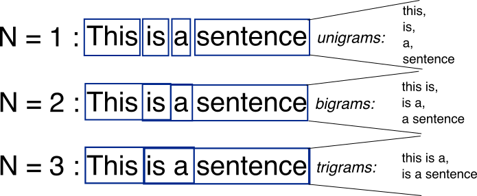

## Table of Contents

## What is an N-Gram in the context of machine learning?

An N-Gram is a way to look at a piece of text by grouping its words or letters into chunks of a certain size. The 'N' in N-Gram stands for the number of items in each chunk. For example, if you have a sentence and you want to use 2-Grams (also called bigrams), you would look at every pair of words in the sentence. So, in the sentence "I love machine learning," the 2-Grams would be "I love," "love machine," and "machine learning."

N-Grams are useful in machine learning, especially in tasks like understanding and generating language. They help computers predict what word might come next in a sentence by looking at the patterns in the text. For example, if a computer sees the 2-Gram "machine learning" often, it might predict that "learning" often follows "machine." This can be very helpful for things like auto-completing text or translating languages.

## How do N-Grams help in natural language processing?

N-Grams help in natural language processing by breaking down text into smaller, manageable chunks. This makes it easier for computers to understand and work with language. For example, if you want to predict the next word in a sentence, looking at the last few words (an N-Gram) can give you a good clue. This is useful for things like auto-completing text on your phone or helping a computer translate from one language to another.

They also help in understanding the context of words. Words can mean different things depending on what comes before or after them. By using N-Grams, a computer can see these patterns and understand the meaning better. For instance, the word "bank" could mean a place to store money or the side of a river. Looking at the N-Grams around "bank" can help a computer figure out which meaning is correct. This makes natural language processing more accurate and helpful.

## Can you explain the difference between unigrams, bigrams, and trigrams?

Unigrams, bigrams, and trigrams are different types of N-Grams used in natural language processing. A unigram is the simplest form, where each word in a text is considered on its own. For example, in the sentence "I love [machine learning](/wiki/machine-learning)," the unigrams would be "I," "love," "machine," and "learning." Unigrams are useful for understanding the frequency of individual words in a text but don't capture any context or relationships between words.

Bigrams, on the other hand, are N-Grams where each chunk contains two words. Using the same example sentence, the bigrams would be "I love," "love machine," and "machine learning." Bigrams help in understanding the relationships between consecutive words, which can be useful for predicting the next word in a sequence or understanding phrases. They provide more context than unigrams but still keep the analysis relatively simple.

Trigrams take it a step further by considering three words at a time. In our example sentence, the trigrams would be "I love machine" and "love machine learning." Trigrams offer even more context, which can be particularly helpful in tasks like language translation or text generation, where understanding longer sequences of words is important. However, as the N in N-Gram increases, the complexity and the amount of data needed also increase, making trigrams more computationally intensive than unigrams or bigrams.

## What are some common applications of N-Grams in text analysis?

N-Grams are widely used in text analysis for tasks like predicting the next word in a sentence. This is helpful in auto-complete features on phones or computers. For example, if you type "I love," the computer might suggest "machine" next because it often sees the bigram "love machine" in text. This makes typing faster and easier. N-Grams also help in language translation. When translating text, understanding the context of words is important. By looking at bigrams or trigrams, a computer can better guess the right translation based on how words are commonly used together.

Another common use of N-Grams is in sentiment analysis, which is about figuring out if a piece of text is positive, negative, or neutral. By looking at N-Grams, a computer can see patterns that show emotion. For instance, the trigram "not very good" might suggest a negative sentiment. N-Grams help in understanding these patterns better than just looking at single words. They are also used in text classification, where texts are sorted into categories. By analyzing the N-Grams in a text, a computer can decide if it's about sports, politics, or something else, based on the words and phrases commonly found in each category.

## How do you create an N-Gram model from a text corpus?

To create an N-Gram model from a text corpus, start by breaking the text into smaller pieces, like words or letters. Decide on the size of the N-Grams you want to use, like unigrams, bigrams, or trigrams. Then, go through the text and make lists of all the N-Grams you find. For example, if you choose bigrams, you would look at every pair of words in the text. After collecting all the N-Grams, count how many times each one appears. This helps you see which N-Grams are common and which are rare. You can use these counts to make predictions about what words might come next in a sentence.

Once you have the counts, you can turn them into probabilities. To do this, divide the count of each N-Gram by the total number of times the first part of the N-Gram appears in the text. For example, if you're using bigrams, you would divide the count of "love machine" by the count of "love." This gives you the probability that "machine" follows "love." You can use these probabilities to build your N-Gram model. The model can then be used to predict the next word in a sequence or to understand the relationships between words in the text.

## What are the challenges of using N-Grams in language models?

One challenge of using N-Grams in language models is the problem of data sparsity. This means that many N-Grams might only appear a few times or not at all in the training data. For example, if you're using trigrams, you need a lot of text to see all possible combinations of three words. If some trigrams are rare or missing, it's hard for the model to predict what comes next. This can make the model less accurate, especially for longer N-Grams.

Another challenge is the trade-off between model complexity and accuracy. As you increase the size of the N-Grams, like going from bigrams to trigrams, the model can understand more context and be more accurate. But bigger N-Grams need more data and more computer power to work well. Also, if you use too many N-Grams, the model can become too specific to the training data and not work as well on new text. This is called overfitting. So, finding the right balance between the size of the N-Grams and the amount of data you have is important for making a good language model.

## How does the choice of N affect the performance of an N-Gram model?

The choice of N in an N-Gram model greatly affects its performance. A smaller N, like unigrams or bigrams, makes the model simpler and faster to train because it needs less data. These smaller N-Grams are good for tasks where you don't need much context, like basic text classification. But they might not capture the full meaning of sentences because they don't look at many words at once. For example, unigrams only consider single words, so they can't see how words relate to each other.

On the other hand, a larger N, like trigrams or even higher, can capture more context and improve the model's accuracy. This is because bigger N-Grams can see patterns in longer sequences of words, which is helpful for tasks like language translation or predicting the next word in a sentence. But larger N-Grams need more data to work well. If you don't have enough text, some N-Grams might not appear often enough, making the model less reliable. So, choosing the right N depends on balancing the need for context with the amount of data you have.

## What is smoothing in N-Gram models and why is it necessary?

Smoothing in N-Gram models is a way to fix the problem of data sparsity. When you make an N-Gram model, you count how often each N-Gram appears in your text. But some N-Grams might not appear at all, or they might appear very rarely. This can make the model guess wrong when it sees these N-Grams in new text. Smoothing helps by giving a small chance to N-Grams that you haven't seen before or seen very little. This makes the model more reliable because it won't completely ignore N-Grams just because they're new or rare.

Smoothing is necessary because it helps the model work better with new or rare words. Without smoothing, if the model sees an N-Gram it hasn't seen before, it would say the chance of that N-Gram happening is zero. This is not good because it means the model can't handle new situations well. By using smoothing, the model can give a small but non-zero chance to these N-Grams. This makes the model more flexible and better at understanding and predicting language, even when it encounters new or unusual text.

## How can N-Grams be used for text classification tasks?

N-Grams can be used for text classification by breaking down text into smaller chunks and looking at the patterns in these chunks. For example, if you want to classify emails as spam or not spam, you can use N-Grams to see which words or phrases often appear in spam emails. By counting how often certain N-Grams show up in different types of text, you can train a model to recognize patterns that are common in one category but not in others. This helps the model decide which category a new piece of text belongs to based on the N-Grams it contains.

One way to use N-Grams for text classification is by creating a feature vector for each text. This means you count how many times each N-Gram appears in the text and use these counts as features. Then, you can use machine learning algorithms, like Naive Bayes or Support Vector Machines, to learn from these feature vectors and classify new texts. For example, if the bigram "free money" often appears in spam emails, the model can learn to use this as a sign that an email might be spam. By looking at many different N-Grams, the model can make better and more accurate classifications.

## What are some advanced techniques for optimizing N-Gram models?

One advanced technique for optimizing N-Gram models is using smoothing methods beyond simple Laplace smoothing. Techniques like Kneser-Ney smoothing or interpolated smoothing can help handle the problem of data sparsity better. Kneser-Ney smoothing, for example, gives a more balanced way to estimate the probabilities of N-Grams by considering how often words appear in different contexts, not just how often they appear overall. This can make the model more accurate when dealing with new or rare words. Another technique is backoff, where if an N-Gram hasn't been seen before, the model can "back off" to a smaller N-Gram to make a prediction. For example, if a trigram isn't in the model, it might use the corresponding bigram instead.

Another way to optimize N-Gram models is by using pruning. Pruning means removing N-Grams that don't appear often enough or don't help much with predictions. This can make the model smaller and faster without losing much accuracy. You can also use techniques like caching, where the model keeps track of recently used N-Grams to make predictions faster. For example, if someone is typing a sentence, the model can quickly suggest the next word based on the N-Grams it has seen recently. These techniques help make N-Gram models more efficient and effective for tasks like language prediction and text classification.

## How do N-Gram models compare to more advanced language models like neural networks?

N-Gram models are simpler and easier to understand than [neural network](/wiki/neural-network) models. They work by looking at short sequences of words and counting how often these sequences appear in text. This makes them good for tasks like predicting the next word in a sentence or classifying text into categories. But N-Gram models have some problems. They need a lot of text to work well, and they can struggle with new or rare words. Also, they don't understand the deeper meaning of language because they only look at short sequences of words.

Neural network models, like those using recurrent neural networks (RNNs) or transformers, are more advanced and can understand language better. These models can learn the context and meaning of words by looking at whole sentences or even paragraphs. They are good at tasks like translating languages or generating new text because they can capture more complex patterns in language. But neural network models are harder to understand and need a lot of computer power to train. So, while they are more powerful, they are also more complex and harder to use than N-Gram models.

## Can you discuss any recent research developments in the use of N-Grams in machine learning?

Recent research in the use of N-Grams in machine learning has focused on improving their efficiency and effectiveness in handling large datasets. One interesting development is the integration of N-Grams with more advanced models like neural networks. For example, researchers have used N-Grams as features in [deep learning](/wiki/deep-learning) models to help with tasks like sentiment analysis and text classification. By combining the simplicity of N-Grams with the power of neural networks, these models can capture both local patterns and broader context in text. This hybrid approach has shown promising results in improving the accuracy of language understanding tasks.

Another area of research is the application of N-Grams in multilingual settings. Researchers have been exploring how N-Grams can help in language translation and cross-lingual text classification. By using N-Grams to identify common phrases across different languages, models can better understand and translate text. This is particularly useful in low-resource languages where training data is scarce. The use of N-Grams in these scenarios helps in creating more robust and adaptable language models that can work across different linguistic environments.

## References & Further Reading

[1]: Manning, C. D., Raghavan, P., & Schütze, H. (2008). ["Introduction to Information Retrieval."](https://www.cambridge.org/highereducation/books/introduction-to-information-retrieval/669D108D20F556C5C30957D63B5AB65C) Cambridge University Press.

[2]: Jurafsky, D., & Martin, J. H. (2009). ["Speech and Language Processing"](https://www.researchgate.net/publication/200111340_Speech_and_Language_Processing_An_Introduction_to_Natural_Language_Processing_Computational_Linguistics_and_Speech_Recognition). Prentice Hall.

[3]: Katz, S. M. (1987). ["Estimation of probabilities from sparse data for the language model component of a speech recognizer."](https://ieeexplore.ieee.org/document/1165125) In IEEE Transactions on Acoustics, Speech, and Signal Processing.

[4]: Chen, S. F., & Goodman, J. (1998). ["An Empirical Study of Smoothing Techniques for Language Modeling."](https://www.sciencedirect.com/science/article/pii/S0885230899901286) In ACL.

[5]: [N-grams in Google Research](https://research.google/blog/all-our-n-gram-are-belong-to-you/) by Google Research, highlighting applications and developments in machine learning.