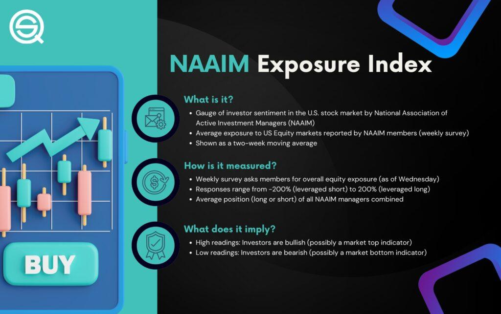

## Table of Contents

## What is NAAIM and what is its primary purpose?

NAAIM stands for the National Association of Active Investment Managers. It is a group of professional money managers who focus on actively managing investments. The main goal of NAAIM is to help its members do a better job at managing money for their clients. They do this by sharing ideas, research, and best practices among the members.

The primary purpose of NAAIM is to support active investment managers in improving their skills and performance. They organize events, like conferences and workshops, where members can learn from each other and from experts in the field. NAAIM also provides resources and tools that help members make better investment decisions. By working together, NAAIM members aim to achieve better results for the people and organizations they serve.

## How does NAAIM measure the exposure of its members to the stock market?

NAAIM measures the exposure of its members to the stock market through a weekly survey called the NAAIM Exposure Index. In this survey, members report how much of their portfolios are invested in stocks. The index shows an average number that represents the overall exposure of all the members to the stock market. This helps to give a quick snapshot of how bullish or bearish the members are feeling about the market.

The NAAIM Exposure Index is a useful tool because it can show trends over time. If the index is high, it means that members are heavily invested in stocks and feel optimistic about the market. If the index is low, it means members are less invested and might be more cautious. By tracking these changes, investors and analysts can get a sense of the mood among active investment managers and possibly use this information to guide their own investment decisions.

## What is the NAAIM Exposure Index and how is it calculated?

The NAAIM Exposure Index is a weekly survey that shows how much money NAAIM members have invested in the stock market. It tells us if members are feeling good or worried about the market. Each week, members report the percentage of their portfolios that are in stocks. The index is the average of all these percentages, giving us a single number that represents the overall exposure of NAAIM members to the stock market.

This index is helpful because it shows trends over time. If the number is high, it means members are putting a lot of money into stocks and feel positive about the market. If the number is low, it means they are putting less money in and might be more cautious. By watching these changes, other investors and analysts can get a sense of how active investment managers are feeling and use this information to help make their own investment choices.

## Can you explain the significance of the NAAIM Exposure Index for investors?

The NAAIM Exposure Index is important for investors because it shows how much money professional money managers are putting into the stock market. This index is like a weekly report card that tells us if these experts are feeling good or worried about the market. If the index number is high, it means these managers are investing a lot in stocks and think the market will do well. If the index number is low, it means they are not putting as much money in and might be more cautious about the market.

Investors can use the NAAIM Exposure Index to help make their own decisions. By watching the changes in the index over time, they can get a sense of whether the experts are feeling more hopeful or more worried about the market. This can give investors clues about when might be a good time to buy or sell stocks. Even though it's just one piece of information, knowing what the pros are doing can be a helpful guide for anyone trying to navigate the stock market.

## How often is the NAAIM Exposure Index updated and where can it be accessed?

The NAAIM Exposure Index is updated every week. This means you can see new numbers every seven days to know how much money the pros are putting into the stock market.

You can find the NAAIM Exposure Index on the NAAIM website. Just go to their site, look for the section about the Exposure Index, and you'll see the latest numbers and past data too. It's easy to check and can help you understand what the experts are thinking about the market.

## What are some common strategies used by NAAIM members to manage their exposure?

NAAIM members use different strategies to manage how much of their money is in the stock market. One common way is called "tactical asset allocation." This means they move their money around based on what they think will happen in the market. If they think the market will go up, they might put more money into stocks. If they think it will go down, they might put more money into safer places like bonds or cash.

Another strategy they use is "sector rotation." This means they focus on different parts of the market at different times. For example, they might put more money into technology stocks if they think that part of the market will do well. Or they might move money into healthcare stocks if they think that sector will be strong. By changing where their money is, they try to do better than the overall market.

Some NAAIM members also use "risk management" strategies. This means they try to protect their money from big losses. They might use tools like stop-loss orders, which sell a stock if it drops to a certain price. Or they might use options to hedge their bets. By managing risk, they hope to keep their clients' money safe while still trying to make it grow.

## How can the NAAIM Exposure Index be used as a contrarian indicator?

The NAAIM Exposure Index can be used as a contrarian indicator because it shows when professional money managers are feeling very hopeful or very worried about the market. If the index is really high, it means these pros are putting a lot of money into stocks because they think the market will keep going up. But, some investors might see this as a sign that the market could be about to go down. They think that when everyone is feeling good, it might be time to be careful.

On the other hand, if the NAAIM Exposure Index is very low, it means the pros are not putting much money into stocks because they are worried about the market going down. Contrarian investors might see this as a good time to buy stocks. They think that when everyone is feeling bad, it might be a good time to be hopeful. By going against what the crowd is doing, contrarian investors hope to buy low and sell high.

## What historical trends have been observed in the NAAIM Exposure Index and what do they indicate?

Over the years, the NAAIM Exposure Index has shown that it can swing a lot. Sometimes, it goes really high when everyone is feeling good about the market. This happened in early 2021 when the index hit over 100, meaning members were putting in more money than they had, using borrowed money to invest. But, when it's high like this, it often means the market might be about to take a break or go down. For example, after the high in 2021, the market did have some ups and downs.

Other times, the index goes really low, like in early 2020 during the start of the COVID-19 crisis. It dropped below zero, showing that members were not just pulling out of stocks but also betting against the market. When it's this low, it can be a sign that the market might be ready to go up again. After the low in 2020, the market did start to recover. These swings in the index show us how the feelings of professional money managers can change and give us clues about what might happen next in the market.

## How do NAAIM members adjust their strategies based on market conditions?

NAAIM members watch the market closely and change their strategies to fit what's happening. When the market is doing well and they think it will keep going up, they might put more money into stocks. This is called being bullish. They might also focus on certain parts of the market that they think will do better than others, like tech or healthcare. This is called sector rotation. By moving their money around, they try to make the most of the good times in the market.

When the market is not doing well, NAAIM members might take money out of stocks and put it into safer places like bonds or cash. This is being bearish. They might also use tools like stop-loss orders to sell stocks if they start to drop too much. This helps them protect their money from big losses. By being careful and adjusting their strategies, NAAIM members try to keep their clients' money safe while still looking for chances to grow it.

## What are the potential risks and benefits of following the NAAIM Exposure Index for individual investors?

Following the NAAIM Exposure Index can help individual investors understand what professional money managers are doing with their money. This can give investors a clue about whether the market might go up or down. If the index is high, it might mean the market is about to take a break or go down, which can help investors decide if it's a good time to sell some stocks. If the index is low, it might mean the market is ready to go up again, which could be a good time to buy stocks. By using the index as a guide, investors might make better choices and possibly make more money.

But there are risks too. The NAAIM Exposure Index is just one piece of information, and it's not always right. Sometimes, even when the pros are feeling good or bad about the market, it can still do the opposite of what they expect. If investors follow the index too closely without looking at other things, they might make bad choices and lose money. It's important to use the index along with other information and maybe even talk to a financial advisor to make the best decisions.

## How does the NAAIM Exposure Index compare to other market sentiment indicators?

The NAAIM Exposure Index is one way to see how professional money managers feel about the stock market. It's different from other market sentiment indicators because it shows what these pros are actually doing with their money, not just what they're saying or thinking. For example, the American Association of Individual Investors (AAII) Sentiment Survey asks regular people how they feel about the market, but the NAAIM Index shows how much money pros have in stocks. Another popular indicator is the VIX, which is sometimes called the "fear index." It measures how much people are worried about the market going down, but it doesn't tell you what pros are doing with their money like the NAAIM Index does.

Other market sentiment indicators can give different kinds of information. The Put/Call Ratio looks at how many people are buying options to bet against the market compared to those betting on it going up. This can show if people are feeling scared or hopeful, but it's more about what regular investors are doing, not pros. The CNN Fear & Greed Index mixes different indicators like stock price [momentum](/wiki/momentum), market [volatility](/wiki/volatility-trading-strategies), and even junk bond demand to give a broad picture of market sentiment. While this can be useful, the NAAIM Exposure Index is more focused and specific because it's all about what professional money managers are doing with their money in stocks.

## What advanced analytical techniques can be applied to the NAAIM Exposure Index data for deeper insights?

One advanced way to look at the NAAIM Exposure Index data is by using time series analysis. This means looking at how the index changes over time and trying to spot patterns. For example, you can use something called moving averages to smooth out the ups and downs and see the bigger trends. Another tool is autoregressive integrated moving average (ARIMA) models, which can help predict what the index might do next based on what it has done before. By using these techniques, you can get a better idea of when the pros might be feeling really good or really bad about the market, and use that to help make your own investment decisions.

Another technique is called [machine learning](/wiki/machine-learning). This involves using computers to find patterns in the data that might be hard for people to see. For example, you can use a method called clustering to group times when the index was high or low and see what was happening in the market during those times. Or you can use something called regression analysis to see how the index might be affected by other things like the economy or interest rates. By using machine learning, you can dig deeper into the data and maybe find new ways to understand what the NAAIM Exposure Index is telling us about the market.

## References & Further Reading

[1]: ["Understanding the NAAIM Exposure Index"](https://naaim.org/programs/naaim-exposure-index/) - National Association of Active Investment Managers

[2]: Faber, M. T. (2013). ["Shareholder Yield: A Better Approach to  Dividend Investing."](https://www.amazon.com/Shareholder-Yield-Approach-Dividend-Investing/dp/0988679906) SSRN Electronic Journal.

[3]: ["The Intelligent Investor"](https://www.amazon.com/Intelligent-Investor-Definitive-Investing-Essentials/dp/0060555661) by Benjamin Graham

[4]: Covel, M. (2009). ["Trend Following: Learn to Make Millions in Up or Down Markets."](https://www.amazon.com/Trend-Following-Updated-Millions-Markets/dp/013702018X) 

[5]: Montier, J. (2009). ["Behavioural Investing: A Practitioner's Guide to Applying Behavioural Finance."](https://onlinelibrary.wiley.com/doi/book/10.1002/9781118673430)