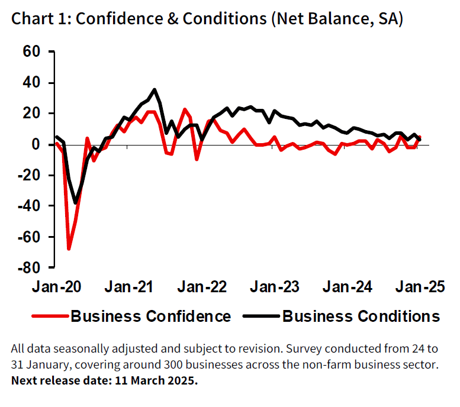

## Table of Contents

## What is the NAB Business Confidence Index?

The NAB Business Confidence Index is a measure that shows how confident businesses in Australia are feeling about the future. It is put together by the National Australia Bank (NAB) every month. The index looks at things like how businesses think their sales, profits, and employment will do in the next few months. If the number is high, it means businesses are feeling good and think things will get better. If the number is low, it means businesses are worried and think things might get worse.

This index is important because it helps people understand what businesses are thinking and planning. Governments, investors, and other businesses use this information to make decisions. For example, if the index shows businesses are feeling confident, the government might decide to spend more money on new projects. On the other hand, if the index shows businesses are not feeling confident, the government might try to help by changing laws or giving businesses more support.

## Who publishes the NAB Business Confidence Index?

The NAB Business Confidence Index is published by the National Australia Bank (NAB). They put it out every month to show how businesses in Australia feel about the future.

This index helps everyone understand if businesses are feeling good or worried. Governments, investors, and other businesses use this information to make decisions about spending and planning.

## How often is the NAB Business Confidence Index released?

The NAB Business Confidence Index comes out every month. This means you can see it 12 times a year. It's like getting a monthly report card on how businesses in Australia are feeling.

This index is important because it helps people understand if businesses are happy or worried about the future. Governments, investors, and other businesses look at this index to make decisions. If businesses feel good, it might mean more spending and growth. If they feel bad, it might mean less spending and more caution.

## What types of businesses are surveyed for the NAB Business Confidence Index?

The NAB Business Confidence Index surveys a wide range of businesses in Australia. This includes small, medium, and large companies from different industries like farming, building, making things, and services. They want to hear from all kinds of businesses to get a good picture of how everyone is feeling.

By asking businesses of different sizes and from different sectors, the NAB can see if confidence is high or low across the board. This helps them understand if certain types of businesses are more worried or more hopeful than others. It's like taking a big survey to see how the whole business community is doing.

## What is the methodology used to calculate the NAB Business Confidence Index?

The NAB Business Confidence Index is calculated by surveying a large number of businesses across Australia every month. They ask these businesses about their feelings on things like sales, profits, and employment for the next few months. Each business gives a score, usually from -100 to +100, where a higher number means they feel more confident. The NAB then takes all these scores and works out an average to get the index number. This average shows how businesses overall are feeling about the future.

To make sure the index is fair and accurate, the NAB makes sure to include businesses of all sizes and from different industries. They want to hear from small shops, big factories, and everything in between. This way, the index reflects the feelings of the whole business community, not just one part of it. By doing this every month, the NAB can see if business confidence is going up or down over time, which helps everyone understand the health of the economy.

## How does the NAB Business Confidence Index reflect business sentiment?

The NAB Business Confidence Index shows how businesses in Australia feel about the future. Every month, the National Australia Bank asks lots of different businesses about their thoughts on things like sales, profits, and jobs for the next few months. Each business gives a score, and the NAB takes all these scores and finds an average. This average number is the index, and it tells us if businesses are feeling good or worried.

The index is important because it helps everyone understand the mood of businesses. If the number is high, it means businesses are feeling confident and think things will get better. If it's low, it means they're worried and think things might get worse. Governments, investors, and other businesses look at this index to make decisions. For example, if businesses are feeling good, the government might spend more on new projects. If they're feeling bad, the government might try to help by changing laws or giving more support.

## What are the key components of the NAB Business Confidence Index?

The NAB Business Confidence Index is made up of several important parts that help show how businesses in Australia feel about the future. The main part is the confidence score that businesses give. Every month, businesses are asked to rate their feelings about things like sales, profits, and jobs for the next few months. They give a number from -100 to +100, where a higher number means they feel more confident. The NAB takes all these scores and finds an average to get the index number.

Another important part is the variety of businesses that are asked. The NAB makes sure to include small, medium, and large companies from different industries like farming, building, making things, and services. This helps make sure the index shows how the whole business community feels, not just one part of it. By looking at all these different businesses, the NAB can see if confidence is high or low across the board and understand if certain types of businesses are more worried or more hopeful than others.

## How can the NAB Business Confidence Index be used to predict economic trends?

The NAB Business Confidence Index can help predict economic trends by showing how businesses feel about the future. When the index number is high, it means businesses are feeling good and think things will get better. This can mean more spending and growth in the economy. If the number is low, it means businesses are worried and think things might get worse. This can lead to less spending and more caution. By watching how the index changes over time, people can guess what might happen next in the economy.

Governments, investors, and other businesses look at the NAB Business Confidence Index to make decisions. For example, if the index shows businesses are feeling confident, the government might decide to spend more money on new projects to help the economy grow even more. On the other hand, if the index shows businesses are not feeling confident, the government might try to help by changing laws or giving businesses more support. Investors might also use the index to decide whether to put money into new businesses or projects, depending on how confident businesses are feeling.

## What are the limitations of the NAB Business Confidence Index?

The NAB Business Confidence Index, while helpful, has some limitations. One big problem is that it's based on what businesses think might happen, not what's actually happening. So, if businesses are feeling too hopeful or too worried, the index might not show what's really going on in the economy. Also, the index only asks businesses in Australia, so it doesn't tell us anything about what's happening in other countries that might affect our economy.

Another limitation is that the index can be affected by short-term events. For example, if there's a big news story or a sudden change in the economy, businesses might change how they feel quickly. This can make the index jump around a lot, which makes it hard to see the bigger picture. Plus, the index doesn't look at all the different reasons why businesses feel the way they do. It's just one number, so it can't tell us everything about the economy.

## How does the NAB Business Confidence Index compare to other business confidence indices?

The NAB Business Confidence Index is one of several indices used to measure how businesses feel about the future. Another popular index is the Westpac-Melbourne Institute Leading Index, which also looks at how confident Australian businesses are. Both indices survey businesses to get their thoughts, but they might ask different questions or focus on different parts of the economy. For example, the NAB index includes businesses from all sizes and industries, while other indices might focus more on specific sectors or types of businesses.

Another key difference is how often these indices come out. The NAB Business Confidence Index is released every month, giving a regular update on business sentiment. On the other hand, some indices, like the OECD Business Confidence Indicator, are released less often, maybe every quarter. This can affect how useful they are for making quick decisions. Also, different indices might use different ways to calculate their numbers, so the NAB index might show different results than others, even if they're looking at the same thing.

## What historical trends can be observed in the NAB Business Confidence Index?

Looking at the NAB Business Confidence Index over time, we can see that it goes up and down with the economy. During good times, like when the economy is growing and people are spending more money, the index usually goes up. This shows that businesses feel good about the future. For example, in the early 2000s, the index was pretty high because Australia had a strong economy. But when there are tough times, like during the Global Financial Crisis in 2008, the index dropped a lot. Businesses were worried and not feeling confident about what was coming next.

Another thing we can see from the index is that it can change quickly because of big events. For instance, when there was a big bushfire or a global health crisis like COVID-19, the index went down fast. Businesses got scared and weren't sure about the future. But the index can also bounce back quickly when things start to look better. After the initial shock of the COVID-19 crisis, the index started to go up again as businesses saw things getting back to normal. Overall, the NAB Business Confidence Index helps us see how businesses feel over time and gives clues about where the economy might be headed.

## How do policymakers and investors use the NAB Business Confidence Index in decision-making?

Policymakers and investors use the NAB Business Confidence Index to help them make decisions about the economy. When the index shows that businesses are feeling good and confident, policymakers might decide to spend more money on new projects or make laws that help businesses grow. This is because they see that businesses are ready to invest and expand, so they want to support that growth. Investors also look at a high index number as a sign to put their money into new businesses or projects, expecting that they will do well in a strong economy.

On the other hand, if the index shows that businesses are worried and not feeling confident, policymakers might try to help by changing laws or giving businesses more support. They might do things like lowering taxes or providing financial help to keep businesses going during tough times. Investors, seeing a low index number, might be more cautious and hold off on making big investments, waiting to see if the economy gets better before they take risks. Both groups use the index to get a sense of the mood of businesses and make decisions that fit with what's happening in the economy.

## References & Further Reading

[1]: ["Economic Trends and Conditions: NAB Business Confidence"](https://business.nab.com.au/nab-monthly-business-survey-september-2024/) - National Australia Bank, providing updates and insights on the NAB Business Confidence Index.

[2]: Bollen, N. P., & Mao, X. (2010). ["Behavioral Trading Strategies across International Stock-Market Movements"](https://arxiv.org/abs/1010.3003) - Journal of Financial Markets, discussing how behavioral strategies in trading can react to market movements.

[3]: Lopez de Prado, M. (2018). ["Advances in Financial Machine Learning"](https://www.amazon.com/Advances-Financial-Machine-Learning-Marcos/dp/1119482089) - A guide to applying machine learning techniques in the context of financial trading.

[4]: Aronson, D. R. (2006). ["Evidence-Based Technical Analysis: Applying the Scientific Method and Statistical Inference to Trading Signals"](https://www.amazon.com/Evidence-Based-Technical-Analysis-Scientific-Statistical/dp/0470008741) - A book that discusses the application of scientific methodologies to improve the reliability of trading signals.

[5]: Chan, E. (2009). ["Quantitative Trading: How to Build Your Own Algorithmic Trading Business"](https://github.com/ftvision/quant_trading_echan_book) - This book explores the construction of algorithmic trading strategies and systems.