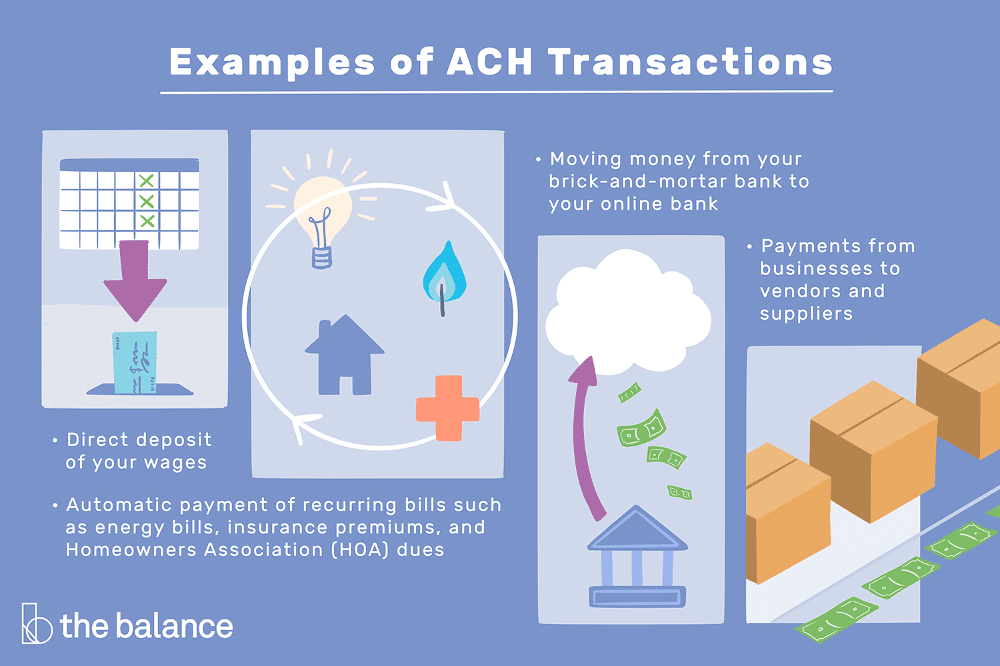

## Table of Contents

## What is Nacha and what is its primary function?

Nacha, which stands for the National Automated Clearing House Association, is an organization in the United States that manages the ACH Network. The ACH Network is a system that helps move money between banks electronically. It's like a big highway for money transfers, making it easier and faster for people and businesses to send and receive payments without using paper checks or cash.

The primary function of Nacha is to set the rules and standards for how the ACH Network operates. This means they make sure that all the banks and other financial institutions follow the same guidelines when they process electronic payments. By doing this, Nacha helps keep the system safe and reliable, so people can trust that their money will get where it needs to go on time.

## How did Nacha originate and what were the key milestones in its historical development?

Nacha started back in 1974 when a group of banks in the U.S. came together to create a better way to move money around. They wanted to make it easier and faster for people to send and receive payments without using paper checks. So, they formed the National Automated Clearing House Association, or Nacha for short. At first, Nacha focused on setting up the rules and standards for the ACH Network, which is like a big electronic highway for money transfers.

Over the years, Nacha grew and made some important changes. In the 1980s, they started allowing businesses to use the ACH Network for things like direct deposit of paychecks and automatic bill payments. This made life a lot easier for both companies and their employees. By the 2000s, Nacha was working on making the ACH Network even faster and more secure. They introduced same-day ACH transfers, which meant people could get their money much quicker than before. Today, Nacha keeps working to improve the ACH Network, making sure it stays safe and reliable for everyone who uses it.

## What role does Nacha play in the ACH network?

Nacha is like the boss of the ACH Network. It makes the rules that all the banks and other money-moving companies have to follow. This helps keep everything running smoothly and safely. When you use the ACH Network to send or receive money, Nacha's rules make sure that the money gets to the right place at the right time.

Nacha also works to make the ACH Network better over time. They've added things like same-day transfers, which means you can get your money faster than before. They keep an eye on new technology and ways to make the system safer and easier to use. By doing all this, Nacha helps make sure that the ACH Network stays a reliable way for people and businesses to move money around.

## How does Nacha facilitate faster payments and what specific initiatives have been implemented?

Nacha helps make payments faster by working on the ACH Network, which is like a big road for moving money. They've made rules that let banks send money to each other quicker. One big change they made is called Same Day ACH. This means that if you need to send or get money, it can happen on the same day instead of waiting a few days. This is really helpful for people who need their money fast, like when they're paying bills or getting paid.

Nacha also started something called the Faster Payments Council. This group looks at new ways to make payments even quicker and easier. They talk about new technology and ideas that can make sending and getting money faster. By doing all this, Nacha helps keep the ACH Network up to date and makes sure that people can move their money around quickly and safely.

## What are the key rules and regulations set by Nacha for ACH transactions?

Nacha has a bunch of rules that banks and other money-moving companies need to follow when they use the ACH Network. One big rule is about making sure the right person gets the money. They have to check that the account numbers and names match up before sending any money. This helps stop mistakes and keeps people's money safe. Another rule is about timing. Nacha says that banks have to move the money within certain times, so people don't have to wait too long to get their money. They also have rules about what to do if something goes wrong, like if money goes to the wrong place. Banks need to fix these problems quickly.

Nacha also has rules to stop bad things from happening, like fraud. They say that banks need to watch out for strange money moves and report them if they look fishy. This helps catch people who might be trying to steal money. Nacha also makes sure that everyone's private information stays private. They have rules about keeping account numbers and other personal stuff safe. By setting all these rules, Nacha helps make sure that the ACH Network stays a safe and reliable way for people to send and get their money.

## How does Nacha ensure the security and integrity of ACH payments?

Nacha works hard to keep ACH payments safe and trustworthy. They have rules that make sure banks check the account numbers and names before sending any money. This helps stop mistakes and keeps people's money from going to the wrong place. Nacha also says that banks need to fix any problems fast if something goes wrong, like if money gets sent to the wrong account. By having these rules, Nacha helps make sure that everyone's money gets to where it needs to go safely.

Nacha also fights against fraud to keep the ACH Network secure. They tell banks to watch out for strange money moves and report them if they look suspicious. This helps catch people who might be trying to steal money. Plus, Nacha has rules to keep everyone's private information safe. They make sure that account numbers and other personal details are protected. By doing all this, Nacha helps make the ACH Network a safe and reliable way for people to send and get their money.

## What is the difference between same-day ACH and real-time payments, and how does Nacha support these?

Same-day ACH and real-time payments are both ways to move money fast, but they work a bit differently. Same-day ACH means that the money you send can reach the other person's bank account on the same day, but it's not instant. There are specific times during the day when banks can send and receive these payments. So, if you send money in the morning, it might not get there until later that day. Real-time payments, on the other hand, are instant. When you send money, it goes to the other person's account right away, no matter what time of day it is.

Nacha helps with same-day ACH by setting the rules that banks need to follow. They made it possible for banks to send and receive these payments three times a day, which means people can get their money faster than with regular ACH transfers. Nacha doesn't directly manage real-time payments, but they support the idea through the Faster Payments Council. This group looks at new ways to make all kinds of payments quicker and easier, including real-time payments. By doing this, Nacha helps keep the payment systems in the U.S. up to date and reliable.

## How does Nacha collaborate with financial institutions and other stakeholders to enhance payment systems?

Nacha works closely with banks and other money-moving companies to make the ACH Network better. They talk to these groups to find out what they need and what problems they're facing. By listening to everyone, Nacha can make rules that help the whole system work smoothly. They also work together on new ideas and technology that can make sending and getting money easier and faster. This teamwork helps keep the ACH Network up to date and reliable for everyone who uses it.

Nacha also teams up with other groups that care about payments. They have something called the Faster Payments Council, where different people from banks, businesses, and even tech companies come together. They all share their ideas on how to make payments quicker and safer. By working with these different groups, Nacha can learn about new ways to improve the payment systems in the U.S. This collaboration helps make sure that the ACH Network stays a good way for people to move their money around.

## What impact has Nacha had on the efficiency and cost of electronic payments?

Nacha has made a big difference in how fast and cheap it is to move money around. They made rules that let banks send money to each other faster, like with same-day ACH. This means people don't have to wait as long to get their money, which is really helpful when they need to pay bills or get paid quickly. Before Nacha's changes, it could take a few days for money to move from one bank to another. Now, with same-day ACH, it can happen much faster, which saves time and makes life easier for everyone.

Nacha also helps keep the cost of electronic payments low. By setting rules that everyone follows, they make sure the system works smoothly and doesn't need a lot of extra work from banks. This helps keep fees down for people and businesses who use the ACH Network. When things run more efficiently, it's cheaper for everyone involved. So, thanks to Nacha, sending and getting money through the ACH Network is not only faster but also more affordable.

## How does Nacha address issues related to fraud and risk management in ACH transactions?

Nacha works hard to keep ACH transactions safe from fraud and manage risks. They have rules that make banks check the account numbers and names before sending any money. This helps stop mistakes and keeps people's money from going to the wrong place. Nacha also tells banks to watch out for strange money moves and report them if they look suspicious. This helps catch people who might be trying to steal money. By having these rules, Nacha helps make sure that everyone's money gets to where it needs to go safely.

Nacha also helps banks fix problems quickly if something goes wrong, like if money gets sent to the wrong account. They have rules about what to do in these situations to make sure the issue is sorted out fast. Plus, Nacha makes sure that everyone's private information stays private. They have rules about keeping account numbers and other personal stuff safe. By doing all this, Nacha helps make the ACH Network a safe and reliable way for people to send and get their money.

## What future developments or innovations can we expect from Nacha in the payment industry?

Nacha is always looking for new ways to make payments better. They want to keep the ACH Network fast and safe. One thing they might do is work on making real-time payments more common. Right now, same-day ACH is really helpful, but real-time payments can be even faster. Nacha could help set rules to make sure these instant payments work well and stay secure. They might also look at new technology, like using smartphones or other devices to send and get money even easier.

Another thing Nacha might focus on is making payments work better for everyone, no matter where they live or what kind of bank they use. They could work on making the ACH Network reach more places and be easier to use for small businesses and people who don't have a lot of money. By doing this, Nacha can help more people use electronic payments and make their lives easier. They'll keep talking to banks and other groups to find out what's needed and make the payment system even better in the future.

## How does Nacha's governance and operational structure support its mission and objectives?

Nacha's governance and operational structure help it do its job well. They have a board of directors made up of people from different banks and payment companies. These people make big decisions about the rules and how the ACH Network should work. They meet regularly to talk about what's happening and what needs to change. This way, Nacha can keep the system safe and make sure it works smoothly for everyone. They also have different groups, like committees, that focus on specific things like fraud prevention or new technology. These groups help Nacha stay on top of what's important and make the right changes.

Nacha also works with other groups to make payments better. They have the Faster Payments Council, which brings together people from banks, businesses, and tech companies. This group talks about new ways to make payments faster and easier. By working together, Nacha can learn about new ideas and technology that can help the ACH Network. They also listen to what banks and other companies need, so they can make rules that help everyone. This teamwork helps Nacha keep the payment system up to date and reliable, so people can trust it to move their money safely and quickly.

## References & Further Reading

[1]: ["The ACH Network and the U.S. Payments System"](https://www.nacha.org/content/ach-payments-fact-sheet) - Federal Reserve

[2]: ["Faster Payments: Market Structure and Policy Considerations"](https://www.bostonfed.org/-/media/Documents/Workingpapers/PDF/2017/cpp1704.pdf) by the Federal Reserve

[3]: ["Nacha's Efforts in Modernizing Payments"](https://en.wikipedia.org/wiki/%C3%8Ele-de-France) - Nacha

[4]: ["Automated Clearing House System"](https://en.wikipedia.org/wiki/Automated_Clearing_House) - Investopedia

[5]: ["Algorithmic Trading and Automated Markets"](https://en.wikipedia.org/wiki/Algorithmic_trading) by Terrence Hendershott, Charles M. Jones, and Albert J. Menkveld, The Journal of Finance

[6]: ["Algorithmic Trading: Winning Strategies and Their Rationale"](https://www.wiley.com/en-us/Algorithmic+Trading%3A+Winning+Strategies+and+Their+Rationale-p-9781118460146) by Ernie Chan