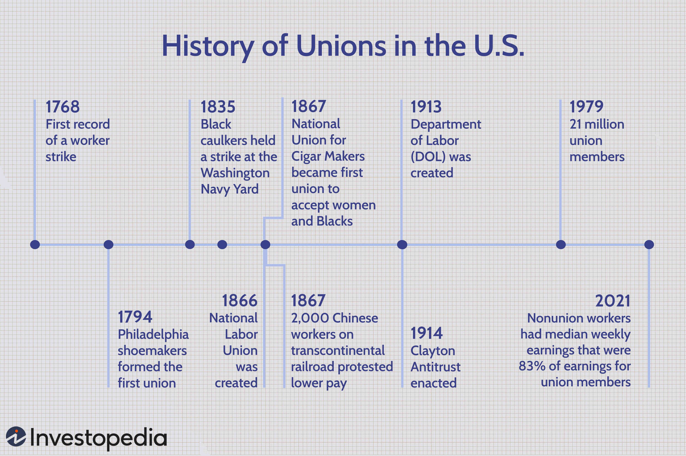

The concept of faster payments is revolutionizing modern financial transactions, allowing both consumers and businesses to transfer funds almost instantaneously. Central to the faster payments infrastructure in the United States is Nacha, the organization responsible for overseeing the Automated Clearing House (ACH) Network. Nacha's influence has not only transformed how transactions are conducted but also plays a significant role in algorithmic trading.

Algorithmic trading, which is heavily dependent on speed and timing, stands to benefit immensely from faster payment processing. By reducing transaction times, traders can execute and settle trades more quickly, enhancing the effectiveness of trading strategies. This improvement can be pivotal in a trading environment that thrives on the ability to capture market opportunities with precision and speed. As traders benefit from reduced payment latency, they can optimize their strategies to react promptly to market movements and anomalies.



The relationship between Nacha's payment systems and trading technologies is of paramount importance for traders aiming to stay competitive. As the financial markets grow increasingly complex, the integration of advanced payment systems with trading platforms can offer a significant competitive edge. Understanding this interplay allows for the development of more sophisticated trading technologies and methodologies that leverage speed and efficiency.

Nacha's initiatives within the payment ecosystem not only enable quick execution but also ensure that the underlying transaction processes are secure and reliable. This dual focus on speed and security is critical for maintaining trust among users of electronic payments. As the landscape of financial markets continues to advance, grasping the dynamics between payment systems and trading technologies will be crucial for traders eager to adapt and excel in a fast-evolving environment.

## Table of Contents

## What is Nacha?

Nacha, or the National Automated Clearinghouse Association, is a pivotal non-profit organization that spearheads the development and regulation of the Automated Clearing House (ACH) Network in the United States. The ACH Network serves as a backbone for electronic financial transactions, processing billions annually across diverse categories such as direct deposits, bill payments, and corporate fund exchanges. By standardizing procedures, Nacha ensures streamlined electronic fund transfers between banks and various financial entities, bolstering both efficiency and security within the system.

One of Nacha's primary functions is to establish and enforce the rules and standards for ACH operations. This governance framework enables seamless interaction among participating institutions, fostering trust and reliability in electronic transactions. In collaboration with key governmental bodies, such as the Federal Reserve and the U.S. Treasury, Nacha plays a significant role in maintaining the integrity and stability of the U.S. electronic payment infrastructure.

Nacha's influence extends beyond traditional banking frameworks, notably through its merger with the Interactive Financial eXchange (IFX) Forum. This strategic consolidation has augmented Nacha's capacity to develop and refine specifications critical for modern financial data exchanges. The merger exemplifies Nacha's commitment to evolving alongside technological advancements, ensuring that its members can leverage cutting-edge solutions for financial data systems.

By integrating its operations with leading financial institutions and regulatory entities, Nacha acts as a cornerstone institution in the American financial landscape, driving the continuous enhancement of electronic payment systems and their associated technologies.

## The Evolution of Nacha and Faster Payments

Nacha has played a foundational role in the evolution of electronic payment systems, with its genesis dating back to 1974. Initially established to harness the potential of electronic fund transfers (EFTs), Nacha has progressively aligned with the ever-shifting financial landscape. One of the pivotal milestones in its trajectory was the launch of the Faster Payments Playbook in 2019, a framework aimed at accelerating transaction processes to provide near-instantaneous funds availability for consumers. This initiative underscored Nacha's commitment to advancing payment technologies to meet the demands of modern financial transactions.

Historically, Nacha has been at the forefront of pioneering payment innovations. The implementation of direct payroll deposits revolutionized how employees received their salaries, while electronic benefits transfers transformed the distribution of social benefits. These developments exemplify Nacha's consistent effort to enhance the efficiency and convenience of payment systems.

Through strategic partnerships, such as the Payments Innovation Alliance, Nacha persists in its exploration of modernization and security measures within the payment ecosystem. These alliances are crucial in fostering dialogue among financial institutions, technology providers, and regulators to cultivate innovative solutions that fortify the integrity and efficiency of electronic payments.

A testament to Nacha's adaptability is its involvement in B2B health insurance payments under the Affordable Care Act. By streamlining these transactions, Nacha not only fulfills a critical industry need but also demonstrates its versatility in addressing diverse market requirements. This adaptability ensures that Nacha remains a central entity in the ongoing evolution of the financial transaction landscape, continuously driving towards faster and more secure payment systems.

## The ACH Network and Its Impact on Algorithmic Trading

The ACH Network is integral to facilitating rapid financial transactions across the U.S., benefiting various sectors, including [algorithmic trading](/wiki/algorithmic-trading). Designed to efficiently connect financial institutions, the ACH Network streamlines the movement of money and information between accounts, providing a robust infrastructure for secure and swift transactions. This capability is particularly advantageous for algorithmic traders, who rely on rapid transaction processing to gain competitive advantages in financial markets.

The network's ability to swiftly process funds is key to quicker trade execution and settlement. For algorithmic traders, whose models often depend on minute-by-minute market fluctuations, the accelerated transaction times afforded by Nacha's faster payments can significantly enhance strategic timing. This expedited process reduces the latency that can adversely impact trade positions, thereby allowing traders to effectively respond to market dynamics.

Nacha prioritizes quality and risk management within the ACH Network, ensuring the reliability and integrity of transactions. This emphasis is crucial for traders who depend on precise timing and trustworthy payment processes. Consistency and security in fund transfers are foundational to maintaining confidence in automated trading systems, which can execute vast numbers of transactions at [high frequency](/wiki/high-frequency-trading).

Moreover, the integration of standardized Application Programming Interfaces (APIs) through Nacha is enhancing algorithmic trading environments. These APIs enable developers and traders to implement automated solutions that better manage transaction processes. A standardized approach allows for seamless interoperability among different financial systems, thereby eliminating delays and errors that can undermine trading operations.

The reduction in transaction latency offered by Nacha's faster payments facilitates the refinement of algorithmic trading strategies. By minimizing delays between order placement and execution, traders can adjust their algorithms to better capitalize on immediate market conditions. For instance, algorithmic strategies that exploit [arbitrage](/wiki/arbitrage) opportunities across markets or participate in high-frequency trading can greatly benefit from these reduced latency times.

Consider a simple Python code snippet that simulates a trading strategy capitalizing on lower latency:

```python
import time
import random

def execute_trade():
    # Simulate trade execution logic
    print("Executing trade at", time.time())

def check_market_conditions():
    # Simulate checking immediate market conditions favorable to trading
    return random.choice([True, False])

# Main function simulating rapid decision making in trading
def trading_algorithm():
    while True:
        if check_market_conditions():
            execute_trade()
        time.sleep(0.01)  # 10 milliseconds between checks

# Run the algorithm
trading_algorithm()
```

By maintaining a vigilant approach to market conditions and employing swift execution, this algorithm mirrors the capabilities enhanced by the ACH Network's faster transaction processing. As financial technologies continue to evolve, those who leverage Nacha's capabilities may find themselves with a significant edge in achieving timely and effective trading outcomes. Understanding these dynamics is essential for traders aiming to thrive in today's fast-paced financial markets.

## Algorithmic Trading: Benefits and Challenges with Faster Payments

Algorithmic trading, characterized by its dependence on rapid data processing and transaction speed, stands to gain significantly from the integration of faster payment systems like those facilitated by Nacha. Faster payments not only expedite the movement of funds but also provide enhanced opportunities for traders to execute strategies that are sensitive to timing. By minimizing transaction delays, traders can capitalize on near-immediate market opportunities, thereby enhancing the potential for profit.

Nacha's initiatives in faster payments have paved the way for innovations in trading algorithms. The capability to process payments quickly enables new trading strategies that were previously limited by slower transaction times. For example, high-frequency trading ([HFT](/wiki/high-frequency-trading-strategies)) strategies are heavily reliant on speed, and reducing payment latency can enhance these strategies by allowing traders to respond swiftly to market changes. Furthermore, standardized APIs provided by Nacha can facilitate the development of automated systems that streamline transaction processes, providing a more seamless integration of payment systems with trading technologies.

Despite these benefits, faster payments introduce several challenges. Security remains a primary concern as quicker transactions could potentially lead to increased vulnerability to fraud and cyber threats. Ensuring secure transactions while maintaining speed is a critical issue that traders must address to safeguard their operations. Additionally, the complexity of integrating multiple financial systems poses a challenge. Traders need robust systems that can manage these integrations without disrupting their trading activities.

Regulatory standards surrounding faster payments and electronic transactions are continually evolving. Traders must keep abreast of these changes to ensure compliance and mitigate legal risks. Adapting to the latest regulations is crucial to maintaining operational integrity and protecting against unauthorized transactions.

Continuous advancements in faster payments technology require traders to stay informed and adaptable. By doing so, they can effectively incorporate these developments into their strategies, gaining a competitive edge in the market. This involves not only understanding the technical aspects of faster payments but also interpreting their implications for trade execution and strategy formulation.

In summary, while faster payments enhance the capabilities of algorithmic trading by reducing transaction times and facilitating new strategies, they also necessitate diligent management of security, integration, and compliance. Traders equipped to navigate these challenges can leverage faster payments to achieve superior trading performance.

## Conclusion

The integration of faster payments with algorithmic trading represents a pivotal shift for both traders and the broader financial sector. Nacha's efforts in streamlining transactions through the Automated Clearing House (ACH) Network have played a crucial role in fostering new trading technologies and methodologies. As the landscape of electronic payment systems continues to evolve, traders who proactively adapt and implement these innovations position themselves to gain a significant competitive edge.

The ACH Network's ongoing evolution underscores the increasing emphasis on speed, efficiency, and security within financial transactions. As Nacha advances its systems, the capacity to execute faster payments will likely shape trading strategies and operations, reinforcing the necessity for traders to remain agile and informed. These advancements are not merely technical upgrades; they represent a transformation in how financial markets operate, offering opportunities to capitalize on immediate market dynamics.

For traders, understanding and effectively leveraging Nacha's payment systems is paramount. With faster payments reducing transaction latency, traders can refine their approaches to maximize market opportunities. Mastery of these systems equips traders to navigate complex and fast-paced market environments, ensuring not just survival but success. The interplay between advanced payment mechanisms and algorithmic trading heralds a future where innovation and adaptability are key drivers of financial success.

## References & Further Reading

[1]: ["The ACH Network and the U.S. Payments System"](https://www.nacha.org/content/ach-payments-fact-sheet) - Federal Reserve

[2]: ["Faster Payments: Market Structure and Policy Considerations"](https://www.bostonfed.org/-/media/Documents/Workingpapers/PDF/2017/cpp1704.pdf) by the Federal Reserve

[3]: ["Nacha's Efforts in Modernizing Payments"](https://en.wikipedia.org/wiki/%C3%8Ele-de-France) - Nacha

[4]: ["Automated Clearing House System"](https://en.wikipedia.org/wiki/Automated_Clearing_House) - Investopedia

[5]: ["Algorithmic Trading and Automated Markets"](https://en.wikipedia.org/wiki/Algorithmic_trading) by Terrence Hendershott, Charles M. Jones, and Albert J. Menkveld, The Journal of Finance

[6]: ["Algorithmic Trading: Winning Strategies and Their Rationale"](https://www.wiley.com/en-us/Algorithmic+Trading%3A+Winning+Strategies+and+Their+Rationale-p-9781118460146) by Ernie Chan