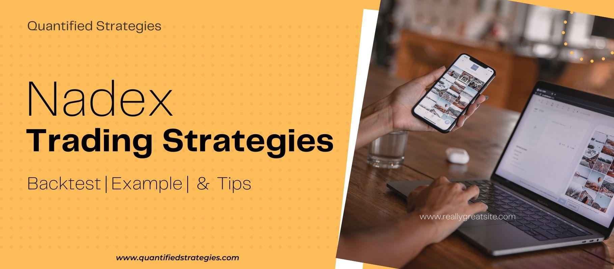

Algorithmic trading has significantly reshaped the landscape of financial markets, offering traders the capability to execute transactions with unprecedented precision and efficiency. As technology advances, the utilization of automated strategies has become integral for both novice and seasoned traders seeking to enhance their market interaction. Nadex, the North American Derivatives Exchange, provides a distinctive platform that specializes in trading binary options and other short-term derivatives, distinguishing itself from traditional exchanges.

In the following exploration, we aim to present an easily understandable Nadex strategy tailored for algorithmic trading. This strategy will elucidate key elements and methods to optimize trading endeavors on this unique platform. Understanding Nadex's intricate mechanisms can empower traders to make informed decisions, thereby enriching their trading experience whether they are just beginning or possess substantial market expertise.



Throughout the exploration of Nadex, various trading instruments will be discussed, including insights into strategic backtesting and effective risk management techniques. Participants in these markets will discover opportunities to apply systematic approaches, refining their skills to navigate and potentially profit within Nadex's distinct framework confidently.

## Table of Contents

## Understanding Nadex and Its Offerings

Nadex, short for the North American Derivatives Exchange, operates as a regulated platform offering a diverse range of opportunities for trading binary options and spreads. It is accessible to both U.S. and certain international traders, allowing participants to engage in trading across multiple asset classes, including forex, stock indices, commodities, and macroeconomic events. 

A thorough understanding of the types of contracts available on the Nadex platform is essential for effective trading. The primary contract types offered include binary options, knock-outs, and call spreads, each possessing unique attributes and trading mechanisms.

Binary options are popular on Nadex due to their straightforward nature. These options allow traders to speculate on the direction of market movements through a simple yes or no question, which ultimately determines the contract's payoff upon expiration. The potential outcomes are binary – either the trader is correct, leading to a predetermined payout, or incorrect, resulting in a loss of the initial stake.

Knock-outs are another type of contract offered by Nadex, featuring built-in expiration levels that act as stop-loss and profit targets. This characteristic makes knock-outs appealing to traders seeking to capitalize on market [volatility](/wiki/volatility-trading-strategies) while managing risk more effectively. The market's movement towards these levels will automatically trigger either an [exit](/wiki/exit-strategy) with a profit or loss, depending on the direction of the market.

Call spreads, meanwhile, operate within a fixed-range market environment, allowing traders to set predefined maximum profit and loss levels. These limits provide a structured approach to trading, enabling participants to mitigate risk exposure while speculating on market fluctuations within the established range.

With an understanding of these instruments, traders can tailor their strategies to fit individual risk appetites and trading styles. By integrating knowledge of market conditions and contract characteristics, traders can select strategies that align with personal objectives and preferences, optimizing their trading efforts on the Nadex platform.

## Developing an Easy Nadex Strategy

An easy Nadex strategy is designed to streamline the decision-making process, enabling traders to leverage the platform's distinctive features efficiently. The first step in developing such a strategy is choosing an underlying asset you are familiar with. Whether you select a [forex](/wiki/forex-system) pair, commodity, or another instrument, familiarity enhances confidence in making predictions and understanding market nuances.

Technical indicators are essential tools for identifying potential trade entries and exits. For simplicity and effectiveness, consider using moving averages. A moving average helps smooth price action and identify trends, which can be invaluable in determining market timing. For instance, a simple moving average (SMA) can be calculated with the formula:

$$
\text{SMA} = \frac{\sum_{i=1}^{n} P_i}{n}
$$

where $P_i$ represents the price at each interval and $n$ is the number of periods. Traders might look for situations where a short-term moving average crosses a long-term moving average as a potential trade signal.

Binary options on Nadex come with a predefined risk and reward structure, making it important to set clear entry and exit points to reduce complexity. Since every binary option carries a maximum risk and reward, these should be assessed prior to entering a trade. Clear-cut entry and exit criteria simplify trading decisions and align them with your risk appetite.

Risk management is critical when engaging in binary options trading. Techniques such as setting stop-loss limits can effectively minimize potential losses when trades do not unfold as anticipated. Stop-loss orders provide a mechanism to exit trades automatically once a certain loss threshold is reached, preserving capital and preventing emotional decision-making.

By adhering to these principles—selecting familiar assets, using straightforward indicators, capitalizing on binary options' risk-reward structure, and implementing robust risk management—you can develop a Nadex strategy that is easy to follow and potentially effective in navigating the market.

## Backtesting and Optimizing the Strategy

Backtesting is a critical component in the validation of any trading strategy, and Nadex trading strategies are no exception. It involves using historical data to simulate past trades, which helps traders evaluate whether a strategy could have been profitable and develop confidence in its future potential.

The first step in [backtesting](/wiki/backtesting) a Nadex strategy is to gather historical data specific to Nadex instruments. For binary options, this data should include price movements over time, expiration times, and any relevant pricing structures. Platforms like TradingView or specialized backtesting software may provide access to such data. The goal is to emulate the trading environment as accurately as possible, ensuring that your backtest reflects realistic market conditions.

Once you have the data, it is essential to utilize backtesting software or platforms designed to accommodate Nadex’s trading specifics. This includes accounting for the fixed expiration times and distinct payout structure inherent to Nadex binary options. Software like MetaTrader, Amibroker, or even Python with backtesting libraries like Backtrader can be used for this purpose. For example, a Python script might look like this:

```python
import backtrader as bt

class NadexStrategy(bt.Strategy):
    def __init__(self):
        self.ma = bt.indicators.SimpleMovingAverage(self.data, period=14)

    def next(self):
        if self.data.close[0] > self.ma[0]:
            self.buy()
        elif self.data.close[0] < self.ma[0]:
            self.sell()

cerebro = bt.Cerebro()
data = bt.feeds.YahooFinanceData(dataname='^SPX', fromdate=datetime(2022, 1, 1), todate=datetime(2022, 12, 31))
cerebro.adddata(data)
cerebro.addstrategy(NadexStrategy)
cerebro.run()
cerebro.plot()
```

The above script demonstrates a basic strategy where trades are executed based on a simple moving average indicator. After developing and running the backtest, analyze the results. Key metrics to consider include the overall return, maximum drawdown, win-loss ratio, and Sharpe ratio. These metrics will provide insight into the strategy's past performance.

Optimizing a strategy involves adjusting its parameters to enhance performance further. Based on backtesting results, you may need to fine-tune aspects such as entry/exit points, stop-loss levels, or conditions for trade initiation. Keep parameters flexible to adapt to current market conditions without overfitting to historical data. This balance aims to maintain robustness across diverse market scenarios.

Despite thorough backtesting and optimization, it is crucial to recognize that no strategy can guarantee success. Market conditions constantly evolve, and what worked previously might not be efficacious in the future. Thus, continual analysis, monitoring, and adjustment are necessary to account for changing market dynamics. Embracing a mindset of adaptability and ongoing learning can enhance the practical application of backtested strategies in live trading.

## Conclusion and Considerations

Trading on Nadex encompasses both exciting opportunities and challenges due to its distinct structure and diverse range of financial instruments. The platform's offerings, such as binary options, knock-outs, and call spreads, allow traders to engage with the market using defined risk parameters which can be crucial for making confident trading decisions.

A strategic approach using [algorithmic trading](/wiki/algorithmic-trading) on Nadex can significantly enhance one's ability to execute trades swiftly and with precision. An easy-to-implement strategy allows traders to streamline their decision-making processes and capitalize on the specific characteristics of Nadex's offerings. By integrating algorithmic methods, traders can automate the monitoring and execution of trades, allowing them to respond nimbly to market movements and reduce the chances of human error.

However, trading in binary options and similar derivatives inherently involves risk. The nature of these instruments, with their potential for significant returns as well as substantial losses, requires traders to exercise caution. Developing a thoughtful risk management plan is essential. This could include setting strict entry and exit points, employing stop-loss orders, and determining acceptable risk-reward ratios. These measures can help mitigate potential downsides and protect capital.

While systematic strategies can be refined and optimized through backtesting, it is crucial to recognize that real market conditions may introduce unforeseen variables. Backtesting provides a historical perspective on a strategy's potential performance, but the market's dynamic nature means that continual learning and adaptation are necessary. Regularly reviewing and adjusting trading strategies in response to market changes, economic events, and technological advancements provides a pathway for maintaining strategy viability.

Ultimately, a deep understanding of Nadex and a disciplined trading methodology can position traders for success. Emphasizing education, analysis, and adaptability can help traders navigate Nadex's financial landscape effectively, leveraging its unique contracts and structures to achieve their trading objectives. With a combination of careful planning and strategic execution, traders can explore the potentials that Nadex offers to registered market participants.

## References & Further Reading

[1]: Bergstra, J., Bardenet, R., Bengio, Y., & Kégl, B. (2011). ["Algorithms for Hyper-Parameter Optimization."](https://papers.nips.cc/paper/4443-algorithms-for-hyper-parameter-optimization) Advances in Neural Information Processing Systems 24.

[2]: ["Advances in Financial Machine Learning"](https://www.amazon.com/Advances-Financial-Machine-Learning-Marcos/dp/1119482089) by Marcos Lopez de Prado

[3]: ["Evidence-Based Technical Analysis: Applying the Scientific Method and Statistical Inference to Trading Signals"](https://www.amazon.com/Evidence-Based-Technical-Analysis-Scientific-Statistical/dp/0470008741) by David Aronson

[4]: ["Machine Learning for Algorithmic Trading"](https://github.com/stefan-jansen/machine-learning-for-trading) by Stefan Jansen

[5]: ["Quantitative Trading: How to Build Your Own Algorithmic Trading Business"](https://books.google.com/books/about/Quantitative_Trading.html?id=j70yEAAAQBAJ) by Ernest P. Chan