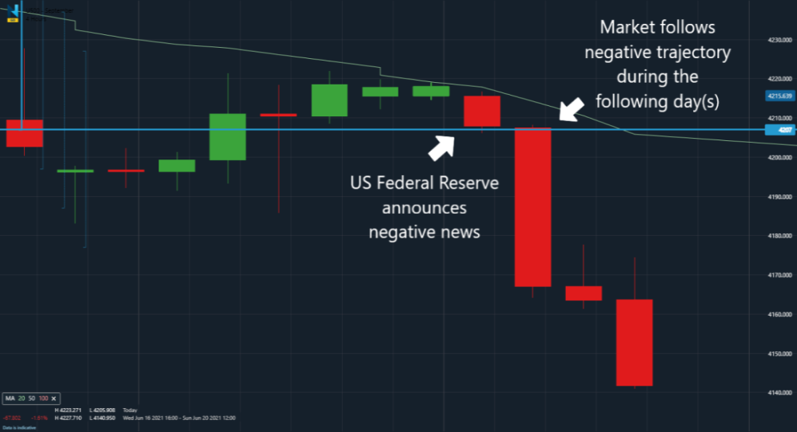

## Table of Contents

## What is Nadex and how does it differ from other trading platforms?

Nadex, which stands for North American Derivatives Exchange, is a regulated online trading platform that allows users to trade binary options and spreads on various financial markets like forex, commodities, and indices. It is unique because it is regulated by the Commodity Futures Trading Commission (CFTC) in the United States, which means it follows strict rules to protect traders. Unlike many other trading platforms, Nadex does not charge any fees or commissions for trading; instead, it makes money from the bid-ask spread.

What sets Nadex apart from other trading platforms is its focus on binary options and spreads, which are types of contracts with fixed risk and reward. This means traders know exactly how much they can win or lose before they enter a trade. Many other platforms offer a wider variety of trading instruments like stocks, cryptocurrencies, and more complex options, but they might also have higher risks and fees. Nadex's user-friendly interface and educational resources also make it a good choice for beginners who want to learn about trading in a safe environment.

## What are the basic types of contracts available on Nadex?

Nadex offers two main types of contracts: binary options and spreads. Binary options are simple contracts where you predict if a market will go up or down within a set time. If you're right, you make a fixed amount of money. If you're wrong, you lose what you paid for the contract. It's like betting on whether it will rain or not, and you know exactly how much you can win or lose.

Spreads on Nadex are a bit different. They let you buy and sell contracts based on the difference between two prices in a market. For example, you might trade a spread on the difference between the price of gold at two different times. With spreads, your potential profit or loss can change depending on how the market moves, but you still know the maximum you can lose when you start. Both types of contracts are designed to be clear and straightforward, so you always know what you're getting into.

## How do beginners start trading on Nadex?

To start trading on Nadex, beginners first need to sign up for an account on the Nadex website. It's easy and free to open an account. Once you're signed up, you'll need to fund your account with money to start trading. Nadex accepts different ways to add money, like bank transfers or credit cards. After your account is funded, you can explore the platform and get familiar with how it works.

Next, beginners should spend some time learning about binary options and spreads, the two types of contracts Nadex offers. Nadex has lots of educational resources like videos and guides to help you understand these contracts. Once you feel ready, you can start trading by choosing a contract that interests you, deciding if you think the market will go up or down, and then buying or selling the contract. Remember, it's smart to start with small amounts of money until you get the hang of it. Nadex's platform is designed to be user-friendly, so even if you're new to trading, you can start learning and trading with confidence.

## What are the key risk management strategies for Nadex trading?

When trading on Nadex, one of the most important risk management strategies is to set clear limits on how much money you're willing to lose. Because Nadex contracts have fixed risk and reward, you know the maximum you can lose before you start trading. Always decide how much you can afford to lose and stick to that amount. It's also a good idea to only use a small part of your total money for each trade, maybe around 1-2%. This way, even if you lose, you won't lose everything at once.

Another key strategy is to use stop-loss orders. These are tools that automatically close your trade if the market moves against you too much. This can help you limit your losses. Also, don't put all your money into just one type of trade or market. Instead, spread your money across different contracts and markets. This is called diversification, and it can help reduce your risk because if one trade goes bad, others might still do well. By using these strategies, you can manage your risks better and trade more safely on Nadex.

## How can technical analysis be applied to Nadex trading?

Technical analysis can help Nadex traders make better decisions by looking at past market data, like prices and trading volumes. On Nadex, you can use charts and tools to spot patterns and trends. For example, if you see a price going up and down in a certain way, it might mean the market will keep moving in that direction. You can use things like moving averages, which are lines on a chart that show the average price over time, to see if a market is trending up or down. This can help you decide if you should buy or sell a binary option or spread.

Another way to use technical analysis on Nadex is by looking at support and resistance levels. These are price points where the market often stops moving and turns around. If a price keeps bouncing off a certain level, that level is called support if it's below the current price, and resistance if it's above. Knowing these levels can help you predict where the market might go next. For example, if a price is getting close to a resistance level, you might think it will go down soon, so you could buy a binary option that pays out if the price goes down. By using these technical analysis tools, you can make more informed trades on Nadex.

## What are the most common Nadex trading strategies for beginners?

One of the most common Nadex trading strategies for beginners is the "Straddle" strategy. This involves buying both a call and a put binary option at the same time, with the same expiration time and price level. The idea is to profit no matter which way the market moves, as long as it moves enough. For example, if you think a big news event will make the market move a lot, you can use this strategy. If the market moves up a lot, the call option will pay out. If it moves down a lot, the put option will pay out. This strategy can help beginners because it lets them profit from big moves in the market without having to predict the direction.

Another simple strategy for beginners is the "Trend Following" strategy. This involves looking at charts to see if a market is going up or down over time. If you see a market going up, you can buy a call binary option, betting that it will keep going up. If you see it going down, you can buy a put binary option, betting it will keep going down. This strategy works well for beginners because it's easy to understand and use. You just need to watch the market's direction and make trades based on that. Remember to always use good risk management, like only trading small amounts and setting limits on how much you can lose.

## How does the Nadex platform support advanced trading strategies?

The Nadex platform supports advanced trading strategies by offering a variety of tools and features that experienced traders can use to their advantage. One key feature is the ability to customize trading charts with different indicators and technical analysis tools. This allows advanced traders to analyze market trends, identify patterns, and make informed decisions based on detailed data. For example, traders can use moving averages, Bollinger Bands, and other technical indicators to spot potential entry and exit points for their trades. Additionally, Nadex provides real-time market data and the ability to set up multiple trading screens, which helps traders monitor different markets and execute complex strategies simultaneously.

Another way Nadex supports advanced trading is through its flexible trading options and the ability to trade spreads. Advanced traders can use spreads to hedge their positions or to take advantage of smaller market movements. For instance, a trader might buy a spread contract that profits if the market moves within a certain range, which can be a sophisticated way to manage risk and potentially increase profits. Nadex also allows for quick trade execution and the ability to close positions at any time before expiration, which is crucial for traders who need to adjust their strategies on the fly. Overall, the platform's robust features and user-friendly interface make it an effective tool for implementing advanced trading strategies.

## What are the differences between binary options and spreads on Nadex?

Binary options and spreads on Nadex are two different kinds of contracts that traders can use. Binary options are simple: you bet on whether a market will go up or down within a certain time. If you guess right, you win a fixed amount of money. If you're wrong, you lose what you paid for the option. It's like betting on a coin flip where you know exactly how much you can win or lose. Binary options are great for beginners because they're easy to understand and you know your risk and reward upfront.

Spreads are a bit more complex. With spreads, you're betting on the difference between two prices in a market. For example, you might bet on how much the price of gold changes from one time to another. Unlike binary options, the amount you can win or lose with spreads can change depending on how the market moves. But you still know the most you can lose when you start. Spreads can be good for experienced traders who want to use more advanced strategies and manage their risks in different ways.

## How can traders use economic indicators to enhance their Nadex trading strategies?

Traders can use economic indicators to make smarter decisions on Nadex by watching how these indicators affect markets. Economic indicators are numbers that tell us about the health of an economy, like how many people have jobs or how much stuff people are buying. When these numbers come out, they can make markets move a lot. For example, if a report shows more people are working than expected, the market might go up because people think the economy is doing well. Traders can use this information to decide if they should buy a call or put binary option, or to set up a spread trade that profits from the market's reaction to the news.

Using economic indicators also helps traders plan their strategies ahead of time. They can look at a calendar to see when important reports are coming out and get ready for big market moves. For example, if they know a big jobs report is coming out, they might use a straddle strategy, buying both a call and a put option. This way, they can make money no matter which way the market moves after the report comes out. By keeping an eye on these indicators, traders can be more prepared and make trades based on what's happening in the real world.

## What are some advanced Nadex trading strategies used by experienced traders?

Experienced traders on Nadex often use a strategy called "Hedging" to manage their risks. Hedging means making trades that can protect them from losing too much money if the market moves against them. For example, a trader might buy a binary option betting that the market will go up, but also buy a spread that will make money if the market goes down. This way, no matter which way the market moves, they can limit their losses. Hedging can be tricky because it involves more trades and can be more expensive, but it's a smart way for experienced traders to keep their money safe while still trying to make profits.

Another advanced strategy is "Scalping," where traders make lots of small trades to take advantage of tiny market movements. They might use spreads to do this, quickly buying and selling contracts to make small profits that add up over time. Scalping requires a lot of attention and fast decision-making because the market can change quickly. Experienced traders who use this strategy often watch the market closely and use technical analysis tools to spot the best times to trade. Both hedging and scalping show how experienced traders can use Nadex's features to create complex strategies that help them manage risks and find more ways to make money.

## How can traders optimize their Nadex trading strategies using backtesting?

Backtesting is a way for traders to test their Nadex trading strategies using old market data. This means they can see how their strategy would have worked in the past. To do this, traders need to use special software or tools that let them enter their strategy rules and then run them against past market data. This helps them find out if their strategy is good or if it needs to be changed. For example, a trader might backtest a strategy that uses moving averages to decide when to buy or sell binary options. By looking at how well the strategy worked in the past, they can make it better before using real money.

After backtesting, traders can make their strategies better by looking at the results. They can see which parts of their strategy worked well and which parts didn't. Maybe their strategy made money most of the time but lost a lot during big market moves. They can then change their strategy to handle those big moves better, maybe by adding a rule to use hedging or by adjusting how they use their stop-loss orders. By using backtesting, traders can feel more confident that their strategy will work well when they start trading with real money on Nadex.

## What are the best practices for managing a Nadex trading account effectively?

Managing a Nadex trading account effectively starts with setting clear goals and sticking to a trading plan. Before you start trading, decide what you want to achieve and how much money you can afford to lose. This helps you stay focused and avoid making rash decisions. It's also important to only trade with money you can afford to lose, so you don't end up in financial trouble. Keep track of your trades by writing them down in a journal. This way, you can look back and see what worked and what didn't, which helps you improve your strategy over time.

Another key part of managing your Nadex account is using good risk management strategies. Always set limits on how much you can lose on each trade. Nadex's binary options and spreads have fixed risks, so you know the most you can lose before you start. Use this to your advantage by only risking a small amount of your money on each trade, maybe around 1-2%. Also, consider using stop-loss orders to automatically close trades that are going against you. This can help you limit your losses. Lastly, keep learning and stay updated on market news and economic indicators, as they can affect your trades. By following these practices, you can manage your Nadex account more effectively and increase your chances of success.

## How can one develop an easy Nadex strategy?

An easy Nadex strategy is designed to streamline the decision-making process, enabling traders to leverage the platform's distinctive features efficiently. The first step in developing such a strategy is choosing an underlying asset you are familiar with. Whether you select a [forex](/wiki/forex-system) pair, commodity, or another instrument, familiarity enhances confidence in making predictions and understanding market nuances.

Technical indicators are essential tools for identifying potential trade entries and exits. For simplicity and effectiveness, consider using moving averages. A moving average helps smooth price action and identify trends, which can be invaluable in determining market timing. For instance, a simple moving average (SMA) can be calculated with the formula:

$$
\text{SMA} = \frac{\sum_{i=1}^{n} P_i}{n}
$$

where $P_i$ represents the price at each interval and $n$ is the number of periods. Traders might look for situations where a short-term moving average crosses a long-term moving average as a potential trade signal.

Binary options on Nadex come with a predefined risk and reward structure, making it important to set clear entry and exit points to reduce complexity. Since every binary option carries a maximum risk and reward, these should be assessed prior to entering a trade. Clear-cut entry and exit criteria simplify trading decisions and align them with your risk appetite.

Risk management is critical when engaging in binary options trading. Techniques such as setting stop-loss limits can effectively minimize potential losses when trades do not unfold as anticipated. Stop-loss orders provide a mechanism to exit trades automatically once a certain loss threshold is reached, preserving capital and preventing emotional decision-making.

By adhering to these principles—selecting familiar assets, using straightforward indicators, capitalizing on binary options' risk-reward structure, and implementing robust risk management—you can develop a Nadex strategy that is easy to follow and potentially effective in navigating the market.

## References & Further Reading

[1]: Bergstra, J., Bardenet, R., Bengio, Y., & Kégl, B. (2011). ["Algorithms for Hyper-Parameter Optimization."](https://papers.nips.cc/paper/4443-algorithms-for-hyper-parameter-optimization) Advances in Neural Information Processing Systems 24.

[2]: ["Advances in Financial Machine Learning"](https://www.amazon.com/Advances-Financial-Machine-Learning-Marcos/dp/1119482089) by Marcos Lopez de Prado

[3]: ["Evidence-Based Technical Analysis: Applying the Scientific Method and Statistical Inference to Trading Signals"](https://www.amazon.com/Evidence-Based-Technical-Analysis-Scientific-Statistical/dp/0470008741) by David Aronson

[4]: ["Machine Learning for Algorithmic Trading"](https://github.com/stefan-jansen/machine-learning-for-trading) by Stefan Jansen

[5]: ["Quantitative Trading: How to Build Your Own Algorithmic Trading Business"](https://books.google.com/books/about/Quantitative_Trading.html?id=j70yEAAAQBAJ) by Ernest P. Chan