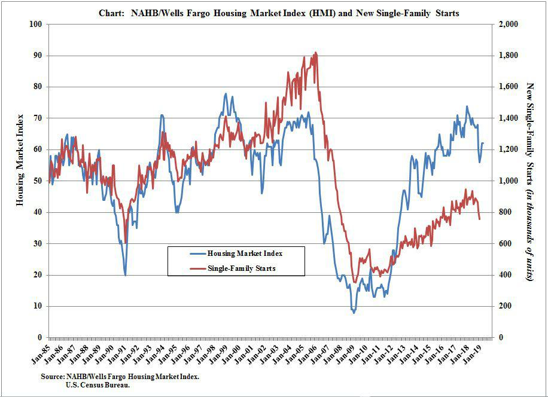

The housing market serves as a vital pillar of the economy, significantly impacting consumer spending, investment patterns, and overall economic stability. Due to its vast influence, various tools and indicators are utilized to monitor and assess its health. Among these indicators, the Housing Market Index (HMI) stands out as a prominent measure, a product of the collaboration between Wells Fargo and the National Association of Home Builders (NAHB). This index provides valuable insights into the sentiment among U.S. homebuilders, offering a lens through which to evaluate current and future conditions in the housing sector.

The HMI is not just an abstract measure; it plays a practical role in the world of trading and investment. With the increased integration of technology in financial markets, algorithmic trading has emerged as a critical component in optimizing investment strategies. The intersection of the HMI with algorithmic trading presents intriguing possibilities for investors, opening avenues for anticipating market movements and refining real estate investment strategies.



As the focus of this article, the Housing Market Index's significance extends beyond a mere reflection of builder sentiment. It serves as a forecast tool that, when coupled with sophisticated trading strategies, can potentially enhance investment outcomes. Understanding how this index operates and how it can be strategically harnessed offers investors not only insights into the housing market but also the ability to align their trading practices in accordance with economic trends. This exploration will shed light on the HMI and its role in shaping algorithmic trading strategies, providing a comprehensive overview of its impact on the economy and investor decision-making processes.

## Table of Contents

## Understanding the Wells Fargo NAHB Housing Market Index

The NAHB/Wells Fargo Housing Market Index (HMI) is a critical measure that reflects the sentiment among U.S. homebuilders, serving as an essential tool for assessing the overall health of the housing market. The index is derived from monthly surveys conducted with members of the National Association of Home Builders (NAHB). These members are asked to evaluate three key components: current sales conditions, sales expectations for the upcoming six months, and prospective buyer traffic.

An HMI reading above 50 is generally considered indicative of a favorable outlook among homebuilders, suggesting a healthy housing market. Conversely, a reading below 50 points to a less favorable or challenging environment. This threshold serves as a benchmark for stakeholders to gauge the relative positivity or negativity in builder sentiment.

The HMI offers significant predictive value as a leading indicator of housing market trends. It aligns closely with tangible market metrics such as housing starts and building permits. These correlations suggest that movements in the HMI can signal forthcoming changes in the broader market conditions, providing valuable foresight into potential shifts in the real estate economy. As such, the HMI is not only a snapshot of current sentiment but also a strategic tool for anticipating future developments in the housing market.

## The Role of Algorithmic Trading in the Housing Market

Algorithmic trading utilizes high-speed, data-driven strategies to execute trades in financial markets with precision and efficiency. In the context of the housing market, algo traders leverage data from various indicators, including the Wells Fargo NAHB Housing Market Index (HMI), to predict trends and adjust real estate investment positions. The HMI is a valuable source of information about builder sentiment and the health of the U.S. housing market.

The utilization of HMI data in [algorithmic trading](/wiki/algorithmic-trading) involves integrating this information into trading algorithms to enhance decision-making processes. By doing so, traders can automate responses to changes in the HMI swiftly, enabling them to capitalize on market opportunities driven by fluctuations in builder sentiment. For example, a positive shift in HMI readings might suggest an uptick in housing demand, prompting traders to invest in housing stocks or real estate investment trusts (REITs) with favorable prospects.

Incorporating HMI data into algorithmic models provides a competitive advantage for traders focusing on real estate securities by aligning their strategies with market dynamics. Automated systems can analyze patterns and make real-time adjustments to investment portfolios, reducing the time lag associated with human decision-making and minimizing exposure to market risks.

A sample approach to integrating HMI data into an algorithmic trading model might involve the development of a Python script that reads HMI data and makes trading decisions based on predefined rules. For instance, the script could analyze historical HMI trends and calculate moving averages to signal buy or sell actions. Here's a simplified Python example:

```python
import pandas as pd

# Load HMI data into a DataFrame
hmi_data = pd.read_csv('hmi_data.csv')

# Calculate the moving average
hmi_data['Moving_Avg'] = hmi_data['HMI'].rolling(window=3).mean()

# Define trading signals
def generate_signal(row):
    if row['HMI'] > row['Moving_Avg']:
        return 'Buy'
    elif row['HMI'] < row['Moving_Avg']:
        return 'Sell'
    else:
        return 'Hold'

hmi_data['Signal'] = hmi_data.apply(generate_signal, axis=1)

# View trading signals
print(hmi_data[['HMI', 'Moving_Avg', 'Signal']])
```

This code provides a basic framework for analyzing HMI data, generating trading signals based on moving averages, and facilitating the decision-making process. Algorithmic traders can refine this model by incorporating other indicators and adjusting parameters to optimize performance.

In conclusion, the integration of Well Fargo NAHB Housing Market Index data into algorithmic trading strategies allows traders to respond rapidly and effectively to market changes. By automating decision-making and capitalizing on high-frequency data, algorithmic trading in the housing market enhances accuracy and potentially increases returns on real estate investments.

## Interpreting HMI Data for Trading Strategies

Traders can utilize Housing Market Index (HMI) reports to anticipate fluctuations in housing stocks, Real Estate Investment Trusts (REITs), and related financial instruments. The HMI provides valuable insight into homebuilder sentiment, offering a predictive metric for the housing market's direction. Recognizing patterns in the HMI enables traders to align their strategies with market expectations and optimize their position in housing-related investments.

A rising HMI generally implies increasing builder confidence, potentially leading to a surge in housing demand. This upward trend may present lucrative investment opportunities in sectors connected to housing development, such as construction and home improvement retail. Conversely, a declining index could signify a downturn, prompting traders to exercise caution, reassess risk exposure, and adjust their portfolios to mitigate potential losses.

Sophisticated traders often dissect the HMI into its three core components: current sales, future sales expectations, and prospective buyer traffic. Each component contributes uniquely to a comprehensive trading model:

1. **Current Sales**: Reflects the present sales performance in the housing market. An upward trend in this component might suggest robust market activity, encouraging investment in housing-related financial products.

2. **Future Sales Expectations**: Provides a forecast of market conditions over the next six months. Positive expectations can drive investment strategies towards growth-focused assets, while negative expectations may necessitate defensive positioning to protect against anticipated declines.

3. **Prospective Buyer Traffic**: Indicates the level of interest and footfall of potential buyers. High traffic typically signals strong buyer interest and potential sales increases, guiding traders towards expanding positions in the housing sector.

To enhance the efficacy of trading strategies, historical data and trend analysis of the HMI can be instrumental. Statistical techniques such as regression analysis can identify correlations between HMI trends and market performance, serving as a basis for hypothesis testing and strategic decision-making. Back-testing these strategies against historical HMI data allows traders to refine algorithmic models, improving predictive accuracy and tactical deployment.

Incorporating Python programming can further facilitate the analysis and integration of HMI data into trading algorithms. Python's libraries, such as pandas for data manipulation and NumPy for numerical operations, are valuable tools in constructing and back-testing trading models:

```python
import pandas as pd
import numpy as np

# Example: Loading historical HMI data
hmi_data = pd.read_csv('hmi_data.csv')

# Example: Calculating moving average to identify trends
hmi_data['HMI_MA'] = hmi_data['HMI'].rolling(window=3).mean()

# Example: Simple strategy back-testing using numpy
historical_returns = np.array(hmi_data['returns'])
strategy_returns = historical_returns * np.sign(hmi_data['HMI_MA'])

# Performance metrics
total_return = np.sum(strategy_returns)
```

This approach enables traders to deploy data-driven strategies, leveraging HMI insights to maximize returns while managing risk effectively. As such, the HMI remains an indispensable tool in modern trading arsenals, guiding informed decisions in adaptive and complex market environments.

## Key Factors Impacting the HMI and Trading Outcomes

Interest rates, employment levels, and material costs are critical determinants of builder sentiment, which in turn significantly influences the Wells Fargo NAHB Housing Market Index (HMI). These factors collectively shape the economic environment that builders face, thereby impacting their confidence and decisions.

Interest rates, governed by central bank policies, directly affect the housing market's affordability. Lower interest rates typically provide an impetus for homebuyers by reducing mortgage costs, thus bolstering builder optimism and possibly elevating the HMI. Conversely, rising interest rates can deter potential buyers due to increased borrowing costs, leading to a decline in the HMI. For traders, sudden shifts in interest rates can trigger rapid changes in the HMI, thus necessitating swift adjustments in trading strategies.

Employment levels also play a vital role in building sentiment. High employment rates translate to greater job stability and increased consumer confidence, incentivizing residential construction and subsequently enhancing the HMI. A robust job market suggests heightened demand for housing, which traders can interpret as a signal for potential appreciation in housing stocks and related investments. On the other hand, rising unemployment can result in decreased demand for housing, prompting a potential decline in the HMI and necessitating cautious trading approaches.

Material costs, including those for lumber, steel, and concrete, significantly affect the economic conditions of homebuilding. Fluctuations in these costs directly impact builders’ profit margins, thereby affecting their sentiment. High material costs may lead to a decrease in construction activity, negatively influencing the HMI. Algorithmic trading models must incorporate these cost variables to predict housing market conditions accurately. Code snippets such as:

```python
def predict_hmi_change(interest_rate, employment_rate, material_cost):
    interest_impact = -0.5 * interest_rate
    employment_impact = 0.3 * employment_rate
    material_impact = -0.2 * material_cost
    return interest_impact + employment_impact + material_impact

# Example usage
hmi_change = predict_hmi_change(interest_rate=3.5, employment_rate=5.0, material_cost=200)
```
could be employed to simulate the projected changes in the HMI based on these variables.

For traders and investors utilizing HMI data, staying informed on broader economic trends and monetary policy decisions is essential. The Federal Reserve's moves, global economic conditions, and supply chain disruptions can all influence these key variables, thereby impacting the HMI. By aligning trading algorithms with real-time economic data and forecasts, traders can refine their strategies and potentially gain a competitive edge in the real estate market.

In sum, interest rates, employment levels, and material costs are pivotal in influencing the HMI and warrant close monitoring by traders seeking to leverage HMI data effectively. Adjusting trading strategies in response to these dynamic economic inputs can significantly enhance the precision and profitability of investments in housing-related markets.

## Conclusion

The Wells Fargo NAHB Housing Market Index (HMI) stands as a crucial metric for gauging the dynamics of the U.S. housing market. As a barometer reflecting homebuilders' sentiment, this index provides timely insights into future housing trends and potential economic shifts. When strategically integrated with algorithmic trading practices, the HMI presents a significant advantage, enabling market participants to react with precision and foresight. By leveraging HMI data, traders can fine-tune their strategies to align with current and anticipated housing market trends, thereby maximizing their investment returns. Successful traders utilize real-time HMI readings to predict potential fluctuations in housing stocks, real estate investment trusts (REITs), and other related financial instruments.

Moreover, continuously monitoring the HMI and adapting to economic changes will allow traders to unlock the full potential of this data-driven approach. This requires staying vigilant of influential economic factors such as interest rates, employment levels, and material costs that sharply impact builder sentiment. Incorporating these elements into algorithmic models can refine predictions and enhance trading accuracy. Ultimately, the fusion of HMI insights with sophisticated trading strategies paves the way for informed investment decisions, essential for navigating the complexities of the real estate market.

## References & Further Reading

[1]: Bergstra, J., Bardenet, R., Bengio, Y., & Kégl, B. (2011). ["Algorithms for Hyper-Parameter Optimization."](https://papers.nips.cc/paper/4443-algorithms-for-hyper-parameter-optimization) Advances in Neural Information Processing Systems 24.

[2]: ["Advances in Financial Machine Learning"](https://www.amazon.com/Advances-Financial-Machine-Learning-Marcos/dp/1119482089) by Marcos Lopez de Prado

[3]: ["Evidence-Based Technical Analysis: Applying the Scientific Method and Statistical Inference to Trading Signals"](https://www.amazon.com/Evidence-Based-Technical-Analysis-Scientific-Statistical/dp/0470008741) by David Aronson

[4]: ["Machine Learning for Algorithmic Trading"](https://github.com/stefan-jansen/machine-learning-for-trading) by Stefan Jansen

[5]: ["Quantitative Trading: How to Build Your Own Algorithmic Trading Business"](https://github.com/LucindaYa/quant-resources/blob/master/Quantitative%20Trading%20How%20to%20Build%20Your%20Own%20Algorithmic%20Trading%20Business.pdf) by Ernest P. Chan

[6]: ["Algorithmic Trading: Winning Strategies and Their Rationale"](https://onlinelibrary.wiley.com/doi/pdf/10.1002/9781118676998.fmatter) by Ernest P. Chan

[7]: ["National Association of Home Builders (NAHB) - Housing Market Index (HMI)"](https://www.nahb.org/News%20and%20Economics/Housing%20Economics/Indices/Housing%20Market%20Index) on the official NAHB website.

[8]: "Wells Fargo and NAHB Partner on Housing Market Index" - [Wells Fargo's Economic Indicators](https://externalcontent.blob.core.windows.net/pdfs/WellsFargo20241218.pdf) page.