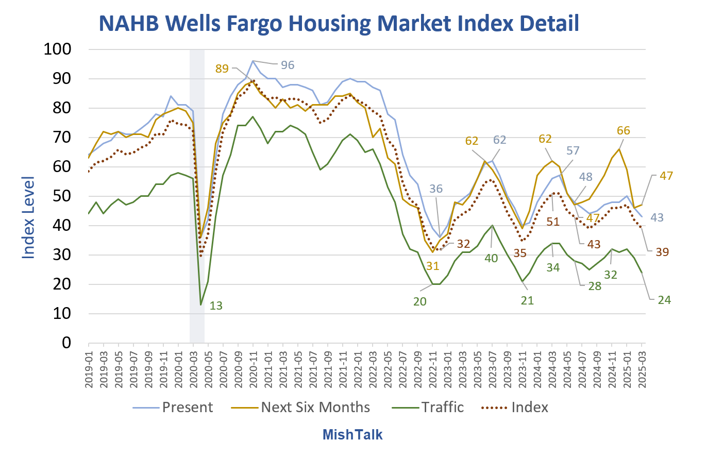

## Table of Contents

## What is the NAHB/Wells Fargo Housing Market Index?

The NAHB/Wells Fargo Housing Market Index (HMI) is a report that measures the confidence of builders in the U.S. housing market. It is put together by the National Association of Home Builders (NAHB) and Wells Fargo. The index asks builders how they feel about the current market for new homes and what they think will happen in the next six months. It also asks about the number of people who want to buy new homes.

The HMI is important because it gives us a good idea of how the housing market is doing. When the index number is high, it means builders are feeling good about selling new homes. When the number is low, it means builders are worried and think it might be hard to sell new homes. The index is released every month, so people can keep track of changes in the housing market over time.

## Who publishes the NAHB/Wells Fargo Housing Market Index?

The NAHB/Wells Fargo Housing Market Index is published by the National Association of Home Builders (NAHB) together with Wells Fargo. The NAHB is a group that helps people who build homes in the United States. They work with Wells Fargo, which is a big bank, to make this report.

The report comes out every month. It tells us how builders feel about selling new homes right now and in the future. This helps everyone understand if the housing market is doing well or if it might be struggling.

## How often is the NAHB/Wells Fargo Housing Market Index released?

The NAHB/Wells Fargo Housing Market Index comes out every month. This means that once a month, people can see a new report about how builders feel about the housing market.

The report is important because it helps everyone understand if builders think it's a good time to sell new homes or if they are worried. By looking at the index every month, people can see if the housing market is getting better or worse over time.

## What does the NAHB/Wells Fargo Housing Market Index measure?

The NAHB/Wells Fargo Housing Market Index measures how builders feel about selling new homes in the United States. It asks builders about their confidence in the current market for new homes and their expectations for the next six months. The index also looks at how many people want to buy new homes.

This index is important because it gives a good picture of the health of the housing market. When the index number is high, it means builders are feeling good and think it's easy to sell new homes. When the number is low, it shows that builders are worried and think it might be hard to sell new homes. People use this information to understand if the housing market is doing well or if it's facing challenges.

## How is the NAHB/Wells Fargo Housing Market Index calculated?

The NAHB/Wells Fargo Housing Market Index is calculated by asking builders to answer three questions. The first question asks builders how they feel about selling new homes right now. The second question asks them about their expectations for selling new homes in the next six months. The third question asks about the traffic of potential buyers looking at new homes.

Each question is answered on a scale from 0 to 100, where 0 means very bad and 100 means very good. The HMI score is then calculated by averaging the answers to the first two questions and adding the answer to the third question. This gives a single number that shows how builders feel about the housing market. The index is released every month, so people can see how builders' confidence changes over time.

## What are the components of the NAHB/Wells Fargo Housing Market Index?

The NAHB/Wells Fargo Housing Market Index has three main parts that help measure how builders feel about the housing market. The first part asks builders about how they feel about selling new homes right now. This tells us if builders think it's a good time to sell homes at the moment. The second part asks builders about their expectations for selling new homes in the next six months. This helps us understand if builders think the market will get better or worse in the future.

The third part of the index looks at the traffic of potential buyers who are looking at new homes. This shows how many people are interested in buying new homes. To calculate the overall HMI score, the answers to the first two questions are averaged, and then the answer to the third question is added to that average. This gives a single number that shows how confident builders are in the housing market.

## How can the NAHB/Wells Fargo Housing Market Index be used to predict housing market trends?

The NAHB/Wells Fargo Housing Market Index can be used to predict housing market trends by looking at how builders feel about selling new homes now and in the future. When the HMI score is high, it means builders are feeling good about the market. This can be a sign that more new homes will be built soon because builders think they can sell them easily. On the other hand, if the HMI score is low, it shows that builders are worried and might build fewer new homes because they think it will be hard to sell them.

By watching the HMI every month, people can see if builders' confidence is going up or down. If the index keeps going up, it could mean that the housing market is getting stronger and more people might want to buy homes. If the index keeps going down, it could be a warning that the housing market might be getting weaker, and fewer people might be interested in buying new homes. This information helps everyone from homebuyers to investors make better decisions about the housing market.

## What is considered a 'good' score on the NAHB/Wells Fargo Housing Market Index?

A 'good' score on the NAHB/Wells Fargo Housing Market Index is usually considered to be above 50. When the index is above 50, it means that more builders feel good about selling new homes than those who feel bad about it. This is a sign that the housing market is doing well, and builders think it's a good time to build and sell new homes.

If the HMI score is below 50, it means more builders are worried about selling new homes. This can be a sign that the housing market might be struggling, and builders might be less likely to start new projects. So, a score above 50 is seen as positive, while a score below 50 is seen as a warning that the market might be facing challenges.

## How does the NAHB/Wells Fargo Housing Market Index correlate with other economic indicators?

The NAHB/Wells Fargo Housing Market Index often moves together with other economic indicators like consumer confidence and employment rates. When the HMI is high, it usually means that builders feel good about selling new homes, which can be a sign that people feel good about their jobs and the economy. This is because when people feel secure in their jobs, they are more likely to buy a new home. So, a high HMI can be a good sign for other parts of the economy too.

On the other hand, the HMI can also show problems in the economy. If the HMI is low, it might mean that builders are worried about selling new homes, which can be a sign that people are worried about their jobs or the economy. This can lead to less spending on big things like homes, which can slow down the economy. So, the HMI is an important tool that can help us understand how the overall economy is doing.

## What are the historical trends of the NAHB/Wells Fargo Housing Market Index?

The NAHB/Wells Fargo Housing Market Index has shown many ups and downs over the years, reflecting changes in the U.S. housing market. During the early 2000s, the HMI was generally high, often above 50, as builders felt good about selling new homes. This was a time of strong economic growth and easy access to home loans. However, the index started to fall sharply around 2006 and hit a low point in 2009 during the housing market crash. This was a time when many people lost their homes and builders were very worried about selling new ones.

Since the housing market crash, the HMI has had its ups and downs but has generally been on an upward trend. After hitting a low in 2009, the index slowly started to recover. By 2012, it was back above 50, showing that builders were feeling better about the market. The HMI reached new highs in the late 2010s and early 2020s, often going above 70, which showed strong builder confidence. However, like any economic indicator, the HMI can be affected by big events like the COVID-19 pandemic, which caused some short-term drops in the index before it started to recover again.

## How do regional differences affect the NAHB/Wells Fargo Housing Market Index?

The NAHB/Wells Fargo Housing Market Index can be different in different parts of the country because the housing market isn't the same everywhere. For example, builders in the West might feel differently about selling new homes than builders in the South. This is because things like job growth, how much people earn, and how many people want to move to an area can be very different from one region to another. So, the HMI score might be high in one part of the country but low in another part at the same time.

The NAHB also releases regional versions of the HMI, which help us see these differences more clearly. They break down the index into four regions: Northeast, Midwest, South, and West. By looking at these regional scores, we can understand how the housing market is doing in different parts of the U.S. For example, if the South has a high HMI score but the Northeast has a low one, it tells us that builders in the South feel good about selling new homes, while builders in the Northeast might be worried. This helps everyone from homebuyers to policymakers make better decisions based on what's happening in their part of the country.

## What are the limitations and criticisms of the NAHB/Wells Fargo Housing Market Index?

The NAHB/Wells Fargo Housing Market Index has some limitations that people should know about. One big problem is that it only asks builders how they feel, so it doesn't tell us everything about the housing market. It doesn't include information about people who are buying homes or what's happening with home prices. Also, the index can change a lot from month to month, which can make it hard to see the bigger picture of what's happening in the housing market over time.

Another criticism is that the HMI might not be a good predictor of what will happen in the future. Just because builders feel good or bad about selling new homes now doesn't mean the market will stay the same in the future. Other things like interest rates, the economy, and big events can change the housing market quickly. So, while the HMI is helpful, it's important to look at other information too to get a full understanding of the housing market.

## References & Further Reading

[1]: Bergstra, J., Bardenet, R., Bengio, Y., & Kégl, B. (2011). ["Algorithms for Hyper-Parameter Optimization."](https://papers.nips.cc/paper/4443-algorithms-for-hyper-parameter-optimization) Advances in Neural Information Processing Systems 24.

[2]: ["Advances in Financial Machine Learning"](https://www.amazon.com/Advances-Financial-Machine-Learning-Marcos/dp/1119482089) by Marcos Lopez de Prado

[3]: ["Evidence-Based Technical Analysis: Applying the Scientific Method and Statistical Inference to Trading Signals"](https://www.amazon.com/Evidence-Based-Technical-Analysis-Scientific-Statistical/dp/0470008741) by David Aronson

[4]: ["Machine Learning for Algorithmic Trading"](https://github.com/stefan-jansen/machine-learning-for-trading) by Stefan Jansen

[5]: ["Quantitative Trading: How to Build Your Own Algorithmic Trading Business"](https://github.com/LucindaYa/quant-resources/blob/master/Quantitative%20Trading%20How%20to%20Build%20Your%20Own%20Algorithmic%20Trading%20Business.pdf) by Ernest P. Chan

[6]: ["Algorithmic Trading: Winning Strategies and Their Rationale"](https://onlinelibrary.wiley.com/doi/pdf/10.1002/9781118676998.fmatter) by Ernest P. Chan

[7]: ["National Association of Home Builders (NAHB) - Housing Market Index (HMI)"](https://www.nahb.org/News%20and%20Economics/Housing%20Economics/Indices/Housing%20Market%20Index) on the official NAHB website.

[8]: "Wells Fargo and NAHB Partner on Housing Market Index" - [Wells Fargo's Economic Indicators](https://externalcontent.blob.core.windows.net/pdfs/WellsFargo20241218.pdf) page.