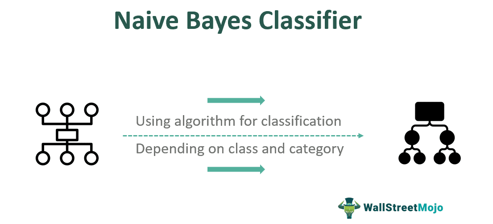

## Table of Contents

## What is the Naive Bayes algorithm?

The Naive Bayes algorithm is a type of machine learning that helps make predictions or decisions based on data. It's called "Naive" because it makes a simple assumption: that all the features or characteristics in the data are independent of each other. This means it believes that the presence of one feature does not affect the presence of another. For example, if you're trying to predict whether an email is spam, Naive Bayes would assume that words in the email are unrelated to each other.

This algorithm is based on Bayes' Theorem, which is a way to calculate the probability of something happening given certain conditions. In the case of Naive Bayes, it calculates the probability of a certain class (like 'spam' or 'not spam') given the observed data. It's widely used in tasks like text classification, such as filtering spam emails or categorizing news articles, because it's fast and works well even with small amounts of data. Despite its simplicity, Naive Bayes can be very effective and is a popular choice for many applications.

## How does the Naive Bayes algorithm work?

The Naive Bayes algorithm works by using a simple idea called Bayes' Theorem. This theorem helps us figure out how likely something is to happen based on what we already know. For example, if you want to know if an email is spam, Naive Bayes looks at the words in the email and calculates the chance that it's spam. It does this by checking how often those words appear in spam emails compared to non-spam emails. The key part of Naive Bayes is that it assumes all the words or features in the email are independent, meaning the presence of one word doesn't affect another.

To use Naive Bayes, you first need some data to train the algorithm. This data should include examples of what you want to predict, like spam and non-spam emails. The algorithm looks at this data to learn which words are more common in spam emails and which are more common in non-spam emails. Once it's trained, you can give it a new email, and it will calculate the probabilities of the email being spam or not spam based on the words it contains. It then picks the class (spam or not spam) with the higher probability. Despite its simple assumption of independence, Naive Bayes often works well and is quick to use, making it popular for tasks like filtering spam or classifying text.

## What are the main assumptions of the Naive Bayes algorithm?

The main assumption of the Naive Bayes algorithm is that all features or characteristics in the data are independent of each other. This means it believes that the presence of one feature does not affect the presence of another. For example, if you're using Naive Bayes to classify emails as spam or not spam, it will assume that the words in the email are unrelated to each other. This assumption is what makes the algorithm "naive," as in real life, features can often be related.

Another important assumption is that the algorithm needs enough data to make accurate predictions. The more examples it has seen, the better it can estimate the probabilities of different outcomes. If you don't have enough data, the predictions might not be very good. Despite these assumptions, Naive Bayes can still be very effective and is often used because it's fast and works well even with small amounts of data.

## What are the different types of Naive Bayes classifiers?

There are three main types of Naive Bayes classifiers: Gaussian, Multinomial, and Bernoulli. Gaussian Naive Bayes is used when the features are continuous, meaning they can be any number, like height or temperature. It assumes that the data follows a normal distribution, which looks like a bell curve. This type is often used for problems where the data is not just yes or no, but can have different values.

Multinomial Naive Bayes is good for data that counts things, like the number of times a word appears in a document. It's often used in text classification, like sorting emails into spam or not spam, because it works well with data that counts the frequency of different words. Bernoulli Naive Bayes is similar, but it's used when the data is binary, meaning it's either yes or no. For example, it might be used to see if certain words are present or absent in a document. Each type of Naive Bayes classifier is suited for different kinds of data and problems, but they all use the same basic idea of calculating probabilities to make predictions.

## Can you explain the formula used in Naive Bayes?

The Naive Bayes algorithm uses a formula called Bayes' Theorem to make predictions. This theorem helps us figure out how likely something is to happen based on what we already know. The basic formula is: P(A|B) = (P(B|A) * P(A)) / P(B). Here, P(A|B) means the probability of A happening given that B has happened. For example, if A is "the email is spam" and B is "the email contains the word 'free'," P(A|B) would be the probability that the email is spam given that it contains the word 'free.' P(B|A) is the probability of B happening given that A has happened, P(A) is the overall probability of A happening, and P(B) is the overall probability of B happening.

In the context of Naive Bayes, we want to find the probability of a class (like 'spam' or 'not spam') given the features (like words in an email). So, we apply Bayes' Theorem to calculate P(class|features). Because Naive Bayes assumes that all features are independent, we can break down P(features|class) into the product of the probabilities of each individual feature given the class. This makes the calculation simpler. We calculate this for each class, and then choose the class with the highest probability as our prediction. Despite its simplicity, this approach often works well for tasks like text classification.

## What are some common applications of the Naive Bayes algorithm?

One common use of the Naive Bayes algorithm is in email spam filtering. It looks at the words in an email and decides if it's likely to be spam or not. It does this by checking how often certain words show up in spam emails compared to normal emails. For example, if an email has words like "free" or "money" a lot, Naive Bayes might think it's more likely to be spam. This helps keep your inbox clean by sorting out unwanted emails.

Another application is in text classification, like sorting news articles into categories. If you have a bunch of news articles, Naive Bayes can help figure out which ones are about sports, politics, or technology. It looks at the words in each article and decides which category it fits best based on what it has learned from other articles. This can make it easier to find the news you're interested in.

Naive Bayes is also used in sentiment analysis, which is figuring out if people like or dislike something based on what they write. For example, if you're looking at reviews of a movie, Naive Bayes can tell if the reviews are mostly positive or negative by looking at the words used. Words like "great" or "terrible" can give clues about how people feel. This is helpful for businesses that want to know what customers think about their products or services.

## How do you handle categorical and continuous data with Naive Bayes?

When using Naive Bayes with categorical data, like words in a document or types of fruit, you count how often each category appears in your data. For example, if you're sorting emails into spam or not spam, you'd count how many times words like "free" or "money" show up in spam emails compared to normal emails. Then, when you get a new email, Naive Bayes looks at its words and uses those counts to figure out if it's more likely to be spam or not. This works well for things like text classification because it's easy to count words and see how they relate to different categories.

For continuous data, like someone's height or temperature, you use a different kind of Naive Bayes called Gaussian Naive Bayes. This type assumes that the data follows a normal distribution, which looks like a bell curve. So, instead of counting how often a value appears, you calculate the probability of a value fitting into that bell curve for each class. For example, if you're trying to predict if someone likes a movie based on their age, Gaussian Naive Bayes would look at the ages of people who liked the movie and those who didn't, and then see where a new person's age fits best. This helps make predictions even when the data isn't just yes or no, but can be any number.

## What are the advantages of using the Naive Bayes algorithm?

One big advantage of using the Naive Bayes algorithm is that it's really fast and easy to use. It doesn't need a lot of data to start making good guesses, which is great when you don't have a lot of information to work with. This makes it perfect for things like sorting emails into spam or not spam, or figuring out what category a news article belongs to. Because it's so quick, you can use it to make decisions on the fly without waiting a long time for results.

Another advantage is that it's good at handling data that has a lot of different parts, like words in a document. Even though it assumes that all these parts are independent, which isn't always true, it often still works well. This makes it a popular choice for tasks like figuring out if people like or dislike something based on what they write. Plus, it's easy to understand how it makes its decisions, so you can see why it thinks something is spam or why it put an article in a certain category.

## What are the limitations and challenges of the Naive Bayes algorithm?

One big challenge with the Naive Bayes algorithm is its main assumption that all features are independent. In real life, this isn't always true. For example, if you're looking at words in an email, the presence of one word can affect the likelihood of another word being there. This can make the predictions less accurate because the algorithm isn't considering these connections. Also, if you don't have enough data, Naive Bayes might not work well because it needs to see examples to learn how to make good guesses.

Another limitation is that Naive Bayes can be sensitive to how you set it up. If the data you're using to train it isn't a good representation of what you'll see later, the predictions can be off. For example, if you're trying to sort emails into spam or not spam, but the emails you use to train the algorithm are very different from the ones you get later, it might not work as well. Also, if some categories in your data are much more common than others, Naive Bayes might always guess the most common category, which isn't helpful if you want to find the less common ones.

## How can you improve the performance of a Naive Bayes classifier?

One way to make a Naive Bayes classifier work better is to use more data. The more examples it sees, the better it can learn how to tell things apart. For example, if you're using it to sort emails into spam or not spam, showing it a lot of different emails can help it understand which words are more likely to show up in spam. Another thing you can do is to make sure the data you use to train it is similar to what you'll see later. If the emails you use to train it are very different from the ones you get later, it might not work as well. So, try to use data that's a good match for what you'll be working with.

Another way to improve it is to handle the problem of imbalanced data. Sometimes, one category is a lot more common than others, and Naive Bayes might always guess that one. To fix this, you can make the less common categories more important when you're training it. This can help it pay more attention to them and make better guesses. Also, you can try to make the features more independent. Even though Naive Bayes assumes they are, you can help it by choosing features that don't depend on each other as much. This can make its guesses more accurate.

## Can you provide a step-by-step example of implementing Naive Bayes in Python?

Let's use Python to create a simple Naive Bayes classifier that sorts fruits into apples or oranges based on their color and size. First, we'll need to import the libraries we'll use. We'll use `pandas` to handle our data and `sklearn` for the Naive Bayes classifier. We'll create a small dataset with columns for color, size, and the type of fruit. Then, we'll convert the categorical data into numbers that the classifier can understand. We'll use `LabelEncoder` from `sklearn` to do this. After that, we'll split our data into features (color and size) and the target (type of fruit). We'll use `train_test_split` to divide our data into training and testing sets, so we can see how well our classifier works.

Next, we'll create and train our Naive Bayes classifier. We'll use `GaussianNB` because our features are continuous (even though we converted them from categorical data). We'll fit the classifier to our training data. After it's trained, we'll use it to predict the types of fruits in our test set. Finally, we'll check how well it did by comparing its predictions to the actual types of fruits in the test set. We'll use `accuracy_score` to see what percentage of the predictions were correct. This simple example shows how you can use Naive Bayes to classify data, and you can apply the same steps to more complex problems with different kinds of data.

Here's the Python code to do all this:

```python
import pandas as pd
from sklearn.model_selection import train_test_split
from sklearn.naive_bayes import GaussianNB
from sklearn.preprocessing import LabelEncoder
from sklearn.metrics import accuracy_score

# Create a small dataset
data = pd.DataFrame({
    'color': ['red', 'green', 'orange', 'red', 'orange', 'green', 'red', 'orange', 'green', 'red'],
    'size': ['small', 'medium', 'large', 'medium', 'large', 'small', 'medium', 'large', 'medium', 'small'],
    'fruit': ['apple', 'apple', 'orange', 'apple', 'orange', 'apple', 'apple', 'orange', 'apple', 'apple']
})

# Convert categorical data to numerical
le_color = LabelEncoder()
le_size = LabelEncoder()
data['color'] = le_color.fit_transform(data['color'])
data['size'] = le_size.fit_transform(data['size'])
data['fruit'] = LabelEncoder().fit_transform(data['fruit'])

# Split the data into features and target
X = data[['color', 'size']]
y = data['fruit']

# Split the data into training and testing sets
X_train, X_test, y_train, y_test = train_test_split(X, y, test_size=0.2, random_state=42)

# Create and train the Naive Bayes classifier
nb_classifier = GaussianNB()
nb_classifier.fit(X_train, y_train)

# Make predictions on the test set
y_pred = nb_classifier.predict(X_test)

# Calculate the accuracy of the classifier
accuracy = accuracy_score(y_test, y_pred)
print(f"Accuracy: {accuracy:.2f}")
```

## How does Naive Bayes compare to other classification algorithms like SVM and Decision Trees?

Naive Bayes is different from other classification algorithms like SVM (Support Vector Machine) and Decision Trees in a few ways. One big difference is how fast and easy it is to use. Naive Bayes can start making good guesses even if you don't have a lot of data, which is great when you're just starting out. It's also really quick to train and use, so it's perfect for things like sorting emails into spam or not spam. On the other hand, SVM and Decision Trees might need more data to work well, and they can take longer to train, especially if the data is complicated. SVM is good at finding the best way to separate different classes, but it can be slower and harder to understand. Decision Trees are easy to understand because they look like a flowchart, but they can get very big and complicated if the data is complex.

Another difference is how each algorithm handles the data. Naive Bayes assumes that all the features in the data are independent, which means it thinks the presence of one feature doesn't affect another. This can make it less accurate if the features are actually related, but it often still works well for things like text classification. SVM, on the other hand, looks for the best way to draw a line (or a more complex shape in higher dimensions) to separate the classes. It's good at finding this line, but it can be sensitive to how you set it up. Decision Trees work by asking a series of questions about the data, like a game of 20 questions, to figure out which class something belongs to. They can handle both categorical and continuous data well, but they might not work as well if the data is noisy or if there are a lot of features. Each algorithm has its strengths and weaknesses, so the best one to use depends on what kind of data you have and what you're trying to do.

## What is Understanding Naive Bayes?

Naive Bayes is a fundamental classification algorithm grounded in Bayes’ Theorem. It operates on the principle that each feature contributes independently to the probability of a particular outcome. This assumption, known as the "naive" assumption, simplifies the computation process significantly, allowing for the fast processing of data. Despite the potential oversimplification due to the assumption of feature independence, Naive Bayes performs remarkably well in various complex real-world applications.

Bayes’ Theorem is central to the Naive Bayes algorithm, providing a mathematical framework to update the probability of a hypothesis based on new evidence. The theorem can be expressed as follows:

$$
P(H|E) = \frac{P(E|H) \cdot P(H)}{P(E)}
$$

Where:
- $P(H|E)$ is the posterior probability of hypothesis $H$ given the evidence $E$.
- $P(E|H)$ is the likelihood of observing evidence $E$ given that $H$ is true.
- $P(H)$ is the prior probability of $H$.
- $P(E)$ is the probability of observing $E$.

In practical terms, Naive Bayes calculates the probability of each class label given a set of features, using the above equation for each instance to assign a class label based on the maximum posterior probability.

The algorithm’s power lies in its ability to quickly categorize data, making it useful for real-time applications. Moreover, its reliance on probabilistic reasoning aligns well with Occam's razor, positing that the simplest solution—often involving less-complex models—tends to be the correct one. This characteristic enhances its usability in scenarios where computational efficiency and simplicity are paramount. Naive Bayes is particularly effective when dealing with text classification and spam detection, among other applications, demonstrating its versatility across various fields.

## What is Bayes Theorem and How is it Applied in Trading?

Bayes' Theorem, a cornerstone of probability theory, is crucial for understanding the Naive Bayes algorithm and its application in [algorithmic trading](/wiki/algorithmic-trading). The theorem allows for the updating of the probability estimate for a hypothesis as additional evidence is acquired. Formally, Bayes' Theorem can be expressed as:

$$
P(A|B) = \frac{P(B|A) \cdot P(A)}{P(B)}
$$

where $P(A|B)$ is the probability of event A occurring given event B is true, $P(B|A)$ is the probability of event B given event A is true, $P(A)$ is the probability of event A, and $P(B)$ is the probability of event B.

In trading, Bayes' Theorem can be applied to predict the likelihood of a price movement, such as a stock price increase, given specific trading conditions. Traders can leverage this to make data-driven decisions. For instance, if we define A as the event where a stock's price increases and B as a trading condition like the Relative Strength Index (RSI) falling below a certain threshold, Bayes' Theorem allows us to compute:

$$
P(\text{Price Increases}|\text{RSI}) = \frac{P(\text{RSI}|\text{Price Increases}) \cdot P(\text{Price Increases})}{P(\text{RSI})}
$$

Using this probability, traders can assess the strength of a trading signal such as an oversold condition for RSI. This probabilistic approach helps traders incorporate statistical evidence from historical data into their trading strategies, enabling more informed decisions.

To implement this in a trading system, one might use Python libraries such as `pandas` for data manipulation and `sklearn` for building the model. The following Python snippet demonstrates a basic approach to calculating the Bayesian probability for a stock price increase given RSI conditions:

```python
import pandas as pd
from sklearn.naive_bayes import GaussianNB

# Load historical stock data including RSI
data = pd.read_csv("historical_stock_data.csv")

# Assume 'RSI' is a feature and 'Price_Increase' is the target variable
X = data[['RSI']].values
y = data['Price_Increase'].values

# Create a Gaussian Naive Bayes classifier
model = GaussianNB()

# Train the model
model.fit(X, y)

# Predict the probability of a price increase given new RSI data
new_rsi_value = [[30]]  # RSI value indicating potential oversold condition
prob_price_increases = model.predict_proba(new_rsi_value)

print(f"Probability of price increase: {prob_price_increases[0][1]}")
```

This code trains a Gaussian Naive Bayes model using historical RSI data and predicts the probability of a price increase under new RSI conditions. It highlights the direct translation of theoretical Bayesian principles into actionable trading strategies, although traders should carefully validate the assumptions of independence and adjust for market complexity accordingly.

## What are the assumptions of the Naive Bayes Model?

The Naive Bayes model is grounded in the fundamental assumption that all predictors are independent of each other. This assumption simplifies calculations significantly, allowing for efficient and rapid model deployment. However, in real market conditions, such independence is seldom observed. Trading indicators like the Relative Strength Index (RSI) and stochastic oscillators frequently exhibit correlations with each other, which challenges this independence assumption.

Despite this, Naive Bayes can still deliver effective results in many scenarios. The model's ability to handle large-dimensional data with relatively low computational costs makes it attractive, especially when quick predictions are necessary. Moreover, this assumption of independence helps in reducing complexity, which is beneficial for swiftly adapting to changing market dynamics.

The formula used in Naive Bayes to calculate the posterior probability is:

$$
P(A|B) = \frac{P(B|A) \times P(A)}{P(B)}
$$

Here, $P(A|B)$ is the probability of event A occurring given event B is true, $P(B|A)$ is the probability of event B occurring given event A is true, $P(A)$ and $P(B)$ are the probabilities of observing A and B independently of each other.

In a trading context, $A$ might represent an increase in stock price, while $B$ could be a condition indicated by an RSI value below a certain threshold. Although market indicators tend to be interdependent, the efficacy of Naive Bayes in certain applications stems from its ability to capture the essence of probabilistic relationships with minimal complexity. This is especially advantageous when working with sparse historical data, where more complex models might suffer from overfitting.

While acknowledging its limitations, traders often use Naive Bayes as a starting point, leveraging its simplicity to gain initial insights before moving on to more intricate models.

## What are the types of Naive Bayes models?

Naive Bayes is a versatile classification algorithm with different models catering to various data types—each model optimizes performance based on the nature of input data. Among these, the Multinomial, Gaussian, and Bernoulli Naive Bayes models are the most prominent.

**Multinomial Naive Bayes:** This model is designed for discrete data typified by word counts and is extensively used in text classification problems. In algorithmic trading, it could be applied to categorize trading signals or events that are described by discrete counts. For example, occurrences of certain trade triggers or patterns might be counted over time to make predictions about future market conditions.

**Gaussian Naive Bayes:** Particularly suitable for continuous data, the Gaussian Naive Bayes model assumes that the data distribution follows a Gaussian (normal) distribution. This is applicable in trading scenarios where indicators, such as stock prices or historical market data, can be assumed to be Gaussian. The model uses the formula:

$$
P(x_i | y) = \frac{1}{\sqrt{2\pi\sigma_y^2}} \exp \left( -\frac{(x_i - \mu_y)^2}{2\sigma_y^2} \right)
$$

where $x_i$ is a feature, and $\mu_y$ and $\sigma_y$ are the mean and standard deviation of the feature in class $y$.

**Bernoulli Naive Bayes:** This model is best suited for binary/boolean data. It evaluates inputs in terms of success/failure or presence/absence, making it appropriate for binary trading signals, such as whether a specific technical indicator crosses a threshold. This model could be used to predict trade entry points by evaluating binary conditions across multiple features or indicators.

**Binomial Naive Bayes:** Although less commonly discussed, in a trading context, this model can be relevant when the binary outcomes of trading signals are directly influenced by multiple probabilistic events. It interprets features in terms of their success probabilities, simplifying the modeling of binary scenarios in trading systems.

In practice, implementing these models in Python can leverage libraries like `scikit-learn` for seamless integration. Here's an example of fitting a Gaussian Naive Bayes model using Python:

```python
from sklearn.naive_bayes import GaussianNB
import numpy as np

# Example data: Feature matrix X and target variable y
X = np.array([[3, 5], [6, 3], [8, 2], [3, 4], [7, 5]])
y = np.array([0, 1, 1, 0, 1])

# Initialize and train the model
model = GaussianNB()
model.fit(X, y)

# Make predictions
predictions = model.predict([[4, 5]])
print(predictions)
```

Choosing the appropriate Naive Bayes model largely depends on the data characteristics, ensuring the model's assumptions align well with the inputs for logical and effective predictions in trading scenarios.

## References & Further Reading

[1]: ["Advances in Financial Machine Learning"](https://www.amazon.com/Advances-Financial-Machine-Learning-Marcos/dp/1119482089) by Marcos Lopez de Prado

[2]: ["Evidence-Based Technical Analysis: Applying the Scientific Method and Statistical Inference to Trading Signals"](https://www.amazon.com/Evidence-Based-Technical-Analysis-Scientific-Statistical/dp/0470008741) by David Aronson

[3]: ["Machine Learning for Algorithmic Trading"](https://github.com/stefan-jansen/machine-learning-for-trading) by Stefan Jansen

[4]: ["Quantitative Trading: How to Build Your Own Algorithmic Trading Business"](https://books.google.com/books/about/Quantitative_Trading.html?id=j70yEAAAQBAJ) by Ernest P. Chan

[5]: ["Pattern Recognition and Machine Learning"](https://www.microsoft.com/en-us/research/publication/pattern-recognition-machine-learning/) by Christopher M. Bishop

[6]: Murphy, K. P. (2012). ["Machine Learning: A Probabilistic Perspective."](https://www.semanticscholar.org/paper/Machine-learning-a-probabilistic-perspective-Murphy/360ca02e6f5a5e1af3dce4866a257aafc2d6d6f5) MIT Press.