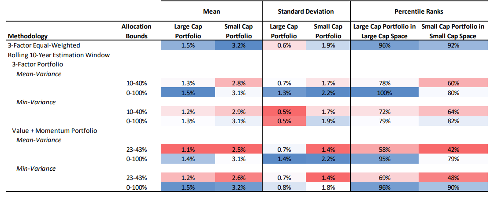

## Table of Contents

## What is naive diversification in the context of investing?

Naive diversification in investing is when an investor spreads their money across many different investments without thinking too much about it. They might just pick a bunch of stocks or funds without really looking into them. The idea is to reduce risk by not putting all their eggs in one basket, but they don't consider if the investments are actually good or if they fit well together.

This approach can seem easy because it doesn't require a lot of research or planning. However, it can lead to problems. For example, an investor might end up with too many similar investments, which doesn't really lower their risk. It's better to think carefully about each investment and how they work together to create a balanced and smart portfolio.

## How does naive diversification differ from strategic asset allocation?

Naive diversification and strategic asset allocation are two different ways to manage investments. Naive diversification is when someone spreads their money across many investments without much thought. They might just pick a lot of different stocks or funds without really understanding them. The goal is to lower risk by not putting all their money in one place, but they don't consider if these investments are good or if they fit well together. It's like throwing darts at a board and hoping for the best.

On the other hand, strategic asset allocation is a more thoughtful approach. It involves carefully choosing investments based on a plan that matches the investor's goals, how much risk they're willing to take, and how long they plan to invest. This method looks at different types of investments, like stocks, bonds, and real estate, and decides how much to put into each one. The idea is to create a balanced portfolio that can handle ups and downs in the market and grow over time. It's like building a strong house with a blueprint, rather than just stacking random bricks.

## What are the potential benefits of naive diversification for a beginner investor?

For a beginner investor, naive diversification can be a good starting point because it's easy to do. Instead of trying to pick the best stocks or funds, a beginner can simply spread their money across many different investments. This helps them get used to investing without having to spend a lot of time studying each choice. It's like dipping their toes in the water before jumping in.

Another benefit is that naive diversification can help lower risk. When a beginner investor spreads their money around, they're not putting all their eggs in one basket. If one investment doesn't do well, the others might balance it out. This can make the beginner feel more comfortable and less worried about losing all their money at once. It's a simple way to start building a safety net in their investment journey.

## What are the limitations or risks associated with naive diversification?

Naive diversification can lead to problems because it doesn't take into account the quality or the fit of the investments. A beginner might end up with a lot of investments that are too similar, which doesn't really lower their risk. For example, if they just buy a bunch of tech stocks, their portfolio could still crash if the tech industry has a bad year. They might think they're safe because they have many different stocks, but they're not really diversified.

Another risk is that naive diversification can miss out on better opportunities. By not looking into each investment carefully, a beginner might not find the best stocks or funds that could grow their money more. They might also keep money in investments that are not doing well just because they want to stay diversified. This can slow down their progress and keep them from reaching their financial goals faster.

## How can an investor move from naive diversification to a more optimized investment strategy?

Moving from naive diversification to a more optimized investment strategy starts with learning. An investor needs to understand the different types of investments, like stocks, bonds, and real estate, and how they work. They should also learn about their own goals, how much risk they're okay with, and how long they plan to invest. This knowledge helps them make a plan, called an investment strategy, that fits their needs. They might start by looking at their current investments and seeing if they're too similar or if they're missing out on better options.

Once they have a plan, the investor can start making changes. They might decide to put more money into certain types of investments that match their goals and less into others. They could also use tools like index funds or ETFs, which help spread their money in a smarter way. It's important to keep checking and adjusting their portfolio as things change, like their goals or the market. By taking these steps, an investor can move away from just [picking](/wiki/asset-class-picking) random investments and towards a strategy that helps them grow their money better over time.

## What role does risk tolerance play in moving beyond naive diversification?

Risk tolerance is really important when an investor wants to move beyond naive diversification. It means understanding how much risk you're okay with. When you know this, you can make better choices about your investments. For example, if you're okay with a lot of risk, you might put more money into stocks that could go up a lot but also could go down. If you don't like risk, you might choose safer investments like bonds. Knowing your risk tolerance helps you pick investments that fit you better, instead of just picking a bunch of random ones.

Once you know your risk tolerance, you can start building a portfolio that matches it. This means looking at your investments and seeing if they fit with how much risk you're willing to take. You might decide to change some of your investments to make your portfolio more balanced. By thinking about risk tolerance, you can move away from just spreading your money around without a plan, to a strategy that helps you reach your goals while feeling comfortable with the risks you're taking.

## What are some common tools or methods used for investment optimization?

One common tool for investment optimization is asset allocation. This means deciding how much of your money to put into different types of investments, like stocks, bonds, and real estate. The goal is to balance risk and reward based on your goals and how long you plan to invest. By spreading your money across different types of investments, you can lower the risk of losing a lot if one type does badly. A lot of people use models or calculators to help figure out the best way to split their money.

Another tool is rebalancing. This means checking your investments every so often and making changes to keep your portfolio balanced. If one type of investment has grown a lot, it might take up too much of your portfolio, so you might sell some of it and buy more of another type to get back to your original plan. Rebalancing helps keep your investments in line with your risk tolerance and goals. It's like keeping your bike steady by adjusting the handlebars as you ride.

A third method is using index funds or ETFs. These are baskets of investments that track a market index, like the S&P 500. They're a good way to get a lot of diversification without having to pick individual stocks. Index funds and ETFs can be a smart choice for someone moving away from naive diversification because they offer a balanced way to invest in the market. Plus, they usually have lower fees than picking stocks one by one, which can help your money grow more over time.

## How does modern portfolio theory enhance investment optimization beyond naive diversification?

Modern portfolio theory (MPT) is a way to make your investments work better than just spreading them around without thinking. MPT says that you can get the best return for the amount of risk you're willing to take by mixing different types of investments in the right way. It uses math to look at how different investments move together. If one goes up when another goes down, they can balance each other out. This helps lower the risk of your whole portfolio without giving up too much of the potential reward. MPT helps you pick a mix of investments that fits your goals and how much risk you're okay with.

Using MPT, you can build a portfolio that's more than just a bunch of random investments. It's like making a recipe where each ingredient is chosen carefully to make the whole dish taste better. MPT helps you find the best mix of stocks, bonds, and other investments to make your money grow while keeping risk under control. It's a smarter way to invest because it's based on understanding how different investments work together, not just hoping for the best. By following MPT, you can move away from naive diversification and towards a strategy that's more likely to help you reach your financial goals.

## What is the impact of correlation between assets on diversification strategies?

The correlation between assets is really important when you're trying to make a good diversification strategy. Correlation means how much two investments move together. If two investments have a high correlation, they tend to go up and down at the same time. If they have a low correlation, one might go up when the other goes down. When you're building a portfolio, you want to pick investments that don't all move in the same way. This helps lower your risk because if one investment does badly, the others might not be affected as much. By understanding correlation, you can make a better plan for spreading your money around.

Using correlation in your diversification strategy can make your portfolio stronger. If you just pick a bunch of investments without thinking about how they move together, you might end up with a lot of high-correlation investments. This can make your portfolio risky because if the market goes down, a lot of your investments might go down too. But if you look at the correlation and pick investments that move differently, you can create a more balanced portfolio. This way, even if some investments don't do well, others might still do okay, helping to protect your money. Understanding and using correlation helps you move beyond just picking random investments to a smarter way of investing.

## How can quantitative analysis be applied to optimize an investment portfolio?

Quantitative analysis is a way to use numbers and math to make your investment portfolio better. It helps you look at things like how much risk you're taking, how much your investments might grow, and how they move together. By using numbers, you can see which investments are good for you and which ones might not be worth keeping. For example, you can use a computer to run different scenarios and see how your portfolio might do in different situations. This helps you make smart choices about where to put your money, instead of just guessing.

One way to use quantitative analysis is by looking at the past performance of your investments. You can use numbers to see how they've done over time and how they might do in the future. This can help you decide if you should keep them or switch to something else. Another way is by using something called optimization models. These models help you find the best mix of investments to reach your goals while keeping risk under control. By using these tools, you can make your portfolio stronger and more likely to help you reach your financial goals.

## What advanced techniques exist for portfolio optimization, such as the use of machine learning?

One advanced technique for portfolio optimization is using [machine learning](/wiki/machine-learning). Machine learning is like teaching a computer to learn from data and make smart choices. In investing, it can look at a lot of information, like how stocks have moved in the past, and use that to predict how they might move in the future. This helps investors pick the best mix of investments for their portfolio. Machine learning can also find patterns that are hard for people to see, which can lead to better decisions about buying and selling investments.

Another technique is using something called Monte Carlo simulations. This is a way to run a lot of different scenarios on a computer to see how your portfolio might do in different situations. It's like playing out thousands of different futures and seeing what might happen. This helps you understand the risks and rewards of your investments better. By using Monte Carlo simulations, you can make your portfolio more ready for whatever the market might do, which can help you reach your financial goals more safely.

## How do professional investors typically approach the balance between diversification and optimization?

Professional investors usually balance diversification and optimization by first understanding their goals and how much risk they're okay with. They look at different types of investments, like stocks, bonds, and real estate, and decide how much to put into each one. They use tools like asset allocation to spread their money in a smart way. This means they pick investments that fit their plan and don't all move in the same way. By doing this, they can lower their risk while still trying to grow their money.

They also use advanced methods like quantitative analysis and machine learning to make their portfolios even better. Quantitative analysis helps them look at numbers to see how their investments have done in the past and might do in the future. Machine learning can find patterns in the data that are hard to see, which helps them make smarter choices. Professional investors keep checking and adjusting their portfolios to make sure they stay balanced and are working towards their goals. This way, they can get the best of both worlds: a diversified portfolio that's also optimized for growth and risk management.

## What are Optimized Diversification Techniques?

Optimized diversification seeks to construct portfolios that optimize the balance between expected returns and risk through the application of mathematical and statistical models. At the core of these techniques is the theory of modern portfolio optimization, which aims to select a set of investment assets in such a way that the portfolio achieves the highest possible expected return for a given level of risk or, alternatively, the lowest possible risk for a given level of expected return.

### Mean-Variance Optimization

One foundational approach within optimized diversification is mean-variance optimization, introduced by Harry Markowitz in the 1950s. This method utilizes the expected returns, variances, and covariance of asset returns to construct an efficient frontier—a set of portfolios that no other portfolio dominates in terms of higher expected return for the same risk level. The optimization problem can be mathematically expressed as:

$$
\text{Minimize } \quad \frac{1}{2} \mathbf{w}^\top \Sigma \mathbf{w} - \lambda \mathbf{w}^\top \mathbf{\mu}
$$

where $\mathbf{w}$ is the vector of asset weights in the portfolio, $\Sigma$ denotes the covariance matrix of asset returns, $\mathbf{\mu}$ represents the vector of expected returns, and $\lambda$ is the risk aversion parameter.

### Monte Carlo Simulation

Another technique used in optimized diversification is Monte Carlo simulation. This method involves generating a large number of potential future states of the market to assess the probability distribution of portfolio returns. By simulating numerous scenarios, Monte Carlo analysis assists in identifying the range of possible outcomes and determining the likelihood of achieving specific financial goals. This probabilistic approach is especially useful in evaluating portfolios under uncertain market conditions and for stress testing portfolio robustness.

### Treynor-Black Model

The Treynor-Black model integrates active management into the framework of efficient portfolios. This model combines a passive portfolio (market portfolio) with an active portfolio, where the active portfolio is derived based on the forecasted abnormal returns (alpha) and the residual variance of securities. The Treynor-Black model is advantageous for identifying opportunities where select securities can be overweighted relative to a benchmark, thereby potentially enhancing returns through informed analysis and stock selection.

### Challenges and Considerations

While these optimized diversification techniques offer sophisticated tools for managing investment risks and enhancing returns, they are not without shortcomings. One significant challenge is the reliance on historical data to estimate expected returns, variances, and covariances, which can introduce estimation errors and potentially lead to inaccurate assessments of future market conditions. Additionally, financial markets are inherently complex and dynamic, and the assumptions underpinning these models may not invariably hold true, especially during periods of market turbulence.

Overall, while optimized diversification techniques are an important asset for institutional investors and advanced finance professionals, they require careful implementation and continuous reassessment to adapt to evolving market conditions and to account for model limitations.

## References & Further Reading

[1]: DeMiguel, V., Garlappi, L., & Uppal, R. (2009). "Optimal Versus Naive Diversification: How Inefficient is the 1/N Portfolio Strategy?" Review of Financial Studies, 22(5), 1915-1953. [Link](https://www.jstor.org/stable/30226017)

[2]: Markowitz, H. (1952). "Portfolio Selection." The Journal of Finance, 7(1), 77-91. [Link](https://onlinelibrary.wiley.com/doi/abs/10.1111/j.1540-6261.1952.tb01525.x)

[3]: Treynor, J., & Black, F. (1973). "How to Use Security Analysis to Improve Portfolio Selection." The Journal of Business, 46(1), 66-86. [Link](https://www.semanticscholar.org/paper/How-to-Use-Security-Analysis-to-Improve-Portfolio-Treynor-Black/fd655bf8e1fb8b018c78188d8c32636ec8c7b3b6)

[4]: Lopez de Prado, M. (2018). "Advances in Financial Machine Learning." Wiley. [Link](https://www.amazon.com/Advances-Financial-Machine-Learning-Marcos/dp/1119482089)

[5]: Chan, E.P. (2009). "Quantitative Trading: How to Build Your Own Algorithmic Trading Business." Wiley. [Link](https://github.com/ftvision/quant_trading_echan_book)