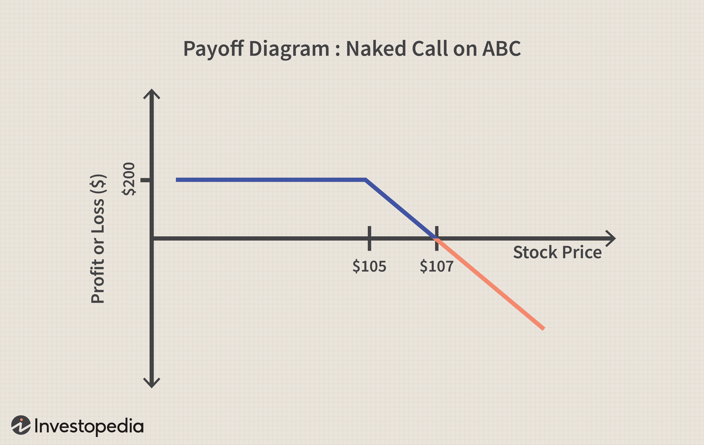

## Table of Contents

## What is a naked call option?

A naked call option is when someone sells a call option on a stock they don't own. It's called "naked" because the seller doesn't have the stock to back up the option if the buyer decides to use it. When you sell a naked call, you're betting that the stock price won't go up much before the option expires. If you're right, you keep the money you got from selling the option. But if the stock price goes up a lot, you could lose a lot of money because you have to buy the stock at the higher price to give to the person who bought the option.

This kind of option is risky because there's no limit to how much the stock price can go up. If it keeps rising, your losses can be huge. That's why many brokers require traders to have a special permission to sell naked calls. It's different from a covered call, where you own the stock you're selling the option on, which limits your risk. Naked calls can be a way to make money if you think a stock won't go up, but you need to be ready for the possibility of big losses.

## How does a naked call option differ from a covered call?

A naked call option and a covered call are two different ways to sell call options, and the main difference is whether you own the stock or not. When you sell a naked call, you're selling an option on a stock you don't own. You're betting that the stock price won't go up much before the option expires. If you're right, you keep the money you got from selling the option. But if the stock price goes up a lot, you could lose a lot of money because you have to buy the stock at the higher price to give to the person who bought the option.

On the other hand, a covered call is when you sell a call option on a stock that you already own. This means if the buyer of the option decides to use it, you can just give them the stock you already have. The risk is much lower with a covered call because the most you can lose is the difference between the stock's current price and the price at which you bought it. Covered calls can be a way to earn some extra money from stocks you already own, while naked calls are riskier but can be used to bet on a stock not going up in price.

## What are the potential risks associated with selling naked calls?

Selling naked calls is very risky. The biggest risk is that the stock price can go up a lot. If it does, you have to buy the stock at the higher price to give to the person who bought the option from you. This means your losses can be huge because there's no limit to how high the stock price can go. For example, if you sell a naked call and the stock price doubles or triples, you could lose a lot more money than you made from selling the option.

Another risk is that you need to have enough money in your account to cover potential losses. Brokers often require you to have a special permission to sell naked calls because they're so risky. If the stock price goes up and you don't have enough money to buy the stock, you could get a margin call, which means you have to add more money to your account quickly. If you can't, the broker might close your position, and you could still lose a lot of money.

## What are the potential rewards of using a naked call strategy?

Selling naked calls can be a way to make money if you think a stock won't go up much before the option expires. When you sell a naked call, you get money right away from the person who buys the option. If the stock stays the same or goes down, the option will expire without being used, and you get to keep all the money you got from selling the option. This can be a good way to earn some extra money if you're good at guessing where stock prices will go.

But, the rewards of using a naked call strategy come with a lot of risk. If you're right and the stock doesn't go up, you can make money without even owning the stock. It's like betting on the stock staying the same or going down. However, this strategy is not for everyone because the potential losses can be much bigger than the money you make from selling the option. You need to be ready for the stock to go up a lot and have a plan for what to do if that happens.

## Who should consider using a naked call options strategy?

People who should consider using a naked call options strategy are usually experienced traders who understand a lot about the stock market. They need to be good at guessing where stock prices will go and be ready to handle big risks. This strategy is not for beginners because it can lead to big losses if the stock price goes up a lot. Experienced traders might use naked calls if they think a stock will not go up much before the option expires, and they want to make some money from selling the option.

Traders who use naked calls should also have enough money in their trading account to cover potential losses. This is important because if the stock price goes up, they need to buy the stock at the higher price to give to the person who bought the option. Brokers often require special permission to sell naked calls because they're so risky. So, only traders who are ready for the possibility of big losses and have the right permissions should think about using this strategy.

## What are the margin requirements for selling naked calls?

When you want to sell naked calls, you need to have enough money in your trading account to cover possible losses. This is called the margin requirement. Brokers set these requirements to make sure you can handle the risk of the stock price going up a lot. The margin for naked calls is usually higher than for other kinds of options because the risk is bigger. The exact amount you need can change based on the stock's price and how much the stock's price moves around.

Brokers often use a formula to figure out the margin requirement for naked calls. They might ask for a certain percentage of the stock's price, plus some extra money to cover the risk of the stock going up. For example, if a stock is worth $100, the broker might ask for a margin of 20% of the stock price, which is $20, plus some more money for risk. This means you need to have at least that much money in your account before you can sell a naked call. If the stock price goes up and you don't have enough money to cover the losses, you could get a margin call, where you have to add more money to your account quickly.

## How can one manage the risks of a naked call position?

Managing the risks of a naked call position is important because the stock price can go up a lot and cause big losses. One way to manage this risk is by keeping a close eye on the stock price. If it starts going up, you might want to buy back the call option you sold before it gets too expensive. This way, you can limit your losses. Another way is to use stop-loss orders. These are orders that automatically close your position if the stock price reaches a certain level, helping to stop the losses from getting too big.

Another strategy is to have enough money in your account to cover potential losses. This is called having enough margin. If the stock price goes up and you don't have enough money, you could get a margin call, where you have to add more money to your account quickly. To avoid this, make sure you have more money than the minimum required by your broker. Also, you can use other options strategies to hedge your naked call. For example, you could buy a call option at a higher price to limit how much you could lose if the stock price goes up a lot. This way, if the stock price goes above the higher call option's price, your losses from the naked call won't be as bad.

## What are some common scenarios where a naked call strategy might be used?

People might use a naked call strategy when they think a stock won't go up much before the option expires. For example, if a trader believes a stock is overvalued and won't rise in price, they might sell a naked call to make some money from the option's premium. They're betting that the stock will stay the same or go down, so the option will expire without being used, and they can keep the money they got from selling the option.

Another common scenario is when traders want to earn extra money from a stock they think will stay steady. If a trader has a good understanding of the stock's price movements and believes it will not move much, they might use naked calls as a way to generate income. This strategy can be risky, but for experienced traders who are confident in their predictions, it can be a way to make money from their knowledge of the market.

## How does market volatility affect a naked call strategy?

Market [volatility](/wiki/volatility-trading-strategies) can make a naked call strategy more risky. When the market is volatile, stock prices can go up and down a lot. If you sell a naked call and the stock price goes up quickly because of high volatility, you could lose a lot of money. You would have to buy the stock at the higher price to give to the person who bought the option from you. This means your losses can be much bigger than the money you made from selling the option.

On the other hand, if you're good at guessing where the stock price will go, you might still use a naked call strategy in a volatile market. You could make more money from selling the option because the price of the option might be higher due to the increased risk. But you need to be ready for the stock price to move a lot and have a plan for what to do if it goes up. So, while high volatility can make naked calls more profitable, it also makes them much riskier.

## What are the tax implications of profits and losses from naked calls?

When you make money or lose money from selling naked calls, you need to think about taxes. In the United States, if you make a profit from naked calls, it's usually considered a short-term capital gain. This means you have to pay your normal income tax rate on the money you made. If you held the option for less than a year before selling it, it's definitely a short-term gain. But if you held it for more than a year, it could be a long-term capital gain, which might have a lower tax rate.

If you lose money on naked calls, you can use those losses to lower your taxes. You can use the losses to reduce other gains you made from investing. If your losses are more than your gains, you can use up to $3,000 of the extra losses to lower your regular income for the year. If you still have losses left after that, you can [carry](/wiki/carry-trading) them over to the next year to use them then. It's a good idea to talk to a tax professional to make sure you're doing everything right with your taxes.

## How can technical analysis be used to enhance a naked call strategy?

Technical analysis can help make a naked call strategy better by looking at past stock prices and patterns. When you sell a naked call, you're betting that the stock won't go up much before the option expires. By using technical analysis, you can look at charts and see if the stock has been going up or down lately. If you see that the stock has been going down and it's hitting a resistance level, you might feel more confident that it won't go up soon. This can help you decide when to sell a naked call and make it more likely that you'll make money from the option's premium.

Technical indicators like moving averages, the Relative Strength Index (RSI), and Bollinger Bands can also be useful. For example, if a stock's price is below its moving average, it might mean the stock is going to keep going down. If the RSI shows the stock is overbought, it might mean the price will go down soon. By using these indicators, you can find good times to sell naked calls when the stock is less likely to go up. But remember, even with technical analysis, selling naked calls is still risky because the stock price can still go up a lot and cause big losses.

## What advanced techniques can be employed to optimize a naked call options strategy?

To optimize a naked call options strategy, one advanced technique is to use delta hedging. Delta is a measure of how much the price of an option changes when the stock price changes. By keeping an eye on the delta, you can buy or sell the stock to balance out the risk of the naked call. For example, if the delta of your naked call is 0.30, you could buy 30 shares of the stock for every 100 options you sold to hedge your position. This way, if the stock price goes up, the gain from the stock can help offset the loss from the naked call. It's a way to manage the risk and make your strategy more stable.

Another technique is to use options spreads, like a bull put spread or a bear call spread, along with your naked calls. This means you sell a naked call and also buy a call option at a higher strike price. This limits how much you can lose if the stock price goes up a lot. The cost of buying the higher call option will lower the money you make from selling the naked call, but it also protects you from big losses. It's like having insurance on your naked call. By combining these strategies, you can make your naked call strategy more effective and less risky.

## What are the risk management techniques for naked calls?

Effective risk management is essential in the execution of naked call options due to the potential for unlimited losses. Traders need to implement robust strategies to safeguard against adverse market movements. Here are several techniques that can help mitigate the risks associated with naked call options:

### Diversification

Diversification involves spreading investments across various assets to reduce exposure to any single asset's risk. In the context of naked call options, traders can diversify by writing calls on different underlying securities across various industries. This approach helps in managing the idiosyncratic risk associated with any one company or sector, thereby reducing the likelihood of substantial losses due to a specific market event.

### Stop-Loss Orders

Stop-loss orders automatically trigger a trade to close a position when the market price reaches a predetermined level. For naked call options, setting an appropriate stop-loss level can help cap potential losses. This strategy requires careful selection of the trigger price, taking into account the option's strike price, volatility of the underlying asset, and the trader's risk tolerance.

### Position Sizing

Position sizing is the process of determining the appropriate number of shares or contracts to trade, keeping potential risk within acceptable bounds. Traders can calculate position size by considering their total capital and the maximum amount they are willing to lose on a single trade. Here's a simple formula to determine position size:

$$
\text{Position Size} = \frac{\text{Total Capital} \times \text{Risk Per Trade}}{\text{Potential Loss Per Option}}
$$

Implementing position sizing ensures that even if a trade moves unfavorably, it will not have a significant negative impact on the overall portfolio.

### Algorithmic Risk Management

Algorithmic trading systems can be leveraged to enhance risk management through discipline and consistency. These systems can be programmed to adhere strictly to predefined risk management rules, like automatic position adjustments or liquidation upon reaching specified risk levels. Algorithms can also continuously monitor market conditions and optimize stop-loss levels and position sizes in real-time, providing an additional layer of precision and control.

Here's an example of a simple algorithm in Python that could help manage risk for naked calls:

```python
def manage_risk(option_price, underlying_price, stop_loss_level, max_risk_per_trade):
    """
    Simulates basic risk management for a naked call option.

    :param option_price: Current price of the option.
    :param underlying_price: Current price of the underlying asset.
    :param stop_loss_level: Price level to trigger stop-loss.
    :param max_risk_per_trade: Maximum risk tolerance for the trade.

    :return: Decision whether to hold, exit, or adjust position.
    """
    potential_loss = max(0, (underlying_price - stop_loss_level))

    if potential_loss > max_risk_per_trade:
        return "Exit Position"
    elif underlying_price >= option_price + stop_loss_level:
        return "Adjust Position"
    else:
        return "Hold Position"

# Example usage
print(manage_risk(10, 150, 140, 500))
```

This code represents a simple decision-making tool that helps in managing a naked call position by assessing the potential loss and suggesting actions such as exiting or holding the position based on risk parameters.

### Conclusion

While implementing these risk management techniques, it's crucial for traders to stay informed about market dynamics and adjust their strategies accordingly. Leveraging both traditional and algorithmic methods can provide a comprehensive framework for managing the inherent risks of naked call options.

## What are the pros and cons of naked call options?

Selling naked call options can serve as an attractive strategy for traders aiming to capitalize on bearish market conditions while generating immediate premium income. By selling a call option without holding the underlying asset, the trader is essentially betting that the asset's price will not exceed the option's strike price before expiration. If the market performance aligns with this expectation, the trader retains the premium as profit. This process can be mathematically represented by:

$$
\text{Profit} = \text{Premium Received} - \max(0, \text{Stock Price at Expiration} - \text{Strike Price})
$$

Here, the profit is maximized when the stock price stays below the strike price, leading to a retention of the entire premium received.

Despite the allure of upfront income, naked call options come with inherent risks. The most significant of these is the potential for unlimited losses. If the underlying asset's price rises substantially above the strike price, the seller of the naked call could face severe financial strain, as they are obligated to sell the asset at the lower strike price, regardless of the current higher market price. Theoretically, since stock prices can climb indefinitely, this can lead to unlimited losses, which poses a significant danger to traders.

Moreover, naked call options often entail high margin requirements. Brokers typically mandate that sellers maintain a margin account with a sufficient balance to cover potential adverse movements of the stock price. This requirement can significantly tie up capital, reducing [liquidity](/wiki/liquidity-risk-premium) and hampering the ability to deploy funds elsewhere.

Beyond these fundamental risks, traders also need to consider market volatility, as it can lead to sudden and unexpected price movements, increasing the potential for loss. Conversely, during periods of low volatility, the premium received for selling naked calls might not adequately compensate for the risks taken.

To summarize, while the opportunity to earn premium income and benefit from bearish markets makes naked call options appealing, their significant drawbacks, namely the risk of unlimited losses, high margin requirements, and the impact of market volatility, require traders to exercise caution and employ robust risk management strategies.

## References & Further Reading

[1]: Bergstra, J., Bardenet, R., Bengio, Y., & Kégl, B. (2011). ["Algorithms for Hyper-Parameter Optimization."](https://papers.nips.cc/paper/4443-algorithms-for-hyper-parameter-optimization) Advances in Neural Information Processing Systems 24.

[2]: ["Advances in Financial Machine Learning"](https://www.amazon.com/Advances-Financial-Machine-Learning-Marcos/dp/1119482089) by Marcos Lopez de Prado

[3]: ["Evidence-Based Technical Analysis: Applying the Scientific Method and Statistical Inference to Trading Signals"](https://www.amazon.com/Evidence-Based-Technical-Analysis-Scientific-Statistical/dp/0470008741) by David Aronson

[4]: ["Machine Learning for Algorithmic Trading"](https://github.com/stefan-jansen/machine-learning-for-trading) by Stefan Jansen

[5]: ["Quantitative Trading: How to Build Your Own Algorithmic Trading Business"](https://www.amazon.com/Quantitative-Trading-Build-Algorithmic-Business/dp/1119800064) by Ernest P. Chan