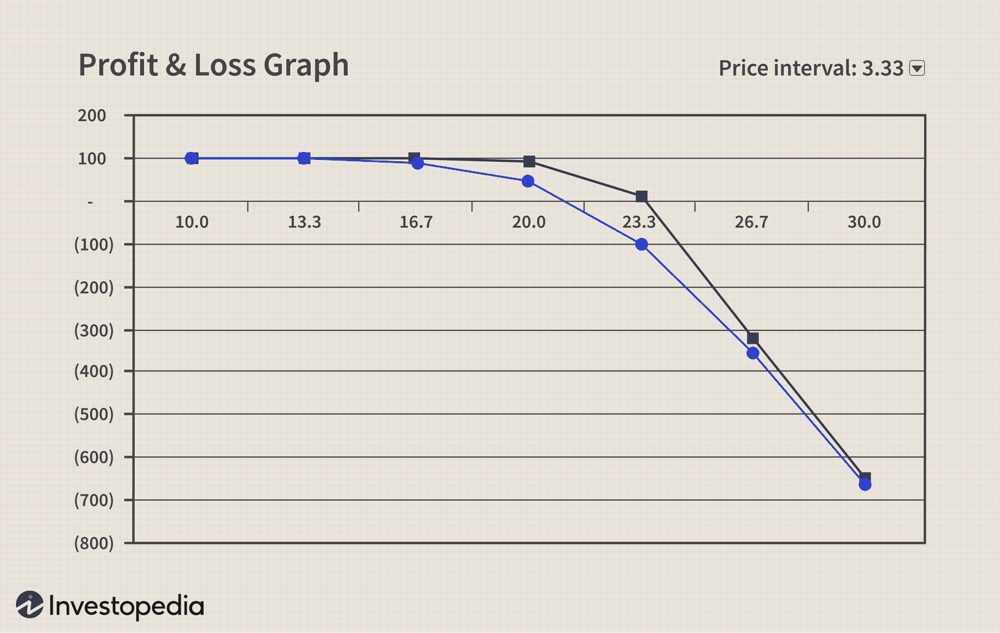

In the fast-paced world of financial trading, derivatives and options are crucial components of comprehensive investment strategies. These instruments provide traders with versatile tools for hedging risks, speculating on future price movements, and leveraging positions to optimize returns. Among the various types of options, naked options stand out as a sophisticated financial instrument offering the potential for substantial rewards, albeit accompanied by significant risks. Naked options involve selling options without the security of holding the underlying asset, thus exposing traders to potentially large losses.

The ongoing evolution of financial markets has seen the emergence of algorithmic trading, a groundbreaking development that has transformed how derivatives are traded. Algorithmic trading, employing complex mathematical models and computer programs, enables traders to automate the decision-making process, optimizing strategies while minimizing human error and emotional bias. By utilizing algorithms, traders can analyze vast amounts of market data in real-time, thereby executing trades faster and with greater precision than traditional methods would allow.



This article targets providing a comprehensive understanding of naked options and examining the role of algorithmic trading in managing the inherent high-risk, high-reward nature of these financial instruments. Through a detailed exploration, we aim to illuminate the potential risks and rewards of employing naked options in trading strategies, as well as the sophisticated algorithmic tools available to navigate this intricate landscape effectively.

## Table of Contents

## Understanding Financial Derivatives

Financial derivatives are complex financial instruments whose value is derived from an underlying asset, such as stocks, bonds, or currencies. They are pivotal in modern finance, serving as tools for hedging risks, enhancing returns, or gaining exposure to specific assets or markets without owning the assets themselves.

One of the most widely used types of derivatives is options. Options afford investors the right, but not the obligation, to buy or sell an asset at a predetermined price, known as the strike price, within a specified time frame. This flexibility can be advantageous for investors aiming to manage risk or leverage their investments for potential gains.

Options contracts can be divided into two primary types: calls and puts. A call option gives the holder the right to purchase the underlying asset, while a put option confers the right to sell the underlying asset. These contracts are traded on options markets and are used by individual investors and institutional entities alike to construct various investment strategies.

Naked options, a specific strategy within options trading, entail selling options contracts without owning the underlying assets. This approach can lead to significant risk exposure because the seller does not have the asset on hand to deliver if the buyer chooses to exercise the option. In the case of naked call options, an investor sells a call option without owning the corresponding stock. If the stock price rises above the strike price, the seller is obligated to purchase the stock at the current market price to fulfill the contract, potentially resulting in unlimited losses. Conversely, naked put options involve selling a put option without a short position in the underlying stock. If the stock price decreases significantly, the seller must buy the stock at a higher price than its current market value, leading to substantial losses.

The risks inherent in naked options trading underscore the necessity for prudent risk management strategies. Traders must possess a deep understanding of market dynamics and the potential consequences of their positions to navigate the complexities of these derivatives effectively.

## The Mechanics of Naked Options

Naked options are a form of options trading that involve selling options without holding a corresponding position in the underlying asset. This approach can be divided into two primary types: naked calls and naked puts.

Naked calls represent a strategy where a trader sells call options without owning the underlying stock. In this scenario, the trader receives a premium from the option buyer but faces potentially unlimited losses if the stock price rises above the strike price of the option. This is because there is theoretically no limit to how high the stock price can go, and the trader may need to purchase the underlying stock at a much higher price to fulfill the contract, incurring significant losses. For example, if a trader sells a naked call with a strike price of $50 and the stock price climbs to $100, the trader may have to buy the stock at $100 to sell it at $50 to the call option holder, resulting in a substantial loss.

On the other hand, naked puts involve selling put options without having a position in the underlying asset. Here, the risk lies in the stock price falling below the strike price of the option. If the stock price drops significantly, the trader might be obligated to buy the stock at the strike price, which is higher than the current market value, leading to potential financial losses. For instance, if a naked put is sold with a strike price of $40 and the stock falls to $20, the trader must purchase the stock at $40, despite its market value being only $20, resulting in a loss of $20 per share.

The risks associated with naked options are influenced by market [volatility](/wiki/volatility-trading-strategies), as rapidly changing prices can quickly transform a profitable position into a loss. Traders engaging in naked options should possess a significant understanding of market dynamics and employ stringent risk management strategies to mitigate potential losses.

## Investment Risks in Naked Options

Naked options, characterized as high-risk financial instruments, demand not only a profound understanding of the market dynamics but also an adeptness in risk management strategies. A naked option involves selling an options contract without holding the underlying asset, thereby exposing the trader to potentially large losses if market conditions turn unfavorable. This exposure becomes especially pronounced in volatile markets where asset prices exhibit rapid fluctuations.

The primary risk associated with naked options is unlimited potential losses. When selling a naked call option, for instance, the loss can become theoretically infinite if the underlying asset's price continues to rise. Conversely, a naked put option, though its maximum loss is limited to the strike price minus the premium received, still poses significant risk should the asset's price plummet far below the expected levels.

Contemporary risk management strategies are crucial to safeguard against losses when engaging in naked options trading. A fundamental technique is the implementation of stop-loss orders. Stop-loss orders can be set at specific price levels to automatically [exit](/wiki/exit-strategy) a trading position, curbing further losses if the market moves adversely. The use of a stop-loss order acts as a crucial buffer by predefining an acceptable level of loss, thus preventing emotional decision-making during market turbulence.

Moreover, traders are advised to conduct meticulous market analysis and adopt a rigorous strategy that includes scenario planning and stress testing their positions against potential market swings. Diversification of the trading portfolio can also aid in spreading and thereby mitigating risk. By diversifying, traders do not concentrate their risk exposure in a singular direction or asset, thus cushioning against extreme market moves.

In quantitative terms, the risk and performance of options can be evaluated using the Greeks, which measure sensitivity to various market factors. For example, Delta measures the sensitivity of the option's price to changes in the price of the underlying asset. Understanding and utilizing these metrics can inform more effective risk management and facilitate strategic decision-making.

In summary, the intrinsic risk associated with naked options necessitates a high degree of financial acumen and a disciplined approach to risk management. By employing strategies such as stop-loss orders, conducting thorough market analysis, and maintaining a diversified portfolio, traders can navigate the challenges posed by naked options and position themselves to potentially capitalize on the opportunities they present.

## Algorithmic Trading: A Modern Approach

Algorithmic trading employs computer algorithms to execute trades automatically based on pre-defined criteria, which significantly enhances the trading process's efficiency and effectiveness. By eliminating human emotions from trading decisions, algorithms contribute to rational and disciplined trade execution. This is especially beneficial when trading naked options—high-risk derivatives that require precise timing and analysis.

Artificial intelligence and [machine learning](/wiki/machine-learning) technologies allow algorithms to process large volumes of market data, spotting trends and patterns that might elude human traders. These sophisticated algorithms can execute trades with high speed and accuracy, capitalizing on fleeting market opportunities while maintaining strategic integrity.

In the context of naked options, [algorithmic trading](/wiki/algorithmic-trading) can effectively manage the risks associated with their inherently volatile nature. Algorithms can swiftly assess market conditions and adjust trading strategies dynamically. For instance, an algorithm might evaluate real-time changes in stock price, implied volatility, and market sentiment to determine the optimal points for buying or selling options.

Python, a popular language in the finance industry, allows traders to develop custom trading algorithms. Using libraries such as Pandas and NumPy for data manipulation, and Scikit-learn for machine learning, traders can create algorithms to predict price movements and assess risk. Here's a simple example in Python demonstrating how one might set up an algorithm to trade naked options:

```python
import pandas as pd
import numpy as np
from sklearn.linear_model import LinearRegression

# Sample data for stock prices
data = pd.DataFrame({
    'Price': [100, 102, 104, 98, 101]
})

# Generate features for algorithmic prediction
data['Price_Change'] = data['Price'].diff()
data['Volatility'] = data['Price'].rolling(window=3).std()

# Fill missing values
data = data.fillna(0)

# Initialize and train a simple linear regression model
X = data[['Price_Change', 'Volatility']]
y = data['Price']

model = LinearRegression().fit(X, y)

# Predict next price
predicted_next_price = model.predict(X.iloc[-1].values.reshape(1, -1))
print(f"Predicted next price: {predicted_next_price[0]}")
```

This basic example depicts using historical price changes and volatility to predict future price movements. Such algorithms can be scaled up and refined to incorporate more complex variables and financial models.

Algorithmic trading transforms the landscape for naked options trading by promoting precision, speed, and consistency. Traders leveraging these advanced technologies can enhance their risk management capabilities and better exploit market inefficiencies, strategically positioning themselves in the highly competitive financial markets.

## Strategies for Success in Algo Trading

Successful trading with naked options in the context of algorithmic trading necessitates a combination of technical analysis and strategic risk management.

Leveraging historical data and market trends is crucial for creating predictive models that facilitate more accurate trading decisions. These models often use machine learning algorithms to identify patterns and establish relationships among various market indicators, thereby predicting future price movements with improved precision. For example, traders might employ Python libraries such as Scikit-learn and TensorFlow to construct predictive models based on historical price data, trading volumes, and economic indicators. Here is a simplified example of how one could utilize Python for such purposes:

```python
import pandas as pd
from sklearn.model_selection import train_test_split
from sklearn.linear_model import LinearRegression

# Sample data setup: historical market data
data = pd.read_csv('historical_data.csv')
X = data[['feature1', 'feature2', 'feature3']]  # Market indicators
y = data['price']  # Target variable: price

# Splitting data into training and testing subsets
X_train, X_test, y_train, y_test = train_test_split(X, y, test_size=0.2, random_state=42)

# Training a simple linear regression model
model = LinearRegression()
model.fit(X_train, y_train)

# Predicting future prices
predictions = model.predict(X_test)
```

Such models offer traders insightful perspectives, enabling the execution of strategies at times deemed optimal based on historical trends and current market conditions.

Diversification and hedging are essential strategies that can mitigate risk while maximizing potential returns. A diversified portfolio, which includes a range of asset classes and financial instruments, reduces exposure to any single market volatility, providing a buffer against potential losses in naked option positions. By including various securities, such as stocks, bonds, and other derivatives, traders can cushion the impact of adverse movements in any single asset.

Hedging, on the other hand, involves taking an opposite position in the market to offset potential losses. This technique is often employed when traders hold naked options, as it provides a safeguard against unpredictable price swings. For instance, holding a protective put on a stock against which one has sold naked calls can limit potential downsides. The mathematical relationship can be expressed as follows:

$$
\text{Net Position} = \text{Naked Call Income} - \text{Protective Put Cost} - \text{Loss due to Adverse Price Movement}
$$

Overall, the integration of sophisticated algorithmic tools with sound trading principles, such as diversification and hedging, equips traders to successfully navigate the complexities associated with naked options, optimizing potential returns while managing risks effectively.

## Conclusion

Naked options present a high-risk, high-reward opportunity for savvy traders, demanding expertise and strategic foresight. These sophisticated instruments enable traders to capitalize on market volatility, but they require a thorough understanding of potential risks and rewards. The integration of algorithmic trading into this arena offers a robust toolset to enhance decision-making processes and manage risks effectively.

Algorithmic trading, which employs computer algorithms to automate trades based on predetermined criteria, provides significant advantages in managing naked options. Its capacity to analyze vast amounts of market data swiftly allows traders to identify advantageous entry and exit points. This automated approach mitigates the influence of human emotions in trading decisions, potentially increasing the accuracy and speed of executing trades involving naked options.

Continual learning and adherence to sound trading principles are essential for navigating the complexities of naked options. Traders must remain vigilant and informed, consistently updating their strategies to reflect current market conditions and emerging trends. Utilizing algorithmic models, informed by historical data and predictive analytics, further enhances the potential for successful outcomes. Moreover, integrating diversified portfolios and implementing hedging strategies can balance inherent risks while maximizing returns.

In conclusion, while naked options are inherently risky, their potential for high returns makes them attractive to experienced traders who are well-versed in market dynamics and risk management techniques. The strategic use of algorithmic trading can significantly elevate the potential for success, providing the precision and adaptability necessary to thrive in the complex landscape of financial derivatives. By combining continuous learning with disciplined trading strategies, traders can effectively navigate the opportunities and challenges presented by naked options.

## References & Further Reading

Hull, J. C. "Options, Futures, and Other Derivatives" is a comprehensive resource for understanding the complex world of financial derivatives, offering key insights into pricing, risk management, and the strategic application of options. This work is essential for traders seeking to expand their knowledge of various derivative instruments, including options and futures, which form the foundation of sophisticated investment strategies.

McMillan, L. G. "Options as a Strategic Investment" provides a thorough exploration of options strategies, emphasizing their strategic use in diverse market conditions. This book is ideal for traders aiming to harness options for both speculative and risk management purposes, delivering practical guidance on implementing options strategies successfully.

Chan, E. P. "Quantitative Trading: How to Build Your Own Algorithmic Trading Business" offers a deep dive into the world of algorithmic trading. It presents techniques for designing, testing, and implementing algorithms, with a focus on financial markets, including derivatives trading. For traders interested in leveraging technology to optimize their trading processes, Chan's work serves as a valuable blueprint.

Investopedia and other financial education resources such as [books](/wiki/algo-trading-books), online courses, and market analysis platforms offer extensive information on financial derivatives and algorithmic trading. These resources are indispensable for continuous learning and staying informed about market trends, regulatory changes, and technological advancements in trading tools. They provide the necessary support for traders aiming to enhance their expertise and to employ effective trading strategies in the dynamic financial markets.