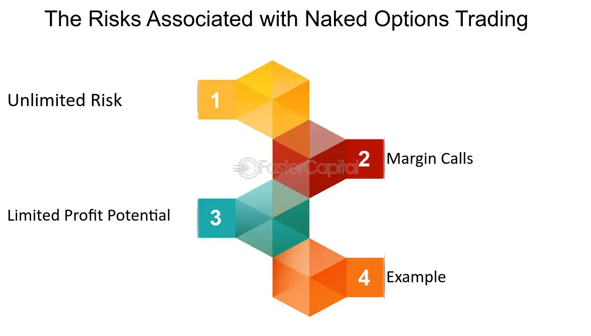

## Table of Contents

## What is a naked option?

A naked option is a type of option trade where the seller does not own the underlying asset. When someone sells a naked option, they are promising to buy or sell the asset at a certain price if the buyer decides to use the option. This can be risky because if the price of the asset moves a lot, the seller might lose a lot of money.

For example, if someone sells a naked call option on a stock, they are promising to sell the stock at the option's strike price. If the stock's price goes up a lot, the buyer might use the option, and the seller will have to buy the stock at the higher market price and then sell it at the lower strike price, losing money. Because of this risk, selling naked options is usually only done by experienced traders.

## How does a naked option differ from a covered option?

A naked option and a covered option are different ways to sell options. A naked option is when you sell an option without owning the underlying asset. For example, if you sell a naked call option on a stock, you don't own the stock. If the buyer decides to use the option, you have to buy the stock at the market price and sell it to them at the strike price. This can be risky because if the stock price goes up a lot, you could lose a lot of money.

A covered option is when you sell an option and you already own the underlying asset. For example, if you own a stock and you sell a call option on that stock, it's a covered call. If the buyer uses the option, you just have to sell them the stock you already own at the strike price. This is less risky because you don't have to buy the stock at a higher price if the stock goes up. Covered options are generally seen as safer than naked options.

## What are the basic types of naked options?

Naked options come in two basic types: naked calls and naked puts. A naked call is when you sell a call option without owning the stock. This means you're promising to sell a stock you don't own at a certain price. If the buyer uses the option, you'll have to buy the stock at the market price, which could be higher than the strike price, and then sell it to the buyer at the lower strike price. This can lead to big losses if the stock price goes up a lot.

A naked put is when you sell a put option without having the cash to buy the stock. This means you're promising to buy a stock at a certain price if the buyer uses the option. If the stock price drops below the strike price, the buyer might use the option, and you'll have to buy the stock at the higher strike price. This can also lead to big losses if the stock price falls a lot. Both types of naked options can be risky because you're not protected by owning the stock or having the cash to buy it.

## What are the potential benefits of trading naked options?

Trading naked options can offer some benefits. One big benefit is the chance to earn more money. When you sell a naked option, you get to keep the money the buyer pays you right away. If the option never gets used, you keep all that money as profit. This can be a good way to make money if you think the stock will stay the same or move in a way that keeps the option from being used.

Another benefit is that selling naked options can be a way to make money in different market conditions. If you think a stock will stay the same or go down, you can sell a naked call. If you think it will stay the same or go up, you can sell a naked put. This flexibility can help you find more chances to make money, no matter what the market is doing. But remember, trading naked options is risky and not for everyone.

## What are the risks involved in trading naked options?

Trading naked options can be very risky. The biggest risk is that you could lose a lot of money if the stock price moves against you. For example, if you sell a naked call and the stock price goes up a lot, you have to buy the stock at the higher market price and sell it at the lower strike price. This means you lose the difference between the market price and the strike price, which can be a lot of money. The same thing can happen with a naked put if the stock price goes down a lot. You have to buy the stock at the higher strike price when it's worth less in the market.

Another risk is that there's no limit to how much you could lose. When you sell a naked option, your potential losses can be much bigger than the money you made from selling the option. This is different from buying options, where the most you can lose is the money you paid for the option. Also, trading naked options can be stressful because you have to keep an eye on the stock price all the time. If it moves against you, you might need to act quickly to limit your losses, which can be hard and stressful.

## How can margin requirements affect naked option trading?

Margin requirements are a big deal when you trade naked options. When you sell a naked option, you have to put up money or other assets as a margin. This is like a safety deposit to make sure you can cover any losses if the option goes against you. The amount of margin you need can change based on how risky the option is. If the stock price moves a lot, the margin requirement might go up. This means you need more money in your account to keep trading, which can limit how many naked options you can sell.

If you don't have enough money to meet the margin requirement, your broker might make you close your positions or add more money to your account. This can be a problem if you're not ready for it. Also, high margin requirements can tie up a lot of your money, so you might not be able to use it for other investments. That's why it's important to understand how margin works before you start trading naked options.

## What strategies can be used to mitigate the risks of naked options?

One way to lower the risks of trading naked options is to use stop-loss orders. A stop-loss order is like a safety net. It tells your broker to close your position if the stock price moves against you too much. This can help limit how much money you lose. Another strategy is to keep an eye on the market all the time. By watching the stock price closely, you can make quick decisions to close your positions if things start going the wrong way. This can help you avoid big losses.

Another strategy is to use a smaller amount of money for each trade. By not putting all your money into one trade, you can spread out your risk. If one trade goes bad, you won't lose everything. Also, you can learn about the stock or market you're trading in. The more you know, the better you can guess where the stock price might go. This can help you make smarter choices about when to sell naked options. Remember, even with these strategies, trading naked options is still risky, so be careful.

## How do market conditions influence the success of naked option trading?

Market conditions play a big role in how well naked option trading goes. If the market is calm and stock prices don't move much, selling naked options can be a good way to make money. When you sell a naked option, you get to keep the money the buyer pays you right away. If the stock price stays the same or moves in a way that keeps the option from being used, you get to keep all that money as profit. So, in a stable market, selling naked options can be a good way to earn some extra cash.

But if the market is volatile and stock prices move a lot, trading naked options can be very risky. Big swings in stock prices can lead to big losses if the stock moves against you. For example, if you sell a naked call and the stock price shoots up, you might have to buy the stock at a high price and sell it at a lower price, losing money. The same thing can happen with a naked put if the stock price drops a lot. So, in a volatile market, you need to be very careful and ready to act quickly to limit your losses.

## What are the regulatory considerations for trading naked options?

Trading naked options has some rules you need to follow. In the U.S., the Financial Industry Regulatory Authority (FINRA) and the Securities and Exchange Commission (SEC) have rules about who can trade naked options. Not everyone can do it. You need to have a certain amount of money in your account and some experience trading options. Brokers also have to make sure you understand the risks before letting you trade naked options. This is to protect you from losing too much money.

Different countries might have different rules about naked options. Some places might not let you trade them at all, while others might have strict rules about how much money you need to have. It's important to know the rules where you live before you start trading. If you break the rules, you could get in trouble or lose your chance to trade. Always check with your broker and read up on the laws in your area to make sure you're doing things the right way.

## How does volatility impact the pricing and risk of naked options?

Volatility is how much a stock's price goes up and down. When the market is more volatile, it means the stock price can change a lot in a short time. This makes naked options more risky because if you sell a naked option and the stock price moves a lot, you could lose a lot of money. For example, if you sell a naked call and the stock price jumps up, you have to buy the stock at the higher price and sell it at the lower strike price, which can be a big loss. The same thing can happen with a naked put if the stock price falls a lot.

Volatility also affects how much money you can get for selling a naked option. When the market is more volatile, the price of options goes up because there's a bigger chance the option will be used. This means you can get more money when you sell a naked option in a volatile market. But remember, the higher price also means more risk. So, while you might make more money selling naked options when the market is volatile, you also have to be ready for bigger losses if things go the wrong way.

## What advanced techniques can be used to manage a portfolio of naked options?

One advanced way to manage a portfolio of naked options is to use a technique called delta hedging. Delta hedging means you buy or sell the stock that the option is based on to balance out the risk of the option. If you sell a naked call option, you can buy some of the stock to reduce the risk. If the stock price goes up, the value of the stock you own goes up too, which can help cover any losses from the option. This technique needs you to keep an eye on the stock price and adjust your position often, but it can help make your portfolio less risky.

Another technique is to use a strategy called a straddle or strangle. These strategies involve selling both a call and a put option on the same stock at the same time. A straddle uses options with the same strike price, while a strangle uses options with different strike prices. By selling both types of options, you can make money if the stock price stays the same or moves in a way that neither option gets used. But if the stock price moves a lot in either direction, you could lose money on one of the options. These strategies can help you manage risk in a portfolio of naked options, but they need careful planning and watching the market closely.

## How can one assess the performance and adjust a naked options trading strategy over time?

To assess the performance of a naked options trading strategy over time, you need to keep track of how much money you're making or losing. Look at the money you get from selling the options and compare it to any losses you have if the options are used against you. Also, think about how often you're right about the stock price staying where you want it to. If you're making more money than you're losing, and you're happy with how often you're right, then your strategy is working well. But if you're losing money or feeling too stressed, it might be time to change things.

To adjust your naked options trading strategy, start by looking at what's not working. If you're losing too much money on certain trades, maybe you need to sell fewer options or pick different stocks. You can also try using stop-loss orders to limit your losses, or use delta hedging to balance out the risk. Another idea is to change how much money you put into each trade, so you're not risking too much at once. Keep learning about the market and the stocks you're trading, and be ready to change your strategy if the market conditions change. Adjusting your strategy over time can help you do better and feel more in control of your trading.

## What are the strategies for success in algo trading?

Successful trading with naked options in the context of [algorithmic trading](/wiki/algorithmic-trading) necessitates a combination of technical analysis and strategic risk management.

Leveraging historical data and market trends is crucial for creating predictive models that facilitate more accurate trading decisions. These models often use [machine learning](/wiki/machine-learning) algorithms to identify patterns and establish relationships among various market indicators, thereby predicting future price movements with improved precision. For example, traders might employ Python libraries such as Scikit-learn and TensorFlow to construct predictive models based on historical price data, trading volumes, and economic indicators. Here is a simplified example of how one could utilize Python for such purposes:

```python
import pandas as pd
from sklearn.model_selection import train_test_split
from sklearn.linear_model import LinearRegression

# Sample data setup: historical market data
data = pd.read_csv('historical_data.csv')
X = data[['feature1', 'feature2', 'feature3']]  # Market indicators
y = data['price']  # Target variable: price

# Splitting data into training and testing subsets
X_train, X_test, y_train, y_test = train_test_split(X, y, test_size=0.2, random_state=42)

# Training a simple linear regression model
model = LinearRegression()
model.fit(X_train, y_train)

# Predicting future prices
predictions = model.predict(X_test)
```

Such models offer traders insightful perspectives, enabling the execution of strategies at times deemed optimal based on historical trends and current market conditions.

Diversification and hedging are essential strategies that can mitigate risk while maximizing potential returns. A diversified portfolio, which includes a range of asset classes and financial instruments, reduces exposure to any single market [volatility](/wiki/volatility-trading-strategies), providing a buffer against potential losses in naked option positions. By including various securities, such as stocks, bonds, and other derivatives, traders can cushion the impact of adverse movements in any single asset.

Hedging, on the other hand, involves taking an opposite position in the market to offset potential losses. This technique is often employed when traders hold naked options, as it provides a safeguard against unpredictable price swings. For instance, holding a protective put on a stock against which one has sold naked calls can limit potential downsides. The mathematical relationship can be expressed as follows:

$$
\text{Net Position} = \text{Naked Call Income} - \text{Protective Put Cost} - \text{Loss due to Adverse Price Movement}
$$

Overall, the integration of sophisticated algorithmic tools with sound trading principles, such as diversification and hedging, equips traders to successfully navigate the complexities associated with naked options, optimizing potential returns while managing risks effectively.

## References & Further Reading

Hull, J. C. "Options, Futures, and Other Derivatives" is a comprehensive resource for understanding the complex world of financial derivatives, offering key insights into pricing, risk management, and the strategic application of options. This work is essential for traders seeking to expand their knowledge of various derivative instruments, including options and futures, which form the foundation of sophisticated investment strategies.

McMillan, L. G. "Options as a Strategic Investment" provides a thorough exploration of options strategies, emphasizing their strategic use in diverse market conditions. This book is ideal for traders aiming to harness options for both speculative and risk management purposes, delivering practical guidance on implementing options strategies successfully.

Chan, E. P. "Quantitative Trading: How to Build Your Own Algorithmic Trading Business" offers a deep dive into the world of algorithmic trading. It presents techniques for designing, testing, and implementing algorithms, with a focus on financial markets, including derivatives trading. For traders interested in leveraging technology to optimize their trading processes, Chan's work serves as a valuable blueprint.

Investopedia and other financial education resources such as [books](/wiki/algo-trading-books), online courses, and market analysis platforms offer extensive information on financial derivatives and algorithmic trading. These resources are indispensable for continuous learning and staying informed about market trends, regulatory changes, and technological advancements in trading tools. They provide the necessary support for traders aiming to enhance their expertise and to employ effective trading strategies in the dynamic financial markets.

