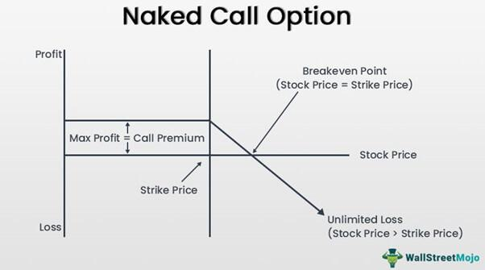

In recent years, the complex strategies within options trading, specifically 'naked puts', 'naked options', and 'naked calls', have gained considerable traction among traders, notably with the surge in algorithmic trading. These terms refer to specific scenarios in options trading where the seller of the option does not hold the underlying asset, presenting both unique opportunities and substantial risks. The absence of an underlying position in these strategies exposes traders to varying potentials for profit and loss, depending on market movements.

The growing popularity of these trading strategies can be attributed to their potential for generating returns, especially in volatile markets. However, they necessitate a deep understanding of market mechanics and a disciplined approach to strategy and risk management. The lack of ownership over the underlying asset means that traders must navigate a complex landscape of margins and premiums, while also being prepared for the scenarios requiring significant capital outlay or accepting large losses.



Algorithmic trading has introduced a transformative dimension to these strategies by enabling traders to execute trades based on predetermined criteria efficiently and accurately. This technological advancement aids in mitigating emotional biases, allowing for more informed and faster decision-making, which can be crucial in the fast-paced world of options trading. Algorithmic trading helps traders to analyze vast amounts of data quickly, identify market trends, and execute trades at the opportune moments, thereby enhancing the effectiveness of trading strategies involving naked options.

Understanding these concepts is critical for traders seeking to leverage advanced trading techniques. Whether you are a novice eager to explore new strategies or an experienced trader looking to refine your approach, a comprehensive grasp of naked puts, naked options, and naked calls, along with the integration of algorithmic trading, is indispensable. As we explore these financial instruments and the associated trading methods, we aim to equip traders with the knowledge necessary to navigate these sophisticated strategies confidently and effectively.

## Table of Contents

## Understanding Naked Options

Naked options are financial derivatives that involve taking an options position without holding the underlying asset. This approach allows traders to speculate on the price movements of the asset itself, rather than managing an offsetting position. Because the trader does not own the underlying asset, naked options trading can be significantly risky.

A typical options position involves a call or put option. A call option gives the holder the right, but not the obligation, to buy the underlying asset at a predetermined price (strike price) within a specified period. Conversely, a put option allows the holder to sell the underlying asset at the strike price within the option's time frame. In a naked option scenario, the trader neither possesses the asset (as in a naked call) nor a corresponding position (as in a naked put).

The lack of ownership or opposing positions results in substantial exposure to price fluctuations. If a trader engages in selling a naked call, the potential losses are theoretically unlimited should the asset's price increase sharply. Similarly, selling a naked put presents risk if the price of the underlying asset falls significantly, obligating the trader to purchase the asset at a higher price than its market value.

Despite these risks, naked options can offer lucrative returns due to premium collection. Traders earn the option premium up front when selling options, which can provide income if the market conditions remain favorable. However, market [volatility](/wiki/volatility-trading-strategies) can drastically affect these strategies' outcomes, requiring traders to carefully monitor market conditions and manage their trades efficiently.

The margin requirements for naked options can also be substantial. Since there is no protective position to offset potential losses, brokers generally require significant margin reserves. Traders must ensure they meet these requirements to avoid margin calls or forced liquidation of positions. This high barrier can limit accessibility for many retail traders, underscoring the advanced nature of naked options trading. 

Overall, naked options represent a strategic approach that requires a keen understanding of market dynamics and a robust risk management plan to navigate effectively.

## What are Naked Puts?

A naked put is a financial strategy employed in options trading where a trader sells put options without holding any position in the underlying stock. This method allows traders to potentially generate income through the collection of premiums associated with the put options. However, it comes with significant risk, as the seller is obligated to purchase the underlying asset at a predetermined strike price if the option buyer decides to exercise their right to sell.

The mechanics of a naked put involve the following process: when a trader sells a naked put, they receive a premium from the buyer. This premium serves as the immediate gain from the transaction. In return, the seller agrees to buy the underlying asset at the strike price before the option expires, should the buyer choose to exercise this option. The profitability of this position hinges on the market price of the underlying asset remaining above the strike price until the expiration of the put option. 

If the market price falls below the strike price, the option buyer has the financial incentive to exercise the option, obligating the seller to purchase the asset at a price higher than the current market value. This could result in substantial losses, especially if the decline in the asset’s price is significant.

For illustration, consider a situation where a trader sells a naked put on a stock with a strike price of $50 and collects a premium of $2 per share. If, at expiration, the stock trades above $50, the option will likely expire worthless, enabling the seller to keep the premium as a profit. Conversely, if the stock price drops to $45, the seller must purchase the stock at $50, incurring a loss of $3 per share ($50 - $45 - $2). 

Given these potential outcomes, naked puts should be approached with caution. They are generally recommended for traders who possess a thorough understanding of risk management and have experience with options trading. Effective risk mitigation strategies, such as setting limits on position sizes and using hedging techniques, are essential for handling the inherent risks associated with this strategy.

## Exploring Naked Calls

Naked calls involve selling call options without possessing the underlying asset, posing inherent financial risks. In this strategy, the trader obliges themselves to sell the asset at a predetermined price if the buyer exercises the option. This can lead to substantial losses if the asset's price surges beyond the strike price, as theoretically, there is no cap on how high prices can rise. Therefore, proper risk management is crucial to mitigate potential losses. 

The primary appeal of naked calls lies in the income generated from the option premiums. Traders receive this premium upfront, and if the option expires worthless, they retain the full amount. However, in scenarios where the underlying asset's value escalates beyond the option's strike price, the seller may incur significant losses, especially since there is no holding of the asset to cushion any adverse movements. 

Implementing naked call strategies requires meticulous market analysis. Traders need to have a clear understanding of potential price movements, factoring in historical volatility, macroeconomic indicators, and sector-specific news that could impact asset prices. Utilizing technical analysis tools, such as moving averages or resistance levels, can aid in predicting price trends and identifying potential entry and [exit](/wiki/exit-strategy) points.

The potentially unlimited risk associated with naked calls necessitates robust risk assessment methodologies. Employing options pricing models, like the Black-Scholes model, can provide valuable insights into option valuations and expected price movements, allowing traders to make informed decisions. Additionally, setting stop-loss orders and maintaining a diversified portfolio can help offset risks associated with adverse market movements.

## The Role of Algorithmic Trading

Algorithmic trading, often abbreviated as algo trading, employs computer algorithms to automate the trading process based on a set of predetermined rules. This allows traders to execute trades with speed and precision that human traders cannot match. In the context of naked options, algo trading provides a robust framework for managing the inherent risks and complexities associated with these strategies.

Naked options trading involves significant exposure to price movements without the safety net of owning the underlying asset. This characteristic makes risk management a critical component of executing such trades successfully. Here, [algorithmic trading](/wiki/algorithmic-trading) can play a crucial role by monitoring real-time market data, assessing options pricing models, and executing trades at moments when the predefined conditions are met. For example, an algo might be programmed to sell a naked put or call option when [volume](/wiki/volume-trading-strategy) and volatility conditions coincide with specific thresholds deemed favorable based on historical data analysis.

One of the primary advantages of using algo trading in naked options is the removal of emotional bias, which can significantly impact decision-making. Algorithms operate on logic and data, executing trades based on objective criteria rather than subjective judgment. This aspect becomes crucial in volatile markets where emotional responses can lead to rash decisions and substantial losses.

The speed at which algorithms can process information and execute trades is another substantial benefit. Markets can move rapidly, and the ability to respond almost instantaneously provides a competitive edge. Algorithms can continuously run simulations based on the latest data, ensuring that traders are executing trades that align with current market conditions. This swift execution capability also improves the opportunities for [arbitrage](/wiki/arbitrage), pricing inefficiencies, and accessing favorable option pricing.

Furthermore, incorporating algo trading enhances the precision of trading strategies. For instance, a well-designed algorithm can incorporate various financial models, such as the Black-Scholes model for options pricing, to calculate theoretical prices and Greeks, which measure an option's sensitivity to various factors. By understanding these numerous dimensions, algos can fine-tune strategies to optimize risk-reward profiles.

In essence, algorithmic trading enhances the ability of traders to manage naked options strategies by incorporating advanced analytics, removing emotional influences, and dramatically increasing the speed and accuracy of trade execution. It enables traders to tackle complex scenarios with greater confidence and efficiency, potentially improving outcomes in the fast-paced financial markets.

## Risks and Rewards

Both naked puts and naked calls are known for their substantial risks due to their speculative nature. These financial strategies expose traders to potentially significant losses, making a comprehensive understanding of their inherent dangers crucial.

Naked puts involve selling put options without owning the underlying asset. If the market price of the underlying asset falls below the strike price, the trader is obliged to buy the asset, potentially at an unfavorable price. Conversely, naked calls involve selling call options without holding the underlying security. If the asset's price surpasses the strike price significantly, losses can be theoretically unlimited, as the seller must acquire the asset at a market price to deliver it to the buyer, contrary to their initial strategy.

Despite these risks, the potential rewards of naked options can be considerable due to the premiums collected from selling options. However, traders must carefully weigh these potential financial gains against the possibility of large losses. Effective risk management is, therefore, imperative when employing these strategies. Tools such as stop-loss orders and meticulous position sizing are essential components of a robust risk management plan. For instance, setting a stop-loss order can limit losses on a naked call position if the underlying asset's price begins to rise unexpectedly.

Understanding market trends, volatility, and potential scenarios also play a critical role in mitigating some of these risks. Analyzing historic price movements, implied volatility, and market conditions can aid traders in making informed decisions. For instance, using technical analysis or market sentiment indicators can provide insights into when to initiate or exit positions.

Incorporating quantitative analysis, traders can employ Python for developing risk management scripts. Here's a simple example of how to calculate the potential loss for a naked call using Python:

```python
# Example Python code to calculate potential loss for a naked call
def calculate_loss(selling_price, strike_price, market_price):
    if market_price > strike_price:
        return (market_price - strike_price) - selling_price
    else:
        return 0

# Example parameters
selling_price = 5  # Premium received for the call
strike_price = 100  # Strike price of the call option
market_price = 120  # Current market price of the asset

potential_loss = calculate_loss(selling_price, strike_price, market_price)
print(f"Potential Loss: ${potential_loss}")
```

In this example, the function `calculate_loss` determines the loss based on various price scenarios, illustrating how traders could programmatically assess risk.

In summary, while engaging in naked puts and naked calls trading can be lucrative, it necessitates adept risk management and a profound understanding of the markets. Traders should be vigilant and employ quantitative tools to navigate the challenges and optimize outcomes effectively.

## Strategies for Successful Trading

Successful naked options trading hinges on a thorough understanding of market conditions and the ability to predict price movements accurately. Traders often rely on a combination of technical and [fundamental analysis](/wiki/fundamental-analysis) to inform their decision-making process.

**Technical Analysis**: This involves evaluating historical market data, primarily price and volume, to forecast future price movements. Common tools include moving averages, relative strength index (RSI), and Bollinger Bands. These tools help traders identify trends and potential reversal points.

Python code for a simple moving average might look like this:

```python
import pandas as pd

# Sample data for stock prices
data = {'Price': [150, 152, 153, 155, 157, 160, 162, 165]}
df = pd.DataFrame(data)

# Calculate 3-day moving average
df['Moving Average'] = df['Price'].rolling(window=3).mean()

print(df)
```

**Fundamental Analysis**: This approach assesses an asset's intrinsic value by examining related economic and financial factors. For example, traders might study financial statements, industry conditions, and broader economic indicators to gauge whether an asset is overvalued or undervalued.

**Portfolio Diversification and Hedged Positions**: Constructing a diversified portfolio involves investing in a range of assets to reduce overall risk. Including hedged positions can further balance the portfolio by offsetting potential losses from one position with gains in another. A classic approach is to pair high-risk naked options with safer, covered options or other defensive assets.

**Algorithmic Trading**: Leveraging algorithms can streamline complex trading strategies. By automating the execution of trades, algorithms minimize human error and emotional bias. For instance, an algorithm can swiftly execute trades when certain market conditions are met, adhering strictly to a trader's predefined criteria.

A basic Python skeleton for an algorithmic trading strategy might look like this:

```python
def trading_strategy(data):
    for index, row in data.iterrows():
        if row['signal'] == 'buy':
            execute_trade('buy', row['asset'], row['price'])
        elif row['signal'] == 'sell':
            execute_trade('sell', row['asset'], row['price'])

def execute_trade(action, asset, price):
    print(f"Executing {action} for {asset} at {price}")
```

In summary, successful trading of naked options demands a blend of solid analytical skills and strategic risk management. By utilizing technical and fundamental analyses, maintaining a diversified and balanced portfolio, and adopting algorithmic trading strategies, traders can enhance their probability of achieving favorable outcomes.

## Conclusion

Naked puts, naked calls, and other naked options strategies present both opportunities and challenges for traders. These strategies revolve around selling options without holding the corresponding underlying asset, exposing traders to potential rewards from premium collection but also carrying significant risks, particularly if market movements are unfavorable. Successful implementation of these strategies requires meticulous planning, a deep understanding of market conditions, and robust risk management techniques. This includes using tools such as stop-loss orders and position sizing to protect against large losses.

Algorithmic trading can significantly enhance the effectiveness of naked options strategies. By using predefined algorithms, traders can execute trades with precision, devoid of emotional bias, and react instantly to market changes. The capability of algorithms to rapidly analyze vast market data and predict potential price movements provides traders with a distinct advantage. This technological support helps in maximizing potential gains while mitigating associated risks.

Continuous learning is essential for traders employing naked options strategies. Financial markets are dynamic, requiring traders to stay informed about new trends, technological advancements, and regulatory changes. Adapting to these evolving conditions is paramount for maintaining a competitive edge. By leveraging technology and maintaining a commitment to education, traders can optimize their trading outcomes, making informed decisions that align with their risk tolerance and investment goals.

## References & Further Reading

[1]: Hull, J. C. (2018). ["Options, Futures, and Other Derivatives"](https://www.semanticscholar.org/paper/Options%2C-Futures%2C-and-Other-Derivatives-Hull/89bdee500c8623864fc9eb7a471546aa713acc44). Pearson Education.

[2]: McMillan, L. G. (2004). ["Options as a Strategic Investment"](https://www.amazon.com/Options-Strategic-Investment-Lawrence-McMillan/dp/0735201978). Penguin Publishing Group.

[3]: Black, F. & Scholes, M. (1973). ["The Pricing of Options and Corporate Liabilities."](https://www.cs.princeton.edu/courses/archive/fall09/cos323/papers/black_scholes73.pdf) Journal of Political Economy.

[4]: Jansen, S. (2020). ["Machine Learning for Algorithmic Trading - Second Edition"](https://github.com/stefan-jansen/machine-learning-for-trading). Packt Publishing.

[5]: Lopez de Prado, M. (2018). ["Advances in Financial Machine Learning"](https://www.amazon.com/Advances-Financial-Machine-Learning-Marcos/dp/1119482089). Wiley.

[6]: Chan, E. P. (2008). ["Quantitative Trading: How to Build Your Own Algorithmic Trading Business"](https://github.com/ftvision/quant_trading_echan_book). John Wiley & Sons.

[7]: Aronson, D. R. (2006). ["Evidence-Based Technical Analysis: Applying the Scientific Method and Statistical Inference to Trading Signals"](https://www.amazon.com/Evidence-Based-Technical-Analysis-Scientific-Statistical/dp/0470008741). Wiley.