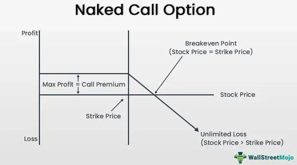

## Table of Contents

## What are naked options?

Naked options are a type of options trading where you sell an option without owning the underlying asset. This is different from covered options, where you own the asset you're selling the option on. When you sell a naked option, you're taking on more risk because you don't have the asset to deliver if the buyer decides to exercise the option.

For example, if you sell a naked call option on a stock, you're promising to sell the stock at a certain price if the buyer wants to buy it. But since you don't own the stock, you'll have to buy it at the market price, which could be higher than the price you promised to sell it for. This means you could lose money if the stock price goes up a lot. Because of this higher risk, naked options are usually only allowed for experienced traders.

## What is the difference between a naked call and a naked put?

A naked call is when you sell a call option without owning the stock it's based on. A call option gives the buyer the right to buy the stock at a set price. If you sell a naked call and the stock price goes up a lot, you might have to buy the stock at the higher market price to sell it to the buyer at the lower set price. This can lead to big losses because you don't own the stock to begin with.

A naked put is when you sell a put option without having the cash to buy the stock if needed. A put option gives the buyer the right to sell the stock to you at a set price. If you sell a naked put and the stock price drops a lot, the buyer might want to sell you the stock at the higher set price. You'll have to buy it at that price even though the market price is lower, which can also lead to losses. Both naked calls and naked puts [carry](/wiki/carry-trading) high risks because you're promising to buy or sell something you don't have.

## How does one initiate a naked options trade?

To start a naked options trade, you first need to have a brokerage account that allows you to trade options. Not all brokerages let you do naked options because they are risky, so you might need to ask your broker if they allow it. Once you have the right account, you go to the options trading section of your broker's platform. You'll see a list of options for different stocks, and you can choose to sell a call or a put option without owning the stock or having the cash to buy it.

After [picking](/wiki/asset-class-picking) the option you want to sell, you enter the details like how many options you want to sell and at what price. You then place the order to sell the naked option. Remember, selling a naked option means you're promising to buy or sell the stock at a set price if the buyer wants to do the trade. This can be risky because if the stock price moves a lot, you might lose money. Always make sure you understand the risks before you start trading naked options.

## What are the risks associated with selling naked calls?

Selling naked calls is risky because you're promising to sell a stock at a set price even if you don't own it. If the stock's price goes up a lot, you might have to buy it at the higher market price to sell it to the buyer at the lower set price. This can lead to big losses. For example, if you sold a naked call with a strike price of $50 and the stock jumps to $100, you lose $50 per share, minus the premium you got for selling the option.

Another risk is that the stock could go up suddenly because of unexpected news or events. This is called a gap up, and it can happen overnight or over a weekend. If the stock gaps up past your strike price, you're in trouble because you have to buy the stock at the higher price to fulfill your promise. Also, selling naked calls can lead to unlimited losses because there's no limit to how high a stock's price can go. So, it's really important to understand these risks before you decide to sell naked calls.

## What are the risks associated with selling naked puts?

Selling naked puts means you promise to buy a stock at a set price if the buyer wants to sell it to you. If the stock price drops a lot, you'll have to buy it at the higher set price even though it's worth less in the market. This can lead to losses. For example, if you sold a naked put with a strike price of $50 and the stock falls to $30, you lose $20 per share, minus the premium you got for selling the option.

Another risk is that the stock could drop suddenly because of bad news or unexpected events. This is called a gap down, and it can happen overnight or over a weekend. If the stock gaps down below your strike price, you're stuck buying it at the higher price. While the risk of selling naked puts is not unlimited like with naked calls, because a stock can't go below zero, the potential losses can still be big if the stock price falls a lot. It's important to understand these risks before you decide to sell naked puts.

## What are the potential rewards of trading naked options?

Trading naked options can be rewarding because you get to keep the premium you collect when you sell the option. This is money you earn right away, and it's yours to keep no matter what happens with the stock price later. If the stock price stays the same or moves in your favor, you can make a nice profit from the premium without having to do anything else.

Another benefit is that you can use naked options to make money in different market conditions. If you think a stock won't move much, you can sell options and keep the premium. Or, if you think a stock will go down, selling a naked call can be a good way to earn money from the premium while betting against the stock. This flexibility can help you find opportunities to make money even when the market is not going up.

## How does margin requirement work for naked options?

When you sell naked options, you need to have enough money in your account to cover the risk. This is called a margin requirement. It's like a safety net for the broker to make sure you can handle any losses. The margin requirement is usually set by the broker and can change based on how risky the option is. For naked calls, the margin can be high because the potential losses are unlimited. For naked puts, the margin might be a bit lower, but it's still important because you might have to buy the stock at a high price if it drops a lot.

The margin requirement is calculated based on things like the price of the stock, how much the stock moves around ([volatility](/wiki/volatility-trading-strategies)), and how long the option lasts. If the stock price moves a lot, the broker might ask for more money to be added to your account. This is called a margin call. You need to keep an eye on your account to make sure you always have enough money to meet the margin requirements. If you don't, the broker might close your position to protect themselves from the risk.

## What are some common strategies used in naked options trading?

One common strategy in naked options trading is selling naked puts. This is when you think a stock won't go down much. You sell the put option and collect the premium. If the stock stays above the strike price until the option expires, you keep the premium as profit. But if the stock falls below the strike price, you have to buy the stock at that higher price, which can lead to losses. This strategy can be good for [earning](/wiki/earning-announcement) extra income if you're willing to buy the stock at a certain price.

Another strategy is selling naked calls. This is riskier because the potential losses can be unlimited. You do this when you think a stock won't go up much. You sell the call option and collect the premium. If the stock stays below the strike price until the option expires, you keep the premium as profit. But if the stock goes above the strike price, you have to sell the stock at that lower price even if you have to buy it at a higher market price. This can lead to big losses if the stock price jumps a lot.

Some traders also use a mix of naked calls and puts to make money in different market conditions. For example, they might sell naked puts on stocks they want to own and sell naked calls on stocks they think won't go up. This way, they can earn premiums from both sides. But it's important to understand the risks because both naked calls and puts can lead to big losses if the market moves against you.

## How can one manage the risk of naked options positions?

Managing the risk of naked options positions is really important because they can lead to big losses. One way to manage risk is by setting stop-loss orders. A stop-loss order is like a safety net that automatically closes your position if the stock price moves too far against you. This can help limit how much money you lose. Another way to manage risk is by keeping a close eye on your margin requirements. If the stock price moves a lot, your broker might ask for more money in your account. Make sure you always have enough money to meet these margin calls, or your broker might close your position to protect themselves.

Another good way to manage risk is by diversifying your trades. Instead of putting all your money into one naked option, spread it out over different stocks or different types of options. This way, if one trade goes bad, it won't hurt your whole account. Also, think about using options strategies that can limit your risk. For example, you might use a spread, where you buy and sell options at different strike prices. This can help cap your potential losses while still letting you make money from the premiums. Always remember, naked options are risky, so it's smart to have a plan to manage that risk.

## What are the regulatory considerations for trading naked options?

Trading naked options comes with some rules you need to follow. In the United States, the Financial Industry Regulatory Authority (FINRA) and the Securities and Exchange Commission (SEC) set these rules. To trade naked options, you need to have a special level of options trading approval from your broker. This is because naked options are risky, and brokers want to make sure you know what you're doing. You might need to show that you have enough experience and money in your account to handle the risks.

Also, brokers have their own rules about margin requirements for naked options. They might ask for more money in your account to cover the risk of big losses. If you don't meet these margin requirements, your broker can close your positions to protect themselves. It's important to know these rules and follow them, or you might not be allowed to trade naked options. Always check with your broker to understand their specific rules and make sure you're following the law.

## How do market conditions affect the viability of naked options strategies?

Market conditions can really change how well naked options strategies work. If the market is calm and stocks aren't moving much, selling naked options can be a good way to make money. You sell the options and collect the premium, and if the stock stays where it is, you keep that money as profit. But if the market gets wild and stocks start moving a lot, naked options can get risky fast. Big moves in stock prices can lead to big losses, especially with naked calls where the losses can be unlimited.

Different market conditions can also make some naked options strategies better than others. In a bull market, where stocks are going up, selling naked puts might be safer because you're betting the stock won't go down much. But in a bear market, where stocks are falling, selling naked calls can be dangerous because stocks can keep going up even when the market is down. It's important to watch the market and think about how it might change before you decide to trade naked options.

## What advanced techniques can be used to optimize naked options trading?

One advanced technique to optimize naked options trading is using delta hedging. Delta is a measure of how much an option's price will change when the stock price changes. By keeping an eye on the delta, you can buy or sell the stock to balance out the risk of your naked options. For example, if you sell a naked call and the stock starts going up, you can buy some of the stock to reduce your risk. This way, you can still make money from the premium but protect yourself from big losses if the stock moves a lot.

Another technique is using volatility analysis. Volatility is how much a stock's price moves around. If you think a stock will be less volatile, you can sell naked options and collect the premium. But if you think the stock will be more volatile, you might want to be careful or use other strategies to manage the risk. You can use tools like the VIX, which measures market volatility, to help you decide when to sell naked options. By understanding and using these advanced techniques, you can make smarter decisions and hopefully make more money while keeping your risks under control.

## References & Further Reading

[1]: Hull, J. C. (2018). ["Options, Futures, and Other Derivatives"](https://www.semanticscholar.org/paper/Options%2C-Futures%2C-and-Other-Derivatives-Hull/89bdee500c8623864fc9eb7a471546aa713acc44). Pearson Education.

[2]: McMillan, L. G. (2004). ["Options as a Strategic Investment"](https://www.amazon.com/Options-Strategic-Investment-Lawrence-McMillan/dp/0735201978). Penguin Publishing Group.

[3]: Black, F. & Scholes, M. (1973). ["The Pricing of Options and Corporate Liabilities."](https://www.cs.princeton.edu/courses/archive/fall09/cos323/papers/black_scholes73.pdf) Journal of Political Economy.

[4]: Jansen, S. (2020). ["Machine Learning for Algorithmic Trading - Second Edition"](https://github.com/stefan-jansen/machine-learning-for-trading). Packt Publishing.

[5]: Lopez de Prado, M. (2018). ["Advances in Financial Machine Learning"](https://www.amazon.com/Advances-Financial-Machine-Learning-Marcos/dp/1119482089). Wiley.

[6]: Chan, E. P. (2008). ["Quantitative Trading: How to Build Your Own Algorithmic Trading Business"](https://github.com/ftvision/quant_trading_echan_book). John Wiley & Sons.

[7]: Aronson, D. R. (2006). ["Evidence-Based Technical Analysis: Applying the Scientific Method and Statistical Inference to Trading Signals"](https://www.amazon.com/Evidence-Based-Technical-Analysis-Scientific-Statistical/dp/0470008741). Wiley.