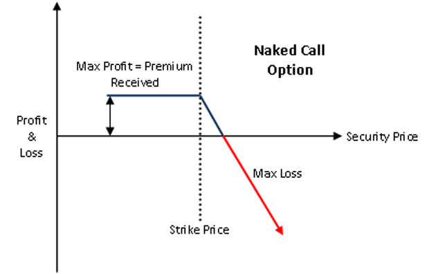

The world of trading encompasses a myriad of financial strategies that traders employ to enhance profitability and mitigate risk. Among these strategies, options trading and algorithmic trading have gained significant traction. Options trading provides investors with the flexibility to engage in financial markets through contracts that grant the right, but not the obligation, to buy or sell an asset at a predetermined price within a specified time frame. This flexibility allows traders to capitalize on market fluctuations while potentially limiting downside risks.

Additionally, algorithmic trading has emerged as a vital tool for traders seeking efficiency and precision. By leveraging computer algorithms to execute trades based on predetermined criteria, algorithmic trading enhances the speed and accuracy of transactions. This approach helps suppress emotional biases that often plague manual trading decisions, enabling a more analytical and data-driven approach to market participation.



This article aims to explore the landscape of financial strategies within options trading, with a particular focus on naked positions and the integral role that algorithmic trading plays in optimizing these strategies. Naked positions involve unhedged, high-risk options trading strategies that, while potentially lucrative, require sophisticated risk management and precise market insights. The combination of options trading with algorithmic strategies presents traders with innovative avenues to navigate the complexities of financial markets, offering tools for effective risk management and strategy execution.

## Table of Contents

## Understanding Naked Positions

A naked position in trading, specifically within options markets, refers to a strategy where an option is sold without holding a position in the underlying asset. This approach introduces substantial risks since the trader does not have an offsetting position to hedge against adverse price movements in the asset. The absence of a hedge means that a trader engaged in naked options trading is wholly exposed to market fluctuations.

In naked options trading, two primary strategies are involved: naked calls and naked puts. Both strategies offer opportunities for profit, but they also come with significant risks due to their unhedged nature.

A naked call occurs when an investor sells a call option without owning the corresponding amount of the underlying asset. If the price of the asset rises above the strike price of the call option, the seller is exposed to potentially unlimited losses, as there is no cap on how high the asset's price can go. The profit for the seller is usually limited to the premium received from selling the option if it expires worthless.

On the other hand, a naked put involves selling a put option without taking a short position in the asset. Here, the risk unfolds if the asset's price falls below the strike price of the put option, potentially requiring the seller to purchase the asset at a price higher than the current market value, effectively bearing a loss equivalent to the difference. The potential for profit, in this case, is also confined to the premium collected at the option's sale.

The inherent risk of these strategies highlights the necessity for robust risk management measures. Successful traders must carefully assess and monitor market conditions to mitigate potential losses while capitalizing on the premiums associated with selling naked options.

## Naked Puts: Risks and Rewards

Naked puts involve selling put options with the aim of generating income through the collection of premiums. A put option provides the buyer the right, but not the obligation, to sell the underlying asset at a specified strike price before the option's expiration. When a trader sells a naked put, they do so without holding a short position in the underlying asset, which can lead to substantial risks for the seller.

The reward for selling naked puts primarily comes from the premiums collected. These premiums represent a source of immediate income and can be attractive, especially in a stable or bullish market where the underlying asset's price remains above the strike price, causing the option to expire worthless. In such scenarios, the trader retains the entire premium as profit.

However, naked puts introduce significant risk if the underlying asset's price drops below the strike price. In this situation, the put option buyer may exercise their right to sell the asset to the seller, forcing the seller to purchase the asset at the agreed-upon strike price, potentially much higher than the current market price. This discrepancy can lead to substantial losses, particularly if the market experiences severe downturns.

To manage these risks, experienced traders implement various risk management strategies. One common approach is the establishment of a predetermined [exit](/wiki/exit-strategy) strategy, such as setting stop-loss orders to limit potential losses. Additionally, traders often monitor the Greeks, particularly the delta and vega, to understand and respond to the sensitivity of the option's price to changes in the underlying asset's price and [volatility](/wiki/volatility-trading-strategies) respectively.

By utilizing these risk management strategies, traders can potentially mitigate the adverse effects of unexpected market movements. Nonetheless, given the inherent risks associated with naked puts, this strategy necessitates a careful assessment of market conditions and a thorough understanding of options trading mechanics.

## Exploring Naked Calls

In options trading, a naked call refers to the strategy of selling a call option without holding the underlying asset. This strategy can offer lucrative opportunities but also exposes the trader to significant risks, primarily due to the nature of call options.

When a trader sells a call option, they receive a premium from the buyer. This premium is the initial profit and provides the seller with a cushion against potential losses. The beauty of this strategy lies in the premium collected if the call option expires worthless, meaning the underlying asset's price remains below the option's strike price until expiration. In such cases, the seller keeps the entire premium as profit.

However, selling naked calls is inherently risky since it involves unlimited potential losses. If the market price of the underlying asset surpasses the strike price of the option, the seller is obligated to deliver the asset at the lower strike price, resulting in a loss. The loss scales with the increase in the asset's price, theoretically without limit, which makes this strategy particularly suitable for experienced traders comfortable with high-risk exposure.

To manage these risks effectively, traders need a deep understanding of market movements and volatility. Market volatility can drastically impact the pricing of options and the likelihood of the options expiring worthless. Strategies such as technical analysis and market sentiment assessments are often employed to gauge potential price movements.

For a practical approach, a trader might analyze historical volatility and implied volatility to forecast potential price ranges. Here is a simple Python code snippet to calculate implied volatility using the Black-Scholes model as an illustration:

```python
from scipy.stats import norm
from scipy.optimize import brentq
import numpy as np

# Black-Scholes formula components
def bs_call_price(S, K, T, r, sigma):
    d1 = (np.log(S / K) + (r + 0.5 * sigma ** 2) * T) / (sigma * np.sqrt(T))
    d2 = d1 - sigma * np.sqrt(T)
    return S * norm.cdf(d1) - K * np.exp(-r * T) * norm.cdf(d2)

# Function to find implied volatility
def find_implied_volatility(market_price, S, K, T, r):
    return brentq(lambda sigma: bs_call_price(S, K, T, r, sigma) - market_price, 0.01, 1.0)

# Example values
S = 100  # Current stock price
K = 105  # Option strike price
T = 1    # Time to expiration in years
r = 0.05 # Risk-free interest rate
market_price = 10  # Market price of the option

# Calculate implied volatility
implied_vol = find_implied_volatility(market_price, S, K, T, r)
print(f"Implied Volatility: {implied_vol:.2%}")
```

In this example, understanding how market conditions such as interest rates, stock prices, and volatility influence option pricing is key. This analysis can inform better decision-making for implementing a naked call strategy in hopes of collecting premiums while mitigating potential downsides.

## Algorithmic Trading in Naked Options

Algorithmic trading automates trading strategies by executing orders using pre-established algorithms without the continuous need for human intervention. This automation is crucial in naked options trading, a strategy that involves selling options without owning the underlying asset. One of the primary benefits of [algorithmic trading](/wiki/algorithmic-trading) in this context is the enhancement of precision and speed in execution, which is essential given the dynamic nature of options markets.

In naked options trading, algorithms play a pivotal role in managing risks and navigating complexities. By continuously analyzing large volumes of market data, they are able to execute rapid trades, reacting to market conditions more swiftly than a human trader could. Algorithms incorporate market indicators, historical data, and real-time analytics to make informed trading decisions. This data-driven approach helps mitigate the risk inherent in naked options, allowing traders to capitalize on short-term market inefficiencies.

Moreover, algorithmic trading effectively removes emotional bias from the decision-making process. Given the high-risk nature of naked positions, impartiality is critical. Emotional trading can lead to impulsive decisions based on fear or greed, which algorithms inherently avoid by sticking strictly to their predefined criteria and rules. For example, if an algorithm is programmed to sell a naked call if the underlying asset's implied volatility exceeds a certain threshold, it will execute this trade based purely on data, without any influence from market sentiment or trader anxiety.

Furthermore, the use of algorithmic trading in naked options facilitates enhanced decision-making through data-driven insights. Machine learning techniques, for instance, can be applied to refine algorithms over time, learning from past data to improve future trading outcomes. This adaptability is particularly useful in the ever-evolving financial markets, where continuous learning and strategy adjustment are paramount.

Below is a simple Python example illustrating how an algorithm can be structured to decide when to sell a naked call based on volatility:

```python
import pandas as pd
import numpy as np

# Load market data
data = pd.read_csv('market_data.csv')

# Predefined volatility threshold
vol_threshold = 0.25

# Function to determine sell condition
def sell_naked_call(volatility, threshold):
    return volatility > threshold

# Apply the function to the market data
data['sell_naked_call'] = np.where(data['implied_volatility'] > vol_threshold, True, False)

# Output potential sell signals
sell_signals = data[data['sell_naked_call'] == True]
print(sell_signals)
```

This script reads market data, applies a condition based on the predefined volatility threshold, and identifies instances where a naked call should be sold. This simple algorithm illustrates the fundamental principles of applying algorithmic strategies to naked options trading.

## Financial Strategies for Successful Trading

Successful trading of naked options necessitates a robust understanding of both market dynamics and effective financial strategies. Central to this process is detailed market analysis, which incorporates both technical and fundamental strategies. Technical analysis involves evaluating statistical trends from trading activity, such as price movement and [volume](/wiki/volume-trading-strategy). Tools commonly used in this analysis include moving averages, oscillators like the Relative Strength Index (RSI), and chart patterns. These tools aid in predicting future price movements of the underlying assets associated with naked options.

Fundamental analysis, on the other hand, involves assessing the intrinsic value of a security by examining related economic, financial, and other qualitative and quantitative factors. This includes evaluating financial statements, management quality, industry conditions, and broader economic signals to gauge the appropriate valuation of the underlying asset. The strength of such comprehensive analysis lies in its ability to inform traders about possible market moves, thereby enabling more informed decision-making.

Incorporating hedged positions within a trading portfolio is another crucial strategy for managing the risks associated with naked options. Hedging involves taking a position in a related security to reduce the risk of adverse price movements. For example, a trader selling a naked put may hedge their position by buying a put at a lower strike price, thereby limiting potential losses should the price of the underlying asset fall significantly.

Portfolio diversification further enhances risk management by spreading investments across various assets to reduce exposure to any single asset’s risk. This strategy helps balance the high-risk nature of naked options by ensuring that adverse movements in one asset are offset by favorable movements in others.

Algorithmic trading represents a modern approach to refining trading strategies, particularly in handling the complexities of naked options. By automating trading strategies based on predefined rules, algorithmic trading ensures precise execution, reducing the latency between trend identification and trade execution. This precision is crucial when dealing with the high-risk nature of naked options, where swift market changes can significantly impact potential outcomes.

Moreover, algorithmic trading systems are designed to process vast amounts of market data quickly and to make trades based on complex algorithms without human intervention. This removes emotional bias from trading decisions, allowing for a more objective approach to handling market volatility and potential risks. By leveraging data-driven insights, traders can enhance their decision-making processes, ensuring a systematic approach to market entries and exits.

Continuous refinement and back-testing of algorithmic strategies are essential to ensure their effectiveness under various market conditions. This constant iteration supports the development of more robust trading models capable of adapting to the dynamic nature of financial markets.

In conclusion, successful trading of naked options relies on a symbiotic integration of thorough market analysis, diversification strategies, and the use of advanced algorithmic trading tools. This multifaceted approach not only mitigates risks but also enhances the potential for profit through informed and precision-based trading decisions.

## Conclusion

Naked options trading can be highly lucrative but also carries substantial financial risks that traders must adeptly manage. Engaging in naked options positions necessitates a comprehensive strategy to handle the potential volatility and absence of hedging. Traders are exposed to significant losses, often unlimited in the case of naked calls, making it imperative to employ well-rounded strategies to mitigate these risks effectively.

Algorithmic trading plays a pivotal role in enhancing the capabilities of traders engaged in naked options. By utilizing algorithms, traders can leverage automated processes that analyze vast amounts of market data, execute trades with precision, and adapt to market fluctuations in real-time. This technology aids in removing emotional biases from trading decisions, ensuring that actions are based on robust, data-driven insights. For example, algorithms can be programmed to trigger sell-offs if an option's price surpasses a certain threshold, thereby minimizing potential losses.

Moreover, the fast-paced nature of algorithmic trading aligns well with the intricacies of options markets, where milliseconds can significantly impact the outcome of a trade. Programmable strategies can incorporate conditions derived from mathematical models such as the Black-Scholes model, allowing for calculated premeditation in dynamic environments.

Continuous learning and adaptation are fundamental for achieving success in naked options trading. Market conditions are ever-changing, requiring traders to stay informed about emerging trends, regulatory changes, and economic indicators that can influence option pricing. Familiarity with cutting-edge trading technologies and strategies should be constantly updated to refine personal and algorithmic models alike.

In conclusion, while naked options present financial opportunities, they demand a robust strategy that emphasizes risk management and adaptability. Harnessing algorithmic trading enhances trader efficiency, offering a competitive edge through meticulous market analysis and timely execution. Remaining vigilant and committed to learning will ensure traders are well-prepared to navigate the complexities of naked options trading.

## References & Further Reading

Hull, J. C. "Options, Futures, and Other Derivatives." This authoritative text provides a comprehensive overview of derivatives markets, explaining both the theoretical frameworks and practical applications relevant to options trading, including the discussion of complex strategies like naked options and algorithmic trading. It is an essential resource for understanding underlying market mechanisms and the intricacies of risk management.

McMillan, L. G. "Options as a Strategic Investment." McMillan's work offers an in-depth analysis of various options trading strategies, emphasizing tactical approaches that include naked options. It provides insights into risk assessment and profit potential, equipping traders with strategies to navigate both basic and advanced options markets effectively.

Black, F. & Scholes, M. "The Pricing of Options and Corporate Liabilities." This seminal paper lays the foundation for modern options pricing theory, introducing the Black-Scholes model. The model is crucial for the valuation of options, including naked calls and puts, by helping traders and financial strategists calculate the fair market value of options, thereby quantifying the associated risks.

For practical applications and algorithmic implementation, traders may explore algorithmic trading frameworks using platforms like QuantConnect or using a Python-based setup. For example, using Python libraries like `pandas` and `numpy` for data analysis, alongside `scikit-learn` for predictive modeling, enhances the accuracy and precision of executing naked options strategies. Engaging with these resources allows for a mix of theoretical understanding and technical skill, necessary for successful participation in options and algorithmic trading.

