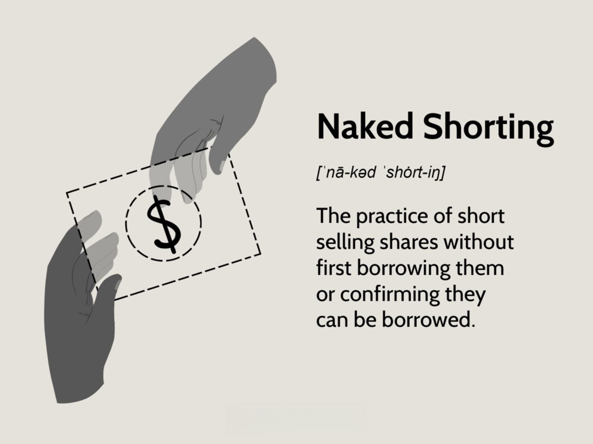

## Table of Contents

## What is naked short selling?

Naked short selling is when someone sells a stock they haven't borrowed yet. Normally, when you short sell, you borrow a stock and then sell it, hoping to buy it back later at a lower price. But with naked short selling, you skip the borrowing part and just sell the stock. This can be risky because it can lead to more stocks being sold than actually exist, which can mess up the market.

This practice is often illegal because it can cause big problems. If too many people do naked short selling, it can make a stock's price drop a lot, even if the company is doing well. This can hurt investors and the company itself. That's why many countries have rules against naked short selling, to keep the stock market fair and stable.

## How does naked short selling differ from regular short selling?

Naked short selling and regular short selling are both ways to bet that a stock's price will go down, but they work a bit differently. In regular short selling, you first borrow shares of a stock from someone else, usually through a broker. Then you sell those borrowed shares at the current market price. Later, if the price drops, you can buy the shares back cheaper and return them to the person you borrowed them from, keeping the difference as profit.

Naked short selling skips the borrowing step. Instead of borrowing shares first, you just sell shares you don't actually have. This can be risky because it can lead to more shares being sold than actually exist. It's like promising to give someone an apple without actually having one to give. If everyone starts doing this, it can cause big problems in the market because it messes with the supply and demand of the stock.

Because of these risks, naked short selling is often against the rules in many places. Regulators want to keep the stock market fair and stable, so they have strict laws against selling shares you don't have. Regular short selling, on the other hand, is legal as long as you follow the rules about borrowing and returning the shares.

## What is the mechanism behind naked short selling?

Naked short selling happens when someone decides to sell a stock without first borrowing it. Imagine you want to sell apples but you don't have any. You just tell people you have apples to sell, and they pay you for them. Later, you need to find those apples to give to the buyers. In the stock market, instead of apples, it's shares of a company. When you naked short sell, you're promising to deliver shares you don't actually have yet.

This can cause big problems because more shares can be sold than actually exist. It's like if everyone started selling apples they didn't have, soon there would be too many promises and not enough apples. This can make the price of the stock go down a lot, even if the company is doing well. That's why many places have rules against naked short selling. They want to make sure the stock market stays fair and that there are enough shares to go around.

## What are the potential benefits of naked short selling?

Naked short selling can help the stock market work better by making it easier to sell stocks quickly. If someone thinks a stock's price is going to drop, they can sell it right away without waiting to borrow the shares. This can make the market more active and help prices move to where they should be faster. It can also make it easier for people to bet against a stock, which is important for keeping the market balanced.

However, there are big risks with naked short selling. It can cause the price of a stock to go down a lot, even if the company is doing well. This can hurt investors and the company itself. That's why many places have strict rules against it. They want to make sure the stock market stays fair and stable, and that there are enough shares to go around.

## What are the risks associated with naked short selling?

Naked short selling can cause big problems in the stock market. When people sell shares they don't have, it can lead to more shares being sold than actually exist. This can make the price of a stock drop a lot, even if the company is doing well. If the price goes down too much, it can hurt the company and the people who own its stock. It's like if everyone started selling apples they didn't have, soon there would be too many promises and not enough apples.

Another risk is that it can be hard to find the shares you need later. If you sell shares you don't have, you need to buy them back to give to the people who bought them from you. But if the price goes up instead of down, you might have to pay a lot more to get the shares. This can lead to big losses. That's why many places have rules against naked short selling. They want to keep the stock market fair and make sure there are enough shares to go around.

## Is naked short selling legal?

Naked short selling is often against the law in many places. It's when someone sells a stock they haven't borrowed yet. This can cause big problems because it can lead to more stocks being sold than actually exist, which can make the price drop a lot. Many countries have rules to stop this from happening because they want to keep the stock market fair and stable.

However, the rules can be different in different places. In some countries, naked short selling is completely illegal. In others, it might be allowed under certain conditions or for certain types of stocks. It's important for people who trade stocks to know the rules in their country to avoid breaking the law.

## In which countries is naked short selling regulated or banned?

Many countries have rules about naked short selling to keep their stock markets fair and stable. In the United States, naked short selling is mostly against the law. The Securities and Exchange Commission (SEC) has rules that say you have to borrow the stock before you can sell it. If you don't follow these rules, you can get in big trouble. In Europe, the rules can be different depending on the country, but many have strict laws against naked short selling. For example, Germany and France have banned it completely.

In other parts of the world, the rules can also vary. In Australia, naked short selling is illegal, and the Australian Securities and Investments Commission (ASIC) makes sure people follow the rules. In Canada, it's also against the law, and the Investment Industry Regulatory Organization of Canada (IIROC) keeps an eye on things. Some countries, like Japan, have rules that allow naked short selling but only under certain conditions. It's important for people who trade stocks to know the rules in their country so they don't break the law.

## What are the regulatory measures against naked short selling?

Many countries have rules to stop naked short selling because it can cause big problems in the stock market. In the United States, the Securities and Exchange Commission (SEC) says you have to borrow the stock before you can sell it. If you don't follow these rules, you can get in big trouble. In Europe, countries like Germany and France have banned naked short selling completely. They want to make sure their stock markets stay fair and stable.

In other parts of the world, the rules can be different but are still strict. In Australia, naked short selling is illegal, and the Australian Securities and Investments Commission (ASIC) makes sure people follow the rules. In Canada, it's also against the law, and the Investment Industry Regulatory Organization of Canada (IIROC) keeps an eye on things. Some countries, like Japan, allow naked short selling but only under certain conditions. These rules help keep the stock market fair and make sure there are enough shares to go around.

## How can naked short selling impact the stock market?

Naked short selling can cause big problems in the stock market. It happens when people sell shares they don't have yet. This can lead to more shares being sold than actually exist. When this happens, the price of the stock can drop a lot, even if the company is doing well. This can hurt the company and the people who own its stock. It's like if everyone started selling apples they didn't have, soon there would be too many promises and not enough apples.

Regulators have strict rules against naked short selling because they want to keep the stock market fair and stable. In many countries, it's against the law to sell shares you don't have. If too many people do naked short selling, it can mess up the market and make prices go down a lot. This can cause big losses for investors and hurt the companies whose stocks are being sold. That's why it's important to follow the rules and make sure there are enough shares to go around.

## What are some historical examples of naked short selling?

One famous example of naked short selling happened during the 2008 financial crisis. Some people thought that big banks like Lehman Brothers were in trouble, so they started selling their stocks without borrowing them first. This made the price of Lehman Brothers' stock drop a lot, even faster than it would have if people had followed the rules. It made things worse for Lehman Brothers and helped cause the big financial crisis.

Another example is the case of Overstock.com in the early 2000s. The company's CEO, Patrick Byrne, claimed that naked short sellers were selling his company's stock without borrowing it first. He said this was making the stock price go down unfairly. Overstock.com took legal action against some big Wall Street firms, and it brought a lot of attention to the problem of naked short selling. Even though it was hard to prove, it showed how naked short selling can hurt a company and its investors.

## How can investors protect themselves from the effects of naked short selling?

Investors can protect themselves from the effects of naked short selling by staying informed about the companies they invest in. They should keep an eye on the news and financial reports to see if there are any signs that a company might be a target for naked short sellers. If a stock's price starts to drop a lot without any clear reason, it could be a sign of naked short selling. By understanding what's going on, investors can make better decisions about when to buy or sell their stocks.

Another way to protect against naked short selling is to diversify their investments. Instead of putting all their money into one stock, investors can spread it out across different companies and industries. This way, if one stock's price drops because of naked short selling, it won't hurt their whole investment. It's also a good idea to use stop-loss orders, which automatically sell a stock if its price drops to a certain level. This can help limit losses if a stock's price falls suddenly due to naked short selling.

## What are the current debates and future outlook on naked short selling regulations?

There are a lot of debates about naked short selling and what the rules should be. Some people think that naked short selling should be allowed because it can help the stock market work better. They say it makes it easier for people to bet against a stock, which can help keep prices fair. But others think it's too risky and should be banned completely. They worry that it can cause big problems in the market, like making stock prices drop a lot even if the company is doing well. This can hurt investors and the companies whose stocks are being sold.

In the future, it's hard to say what will happen with naked short selling rules. Some countries might keep their strict rules against it, while others might change their laws to allow it under certain conditions. As more people learn about naked short selling and its effects, there might be more pressure to make the rules clearer and stronger. But it's also possible that new technology and ways of trading could make it harder to stop naked short selling completely. So, the debate will likely keep going as people try to find the best way to keep the stock market fair and stable.

## References & Further Reading

[1]: Jones, C. M., & Lamont, O. A. (2002). ["Short-sale constraints and stock returns."](https://www.nber.org/papers/w8494) Journal of Financial Economics, 66(2-3), 207-239.

[2]: U.S. Securities and Exchange Commission. ["Key Points About Regulation SHO."](https://www.sec.gov/investor/pubs/regsho.htm)

[3]: De Prado, M. L. (2018). ["Advances in Financial Machine Learning."](https://www.amazon.com/Advances-Financial-Machine-Learning-Marcos/dp/1119482089) Wiley.

[4]: Deville, L., & Riva, F. (2007). ["Naked Short Selling: The Emperor's New Clothes?"](https://www.ou.edu/dam/price/Finance/files/Naked_Short_Selling.pdf) SSRN Electronic Journal.

[5]: Chan, E. P. (2009). ["Quantitative Trading: How to Build Your Own Algorithmic Trading Business."](https://github.com/ftvision/quant_trading_echan_book) Wiley.

[6]: Hendershott, T., Jones, C. M., & Menkveld, A. J. (2011). ["Does Algorithmic Trading Improve Liquidity?"](https://onlinelibrary.wiley.com/doi/full/10.1111/j.1540-6261.2010.01624.x) American Economic Review, 101(1), 1-44.

[7]: Gomber, P., Arndt, B., Lutat, M., & Uhle, T. (2011). ["High-Frequency Trading."](https://papers.ssrn.com/sol3/papers.cfm?abstract_id=1858626) IT - Information Technology, 53(4), 159-164.