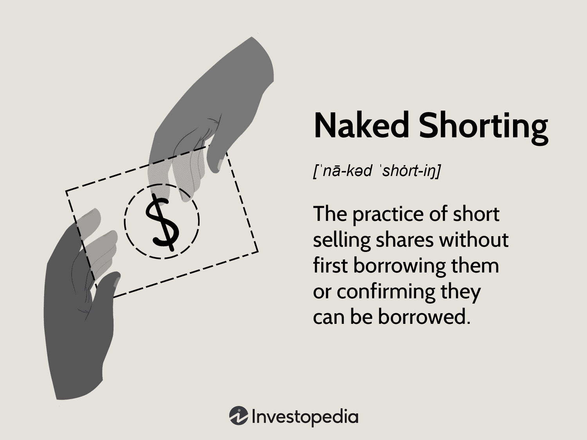

## Table of Contents

## What is naked short selling?

Naked short selling is when someone sells a stock they don't own and haven't borrowed. Normally, when you short sell, you borrow the stock first and then sell it, hoping to buy it back later at a lower price. But with naked short selling, you skip the borrowing part. This can cause problems because it can lead to more shares being sold than actually exist, which can mess up the stock's price.

This practice is often illegal because it can harm the market. It's different from regular short selling, which is legal and helps keep the market balanced. Naked short selling can make a stock's price drop a lot, which can hurt the company and its investors. That's why many countries have strict rules against it.

## How does naked short selling differ from regular short selling?

Naked short selling and regular short selling are both ways to bet that a stock's price will go down, but they are done differently. In regular short selling, you first borrow the stock from someone who owns it, then you sell it. You hope to buy it back later at a lower price, return it to the owner, and keep the difference as profit. This is a common and legal way to trade in the stock market.

Naked short selling skips the borrowing part. You sell the stock without owning it or borrowing it first. This can be risky and is often illegal because it can lead to more shares being sold than actually exist. This can cause the stock price to drop a lot more than it should, which can hurt the company and other investors. That's why many places have rules against naked short selling.

## Is naked short selling legal?

Naked short selling is mostly not allowed in many countries. It's seen as a risky move that can mess up the stock market. When someone does naked short selling, they sell stocks they don't own or haven't borrowed. This can lead to more stocks being sold than actually exist, which can make the stock price drop a lot. That's why many places have rules to stop it.

In the United States, for example, the SEC (Securities and Exchange Commission) has rules against naked short selling. They want to keep the market fair and safe for everyone. But, there are some special cases where it might be allowed, like when a market maker needs to keep the market running smoothly. Still, these cases are rare and tightly controlled.

## What are the potential risks of naked short selling for investors?

Naked short selling can be very risky for investors. When someone does naked short selling, they sell stocks they don't own or haven't borrowed. This can lead to more stocks being sold than actually exist. This can make the stock price drop a lot more than it should. If you own the stock, this sudden drop can hurt you a lot because your investment loses value quickly.

Also, naked short selling can make the market less fair. It can be hard to know if the price of a stock is going down because it's not doing well, or because someone is doing naked short selling. This can make it tough for investors to make good choices. If the market gets too messed up, it can lead to big problems, like a market crash. That's why many places have rules to stop naked short selling and keep the market safe for everyone.

## Can you explain the mechanics of how naked short selling occurs?

Naked short selling happens when someone decides to sell a stock they don't own and haven't borrowed. Normally, if you want to short sell a stock, you would first borrow it from someone who owns it, then sell it. But with naked short selling, you skip the borrowing part. You just go ahead and sell the stock, promising to deliver it later. This can be done through a broker, who might not know that the stock hasn't been borrowed.

The problem with naked short selling is that it can lead to more shares being sold than actually exist. This is called a "failure to deliver." When the time comes to give the stock to the buyer, the seller has to find it somewhere. If they can't, it can cause big problems. The stock price can drop a lot because there are too many shares out there. This can hurt the company and other investors who own the stock. That's why many places have rules to stop naked short selling and keep the market fair.

## What are the regulatory measures in place to prevent naked short selling?

Many countries have rules to stop naked short selling because it can hurt the stock market. In the United States, the Securities and Exchange Commission (SEC) has rules that say you have to deliver the stock you sold within a certain time. If you can't deliver the stock, it's called a "failure to deliver," and the SEC can punish you. They might fine you or even ban you from trading. The SEC also keeps an eye on the market to make sure people are following the rules.

Another way to stop naked short selling is by using something called "close-out requirements." This means that if you can't deliver the stock you sold, you have to buy it back and give it to the buyer right away. This helps stop too many shares from being sold and keeps the stock price from dropping too much. Many countries have these rules to make sure the market stays fair and safe for everyone.

## How does naked short selling impact the stock market?

Naked short selling can mess up the stock market a lot. When someone does naked short selling, they sell stocks they don't own or haven't borrowed. This can lead to more stocks being sold than actually exist, which can make the stock price drop a lot more than it should. If the stock price drops too much, it can hurt the company and the people who own the stock. They might lose a lot of money because their investment is worth less.

This can also make the market less fair. It can be hard for investors to know if the stock price is going down because the company is not doing well, or because someone is doing naked short selling. This can make it tough for investors to make good choices. If the market gets too messed up, it can lead to big problems, like a market crash. That's why many places have rules to stop naked short selling and keep the market safe for everyone.

## What are some historical examples of naked short selling?

One famous example of naked short selling happened with the company Overstock.com. In the early 2000s, Overstock.com said that some people were doing naked short selling on their stock. They said this was making their stock price go down a lot. Overstock.com even took some big banks to court, saying these banks were part of the naked short selling. The case went on for a long time, and it showed how naked short selling can hurt a company and its investors.

Another example is the case of Lehman Brothers. Before Lehman Brothers went bankrupt in 2008, there were rumors that naked short selling was making their stock price drop even more. Some people thought that naked short selling made things worse for Lehman Brothers during the financial crisis. This made the government step in and put new rules in place to stop naked short selling. These examples show how naked short selling can cause big problems in the stock market and why it's important to have rules to stop it.

## How can investors detect if naked short selling is occurring with a stock?

Investors can look for signs that naked short selling might be happening with a stock. One way is to check the stock's "failure to deliver" data. This data shows if there are more shares being sold than actually exist. You can find this information on the SEC's website. If you see a lot of failures to deliver for a stock, it might mean that someone is doing naked short selling.

Another way to spot naked short selling is by watching the stock's price and trading [volume](/wiki/volume-trading-strategy). If the stock price suddenly drops a lot without any clear reason, and the trading volume is very high, it could be a sign of naked short selling. It's important to remember that these signs don't always mean naked short selling is happening, but they can help you keep an eye out for it.

## What are the arguments for and against banning naked short selling?

People who want to ban naked short selling say it can hurt the stock market. They think it can make stock prices drop too much because more shares are sold than really exist. This can be bad for companies and the people who own their stocks. They also say naked short selling can make the market less fair. It's hard to know if a stock's price is going down because the company is not doing well, or because someone is doing naked short selling. That's why they want strict rules to stop it and keep the market safe for everyone.

On the other hand, some people think banning naked short selling might not be a good idea. They say it can help keep the market working smoothly. Sometimes, market makers need to sell stocks they don't own to make sure there are enough shares for everyone to buy and sell. If they can't do this, it might make trading harder. Also, they think that too many rules can make it hard for the market to work well. They believe that instead of banning it, we should have good rules to watch over it and make sure it's not being used to hurt the market.

## How do financial institutions monitor and report naked short selling activities?

Financial institutions monitor naked short selling by keeping an eye on what's called "failure to deliver" data. This data shows if more shares of a stock are being sold than actually exist. They can find this information on the SEC's website. If they see a lot of failures to deliver for a stock, it might mean that someone is doing naked short selling. They also watch the stock's price and trading volume. If the price suddenly drops a lot without a clear reason, and the trading volume is very high, it could be a sign of naked short selling.

Financial institutions report naked short selling activities to the SEC. They have to follow strict rules that say they need to deliver the stock they sold within a certain time. If they can't deliver the stock, they need to report it as a failure to deliver. The SEC uses this information to make sure people are following the rules. If they find out someone is doing naked short selling, they can punish them. This helps keep the market fair and safe for everyone.

## What advanced strategies can be used to mitigate the risks associated with naked short selling?

One advanced strategy to mitigate the risks of naked short selling is to use close monitoring and reporting systems. Investors and financial institutions can keep a close eye on "failure to deliver" data, which shows if more shares are being sold than actually exist. By regularly checking this data, they can quickly spot signs of naked short selling and take action. They might report it to the SEC or adjust their investment strategies to protect themselves from sudden price drops caused by naked short selling. This proactive approach helps keep the market fair and can reduce the impact of illegal activities on their investments.

Another strategy is to use hedging techniques. Investors can buy put options or other financial instruments that gain value if the stock price falls. This way, if naked short selling causes the stock price to drop, the investor can offset some of their losses with gains from the hedging instruments. Additionally, staying informed about market news and regulatory changes can help investors anticipate and react to potential naked short selling. By understanding the market environment and using these advanced strategies, investors can better protect themselves and their investments from the risks associated with naked short selling.

## References & Further Reading

[1]: U.S. Securities and Exchange Commission. ["Regulation SHO."](https://www.sec.gov/investor/pubs/regsho.htm)

[2]: Lopez de Prado, Marcos. ["Advances in Financial Machine Learning,"](https://www.amazon.com/Advances-Financial-Machine-Learning-Marcos/dp/1119482089) Wiley, 2018.

[3]: Jones, Charles M. (2013). ["What Do We Know About High-Frequency Trading?"](https://www.wsj.com/public/resources/documents/HFT0324.pdf) Columbia Business School Research Paper No. 13-11.

[4]: U.S. Securities and Exchange Commission. ["Key Points About Regulation SHO."](https://www.sec.gov/investor/pubs/regsho.htm)

[5]: European Securities and Markets Authority (ESMA). ["Short Selling Regulation,"](https://www.esma.europa.eu/esmas-activities/markets-and-infrastructure/short-selling) ESMA, 2012.

[6]: Patterson, Scott. ["Dark Pools: High-Speed Traders, A.I. Bandits, and the Threat to the Global Financial System,"](https://dl.acm.org/doi/10.5555/2385786) Crown Business, 2012.

[7]: Aldridge, Irene. ["High-Frequency Trading: A Practical Guide to Algorithmic Strategies and Trading Systems,"](https://www.amazon.com/High-Frequency-Trading-Practical-Algorithmic-Strategies/dp/1118343506) Wiley, 2013.