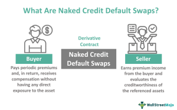

In the complex world of finance, understanding various investment instruments and trading strategies is vital for maximizing returns. This article provides insights into financial instruments, focusing on naked warrants and their associated investment risks, combined with the role of algorithmic trading in managing these risks effectively.

Naked warrants, a sophisticated derivative instrument, offer investors the right, but not the obligation, to trade a specific security. Unlike traditional warrants tied to bonds or stocks, naked warrants stand alone, unconnected to any company's issued securities. This unique nature provides opportunities for flexibility and leverage, although it also introduces elements of risk that require careful attention from investors.



Algorithmic trading emerges as an effective tool in scenarios involving naked warrants. By automating trading processes and employing algorithms based on predefined rules, it can exploit pricing inefficiencies and manage volatility in real-time. This automated trading approach surpasses human capabilities in speed and precision, thus enhancing trade execution.

Moreover, this article will explore how integrating high-return warrants with algorithmic trading systems can optimize performance. By employing sophisticated strategies and leveraging technological advancements, investors can improve their decision-making processes. The integration of such systems allows for better timing in entry and exit points, thus maximizing returns while controlling risks inherent in volatile market conditions.

This guide aims to provide a comprehensive understanding of these elements and their interactions in modern investment strategies. By structuring the article to address both novice and seasoned investors, we invite a broader audience to engage with and navigate the sophisticated investment landscape that naked warrants and algorithmic trading present.

## Table of Contents

## Understanding Naked Warrants

Naked warrants, often referred to as covered warrants, are a type of derivative instrument that endows the holder with the right, but not the obligation, to buy or sell an underlying security at a predetermined price before the expiration date. The primary distinction between traditional warrants and naked warrants lies in their underlying securities. While traditional warrants are typically issued by businesses and directly linked to their equity or debt instruments, naked warrants are not tied to any specific issued security by a company. Instead, they originate from financial institutions and are actively traded on major financial exchanges.

The absence of an attachment to specific corporate securities provides naked warrants with a significant degree of flexibility. This feature enables investors to gain leveraged exposure to various underlying assets without the obligation of ownership, which can potentially result in higher returns compared to direct investments. However, this leverage also escalates the risk profile of naked warrants, making them inherently more speculative and subject to substantial price [volatility](/wiki/volatility-trading-strategies).

Additionally, naked warrants introduce complexities primarily related to their speculative nature. Their value is significantly influenced by the underlying asset's price movements, leading to high volatility. Consequently, they pose significant risks, including the potential for substantial losses if the market moves unfavorably.

One of the essential considerations in trading naked warrants is managing expiration risk. These warrants have a finite lifetime, and if they expire "out of the money" (meaning the exercise price is not favorable compared to the market price), they can become worthless, resulting in a total loss of the investment. Other factors influencing the pricing and risk of naked warrants include time decay, or theta, which describes how the warrant's value diminishes as it approaches expiration, and delta, which measures the expected change in the price of the warrant relative to a change in the price of the underlying asset.

Investors should also be mindful of the broader market conditions, which can impact the [liquidity](/wiki/liquidity-risk-premium) and pricing of naked warrants. Highly liquid markets can facilitate easier entry and [exit](/wiki/exit-strategy) from warrant positions, while illiquid conditions may trap investors or lead to adverse price movements. Therefore, understanding both the mechanics of naked warrants and the market dynamics that affect them is crucial for effective risk management and optimal investment outcomes.

## Investment Risks of Naked Warrants

Warrants are financial derivatives that allow investors to gain exposure to an underlying asset with potentially higher returns due to leverage. However, this leverage also amplifies the risks associated with naked warrants. One of the primary risks is the expiration date. If a warrant expires without being exercised, the holder loses the premium paid, rendering the investment worthless. This characteristic underscores the importance of timing and market awareness when trading warrants.

Market volatility is another significant [factor](/wiki/factor-investing) influencing the valuation of naked warrants. The prices of these instruments tend to be highly sensitive to fluctuations in the underlying asset's market price. This sensitivity can result in sharp value changes, making them unpredictable and potentially rewarding or perilous depending on the investor's position.

Liquidity is a crucial consideration in warrant trading. Low liquidity can hinder an investor's ability to enter or exit positions efficiently, often leading to market price impacts due to large trade sizes. In illiquid markets, executing trades at desired prices can be challenging, increasing the potential for financial loss.

Dilution risk is a further concern for investors in naked warrants. When these warrants are exercised, they can be converted into shares, potentially increasing the total number of shares outstanding. This dilution can adversely affect shareholder equity and the stock's market price, impacting the overall value of an investor's holdings.

The combination of these risks necessitates strategic planning and careful risk assessment when dealing with naked warrants. Investors must weigh the potential for high returns against the amplified risks these financial instruments present. By maintaining a keen understanding of market dynamics and expiration timelines, traders can better navigate the complexities of naked warrants.

## Algorithmic Trading in the Warrant Market

Algorithmic trading leverages advanced computational models and technologies to execute trades at extraordinary speeds and with impeccable precision, outperforming human traders in most scenarios. In the context of the warrant market, these algorithms are designed specifically to take advantage of the inherent pricing inefficiencies and volatility associated with these financial instruments. By systematically analyzing real-time data, algorithms can optimize trade execution, capitalizing on opportunities that might be missed during manual trading.

The ability to process vast datasets enables these algorithms to identify market trends and evaluate risk factors rapidly. This constant stream of analysis allows for dynamic adjustments to trading strategies, which is particularly crucial in the high-stakes environment of warrant trading. Various strategies are employed in this process, each targeted at different aspects of market behavior.

Trend-following algorithms aim to detect and exploit long-term market movements, anticipating future price directions based on historical data patterns. These algorithms are valuable in markets with sustained trends, where persistent directional trading can yield significant returns.

Statistical [arbitrage](/wiki/arbitrage) involves complex quantitative models to identify price discrepancies between related securities or market segments. By exploiting these slight differences, algorithms can execute high-frequency trades to profit from inevitable price corrections.

Momentum strategies focus on the strength of recent price movements to anticipate continued trends, allowing traders to ride the wave of price [momentum](/wiki/momentum) until signs of reversal appear. This approach requires precise timing and swift execution, both of which are well-suited to algorithmic systems.

Algorithmic trading also plays a critical role in implementing robust risk management frameworks. Given the volatile nature of the warrant market, mitigating potential losses is essential. Algorithms can apply stop-loss orders, monitor market conditions for adverse changes, and adjust positions automatically to limit exposure to risk.

Python is commonly used for [algorithmic trading](/wiki/algorithmic-trading) due to its extensive libraries and tools for data analysis and [machine learning](/wiki/machine-learning). For example, libraries like NumPy and Pandas are invaluable for data manipulation, while platforms like Quantitative Python (quandl) can retrieve financial data. Additionally, machine learning frameworks like TensorFlow or PyTorch can be incorporated to develop predictive models that enhance trading strategies.

Here is a simple example of a Python script for a trend-following strategy using historical price data:

```python
import pandas as pd
import numpy as np

def moving_average(data, window_size):
    return data.rolling(window=window_size).mean()

# Load historical price data
data = pd.read_csv('warrant_data.csv')
prices = data['Close']

# Calculate short and long-term moving averages
short_ma = moving_average(prices, window_size=20)
long_ma = moving_average(prices, window_size=50)

# Generate signals
data['Signal'] = np.where(short_ma > long_ma, 1, 0)  # Buy signal
data['Signal'] = np.where(short_ma < long_ma, -1, data['Signal'])  # Sell signal

# Trade execution logic based on signals can be developed further
```

This script demonstrates the basic framework for a moving average crossover strategy, generating buy and sell signals based on the detected trend. With more sophisticated data inputs and risk management parameters, such algorithms can form the backbone of an effective warrant trading strategy.

## Integrating Warrants with Algo Trading Systems

Integrating warrant trading with algorithmic systems requires strategic planning and sophisticated algorithm development. At the core of these systems is the ability to account for warrant-specific factors, such as the volatility of the underlying assets and market sentiment, which significantly influence warrant pricing and the optimal timing for trade execution.

Algorithmic trading systems, such as those developed on platforms like QuantConnect and MetaTrader 5, facilitate the intricate process of building and [backtesting](/wiki/backtesting) trading algorithms in real-time scenarios. These platforms provide comprehensive environments where traders can implement, test, and refine algorithms before deploying them in live markets. This procedural rigor is crucial for accounting for diverse market conditions and adapting strategies accordingly.

A well-designed algorithmic system can time entry and exit points with precision. For instance, by continuously assessing the implied volatility of the underlying assets and correlating this with market indicators, an algorithm can dynamically adjust its trading strategy. An important computational aspect of such systems is the use of advanced methods like Monte Carlo simulations or machine learning models to predict price movements and optimize trading signals.

Algorithmic trading strategies specific to warrant markets may include trend-following strategies, where the algorithm identifies upward or downward trends and initiates trades accordingly, or [statistical arbitrage](/wiki/statistical-arbitrage) strategies that exploit pricing inefficiencies between related financial instruments. For example, an algorithm might analyze the price differential between a warrant and its underlying stock, executing trades to capitalize on any discrepancies detected.

Furthermore, real-world case studies have demonstrated the efficacy of algorithmic trading in enhancing returns during volatile market conditions. By leveraging high-speed data analysis and autonomous decision-making capabilities, algorithms can outperform manual trading strategies, especially in fast-moving or turbulent market environments. This success hinges on the ability to effectively integrate algorithmic systems with comprehensive risk management frameworks, ensuring that potential losses are mitigated while maximizing profit potential.

In summary, the integration of warrants with algorithmic trading systems combines strategic algorithm development with the use of advanced trading platforms to optimize performance. This integration enables traders to manage the complexities and risks associated with warrant trading more efficiently, ultimately enhancing investment returns.

## Regulatory and Ethical Considerations

Regulations for algorithmic trading play a crucial role in ensuring market fairness and stability. These regulations are enforced by key regulatory bodies such as the U.S. Securities and Exchange Commission (SEC) and the Commodity Futures Trading Commission (CFTC). These organizations establish guidelines and standards for trading activities to prevent market abuses and promote transparency.

Ethical trading practices are essential to prevent market manipulation and maintain investor trust. Algorithmic traders are expected to design their trading algorithms to operate fairly and transparently. Adherence to ethical guidelines involves avoiding activities that could distort market prices or create unfair trading advantages, such as spoofing or layering.

Traders must maintain transparency and fairness in their algorithmic operations. This entails developing algorithms that adhere to ethical standards and regulatory requirements. Algorithms should be designed to execute trades in a way that does not undermine market integrity or exploit other market participants unfairly.

Regulatory changes can significantly impact trading strategies, necessitating constant monitoring to ensure compliance. As regulations evolve, traders must be responsive to changes, adapting their strategies to align with the latest legal requirements. This ensures that their trading activities remain within legal boundaries, avoiding potential penalties or sanctions.

Investors should stay informed of regulatory developments by subscribing to financial news updates and engaging with trading forums. Keeping abreast of changes in the legal landscape helps investors and traders adjust their strategies accordingly, ensuring adherence to current standards and safeguarding against regulatory breaches.

## Conclusion

Naked warrants and algorithmic trading represent intriguing opportunities for investors seeking high returns, yet they are accompanied by significant risks. Successful navigation of these opportunities largely hinges on adept strategy planning and meticulous execution. A keen understanding of market dynamics and a cautious approach to risk management are crucial in aligning potential rewards with the inherent volatility and complexities of these financial instruments.

Continual education and adaptation to technological advancements are imperative in maintaining a competitive edge. As financial markets evolve, so too do the tools and strategies necessary for effective investment. Investors must remain vigilant, constantly updating their knowledge and skills to harness new technologies and methodologies.

The future of investing is poised for a notable shift with the further integration of [artificial intelligence](/wiki/ai-artificial-intelligence) (AI) and machine learning. These technologies promise to enhance predictive capabilities, refine trading efficiency, and offer deeper insights into market behaviors. By leveraging AI, investors can analyze vast datasets to identify patterns and trends that may not be immediately visible through traditional analytical approaches.

Investors who effectively integrate these advanced tools into their strategies are likely to achieve substantial returns, while also playing a role in the further development of the financial ecosystem. This evolution in investing strategies not only offers personal financial growth but also contributes to a broader understanding and refinement of market mechanisms, potentially leading to more sophisticated and efficient financial markets.

## References & Further Reading

For those interested in a deeper understanding, resources like Investopedia provide comprehensive overviews and tutorials on the nuances of naked warrants and algorithmic trading. Books such as "Options, Futures, and Other Derivatives" by John C. Hull offer in-depth coverage on derivatives, including warrants, providing both theoretical and practical insight.

Research papers published in financial journals are invaluable for ongoing education. Articles in the Journal of Finance or the Review of Financial Studies frequently explore cutting-edge strategies in derivative trading and the evolving algorithmic methodologies. Engaging with trading communities, such as those found on Reddit's r/algotrading or professional platforms like QuantConnect, allows for sharing insights and strategies.

Staying informed of industry trends is crucial. Financial news outlets like Bloomberg and The Financial Times offer updates on market conditions and technological advancements impacting trading practices. Online forums and webinars often discuss regulatory changes, providing insights that are essential for compliant and ethical trading. By leveraging these resources, traders can stay competitive and adaptive in a rapidly evolving financial landscape.