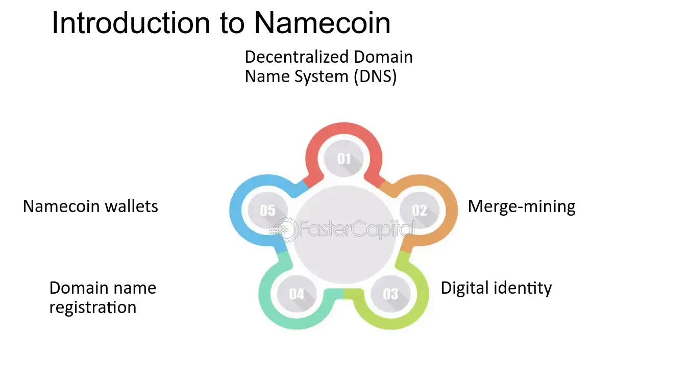

## Table of Contents

## What is Namecoin and why was it created?

Namecoin is a type of cryptocurrency, similar to Bitcoin, but it was created for a different purpose. It was launched in 2011 and uses the same technology as Bitcoin, called blockchain, to keep track of its transactions. However, Namecoin is not just for buying and selling things. It has a special feature that lets people register and manage domain names that end in .bit. These domain names work like regular website addresses but are more private and harder for governments or companies to control.

The main reason Namecoin was created was to give people a way to have more control over their online identities and information. The people who made Namecoin wanted to build a system where you could have a website or an email address that no one else could take away or censor. By using Namecoin, people can create and manage these .bit domain names without needing to go through a central authority like a government or a big company. This makes the internet more free and open for everyone.

## How does Namecoin differ from Bitcoin?

Namecoin and Bitcoin are both cryptocurrencies, but they have different main goals. Bitcoin is mainly used as a digital money that people can use to buy things or send money to others. It's like having cash, but online. On the other hand, Namecoin was created not just to be a digital money, but also to help people control their online identities. With Namecoin, you can register special domain names that end in .bit, which can be used for websites or emails that are more private and harder for others to control.

While both use blockchain technology to keep track of transactions, Namecoin adds an extra feature to its blockchain. This feature allows people to register and manage .bit domain names directly on the blockchain. This means that unlike regular domain names that you get from big companies, .bit domains are managed by the Namecoin community itself. Bitcoin doesn't have this feature; it's all about the money part. So, while Bitcoin focuses on being a currency, Namecoin aims to make the internet more free and open by giving people more control over their online presence.

## What is the primary function of Namecoin?

The main job of Namecoin is to let people control their own online identities. It does this by letting people register special domain names that end in .bit. These .bit domain names can be used for websites or emails that are more private and harder for others to control. Unlike regular domain names that you get from big companies, .bit domains are managed by the Namecoin community itself. This means people can have a website or email address that no one else can take away or censor.

Besides helping with online identities, Namecoin also works as a kind of digital money, just like Bitcoin. You can use Namecoin to buy things or send money to others. But the big difference is that Namecoin adds the extra feature of managing .bit domain names directly on its blockchain. This makes the internet more free and open for everyone by giving people more control over their online presence.

## How does the Namecoin blockchain work?

The Namecoin blockchain works a lot like the Bitcoin blockchain. It's a big list of all the transactions that have ever happened with Namecoin. Every time someone sends Namecoin to another person or registers a .bit domain name, it gets written down on this list. The list is kept on lots of different computers all over the world, and they all check each other to make sure the list is correct. This makes it very hard for anyone to cheat or change the list because they would need to change it on all those computers at the same time.

What makes the Namecoin blockchain special is that it can do more than just keep track of money. It can also keep track of .bit domain names. When someone wants to register a .bit domain name, they send a special kind of transaction to the Namecoin blockchain. This transaction says, "I want to own this .bit domain name." Once it's written on the blockchain, everyone can see that the person owns that domain name. This way, people can have their own private websites or emails that are harder for others to control or take away.

## What are Namecoin domains and how are they used?

Namecoin domains are special kinds of website addresses that end in .bit. They are different from regular website addresses like .com or .org because they are managed by the Namecoin blockchain instead of big companies. When someone wants to own a .bit domain, they use Namecoin to register it on the blockchain. This means that no one can take the domain away from them without their permission, making it more private and secure.

People use Namecoin domains for websites and emails that they want to keep more private and free from control by big companies or governments. Because .bit domains are on the blockchain, they are harder to censor or shut down. This makes them useful for people who want to share information or communicate without worrying about someone else controlling their online space.

## How can someone register a .bit domain with Namecoin?

To register a .bit domain with Namecoin, you first need to have some Namecoin. You can get Namecoin by buying it from a [cryptocurrency](/wiki/cryptocurrency) exchange or by mining it. Once you have some Namecoin, you'll need a Namecoin wallet. This is a special app or software that helps you manage your Namecoin and interact with the blockchain. In the wallet, you'll find a section where you can register a new .bit domain. You type in the domain name you want, like "mywebsite.bit," and you send a special transaction to the Namecoin blockchain. This transaction tells the blockchain that you want to own that domain name.

After you send the transaction, it gets added to the blockchain. This means that everyone who uses Namecoin can see that you own that .bit domain. It might take a little while for the transaction to be confirmed, but once it's done, you own the domain. Now, you can use your .bit domain for your website or email. To do this, you'll need to set up a server or use a service that supports .bit domains. This way, when someone types in your .bit domain, they can see your website or send you an email.

## What are the security features of Namecoin?

Namecoin has strong security features to keep your money and your .bit domain names safe. It uses something called blockchain technology, which is like a big, shared list of all the transactions that have ever happened. This list is kept on lots of different computers all over the world, so it's very hard for anyone to cheat or change it. If someone tried to change something, they would need to change it on all those computers at the same time, which is almost impossible. This makes Namecoin very secure because no one can take your Namecoin or your .bit domain name without your permission.

Another important security feature is that Namecoin uses strong encryption. This means that the information about your transactions and your .bit domain names is turned into a secret code that only you can unlock. This keeps your information private and safe from people who might try to steal it. Also, when you register a .bit domain, it's yours as long as you keep paying a small fee every so often. This fee helps keep the Namecoin system running and makes sure that no one else can take your domain name away from you.

## How does Namecoin ensure decentralization and censorship resistance?

Namecoin ensures decentralization by using a blockchain that is managed by lots of different computers all over the world. No one person or company controls the whole thing. Instead, everyone who uses Namecoin helps to keep the system running. This means that if one computer goes down or someone tries to mess with it, the rest of the network keeps going. It's like having a big team where everyone does a little bit to make sure everything works well. This way, Namecoin stays free and open for everyone to use without anyone being in charge.

Namecoin also helps with censorship resistance because it lets people register .bit domain names that are hard for others to control or take away. When you register a .bit domain, it gets written on the blockchain where everyone can see it. This makes it very hard for anyone to censor or shut down your website or email. Even if someone doesn't like what you're saying or doing, they can't just take your domain away because it's protected by the whole Namecoin network. This helps people share information and communicate freely without worrying about being stopped by others.

## What are some practical applications of Namecoin beyond domain registration?

Besides helping people register .bit domains, Namecoin can also be used as a kind of digital money. Just like Bitcoin, you can use Namecoin to buy things or send money to other people. This can be useful if you want to make payments online without using regular money or if you want to send money to someone in another country quickly and cheaply. Because Namecoin works on a blockchain, it's secure and no one can take your money without your permission.

Another practical use of Namecoin is for creating and managing digital identities. You can use Namecoin to store information about yourself, like your name, email, or other personal details, on the blockchain. This can be helpful if you want to prove who you are online without needing to go through a big company or government. Because the information is on the blockchain, it's hard for anyone to change or steal it, making it a safe way to manage your online identity.

## How does Namecoin integrate with other blockchain technologies?

Namecoin can work together with other blockchain technologies to make them even more useful. For example, it can connect with Bitcoin to create something called merged mining. This means that people who mine Bitcoin can also help keep the Namecoin blockchain safe without needing extra work. This makes both blockchains stronger and more secure because they share the work of keeping everything running smoothly. Also, Namecoin can be used with other cryptocurrencies to make new kinds of digital money that have the special features of Namecoin, like .bit domain registration.

Another way Namecoin integrates with other technologies is through decentralized applications, or dApps. These are apps that run on blockchains and can use Namecoin's features to do things like manage online identities or register domain names. For example, a dApp might use Namecoin to let people create and control their own online profiles or websites without needing to go through big companies. This makes the internet more open and free for everyone. By working with other blockchains and technologies, Namecoin helps make the digital world safer and more private.

## What are the current challenges and limitations facing Namecoin?

Namecoin faces some challenges that make it hard for more people to use it. One big problem is that not many people know about Namecoin. It's not as famous as Bitcoin, so fewer people are interested in using it. Also, .bit domains can be tricky to use because regular web browsers don't support them automatically. You need special software or a browser extension to visit .bit websites, which can be hard for some people to set up. Another challenge is that Namecoin can be slow and expensive to use. Transactions can take a while to be confirmed, and the fees can be high, which might make people think twice before using it.

Despite these challenges, Namecoin is still working to get better. The people who work on Namecoin are trying to make it easier for more people to use .bit domains. They're also looking at ways to make transactions faster and cheaper. But these things take time, and until they're fixed, Namecoin might not grow as fast as other cryptocurrencies. Still, Namecoin's focus on privacy and freedom is important, and many people believe in its goals, even if it faces some hurdles along the way.

## What future developments are anticipated for Namecoin?

People who work on Namecoin are trying to make it better in the future. One thing they want to do is make .bit domains easier to use. Right now, you need special software to visit .bit websites, but they're working on ways to make it so regular web browsers can handle .bit domains too. They also want to make transactions faster and cheaper. Right now, it can take a while for a transaction to be confirmed, and the fees can be high. If they can fix these problems, more people might start using Namecoin.

Another thing they're looking at is making Namecoin work better with other technologies. For example, they want to make it easier to use Namecoin with other blockchains and apps. This could help Namecoin grow and be used in more ways. Even though Namecoin faces some challenges now, the people working on it are trying hard to make it better and more useful for everyone. They believe that with time and effort, Namecoin can become a bigger part of the digital world.

## What are the algorithmic trading strategies for Namecoin?

Algorithmic trading, which involves the use of computer algorithms to execute trades, presents unique challenges and opportunities when applied to Namecoin, one of the pioneering cryptocurrencies. Namecoin's lower market capitalization compared to more mainstream cryptocurrencies poses both a constraint and an opportunity for algorithmic traders. The specific challenges include navigating its relatively low [liquidity](/wiki/liquidity-risk-premium) and high [volatility](/wiki/volatility-trading-strategies), which can lead to significant slippage—the difference between the expected price of a trade and the actual executed price.

### Popular Algorithmic Trading Strategies for Namecoin

In the context of Namecoin, commonly employed [algorithmic trading](/wiki/algorithmic-trading) strategies include:

1. **Market Making**: This strategy involves placing buy and sell orders to capture the spread between bid and ask prices. Due to Namecoin's volatility, traders must swiftly adapt their pricing models to minimize risk.

2. **Arbitrage**: Given the potential price discrepancies between different exchanges, arbitrage strategies seek to exploit these inefficiencies. Implementing effective arbitrage requires high-speed connectivity and robust monitoring systems.

3. **Trend Following**: This strategy aims to capitalize on Namecoin's directional price movements over various time frames. Algorithms identify potential trends using indicators like moving averages or momentum oscillators.

4. **Statistical Arbitrage**: This involves using statistical methods to identify short-term price inefficiencies. This is particularly challenging in Namecoin due to its less predictable price movements, thus requiring sophisticated mathematical models.

### Analysis of Liquidity, Volatility, and Other Factors

Namecoin's market characteristics significantly impact trading strategies. Liquidity is a critical [factor](/wiki/factor-investing), as lower liquidity can make it difficult to execute large trades without impacting the market price. High volatility can both increase potential profit margins and the risk associated with position holding.

Mathematically, volatility can be quantified using standard deviation or variance of historical price data, which can be calculated via:

$$
\sigma = \sqrt{\frac{1}{N} \sum_{i=1}^{N} (x_i - \mu)^2}
$$

where $\sigma$ is the standard deviation, $x_i$ are historical prices, $\mu$ is the mean of these prices, and $N$ is the number of data points.

### Tools and Platforms

Several platforms support algorithmic trading for cryptocurrencies like Namecoin, including:

- **MetaTrader**: Widely used for deploying algorithmic trading strategies, offering comprehensive tools for technical analysis.
- **TradingView**: Known for its charting capabilities, essential for identifying trends and patterns in Namecoin price movements.
- **Python Libraries**: Libraries such as NumPy, pandas, and TA-Lib facilitate the creation and testing of trading algorithms.

A simple Python code snippet for calculating a moving average might look like this:

```python
import pandas as pd

def moving_average(prices, window_size):
    return prices.rolling(window=window_size).mean()

# Example usage
prices = pd.Series([10, 20, 30, 40, 50])  # hypothetical price data
ma = moving_average(prices, 3)
print(ma)
```

### Risk Management Practices

Effective risk management is essential to counter Namecoin's unpredictable market dynamics. Key practices include:

- **Position Sizing**: Limiting the size of each trade relative to the total portfolio to avoid significant losses.
- **Stop-Loss Orders**: Automating the closure of positions at predefined price levels to contain losses.
- **Diversification**: Reducing exposure by trading multiple assets and strategies, thereby spreading risk.

Algorithmic trading presents a promising yet challenging frontier for engaging with Namecoin, necessitating meticulous strategy formulation and risk management to optimize outcomes in its volatile market environment.

## What are the challenges in algorithmic trading with Namecoin?

Algorithmic trading in Namecoin, as with other cryptocurrencies, presents unique challenges that traders must navigate to effectively exploit market opportunities. One primary challenge lies in constructing and implementing effective algorithms. Designing robust algorithms requires a deep understanding of market dynamics, statistical methods, and computational proficiency. The inherent volatility of cryptocurrency markets, including Namecoin, necessitates algorithms that can quickly adapt to rapid price changes to minimize potential losses due to slippage. Slippage occurs when the actual price of a trade differs from the estimated price expected due to market movements during the execution time. This can be calculated as:

$$
\text{Slippage} = \left(\frac{\text{Execution Price} - \text{Expected Price}}{\text{Expected Price}}\right) \times 100\%
$$

Implementing strategies that can effectively manage slippage is crucial for maintaining profitability in Namecoin trading.

Security is another pressing concern with algorithmic trades. The risk of hacking is elevated in digital currency trading due to the decentralized nature of the blockchain, which, while secure, can be vulnerable at touchpoints such as exchanges or through faulty smart contracts. Additionally, an algorithm must be meticulously tested to ensure it performs accurately and does not deviate from its intended function, which could result in significant financial losses.

Regulatory considerations also significantly impact algorithmic trading in Namecoin. The evolving legal landscape for cryptocurrencies can impose restrictions that affect trading strategies and exchanges' operational guidelines. Traders need to remain compliant with relevant regulations, which might vary across jurisdictions, to avoid legal repercussions.

Moreover, the ever-changing market dynamics make it imperative for algorithms to be continuously monitored and updated. Innovations within the blockchain sphere, economic changes, and shifts in investor sentiment can rapidly render existing trading strategies obsolete. Consequently, a feedback loop in the algorithmic design is crucial to continuously optimize performance.

Addressing these challenges effectively requires not only technical acumen but also strategic planning and an adaptable mindset to successfully engage with the Namecoin market through algorithmic trading.

## References & Further Reading

[1]: "Mastering Bitcoin" by Andreas M. Antonopoulos: A comprehensive guide to understanding Bitcoin and blockchain technology. Available on [Amazon](https://www.amazon.com/Mastering-Bitcoin-Programming-Open-Blockchain/dp/1491954388).

[2]: Tasca, Paolo. "Evolution of the Bitcoin Blockchain: Transactional Activity and the Network." ["Journal of Internet Technologies and Secured Transactions"](https://papers.ssrn.com/sol3/papers.cfm?abstract_id=2808762) 4.2 (2015): 56-59.

[3]: "Cryptocurrency: How Bitcoin and Digital Money are Challenging the Global Economic Order" by Paul Vigna and Michael J. Casey. Available on [Amazon](https://www.amazon.com/Age-Cryptocurrency-Bitcoin-Challenging-Economic/dp/1250065631).

[4]: "The Age of Cryptocurrency: How Bitcoin and Digital Money are Challenging the Global Economic Order" by Paul Vigna and Michael J. Casey: Explores the potential of cryptocurrencies beyond financial transactions. Available on [Amazon](https://www.amazon.com/Age-Cryptocurrency-Bitcoin-Challenging-Economic/dp/1250065631).

[5]: Narayanan, Arvind, et al. "Bitcoin and Cryptocurrency Technologies: A Comprehensive Introduction." Princeton University Press, 2016. Available on [Amazon](https://press.princeton.edu/books/hardcover/9780691171692/bitcoin-and-cryptocurrency-technologies).

[6]: "Algorithmic Trading: Winning Strategies and Their Rationale" by Ernest P. Chan. Available on [Amazon](https://www.wiley.com/en-us/Algorithmic+Trading%3A+Winning+Strategies+and+Their+Rationale-p-9781118460146).

[7]: "Namecoin: An Experimental Decentralized Naming System" (2014) by Iain Stewart. Available on [Bitcoin Wiki](https://www.namecoin.org/).

[8]: "Decentralized Autonomous Organizations and Governance" by Primavera De Filippi and Aaron Wright, in Blockchain and the Law: The Rule of Code. Harvard University Press, 2018. Available on [Amazon](https://books.google.com/books/about/Blockchain_and_the_Law.html?id=k7pTDwAAQBAJ).