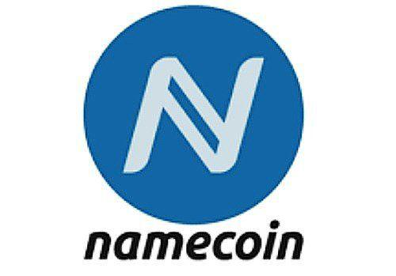

Blockchain technology has emerged as a transformative force, fundamentally altering digital landscapes across various sectors. At its core, blockchain is a decentralized ledger system that ensures transparency, security, and immutability of data. These attributes have enabled blockchain to transcend its initial application in cryptocurrencies and extend its utility to industries such as supply chain management, healthcare, and finance, fostering a new era of digital interactions and transactions.

Namecoin stands out as one of the first altcoins to follow Bitcoin, introduced in April 2011. It is a pioneering project that extends the functionalities of traditional cryptocurrencies by focusing on the decentralization of online identity, specifically through a decentralized Domain Name System (DNS). This innovation not only paved the way for further developments in blockchain technology but also highlighted the potential for blockchain applications beyond mere financial transactions.



Algorithmic trading has gained significant traction in the cryptocurrency market, offering a level of precision and efficiency previously unattainable with manual trading. It involves the use of computer algorithms to execute trades at optimal conditions based on predefined criteria, such as timing, price, or quantity. The growing inclusion of algorithmic trading in the cryptocurrency domain underscores its importance, driven by the volatile nature of crypto assets and the vast amount of data available for analysis. These algorithms can process data at high speeds and execute trades without the emotional biases that often affect human decisions.

This article aims to explore the intersection of Namecoin and algorithmic trading within the blockchain ecosystem. By examining how algorithmic trading can be applied to Namecoin and other cryptocurrencies, we aim to uncover potential benefits such as improved trading efficiency and data-driven decision-making. However, it is also crucial to address the challenges that may arise, including market volatility and the technical complexities associated with developing effective trading algorithms. Through this exploration, we seek to provide insights into the evolving landscape of blockchain technology and its implications for cryptocurrency traders and investors.

## Table of Contents

## Understanding Blockchain and Cryptocurrency

Blockchain technology, since its inception, has emerged as a revolutionary force in the digital era, fundamentally altering traditional processes through its decentralized and immutable nature. At its core, a blockchain is a distributed ledger that records transactions across multiple computers in a manner that's both secure and transparent. This underlying technology ensures that once data is recorded, it cannot be altered retroactively without the alteration of all subsequent blocks and the consensus of the network, thereby providing exceptional security and trust in various applications.

Cryptocurrencies serve as the cornerstone of blockchain ecosystems. They are digital or virtual currencies that use cryptographic methods for securing transactions, controlling the creation of units, and verifying the transfer of assets. Bitcoin, the pioneer cryptocurrency introduced by an anonymous entity named Satoshi Nakamoto in 2009, set the precedent for other digital currencies, often referred to as altcoins, which include Namecoin, Ethereum, and many others. These cryptocurrencies facilitate a myriad of functionalities within their respective blockchain networks—from acting as a medium of exchange to providing utility in smart contract operations.

The variety among cryptocurrencies is vast, leading to multiple categorizations based on their distinct uses. For instance, Bitcoin is predominantly viewed as a store of value, akin to digital gold, whereas Ethereum, with its Turing-complete programming language, allows developers to build decentralized applications (DApps) and complex programmable transactions via smart contracts. Other cryptocurrencies, like Ripple (XRP), focus on optimizing cross-border payment systems, highlighting the diverse applications of [cryptocurrency](/wiki/cryptocurrency) technologies.

Beyond finance, blockchain's influence stretches across numerous industries, introducing new efficiencies and capabilities. Supply chains leverage blockchain for enhanced transparency and tracking of goods, healthcare industries employ it for secure patient data management, and the entertainment sector explores its potential for fairness in rights distribution and royalties. Moreover, blockchain technology continues to foster innovation in sectors such as energy, real estate, and even voting systems, enhancing trust and reducing intermediary burdens.

Globally, the adoption of blockchain and cryptocurrencies is on an upward trajectory, driven by increasing recognition of their potential benefits. Financial institutions are integrating blockchain to streamline operations, governments are exploring cryptocurrencies for monetary policy implementation, and businesses large and small are either adopting blockchain solutions or experimenting with pilot projects. Despite regulatory challenges and the necessity for technological advancements, the ubiquity and acceptance of blockchain and cryptocurrencies signal enduring and transformative growth potential in diverse areas worldwide.

 to Namecoin

Namecoin is one of the first altcoins derived from Bitcoin, established in April 2011. It emerged as a revolutionary project in the cryptocurrency sphere, leveraging Bitcoin's codebase while introducing novel functionalities. One of its most significant contributions is in providing decentralized DNS (Domain Name System) services. The goal was to create a more secure and privacy-focused system for online identity, effectively decentralizing how domain names are registered and managed.

Unlike traditional DNS services, which are centralized and prone to censorship and attacks, Namecoin utilizes blockchain technology to ensure that domain name assignments are immutable and distributed. This approach helps to protect against unauthorized domain seizures and enhances users' control over their online presence.

When comparing Namecoin to other cryptocurrencies, particularly those that emerged after its inception, a few distinctive characteristics stand out. First, Namecoin combines cryptocurrency functions with a utility system, making it distinct from others targeting purely financial transactions. Second, its DNS feature allows it to occupy a niche role that is less common among the thousands of digital currencies in the market.

Technologically, Namecoin shares several similarities with Bitcoin, including using the proof-of-work consensus algorithm, but it extends its blockchain application beyond mere financial transactions. Its capability to store data within the blockchain expands potential use cases significantly beyond those offered by Bitcoin.

Namecoin's market presence, while not as dominant as Bitcoin or Ethereum, is influential due to its pioneering role in demonstrating the versatility of blockchain technology. It serves as a reference point for other blockchain projects aiming to decentralize services traditionally regulated by centralized authorities.

Key features of Namecoin include its resistance to censorship, the ability to create secure and private transactions, and the functionality to integrate with existing internet infrastructure through plugins and special software. Its use of merged mining with Bitcoin also provides a security boost, as it shares the computational power of Bitcoin mining, enhancing resistance to attacks. This combination of features establishes Namecoin as a unique blend of digital currency and decentralized service provider.

## Algorithmic Trading: An Overview

Algorithmic trading refers to the use of computer algorithms to automatically execute trading orders at set parameters such as price, timing, and [volume](/wiki/volume-trading-strategy). This approach enables traders to make decisions with high speed and precision, minimizing human intervention. Algorithms assess market conditions in real-time and can execute trades in milliseconds, taking advantage of short-lived market opportunities that would be nearly impossible to exploit manually.

The adoption of [algorithmic trading](/wiki/algorithmic-trading) has surged in traditional financial markets, largely due to its efficiency and the ability to process large volumes of data instantaneously. As technology advanced, this trading method naturally extended to cryptocurrency markets. The decentralized and 24/7 nature of crypto trading presents unique opportunities and challenges, necessitating sophisticated algorithms capable of handling greater [volatility](/wiki/volatility-trading-strategies) and decentralized exchanges.

Algorithmic trading in cryptocurrencies employs several strategies, notably [arbitrage](/wiki/arbitrage), trend-following, and market-making. Arbitrage strategies exploit price discrepancies across different markets or exchanges. For example, a trader might simultaneously buy a cryptocurrency on one exchange where the price is lower and sell it on another where the price is higher. Trend-following strategies identify and ride on [momentum](/wiki/momentum) by executing trades aligned with the direction of market trends. Market-making involves placing simultaneous buy and sell limit orders to capture the spread, thus benefiting from [liquidity](/wiki/liquidity-risk-premium) provision to the market.

The primary benefits of algorithmic trading include enhanced efficiency and the elimination of emotional bias. Algorithms can process and analyze vast datasets much faster than humans, enabling them to identify patterns and execute trades with precision. Additionally, traders benefit from the ability to backtest strategies using historical data, ensuring that their algorithms are robust before being deployed in real trading environments.

Despite these advantages, algorithmic trading faces significant challenges, especially in volatile markets like cryptocurrencies. Algorithms must contend with sudden market shifts that can lead to slippage, where the executed trade price deviates unfavorably from the expected price. Furthermore, developing and maintaining effective algorithms requires continuous adaptation to evolving market conditions and technological advancements. Security concerns also persist, as faulty algorithms or malicious attacks can lead to substantial financial losses.

In conclusion, while offering substantial benefits, algorithmic trading demands technical expertise and vigilance to navigate its complexities and inherent market risks effectively.

## Algorithmic Trading Strategies for Namecoin

Algorithmic trading, which involves the use of computer algorithms to execute trades, presents unique challenges and opportunities when applied to Namecoin, one of the pioneering cryptocurrencies. Namecoin's lower market capitalization compared to more mainstream cryptocurrencies poses both a constraint and an opportunity for algorithmic traders. The specific challenges include navigating its relatively low liquidity and high volatility, which can lead to significant slippage—the difference between the expected price of a trade and the actual executed price.

### Popular Algorithmic Trading Strategies for Namecoin

In the context of Namecoin, commonly employed algorithmic trading strategies include:

1. **Market Making**: This strategy involves placing buy and sell orders to capture the spread between bid and ask prices. Due to Namecoin's volatility, traders must swiftly adapt their pricing models to minimize risk.

2. **Arbitrage**: Given the potential price discrepancies between different exchanges, arbitrage strategies seek to exploit these inefficiencies. Implementing effective arbitrage requires high-speed connectivity and robust monitoring systems.

3. **Trend Following**: This strategy aims to capitalize on Namecoin's directional price movements over various time frames. Algorithms identify potential trends using indicators like moving averages or momentum oscillators.

4. **Statistical Arbitrage**: This involves using statistical methods to identify short-term price inefficiencies. This is particularly challenging in Namecoin due to its less predictable price movements, thus requiring sophisticated mathematical models.

### Analysis of Liquidity, Volatility, and Other Factors

Namecoin's market characteristics significantly impact trading strategies. Liquidity is a critical [factor](/wiki/factor-investing), as lower liquidity can make it difficult to execute large trades without impacting the market price. High volatility can both increase potential profit margins and the risk associated with position holding.

Mathematically, volatility can be quantified using standard deviation or variance of historical price data, which can be calculated via:

$$
\sigma = \sqrt{\frac{1}{N} \sum_{i=1}^{N} (x_i - \mu)^2}
$$

where $\sigma$ is the standard deviation, $x_i$ are historical prices, $\mu$ is the mean of these prices, and $N$ is the number of data points.

### Tools and Platforms

Several platforms support algorithmic trading for cryptocurrencies like Namecoin, including:

- **MetaTrader**: Widely used for deploying algorithmic trading strategies, offering comprehensive tools for technical analysis.
- **TradingView**: Known for its charting capabilities, essential for identifying trends and patterns in Namecoin price movements.
- **Python Libraries**: Libraries such as NumPy, pandas, and TA-Lib facilitate the creation and testing of trading algorithms.

A simple Python code snippet for calculating a moving average might look like this:

```python
import pandas as pd

def moving_average(prices, window_size):
    return prices.rolling(window=window_size).mean()

# Example usage
prices = pd.Series([10, 20, 30, 40, 50])  # hypothetical price data
ma = moving_average(prices, 3)
print(ma)
```

### Risk Management Practices

Effective risk management is essential to counter Namecoin's unpredictable market dynamics. Key practices include:

- **Position Sizing**: Limiting the size of each trade relative to the total portfolio to avoid significant losses.
- **Stop-Loss Orders**: Automating the closure of positions at predefined price levels to contain losses.
- **Diversification**: Reducing exposure by trading multiple assets and strategies, thereby spreading risk.

Algorithmic trading presents a promising yet challenging frontier for engaging with Namecoin, necessitating meticulous strategy formulation and risk management to optimize outcomes in its volatile market environment.

## Benefits of Algorithmic Trading for Namecoin Holders

Algorithmic trading offers numerous advantages for Namecoin holders, enhancing the trading process through the use of technology and sophisticated algorithms. One of the primary benefits is automation and precision in executing multiple trades simultaneously. By using pre-programmed algorithms, traders can automate their trades, which significantly reduces human error and ensures precision in trade execution. This is particularly advantageous in the cryptocurrency market, where price movements can be rapid and volatile.

Informed trading decisions are another significant benefit, as algorithms are driven by data and not influenced by emotions. Algorithms can quickly analyze vast amounts of market data, identify patterns, and make predictions based on statistical and mathematical models. This data-driven approach facilitates informed decision-making, allowing traders to react instantly to market changes and capitalize on favorable conditions.

Another critical advantage is the ability to backtest strategies before deploying them in live markets. Backtesting involves simulating a trading strategy using historical data to evaluate its effectiveness. This process helps traders identify potential flaws in their strategies and make necessary adjustments, reducing the likelihood of losses when the strategies are executed in live markets.

Enhanced speed and efficiency are inherent in algorithmic trading. Algorithms can execute trades in fractions of a second, a speed unattainable by human traders. This rapid execution is crucial in capturing the best possible prices and maximizing profit margins, especially in a volatile market environment.

Finally, algorithmic trading holds the potential for consistent profits by capitalizing on market inefficiencies. Algorithms can identify arbitrage opportunities and other market discrepancies that may not be immediately apparent to human traders. By systematically exploiting these inefficiencies, algorithms can generate consistent returns over time.

In sum, algorithmic trading provides Namecoin holders with tools for enhancing trading performance through automation, data-driven decisions, strategic testing, speed, and the ability to exploit market inefficiencies effectively.

## Challenges in Algorithmic Trading with Namecoin

Algorithmic trading in Namecoin, as with other cryptocurrencies, presents unique challenges that traders must navigate to effectively exploit market opportunities. One primary challenge lies in constructing and implementing effective algorithms. Designing robust algorithms requires a deep understanding of market dynamics, statistical methods, and computational proficiency. The inherent volatility of cryptocurrency markets, including Namecoin, necessitates algorithms that can quickly adapt to rapid price changes to minimize potential losses due to slippage. Slippage occurs when the actual price of a trade differs from the estimated price expected due to market movements during the execution time. This can be calculated as:

$$
\text{Slippage} = \left(\frac{\text{Execution Price} - \text{Expected Price}}{\text{Expected Price}}\right) \times 100\%
$$

Implementing strategies that can effectively manage slippage is crucial for maintaining profitability in Namecoin trading.

Security is another pressing concern with algorithmic trades. The risk of hacking is elevated in digital currency trading due to the decentralized nature of the blockchain, which, while secure, can be vulnerable at touchpoints such as exchanges or through faulty smart contracts. Additionally, an algorithm must be meticulously tested to ensure it performs accurately and does not deviate from its intended function, which could result in significant financial losses.

Regulatory considerations also significantly impact algorithmic trading in Namecoin. The evolving legal landscape for cryptocurrencies can impose restrictions that affect trading strategies and exchanges' operational guidelines. Traders need to remain compliant with relevant regulations, which might vary across jurisdictions, to avoid legal repercussions.

Moreover, the ever-changing market dynamics make it imperative for algorithms to be continuously monitored and updated. Innovations within the blockchain sphere, economic changes, and shifts in investor sentiment can rapidly render existing trading strategies obsolete. Consequently, a feedback loop in the algorithmic design is crucial to continuously optimize performance.

Addressing these challenges effectively requires not only technical acumen but also strategic planning and an adaptable mindset to successfully engage with the Namecoin market through algorithmic trading.

## Future Prospects and Innovations

Namecoin, as a pioneering blockchain project, holds continued potential in the rapidly evolving blockchain ecosystem. Its unique positioning as a decentralized domain name system (DNS) offers vital security and privacy advantages over traditional systems. As blockchain technology further infiltrates various industries, Namecoin could experience growth by expanding its utilitarian role in cyberspace alongside enhanced adoption of decentralized applications (dApps) and web 3.0 services. 

Upcoming innovations in algorithmic trading are set to transform cryptocurrency markets, making trading strategies more sophisticated and efficient. Developments such as low-latency trading systems and improved order execution algorithms offer the promise of enhanced profitability and risk management for traders. The incorporation of [artificial intelligence](/wiki/ai-artificial-intelligence) (AI) and [machine learning](/wiki/machine-learning) (ML) into trading algorithms provides a leap forward in predicting market trends and decision-making. By utilizing AI to analyze vast datasets, traders can identify patterns and anomalies often missed by conventional methods. Machine learning models can dynamically adjust strategies based on market conditions, optimizing trading processes.

Emerging trends, including increased market regulation and the growing emphasis on sustainable finance, will likely impact Namecoin traders and the broader crypto landscape. As governments and financial institutions integrate regulatory frameworks, transparency, and compliance become essential for cryptocurrency operations. Namecoin's decentralized nature presents unique challenges and opportunities in navigating these regulatory changes.

Opportunities for collaboration between blockchain developers and algorithmic traders are abundant. By working together, these groups can advance technology in areas like network scalability, security, and data analytics. Improved blockchain infrastructure supports more robust and complex algorithmic trading systems, potentially leading to mutually beneficial advancements.

In conclusion, staying abreast with technological innovations and market trends can provide Namecoin traders and the blockchain community with significant advantages in this dynamic environment. Embracing collaboration and leveraging advancements in AI and ML will be essential for capitalizing on the evolving landscape of cryptocurrency trading.

## Conclusion

The landscape of blockchain technology and cryptocurrencies has undergone significant transformation, with blockchain serving as the backbone for decentralized applications and digital currencies reshaping financial systems. Namecoin stands out as an early alternative cryptocurrency, aiming to decentralize online identity and offering a unique perspective on the capabilities of blockchain. Meanwhile, algorithmic trading has revolutionized the trading landscape, offering efficiency and precision in executing trades, and has become pivotal in the context of cryptocurrencies, including Namecoin.

Staying informed and adaptable in the dynamic context of the crypto market is crucial for traders and investors. The volatile nature of cryptocurrencies, combined with rapid technological advancements, demands a proactive approach to understanding market trends, regulatory changes, and technological innovations. Traders are encouraged to explore algorithmic trading, which, while complex, offers significant advantages in terms of speed and data-driven decision-making. Understanding the intricacies and potential pitfalls, such as market volatility and security risks, is vital for successful implementation.

The blockchain ecosystem continues to evolve, impacting various sectors and prompting further integration of innovative technologies like artificial intelligence and machine learning to enhance trading algorithms. These developments not only increase the potential for profit but also underscore the need for continuous learning and adaptation. As the crypto market progresses, there are abundant opportunities for collaboration between blockchain developers and algorithmic traders, presenting a fertile ground for innovation and mutual benefit.

To navigate this evolving landscape effectively, further research and experimentation with algorithmic trading strategies specific to Namecoin and similar cryptocurrencies are encouraged. This exploration can lead to refined strategies, better risk management, and optimized trading outcomes. Engaging with the latest advancements will empower traders to harness the full potential of blockchain technology and contribute to the broader narrative of technological progress.

## References & Further Reading

[1]: "Mastering Bitcoin" by Andreas M. Antonopoulos: A comprehensive guide to understanding Bitcoin and blockchain technology. Available on [Amazon](https://www.amazon.com/Mastering-Bitcoin-Programming-Open-Blockchain/dp/1491954388).

[2]: Tasca, Paolo. "Evolution of the Bitcoin Blockchain: Transactional Activity and the Network." ["Journal of Internet Technologies and Secured Transactions"](https://papers.ssrn.com/sol3/papers.cfm?abstract_id=2808762) 4.2 (2015): 56-59.

[3]: "Cryptocurrency: How Bitcoin and Digital Money are Challenging the Global Economic Order" by Paul Vigna and Michael J. Casey. Available on [Amazon](https://www.amazon.com/Age-Cryptocurrency-Bitcoin-Challenging-Economic/dp/1250065631).

[4]: "The Age of Cryptocurrency: How Bitcoin and Digital Money are Challenging the Global Economic Order" by Paul Vigna and Michael J. Casey: Explores the potential of cryptocurrencies beyond financial transactions. Available on [Amazon](https://www.amazon.com/Age-Cryptocurrency-Bitcoin-Challenging-Economic/dp/1250065631).

[5]: Narayanan, Arvind, et al. "Bitcoin and Cryptocurrency Technologies: A Comprehensive Introduction." Princeton University Press, 2016. Available on [Amazon](https://press.princeton.edu/books/hardcover/9780691171692/bitcoin-and-cryptocurrency-technologies).

[6]: "Algorithmic Trading: Winning Strategies and Their Rationale" by Ernest P. Chan. Available on [Amazon](https://www.wiley.com/en-us/Algorithmic+Trading%3A+Winning+Strategies+and+Their+Rationale-p-9781118460146).

[7]: "Namecoin: An Experimental Decentralized Naming System" (2014) by Iain Stewart. Available on [Bitcoin Wiki](https://www.namecoin.org/).

[8]: "Decentralized Autonomous Organizations and Governance" by Primavera De Filippi and Aaron Wright, in Blockchain and the Law: The Rule of Code. Harvard University Press, 2018. Available on [Amazon](https://books.google.com/books/about/Blockchain_and_the_Law.html?id=k7pTDwAAQBAJ).