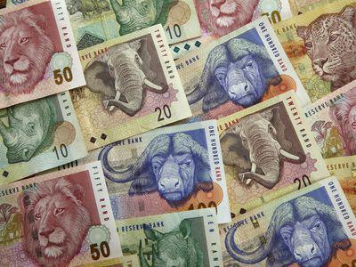

## Table of Contents

## What is the Namibian Dollar and when was it introduced?

The Namibian Dollar is the official currency of Namibia, a country in southern Africa. It is used every day by people in Namibia to buy things like food, clothes, and other stuff they need. The Namibian Dollar is also known by its symbol, N$ or NAD.

The Namibian Dollar was introduced on September 15, 1993. Before that, Namibia used the South African Rand because it was part of South Africa. When Namibia became its own country, it decided to have its own money. Even though the Namibian Dollar is the main money used in Namibia, the South African Rand can still be used there too.

## What is the relationship between the Namibian Dollar and the South African Rand?

The Namibian Dollar and the South African Rand have a special connection. They are linked together, which means that 1 Namibian Dollar is always worth the same as 1 South African Rand. This makes it easy for people in Namibia to use both types of money. If you have South African Rand, you can use it in Namibia without needing to change it into Namibian Dollars first.

This link between the two currencies helps make trading and business between Namibia and South Africa easier. Because they are connected, people and businesses don't have to worry about the money changing value when they buy or sell things between the two countries. It's like they are using the same money, even though they have different names and looks.

## How is the Namibian Dollar managed by the Bank of Namibia?

The Bank of Namibia is in charge of the Namibian Dollar. They make sure that the money stays stable and works well for everyone in Namibia. The Bank of Namibia does this by controlling how much money is in the country. If there's too much money, it might not be worth as much, so they have to be careful. They also set rules for banks and other places that deal with money to make sure everything is fair and safe.

Another important job of the Bank of Namibia is to keep the Namibian Dollar linked to the South African Rand. They watch this link closely to make sure it stays the same. This helps people and businesses in Namibia and South Africa to trade easily without worrying about the money changing value. The Bank of Namibia also prints new Namibian Dollar notes and coins when they are needed, and they take old ones out of use when they are worn out or no longer needed.

## What are the key historical events that have influenced the Namibian Dollar?

The Namibian Dollar was introduced on September 15, 1993, after Namibia gained independence from South Africa in 1990. Before that, Namibia used the South African Rand because it was part of South Africa. When Namibia became its own country, it wanted to have its own money to show that it was independent. This was a big moment because it helped Namibia feel more like its own country and not just part of South Africa anymore.

The link between the Namibian Dollar and the South African Rand was a big decision made by the Bank of Namibia. They chose to keep the two currencies equal so that people and businesses could easily trade between the two countries. This was important because it made things simpler for everyone and helped the economy grow. The Bank of Namibia has always worked hard to keep this link strong, which has been a key part of managing the Namibian Dollar ever since it was introduced.

## How has the Namibian Dollar performed against major world currencies since its inception?

Since it started in 1993, the Namibian Dollar has been tied to the South African Rand. This means that when the Rand goes up or down against other big world currencies, the Namibian Dollar does the same thing. Because of this link, the Namibian Dollar's value against currencies like the US Dollar, the Euro, and the British Pound has followed the same ups and downs as the Rand. Over the years, the Rand and the Namibian Dollar have had times when they were strong and times when they were weak compared to these major currencies.

For example, in the early 2000s, the Rand and the Namibian Dollar were pretty strong against the US Dollar, but later on, they got weaker. This happened because of things like changes in the world economy, problems in South Africa, and other big events. Even though the Namibian Dollar is tied to the Rand, the Bank of Namibia still works to keep it stable and make sure it works well for people in Namibia. They watch the value of the Namibian Dollar closely and make changes when they need to, to help the economy stay strong.

## What are the main economic factors that affect the value of the Namibian Dollar?

The value of the Namibian Dollar is closely tied to the South African Rand because they are linked together. This means that anything that affects the Rand will also affect the Namibian Dollar. One big thing that can change the value of the Rand and the Namibian Dollar is what happens in the world economy. If other countries are doing well and buying a lot of things from South Africa and Namibia, the Rand and Namibian Dollar can get stronger. But if the world economy is having problems, it can make the Rand and Namibian Dollar weaker.

Another important [factor](/wiki/factor-investing) is what's happening inside South Africa and Namibia. If South Africa has problems like high inflation or political issues, it can make the Rand and the Namibian Dollar lose value. Namibia's own economy also plays a role. For example, if Namibia is doing well with its mining and farming, it can help keep the Namibian Dollar strong. But if there are problems like droughts that hurt farming, or if mining isn't doing well, it can make the Namibian Dollar weaker. The Bank of Namibia tries to manage these things to keep the Namibian Dollar stable.

## How does inflation impact the Namibian Dollar and the economy of Namibia?

Inflation is when the prices of things like food, clothes, and other stuff go up over time. When inflation happens, the Namibian Dollar can buy less than before. For example, if a loaf of bread costs N$10 today, and next year it costs N$12 because of inflation, then the Namibian Dollar has lost some of its value. If inflation is too high, it can make life harder for people because they need more money to buy the same things. The Bank of Namibia tries to keep inflation low so that the Namibian Dollar stays strong and people can afford what they need.

High inflation can also affect the whole economy of Namibia. When prices go up a lot, businesses might have trouble planning because they don't know how much things will cost in the future. This can make them less likely to grow or hire more people. Also, if inflation is higher in Namibia than in other countries, it can make the Namibian Dollar weaker compared to other currencies. This can make it harder for Namibia to trade with other countries because their goods might become more expensive for others to buy. The Bank of Namibia works hard to manage inflation to keep the economy stable and help everyone in Namibia.

## What role does the Namibian Dollar play in Namibia's trade and investment?

The Namibian Dollar is really important for Namibia's trade and investment. It's the money that people and businesses in Namibia use to buy and sell things. When Namibia trades with other countries, the value of the Namibian Dollar compared to other currencies matters a lot. If the Namibian Dollar is strong, it can make Namibian goods more expensive for other countries to buy. But if it's weak, Namibian goods can be cheaper and easier to sell to other places. This can help Namibia's trade grow because more people might want to buy things from Namibia.

The Namibian Dollar also affects investment in Namibia. When people or companies from other countries want to invest in Namibia, they need to change their money into Namibian Dollars. If the Namibian Dollar is stable and not losing value quickly, it can make investors feel more confident about putting their money into Namibia. They know that their money will still be worth something in the future. The Bank of Namibia works hard to keep the Namibian Dollar stable so that it can help attract more investment and help the economy grow.

## How have changes in global commodity prices affected the Namibian Dollar?

Changes in global commodity prices can have a big impact on the Namibian Dollar because Namibia's economy depends a lot on things like mining and farming. When the prices of things like diamonds, uranium, and beef go up, it's good for Namibia. More money comes into the country, and this can make the Namibian Dollar stronger. People and businesses in Namibia can sell their goods for more money, which helps the economy grow. But if global commodity prices go down, it can be tough for Namibia. Less money comes in, and this can make the Namibian Dollar weaker. It's harder for Namibia to earn money from selling its goods, and this can slow down the economy.

The link between the Namibian Dollar and the South African Rand also plays a part in how global commodity prices affect the Namibian Dollar. Since the two currencies are tied together, if commodity prices change and it affects the South African Rand, it will also affect the Namibian Dollar in the same way. For example, if the price of gold goes down and it makes the South African Rand weaker, the Namibian Dollar will also get weaker. The Bank of Namibia watches these changes closely and tries to manage the Namibian Dollar to keep it stable, even when global commodity prices are going up and down.

## What are the current monetary policies affecting the Namibian Dollar?

The Bank of Namibia uses different ways to keep the Namibian Dollar stable and working well for the country. One big thing they do is keep the Namibian Dollar tied to the South African Rand. This means they make sure that 1 Namibian Dollar is always worth the same as 1 South African Rand. This helps make trading and business between Namibia and South Africa easier because people don't have to worry about the money changing value. The Bank of Namibia also controls how much money is in the country. If there's too much money, it might not be worth as much, so they have to be careful about how much they let into the economy.

Another important part of the Bank of Namibia's work is keeping inflation low. Inflation is when prices go up over time, and if it's too high, it can make life harder for people because they need more money to buy the same things. The Bank of Namibia tries to keep inflation around 3-6% a year. They do this by setting interest rates, which is like the cost of borrowing money. If they think inflation is getting too high, they might raise interest rates to make borrowing more expensive, which can help slow down spending and keep prices from going up too fast. All these things help make sure the Namibian Dollar stays strong and helps the economy of Namibia grow.

## How does the Namibian Dollar's peg to the South African Rand influence Namibia's economic sovereignty?

The Namibian Dollar being tied to the South African Rand means that Namibia doesn't have full control over its own money. When the South African Rand goes up or down against other currencies, the Namibian Dollar does the same thing. This can make it harder for Namibia to make its own choices about its economy. If South Africa has problems like high inflation or political issues, it can affect the Namibian Dollar too, even if Namibia is doing well. This link can limit how much Namibia can do things on its own to help its economy grow or deal with problems.

On the other hand, being tied to the South African Rand can also help Namibia in some ways. It makes it easier for Namibia to trade with South Africa because people and businesses don't have to worry about the money changing value. This can help the economy grow because it's simpler to buy and sell things between the two countries. Also, having a stable currency like the South African Rand can make investors feel more confident about putting their money into Namibia. They know that their money won't lose value quickly, which can help attract more investment and help the economy. So, while the peg to the Rand limits Namibia's economic sovereignty in some ways, it also brings some benefits.

## What are the expert forecasts for the future of the Namibian Dollar and its impact on Namibia's economy?

Experts think that the Namibian Dollar will keep being tied to the South African Rand for a long time. This means that if the Rand goes up or down against other big world currencies, the Namibian Dollar will do the same thing. Because of this, what happens to the South African economy will keep affecting Namibia's money. If South Africa has problems like high inflation or political issues, it can make the Namibian Dollar weaker too. But if South Africa does well, it can help the Namibian Dollar stay strong. Experts also think that the Bank of Namibia will keep working hard to manage the Namibian Dollar and keep inflation low, which can help the economy stay stable.

In the future, the Namibian Dollar's link to the South African Rand could affect how much Namibia can grow its economy. If the Rand stays weak, it might make it harder for Namibia to trade with other countries because Namibian goods could be more expensive for them to buy. But if the Rand gets stronger, it could help Namibia's trade grow. Also, the link to the Rand can make it easier for Namibia to attract investment from other countries because people know that the Namibian Dollar won't lose value quickly. So, while the Namibian Dollar's future depends a lot on what happens with the South African Rand, the Bank of Namibia's work to keep things stable can help make sure the economy keeps growing in a good way.

## What is the economic performance of the Namibian Dollar?

The Namibian Dollar (NAD) is pegged to the South African Rand (ZAR) at a fixed rate of 1-to-1, a relationship that has existed since the NAD's introduction in 1993. This pegging means that the NAD's value directly mirrors that of the ZAR, a currency that has its own fluctuations against global currencies, particularly the United States Dollar (USD). Over the years, the NAD has experienced depreciation against the USD, reflecting underlying economic shifts within both Namibia and the broader Southern African region.

The depreciation of the NAD against the USD is a function of several economic factors. Firstly, the Namibian GDP has a direct impact on the country's currency strength. A nation's GDP growth can often correlate with the currency's appreciation, as it signals a robust and growing economy. Namibia's GDP growth rates have varied, influenced by factors such as commodity prices, mining output—which is a critical sector—and agricultural performance.

Secondly, inflation plays a crucial role in the currency's valuation. Namibia's inflation rates can affect the purchasing power parity (PPP) of the NAD. Higher inflation can erode the currency's purchasing power, making it less valuable against stronger, more stable currencies like the USD. Inflation metrics also offer insights into the broader economic well-being of the country, influencing investor sentiment and impacting foreign exchange rates.

The purchasing power parity concept further elaborates the relative currency value in terms of domestic purchasing power. Mathematically, this can be represented as:

$$
\text{PPP Exchange Rate} = \frac{\text{Price Level in Namibia (NAD)}}{\text{Price Level in the USA (USD)}}
$$

Fluctuations in GDP, inflation, and purchasing power directly impact this calculation and, consequently, the expected exchange rate.

Overall, while the peg to the ZAR provides a degree of stability to the NAD, it also subjects Namibia to economic disturbances originating from South Africa. The economic dynamics within Namibia, complemented by regional influences, shape the performance and valuation of the NAD within the global currency market. Thus, monitoring these economic indicators is essential for understanding the NAD's value trajectory, especially for traders and investors looking to make informed decisions.

## References & Further Reading

[1]: Bergstra, J., Bardenet, R., Bengio, Y., & Kégl, B. (2011). ["Algorithms for Hyper-Parameter Optimization."](https://dl.acm.org/doi/10.5555/2986459.2986743) Advances in Neural Information Processing Systems 24.

[2]: ["Advances in Financial Machine Learning"](https://www.amazon.com/Advances-Financial-Machine-Learning-Marcos/dp/1119482089) by Marcos Lopez de Prado

[3]: ["Evidence-Based Technical Analysis: Applying the Scientific Method and Statistical Inference to Trading Signals"](https://www.amazon.com/Evidence-Based-Technical-Analysis-Scientific-Statistical/dp/0470008741) by David Aronson

[4]: ["Machine Learning for Algorithmic Trading"](https://github.com/stefan-jansen/machine-learning-for-trading) by Stefan Jansen

[5]: ["Quantitative Trading: How to Build Your Own Algorithmic Trading Business"](https://www.amazon.com/Quantitative-Trading-Build-Algorithmic-Business/dp/1119800064) by Ernest P. Chan