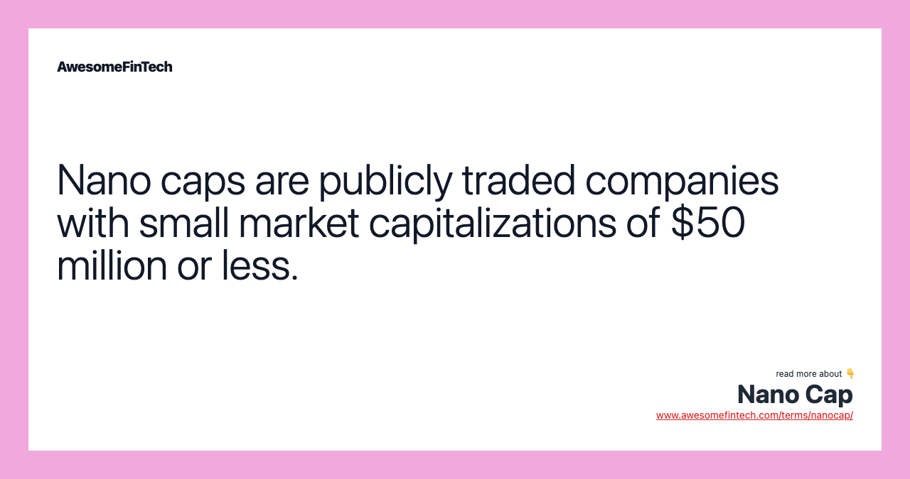

## Table of Contents

## What is a nano cap company?

A nano cap company is a very small business that has a very low total value in the stock market. This total value is called market capitalization, or market cap for short. Nano cap companies usually have a market cap of less than $50 million. Because they are so small, they are often new businesses or in industries that are just starting to grow.

Investing in nano cap companies can be risky. Since they are small and often new, they might not have a lot of money or a proven way to make profits yet. This means they could fail easily. On the other hand, if a nano cap company does well, it could grow a lot and make a big profit for investors. But because they are so small, they are not watched closely by big investors or the media, so it can be hard to find good information about them.

## How is a nano cap defined in terms of market capitalization?

A nano cap company is defined by its very small size in the stock market. Specifically, a nano cap has a market capitalization of less than $50 million. Market capitalization, or market cap, is the total value of all the company's shares combined.

Because nano cap companies are so small, they are often new or in industries that are just starting to grow. This small size makes them riskier to invest in because they might not have much money or a proven way to make profits yet. If a nano cap does well, it could grow a lot, but it's also more likely to fail compared to bigger companies.

## What are the typical characteristics of nano cap stocks?

Nano cap stocks are very small companies with a market value of less than $50 million. They are often new businesses or in industries that are just starting to grow. Because they are so small, they don't have a lot of money or a proven way to make profits yet. This makes them riskier to invest in because they could fail easily.

On the other hand, if a nano cap company does well, it could grow a lot and make a big profit for investors. But because they are so small, they are not watched closely by big investors or the media. This means it can be hard to find good information about them. So, investing in nano cap stocks can be like a big gamble, with the chance for big wins but also big losses.

## What are the potential benefits of investing in nano cap stocks?

Investing in nano cap stocks can offer big rewards. Because these companies are very small, they have a lot of room to grow. If a nano cap company does well, its stock price can go up a lot. This means that if you invest early, you could make a lot of money. It's like finding a hidden gem that turns into a big success.

Another benefit is that nano cap stocks are often overlooked by big investors and the media. This means you might find good deals that others haven't noticed yet. If you do your research and find a nano cap company with a good idea and a strong plan, you could get in on the ground floor of something great. It's like being the first to discover a new trend or product.

## What are the risks associated with nano cap investments?

Investing in nano cap stocks can be very risky. These companies are very small and often new, so they might not have a lot of money or a proven way to make profits yet. This means they could fail easily. If a nano cap company goes out of business, you could lose all the money you invested. Also, because they are so small, they don't have to share as much information with the public. This makes it hard to know if the company is doing well or not.

Another risk is that nano cap stocks can be hard to sell. Because they are not watched closely by big investors or the media, there might not be many people who want to buy them. This means you might have to wait a long time to sell your shares, or you might have to sell them for less money than you wanted. It's like trying to sell a rare item that not many people know about or want.

## How do nano cap stocks differ from micro cap, small cap, and large cap stocks?

Nano cap stocks are the smallest type of company you can invest in. They have a market value of less than $50 million. These companies are often new or in industries that are just starting to grow. They don't have a lot of money or a proven way to make profits yet. This makes them very risky to invest in because they could fail easily. But if they do well, their stock price can go up a lot, which means you could make a lot of money.

Micro cap stocks are a bit bigger than nano caps, with a market value between $50 million and $300 million. They are still small companies, but they might have a bit more money and a clearer way to make profits. Small cap stocks are even bigger, with a market value between $300 million and $2 billion. These companies are more established and less risky than nano and micro caps. Large cap stocks are the biggest, with a market value over $10 billion. They are well-known companies that are less likely to fail, but their stock prices don't usually grow as fast as smaller companies.

The main difference between these types of stocks is their size and risk level. Nano caps are the smallest and riskiest, while large caps are the biggest and safest. As you move from nano caps to large caps, the companies get bigger, have more money, and are less likely to fail. But they also have less room to grow quickly, so the potential for big profits is smaller.

## What role do nano cap companies play in the economy?

Nano cap companies are very small businesses that play a big role in the economy. They often start new ideas and create new jobs. When these tiny companies grow, they can bring new products and services to the market. This helps the economy grow because it gives people more choices and can make businesses in other areas grow too.

Even though nano cap companies are small, they can be important for innovation. They might not have a lot of money, but they can take big risks that bigger companies might not take. If a nano cap company does well, it can become a bigger company and help the economy even more. But if it fails, it might not hurt the economy as much because it's so small. So, nano cap companies are like the seeds that can grow into big trees in the economy.

## How can one identify promising nano cap stocks?

Finding good nano cap stocks can be hard because they are very small and don't have a lot of information out there. But you can start by looking at the company's business plan. See if they have a new idea or a way to do something better than others. Also, check if the people running the company have done well before. If they have, they might be able to make the company grow.

Another way to find promising nano cap stocks is to look at the industry they are in. If it's an industry that is just starting to grow, the company might have a good chance to do well. Also, read news and reports about the company. Even though there might not be a lot, any good news can be a sign that the company is doing something right. Remember, investing in nano cap stocks is risky, so always do a lot of research before you decide to invest.

## What are the liquidity concerns when investing in nano caps?

When you invest in nano cap stocks, one big worry is [liquidity](/wiki/liquidity-risk-premium). Liquidity means how easy it is to buy or sell a stock. Because nano cap companies are so small, not many people want to buy their stocks. This means if you want to sell your nano cap stocks, you might have a hard time finding someone to buy them. You might have to wait a long time or sell them for less money than you wanted.

This lack of liquidity can be a big problem. If you need your money back quickly, you might not be able to get it. And if the price of the stock goes down while you're waiting to sell, you could lose even more money. So, when you invest in nano cap stocks, you need to be ready to keep your money in them for a long time and be okay with not being able to sell them right away.

## How does the regulatory environment affect nano cap companies?

The rules and laws that nano cap companies have to follow can be a big challenge for them. Because they are so small, they don't have a lot of money to spend on making sure they follow all the rules. This can make it hard for them to grow and do well. Also, the rules can be different depending on where the company is, which can make things even harder if they want to do business in different places.

On the other hand, the rules can also help nano cap companies. They can make sure that the company is doing things the right way and not cheating. This can make people trust the company more and want to invest in it. But because nano cap companies are so small, they don't have to share as much information with the public as bigger companies do. This can make it hard for people to know if the company is doing well or not.

## What strategies can be used to mitigate risks when investing in nano caps?

When you invest in nano cap stocks, one way to lower your risk is to do a lot of research. Look at the company's business plan and see if they have a good idea or a way to do something better than others. Also, check if the people running the company have done well before. This can give you a better idea of whether the company might do well. Another way to lower your risk is to not put all your money into one nano cap stock. Instead, spread your money out over a few different nano cap stocks. This way, if one company does badly, you won't lose all your money.

Another strategy is to be patient. Nano cap stocks can be hard to sell quickly because not many people want to buy them. So, be ready to keep your money in them for a long time. This can help you avoid selling them for less money than you wanted. Also, keep an eye on the news and reports about the company. Even though there might not be a lot of information, any good news can be a sign that the company is doing something right. By being patient and staying informed, you can make better choices about when to buy or sell your nano cap stocks.

## What are some success stories of nano cap companies that have grown significantly?

One great success story is Monster Beverage Corporation. A long time ago, when it was called Hansen Natural Corporation, it was a nano cap company. It made natural sodas and juices. But then, it started making energy drinks called Monster Energy. People loved them, and the company grew a lot. Now, Monster Beverage is a big company worth billions of dollars. It shows how a small nano cap company can become a huge success if it has a good idea and works hard.

Another example is Netflix. When it first started, Netflix was a tiny company that sent DVDs to people's homes through the mail. It was a nano cap back then. But as more people started using the internet, Netflix changed its business to streaming movies and TV shows online. This was a smart move, and Netflix grew really big. Now, it's a giant company that people all over the world use. It's a good example of how a nano cap can grow by finding new ways to do things.

## References & Further Reading

[1]: Bergstra, J., Bardenet, R., Bengio, Y., & Kégl, B. (2011). ["Algorithms for Hyper-Parameter Optimization."](https://proceedings.neurips.cc/paper/2011/file/86e8f7ab32cfd12577bc2619bc635690-Paper.pdf) Advances in Neural Information Processing Systems 24.

[2]: ["Advances in Financial Machine Learning"](https://www.amazon.com/Advances-Financial-Machine-Learning-Marcos/dp/1119482089) by Marcos Lopez de Prado

[3]: ["Evidence-Based Technical Analysis: Applying the Scientific Method and Statistical Inference to Trading Signals"](https://www.amazon.com/Evidence-Based-Technical-Analysis-Scientific-Statistical/dp/0470008741) by David Aronson

[4]: ["Machine Learning for Algorithmic Trading"](https://github.com/stefan-jansen/machine-learning-for-trading) by Stefan Jansen

[5]: ["Quantitative Trading: How to Build Your Own Algorithmic Trading Business"](https://www.amazon.com/Quantitative-Trading-Build-Algorithmic-Business/dp/1119800064) by Ernest P. Chan