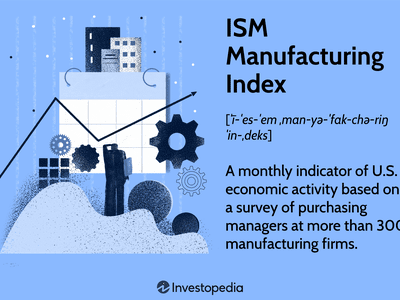

In a rapidly globalizing world, supply chain management has become increasingly complex and crucial for businesses. Supply chains are now vast, interconnected networks that extend across international borders, necessitating sophisticated management and analytical techniques to ensure their seamless operation. This intricate framework requires continuous monitoring, forecasting, and adaptation to meet the ever-evolving demands of global markets.

The National Association of Purchasing Management (NAPM) Chicago is instrumental in providing valuable insights into business conditions, which are critical for effective supply chain management. With its indices and surveys, NAPM Chicago delivers key economic data that serves as a leading indicator of industry trends and economic health. Such insights enable businesses to make informed decisions regarding inventory management, production scheduling, and risk mitigation.



In tandem with these traditional methodologies, the rise of algorithmic trading (algo trading) has highlighted a new dimension of technological integration within supply chain management. Algorithmic trading leverages complex algorithms and machine learning techniques to automate decision-making processes, allowing for rapid adaptation to market fluctuations. The intertwining of algo trading’s computational power with supply chain operations opens avenues for innovation, particularly in predictive logistics and the mitigation of supply chain disruptions.

This article explores the intersection of supply chain management, NAPM Chicago insights, and algorithmic trading. By understanding how these components interact, businesses can harness their potential to innovate and maintain a competitive edge in today's dynamic marketplace.

## Table of Contents

## Understanding Supply Chain Management

Supply Chain Management (SCM) is a critical component in today's interconnected business environment. It generally refers to the comprehensive oversight and control of the flow of goods and services, encompassing all processes that transform raw materials into final products. The importance of SCM lies in its ability to enhance customer service, reduce operational costs, and improve financial performance, thus providing a competitive edge in the market.

**Key Components of Effective Supply Chain Management:**

1. **Planning:** This stage involves strategizing the most efficient way to meet consumer demand. It includes demand forecasting and aligning supply chain activities to meet predicted consumer needs while optimizing resources.

2. **Sourcing:** Choosing suppliers who can provide the necessary goods or services is crucial. This component focuses on supplier relationship management, negotiating contracts, and establishing payment terms while ensuring quality and compliance standards are met.

3. **Manufacturing:** This is the production phase where inputs are transformed into final products. Efficient manufacturing processes are vital to maintaining quality and minimizing waste. It involves scheduling, process management, and quality control.

4. **Delivery:** Often termed logistics, this involves the coordination of order fulfilment, warehousing, and transport of products to the end customer. Efficient delivery systems ensure products are distributed swiftly and cost-effectively.

5. **Returns:** Also known as reverse logistics, this involves managing the return and recycling of products. Effective return systems enhance customer satisfaction and contribute to sustainability by facilitating recycling and waste reduction.

**Challenges Faced in Supply Chain Management:**

Supply chains today confront various challenges:

- **Demand Fluctuations:** Variability in consumer demand can disrupt supply balances, leading to either overproduction or shortages. Accurate demand forecasting using advanced data analytics can help mitigate this issue.

- **Disruptions:** Natural disasters, political instability, and pandemics can cause significant disruptions. Building resilient supply chains with contingency plans is imperative to handle such uncertainties.

- **Technological Changes:** The rapid pace of technological advancement necessitates continuous adaptation and integration of new technology. While technology can drive efficiency, it also requires constant updates and investments in employee training.

Supply Chain Management functions as the backbone of any business operation, requiring precise coordination across its numerous components. Despite the inherent challenges, effective SCM practices are pivotal in ensuring business continuity and success in the global market landscape.

## Role of NAPM Chicago in Supply Chain Management

The National Association of Purchasing Management (NAPM) Chicago, now known as the ISM-Chicago, plays a crucial role in providing a clear picture of business conditions in the Chicago area through its meticulously curated surveys. These surveys serve as a vital resource for supply chain professionals, offering insights into the economic environment that can significantly impact supply chain management.

The NAPM Chicago index is a key leading indicator of economic trends, particularly for supply chains. This index is calculated based on survey responses from purchasing and supply managers concerning their organization's operations. It includes various components such as new orders, inventory levels, production, supplier deliveries, and employment environment. The NAPM Chicago Purchasing Managers' Index (PMI) is a pivotal measure; a PMI above 50 signifies expansion in the sector, while a PMI below 50 indicates contraction.

Supply chain professionals leverage the insights from the NAPM Chicago surveys to enhance forecasting, planning, and risk management. The data derived from the NAPM index can help businesses anticipate demand fluctuations, manage inventory levels more effectively, and streamline procurement processes. For example, if the survey shows an increase in new orders, companies can prepare for heightened production requirements. Simultaneously, by keeping track of supplier delivery times from survey findings, managers can better anticipate potential disruptions and plan accordingly to mitigate risks.

Furthermore, the analysis of employment conditions provided by the index allows firms to strategically manage their workforce, optimizing labor costs while ensuring that the operational needs of the supply chain are met. By incorporating NAPM Chicago insights into their strategic planning, businesses can make informed decisions that foster resilience and competitiveness in an ever-evolving market landscape.

 to Algorithmic Trading

Algorithmic trading, often referred to as algo trading, represents a contemporary transformation in how trading is conducted within financial markets. It utilizes complex mathematical models and computational algorithms to make high-speed transactions, often capitalizing on minuscule market fluctuations. These algorithms decide and execute trades based on predefined criteria and are capable of processing vast amounts of data more rapidly and accurately than traditional human traders.

In today's financial ecosystems, [algorithmic trading](/wiki/algorithmic-trading) is significant due to its efficiency and the automation of decision-making processes. It eliminates emotional and psychological biases, ensuring consistency and speed in executing trades. The underlying algorithms employ [machine learning](/wiki/machine-learning) techniques, enabling the system to adapt to changing market conditions by identifying patterns and predicting future price movements.

One common technique in algorithmic trading is high-frequency trading ([HFT](/wiki/high-frequency-trading-strategies)), which involves executing a high number of trades in fractions of a second. This is achieved through the integration of advanced statistical models into trading systems. The impact of HFT on supply chains is noteworthy. For instance, the need for rapid data processing and reduced latency has driven advancements in technology infrastructure within supply chains, which have had to adapt to the demands of high-frequency trading environments. 

Moreover, algorithmic trading influences supply chains by necessitating real-time risk assessment and operational adjustments. This can lead to enhanced logistical operations, as companies must optimize their processes to synchronize with the fast-paced trading cycles. They need to ensure that their data processing, risk management, and logistical solutions are agile and robust enough to handle the dynamic nature of financial markets driven by algorithmic strategies.

In summary, algorithmic trading automates and optimizes the trading process through precise algorithms and machine learning, offering efficiency and reliability in modern markets. Its impact extends beyond financial exchanges, prompting supply chains to evolve technologically to remain competitive and responsive.

## Integrating Algo Trading into Supply Chain Management

Technology plays a critical role in advancing supply chain management, and the integration of algorithmic trading—popularly known as algo trading—offers new opportunities for efficiency and resilience. Algo trading utilizes complex algorithms and machine learning to automate decision-making, primarily in financial markets, but its implications extend into supply chain management.

Algorithmic models serve as predictive tools that can anticipate supply chain disruptions and optimize logistics processes. By analyzing vast datasets, these models can identify patterns and anomalies that indicate potential bottlenecks or breakdowns long before they manifest. For example, machine learning algorithms can predict demand fluctuations by analyzing historical sales data, weather patterns, economic indicators, and even social media sentiment. This foresight enables businesses to adjust their inventory levels proactively, minimizing the risk of stockouts or overstock situations.

Optimizing logistics through algo trading involves enhancing route planning for transportation networks. By leveraging real-time data, algorithms can calculate the most efficient routes, taking into account variables such as traffic congestion, fuel costs, and delivery time windows. Python libraries like Pandas and NumPy can process and analyze transportation data, while optimization libraries such as SciPy and PuLP can solve complex routing problems. The following Python snippet demonstrates how to use these libraries for optimizing delivery routes:

```python
from scipy.optimize import linprog

# Cost matrix for delivery routes
cost_matrix = [[4, 6, 9], [5, 3, 8], [7, 8, 6]]

# Apply linear programming to minimize costs
result = linprog(c=[4, 6, 9, 5, 3, 8, 7, 8, 6], method='highs')

print(result)
```

Chicago's supply chain landscape has witnessed successful case studies of integrating algo trading to enhance logistics operations. One case involved a major retail chain that adopted algorithmic models to forecast demand across its network of stores. By doing so, the company significantly reduced its inventory holding costs while maintaining high service levels, illustrating the impact of predictive analytics on supply chain efficiency.

Another example is a logistics firm that implemented algo trading techniques to optimize its fleet operations. By using algorithms to process real-time traffic data and predict route conditions, the company improved delivery times and reduced operational expenses. These case studies underscore the potential of algo trading to transform traditional supply chain practices through technological innovation.

Incorporating algo trading into supply chain management necessitates a robust technological infrastructure and a commitment to continual data analysis and refinement of predictive models. As more businesses harness these capabilities, the integration of algo trading with supply chain management is poised to yield significant advancements in operational efficiency and strategic foresight.

## Collaborative Efforts and Risk Mitigation

Collaboration among supply chain professionals and associations such as the National Association of Purchasing Management (NAPM) Chicago is a vital component in mitigating risks inherent in supply chain management. The complexity and interconnectivity of modern supply chains necessitate a concerted effort among stakeholders to anticipate and manage potential disruptions. Collaboration facilitates the exchange of valuable insights and strategies, thereby enhancing the overall resilience of the supply network.

Proactive risk assessment and management are increasingly relying on technological innovations to identify, analyze, and mitigate risks. For example, the use of advanced analytics and machine learning allows for the processing of vast amounts of data to detect patterns and anomalies that may indicate potential disruptions. Consider the implementation of predictive analytics, which employs historical and real-time data to predict future supply chain disruptions. A supply chain manager might use a Python script to analyze such data:

```python
import pandas as pd
from sklearn.ensemble import RandomForestClassifier

# Load historical supply chain data
data = pd.read_csv('supply_chain_data.csv')

# Prepare the data
features = data.drop('disruption_label', axis=1)
labels = data['disruption_label']

# Initialize the Random Forest Classifier
model = RandomForestClassifier(n_estimators=100, random_state=42)

# Train the model
model.fit(features, labels)

# Predict potential disruptions
predictions = model.predict(features_test)
```

This type of technological implementation allows for real-time decision-making and proactive measures, minimizing downtime and losses.

NAPM Chicago plays a critical role in facilitating networking and knowledge sharing within the industry. By organizing conferences, seminars, and workshops, NAPM provides a platform for professionals to exchange knowledge, discuss best practices, and collaborate on solutions to common challenges. These events encourage the dissemination of innovative ideas and provide opportunities for supply chain managers to learn from experts and peers.

Additionally, NAPM's publications and resources provide valuable insights into market trends and economic indicators, enabling professionals to make informed decisions. The association's focus on fostering a community of collaboration and learning strengthens the industry's ability to anticipate and respond to challenges, thereby enhancing supply chain resilience. 

In conclusion, the collaborative efforts encouraged by NAPM Chicago not only enhance the capabilities of individual organizations but also contribute to a more agile and secure supply network.

## Future of Supply Chain Management with NAPM Chicago and Algo Trading

Emerging trends in supply chain management are increasingly shaped by the integration of data analytics and algorithmic trading. These technological advancements offer significant potential for transforming conventional supply chain practices, leading to enhanced efficiency, accuracy, and responsiveness. Data analytics, in particular, provides the ability to process vast amounts of information to extract actionable insights, enabling businesses to make more informed decisions. Algorithmic trading introduces automated decision-making processes that can significantly impact supply chains, especially in terms of predicting and reacting to market fluctuations.

Integrating these new technologies into supply chain operations, however, presents several challenges. Firstly, there is the issue of data complexity and [volume](/wiki/volume-trading-strategy). Supply chains generate a significant amount of data that can be vastly complex. Utilizing data analytics effectively requires systems capable of processing and analyzing these data efficiently. Additionally, the accuracy of algorithms is highly dependent on the quality of data input, necessitating robust data management practices.

Security concerns also pose a challenge. As supply chains become more reliant on digital technologies, the risk of cyber threats increases. Implementing robust cybersecurity measures is essential to protect sensitive data and maintain the integrity of supply chain operations. Compatibility issues between legacy systems and new technologies can also hinder seamless integration.

To address these challenges, businesses must adopt a strategic approach. Implementing advanced data analytics platforms equipped with machine learning capabilities can help manage and interpret large datasets. Ensuring that data inputs are accurate and reliable through data validation and cleaning processes is crucial. Furthermore, building a flexible technology infrastructure that supports interoperability between new and existing systems can facilitate smoother transitions.

The future role of the National Association of Purchasing Management (NAPM) Chicago is likely to expand as these technologies evolve. NAPM Chicago can continue to provide valuable insights by leveraging its position and expertise in the industry. By analyzing market trends and disseminating findings through surveys and reports, NAPM Chicago can aid businesses in forecasting and strategic planning.

Furthermore, NAPM Chicago can foster innovation by creating platforms for collaboration among industry players. Networking events, workshops, and conferences can facilitate knowledge sharing, allowing businesses to learn from each other's experiences and best practices. By promoting collaborative efforts, NAPM Chicago can contribute to driving forward-thinking supply chain strategies, making them more resilient and adaptable in the face of rapid technological changes.

In conclusion, the future of supply chain management will be heavily influenced by the integration of data analytics and algorithmic trading. While challenges exist, strategic implementation and collaboration can unlock substantial benefits. NAPM Chicago's role as a facilitator of insights and innovation will be critical in navigating these emerging trends, thereby supporting businesses in maintaining their competitive edge.

## Conclusion

The convergence of supply chain management, insights from NAPM Chicago, and algorithmic trading represents a transformative shift in how businesses navigate modern complexities. Supply chain management is an essential component of the business ecosystem, involving the coordination and integration of various processes, including planning, sourcing, manufacturing, delivery, and returns. Through indices and surveys, NAPM Chicago offers valuable insights into business conditions, enabling companies to make informed decisions in forecasting and planning.

Algorithmic trading introduces a further layer of sophistication, utilizing automated, data-driven strategies to enhance decision-making capabilities within supply chains. This integration is particularly crucial in high-frequency trading environments, where the speed and accuracy of transactions can significantly impact outcomes. Algorithmic models can predict supply chain disruptions and optimize logistics, contributing to resilience and efficiency.

Technological advancements continue to drive innovations in supply chain practices. As these practices evolve, businesses must remain adaptive and proactive, capitalizing on insights from both NAPM Chicago and algorithmic trading to maintain a competitive edge. By leveraging these insights, companies can better anticipate changes, mitigate risks, and enhance their strategic positioning within the marketplace. The interplay of these elements underscores a commitment to continuous improvement and strategic agility in a rapidly changing world.

## References & Further Reading

[1]: ["Advances in Financial Machine Learning"](https://www.amazon.com/Advances-Financial-Machine-Learning-Marcos/dp/1119482089) by Marcos Lopez de Prado

[2]: ["Evidence-Based Technical Analysis: Applying the Scientific Method and Statistical Inference to Trading Signals"](https://www.amazon.com/Evidence-Based-Technical-Analysis-Scientific-Statistical/dp/0470008741) by David Aronson

[3]: ["Machine Learning for Algorithmic Trading"](https://github.com/stefan-jansen/machine-learning-for-trading) by Stefan Jansen

[4]: ["Quantitative Trading: How to Build Your Own Algorithmic Trading Business"](https://www.amazon.com/Quantitative-Trading-Build-Algorithmic-Business/dp/1119800064) by Ernest P. Chan

[5]: Bergstra, J., Bardenet, R., Bengio, Y., & Kégl, B. (2011). ["Algorithms for Hyper-Parameter Optimization."](https://dl.acm.org/doi/10.5555/2986459.2986743) Advances in Neural Information Processing Systems 24.

[6]: ["The Essentials of Supply Chain Management"](https://onlinelibrary.wiley.com/doi/book/10.1002/9781119464495) by Hokey Min