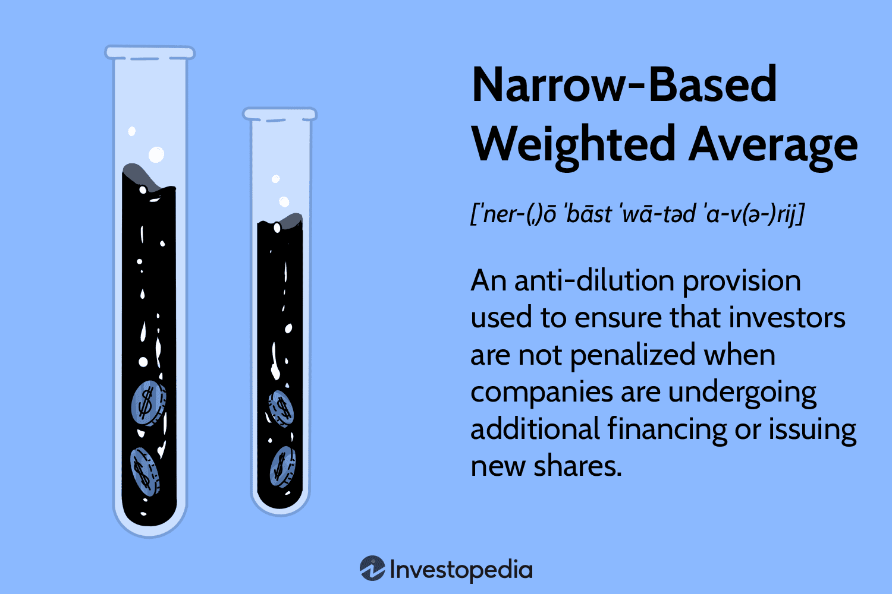

The rise of algorithmic trading in financial markets has significantly transformed the landscape of trading and investment strategies. At the core of these advanced methodologies lies the concept of weighted average calculations, which have become indispensable tools for market participants seeking to optimize trade executions and protect investor interests. Weighted averages, an extension of simple averages, provide greater analytical precision by assigning different weights to various data points based on their significance. This flexibility allows for a more nuanced interpretation of data, which is especially useful in dynamic financial environments.

Among the different types of weighted averages, narrow-based weighted averages stand out for their specialized application in protecting early investors from dilution during funding rounds. Unlike broad-based weighted averages, narrow-based variants focus on a specific subset of shares, typically preferred shares. This targeted approach ensures that early investors retain a higher degree of equity when new shares are issued, particularly in scenarios where the company raises capital at a valuation lower than previous rounds—a situation known as a "down round."



In financial analysis and algorithmic trading, narrow-based weighted averages are crucial. They offer robust solutions not just for equity protection but also for the refinement of trading algorithms that enhance market performance. These calculations are integral to strategies like Volume Weighted Average Price (VWAP) and Exponential Moving Averages (EMA), which are designed to provide traders with a deeper understanding of market trends, thereby informing more strategic decision-making.

Overall, the impact of weighted averages, and specifically narrow-based weighted averages, is profound in modern finance. They contribute significantly to safeguarding investor interests and driving efficient market operations, making them a cornerstone of contemporary trading strategies and financial analysis frameworks. Through continued innovation and strategic application, these techniques will likely play an increasingly vital role in the evolving financial landscape.

## Table of Contents

## Understanding Weighted Averages and Narrow-Based Variants

Weighted averages are a pivotal tool in financial analytics, providing a more nuanced understanding of data sets by assigning varying degrees of significance to different components. Unlike simple averages, which treat all values equivalently, weighted averages recognize that certain data points may have more impact or relevance than others, offering a refined approach to analysis.

Mathematically, the weighted average is calculated by multiplying each data point by a predetermined weight, summing these products, and then dividing by the total of the weights. The formula for a weighted average $W$ is:

$$

W = \frac{\sum_{i=1}^{n} w_i x_i}{\sum_{i=1}^{n} w_i} 
$$

where $w_i$ represents the weight of the $i$-th data point, and $x_i$ is the value of the $i$-th data point.

In corporate finance, particularly during funding rounds, the narrow-based weighted average is a specialized variant pertinent to managing equity dilution. This approach is crucial for protecting early investors by focusing on a critical subset of shares, typically preferred shares. It considers only these specific shares when recalculating conversion rates, thereby limiting dilution to a narrower share base. This adjustment is particularly significant during down rounds—investment rounds where new investors buy in at a lower valuation than previous investors.

The mathematical foundation of narrow-based weighted averages for anti-dilution adjustments involves recalibrating the conversion price of preferred shares. The adjusted conversion price $CP'$ is calculated as follows:

$$

CP' = \frac{CP \times (OS + \frac{NP}{CP})}{OS + NP} 
$$

where:
- $CP$ is the original conversion price,
- $OS$ is the outstanding shares before the new issue,
- $NP$ is the new price per share issued.

The narrow-based approach uses the outstanding common shares alongside preferred shares eligible for conversion, ensuring that early investors' stakes are prioritized.

In summary, weighted averages, especially narrow-based variants, play a crucial role not just in offering refined data insights but also in safeguarding investor interests in corporate finance. Their application within the financial sector underscores their strategic importance in maintaining the integrity of investments even amidst varying market conditions.

## Applications in Financial Analysis

Weighted averages play a crucial role in enhancing financial analysis, particularly in [algorithmic trading](/wiki/algorithmic-trading). Two major strategies that utilize weighted averages are the Volume Weighted Average Price (VWAP) and Exponential Moving Averages (EMA). These strategies help traders make well-informed decisions by offering insights into market trends and optimizing trade executions.

### Volume Weighted Average Price (VWAP)

VWAP is a trading benchmark that represents the average price a security has traded at throughout the day, based on both [volume](/wiki/volume-trading-strategy) and price. It is widely used by traders to assess the performance of their buy and sell activities in a trading session. The VWAP is calculated using the formula:

$$
\text{VWAP} = \frac{\sum_{i=1}^{n} P_i \times Q_i}{\sum_{i=1}^{n} Q_i}
$$

where $P_i$ is the price of the trade, $Q_i$ is the number of units traded, and $n$ is the total number of trades. This calculation gives traders a more comprehensive view of the trading history by considering both the price and the volume of transactions.

VWAP is essential for minimizing market impact when executing large orders. Traders and portfolio managers use VWAP to ensure that their trades align with the average market price, reducing the risk of adversely affecting the market or generating suboptimal outcomes.

### Exponential Moving Averages (EMA)

EMA is another critical tool in algorithmic trading that emphasizes more recent data points by assigning them a larger weight in the average calculation. This technique provides a more responsive indicator of price trends compared to simple moving averages, which treat all data points equally. The formula for calculating EMA is as follows:

$$
\text{EMA}_t = \left( \frac{2}{N+1} \right) \cdot \text{Price}_t + \left( 1 - \frac{2}{N+1} \right) \cdot \text{EMA}_{t-1}
$$

where $N$ is the number of periods, and $\text{EMA}_{t-1}$ is the EMA value of the previous period. The weighting factor $\frac{2}{N+1}$ determines the degree of responsiveness of the EMA to the latest data points.

EMA is crucial for identifying trend direction and potential reversal points, helping traders strategize effectively. It is commonly used in crossover strategies, where traders look for the intersection of short-term and long-term EMAs as signals for potential buy or sell opportunities.

### Enhancing Financial Analysis and Decision-Making

Weighted averages, such as VWAP and EMA, dramatically enhance the financial analysis process by offering a more nuanced understanding of price movements and market dynamics. These calculations allow traders to develop algorithmic strategies that are better aligned with market conditions, ultimately leading to more informed decision-making.

By utilizing weighted averages, traders gain insights into market [liquidity](/wiki/liquidity-risk-premium), trend strength, and [volatility](/wiki/volatility-trading-strategies). This information is critical for optimizing trade execution, managing risks, and improving overall trading performance. As the financial market continues to evolve, the use of sophisticated weighted average calculations will remain pivotal to the success of algorithmic trading strategies.

## Narrow-Based Weighted Average in Algo Trading

Narrow-based weighted averages serve as a crucial mechanism in algorithmic trading, particularly in protecting investor interests during adverse market conditions, such as down rounds. In such instances, these averages adjust the conversion rate of preferred stocks, shielding early investors from significant dilution. This adjustment is essential because, without it, the value of early investments might be severely compromised when a company issues new shares at a lower price than previous rounds.

For example, consider a scenario where a company originally issues preferred shares with an initial price. During a down round, new shares may be issued at a lower price, but the narrow-based weighted average adjustments ensure that the conversion ratio of the existing preferred shares is recalculated to dilute the impact on early investors. Mathematically, this is often expressed as:

$$
\text{New Conversion Price} = \frac{\text{Old Conversion Price} \times \text{Old Shares Outstanding} + \text{New Issue Price} \times \text{New Shares Issued}}{\text{Old Shares Outstanding} + \text{New Shares Issued}}
$$

This formula exemplifies how narrow-based weighted averages can maintain equity balance amid fluctuating market conditions.

From a technical perspective, implementing narrow-based weighted averages in trading systems involves careful integration of these calculations into trading algorithms. This demands systems capable of real-time data processing, ensuring that weighted average calculations swiftly occur as new pricing data and issuance details become available. Python, often favored for its versatility in financial applications, can be employed to handle these calculations efficiently. A basic Python code snippet for calculating the new conversion price might look like this:

```python
def calculate_new_conversion_price(old_conv_price, old_shares, new_issue_price, new_shares):
    return (old_conv_price * old_shares + new_issue_price * new_shares) / (old_shares + new_shares)

# Example usage:
old_conv_price = 10.0
old_shares = 100000
new_issue_price = 8.0
new_shares = 20000

new_conv_price = calculate_new_conversion_price(old_conv_price, old_shares, new_issue_price, new_shares)
print(f"New Conversion Price: ${new_conv_price:.2f}")
```

Furthermore, case studies highlight scenarios where narrow-based weighted averages have played a pivotal role in maintaining investor confidence and optimizing trading algorithms. For instance, during economic downturns or market crashes, companies that have successfully integrated these calculations into their trading frameworks not only protect their investors but also gain a strategic advantage by retaining investor trust.

Technical considerations also include ensuring data integrity and accuracy, given that these averages rely heavily on precise market data. Trading systems must be equipped with robust algorithms capable of handling complex calculations without significant latency, which is crucial in fast-paced trading environments.

Overall, narrow-based weighted averages in algorithmic trading function as a safeguard mechanism that, when properly implemented, can significantly enhance investor protection while enabling efficient trade execution.

## Legal and Strategic Considerations

The legal and strategic considerations surrounding narrow-based weighted averages are an essential aspect of structuring financial agreements, particularly in venture capital and equity financing. These provisions are designed to protect early investors from the dilution of their equity stakes when a company issues new shares at a price lower than previous rounds, often referred to as a "down round." The precise execution of anti-dilution clauses is critical to maintain investor confidence and optimize corporate capital structures.

Narrow-based weighted averages focus on allocating additional shares to preferred stockholders during a down round, thereby recalculating the conversion price of preferred shares based on a subset of shares outstanding, excluding certain shares like employee options or unissued treasury shares. This variant is more company-friendly compared to broad-based weighted averages, and it specifically considers the impact on early investors by limiting dilution to them rather than spreading it across all shareholders.

For venture capitalists and companies, negotiating the specifics of these provisions is a strategic endeavor. Investors seek robust anti-dilution protection to safeguard their investments, while companies aim for flexibility to raise capital efficiently without excessive dilution of founder or employee equity. The legal language of these agreements must clearly articulate the conditions and methodologies for applying weighted averages. Missteps in crafting these provisions can lead to significant legal disputes or imbalance in control and economic outcomes.

Stakeholders must understand key elements like "trigger events," which initiate anti-dilution protections, and the exact formula used. In a narrow-based weighted average context, the formula is typically expressed as:

$$
\text{New Conversion Price} = \frac{(O \times OP) + (NP \times N)}{O + N}
$$

where $O$ is the number of outstanding shares, $OP$ is the original conversion price, $NP$ is the new price per share issued, and $N$ is the number of new shares issued.

Strategic negotiation of these elements requires a deep understanding of the company's growth trajectory, market conditions, and potential financing needs. Attorneys and financial advisors must work closely to ensure that the anti-dilution provisions balance protecting investor interests with preserving the company’s operational flexibility. This balance is crucial for maintaining healthy relationships between stakeholders and promoting the long-term value creation of the enterprise.

In conclusion, the legal and strategic considerations of narrow-based weighted averages necessitate meticulous drafting and negotiation. Ensuring that all parties understand and agree on the intricacies of these provisions helps mitigate risks and align the interests of investors and companies as they navigate the complexities of venture financing and equity management.

## Challenges and Future Directions

Utilizing weighted averages in financial analysis, particularly narrow-based weighted averages, presents specific challenges that need careful consideration. One of the primary challenges is ensuring data accuracy. Weighted averages rely heavily on the precision of input data as inaccuracies can lead to flawed analytics and improper decision-making. This challenge is exacerbated in financial markets where data streams are continuous and voluminous, increasing the probability of errors. Therefore, maintaining data fidelity is crucial for effective financial analysis and algo trading.

Another significant challenge is the complexity associated with the adjustments needed for accurately calculating narrow-based weighted averages. This complexity arises from needing to allocate correct weights to individual financial instruments or data entries, particularly preferred shares in the context of funding rounds. In corporate finance, for instance, ensuring that narrow-based weighted averages correctly protect early investors from dilution involves intricate calculations, often requiring bespoke solution designs tailored to specific investment scenarios.

Looking to the future, integrating advanced technologies such as [machine learning](/wiki/machine-learning) and blockchain emerges as a promising trend to enhance the precision and transparency of weighted average calculations. Machine learning algorithms can process vast datasets efficiently, identifying patterns and making weighting decisions that reflect real-time market dynamics. Additionally, these algorithms can help automate adjustments, reducing human error and increasing calculation efficiency.

Blockchain technology can address transparency and auditability issues by providing immutable ledgers. These ledgers can track changes in weights and adjustments over time, affording all stakeholders a clear and unaltered view of the calculations made. This transparency is particularly beneficial in scenarios with legal scrutiny or disputes over anti-dilution clauses.

As these technologies evolve, their integration into algorithmic trading systems will profoundly influence the future of financial analysis. By enhancing calculation precision and ensuring transparency, they enable more informed decision-making and robust investor protection strategies.

Efforts invested in overcoming current challenges and harnessing technological advancements will shape the future landscape of finance, facilitating a more efficient and transparent financial ecosystem. These innovations promise to continue the evolution of algorithmic trading, offering new solutions for complex analytical requirements in the financial industry.

## Conclusion

Weighted averages, particularly narrow-based, play a critical role in the field of financial analysis and algorithmic trading. These calculations are crucial as they provide nuanced insights that foster more precise decision-making. By considering specific factors and weights, they adapt to market changes, thus ensuring their continued relevance and efficacy in protecting investor interests.

The resilience and adaptability of weighted averages make them indispensable tools in financial analysis. Their application aids in mitigating risks associated with market volatility, thereby safeguarding investor equity. For example, in situations where funding rounds might lead to potential dilution of shares, narrow-based weighted averages adjust the conversion rate to preserve early investor interests. This inherent flexibility is a significant advantage, contributing to their sustained importance in financial strategies.

As financial markets evolve, weighted averages are expected to become even more integral. The integration of cutting-edge technologies such as machine learning and blockchain introduces opportunities for enhanced precision and transparency in calculations. These advancements promise to refine the methodologies involved, offering higher accuracy and more significant insights into market dynamics.

Strategic implementation of weighted averages in trading systems is essential for leveraging these advantages. Innovations in computational techniques will likely offer new approaches to trading strategies, optimizing execution efficiency and effectiveness. As a result, the continued development and refinement of these techniques will shape and define the future of finance and trading, ensuring that weighted averages remain a core component in navigating the complexities of modern financial markets.

## References & Further Reading

[1]: ["Advances in Financial Machine Learning"](https://www.amazon.com/Advances-Financial-Machine-Learning-Marcos/dp/1119482089) by Marcos Lopez de Prado

[2]: ["Evidence-Based Technical Analysis: Applying the Scientific Method and Statistical Inference to Trading Signals"](https://www.amazon.com/Evidence-Based-Technical-Analysis-Scientific-Statistical/dp/0470008741) by David Aronson

[3]: ["Machine Learning for Algorithmic Trading"](https://github.com/stefan-jansen/machine-learning-for-trading) by Stefan Jansen

[4]: ["Quantitative Trading: How to Build Your Own Algorithmic Trading Business"](https://www.amazon.com/Quantitative-Trading-Build-Algorithmic-Business/dp/1119800064) by Ernest P. Chan

[5]: Arnold, T., Herschberg, M., & Meeuwissen, J. (2016). ["Algorithmic Trading and Changes in Firms' Expected Returns."](https://www.sciencedirect.com/science/article/pii/S0275531920304050) Abacus, 52(2), 218-251.

[6]: Back, K., & Baruch, S. (2012). ["Working Orders in Limit Order Markets and Floor Exchanges."](https://www.semanticscholar.org/paper/Working-Orders-in-Limit-Order-Markets-and-Floor-Back-Baruch/a2d5554ec9b83732e5293ce5aa5c0666f9b59f8a) American Economic Review, 102(10), 3395-3429.

[7]: Hasbrouck, J., & Saar, G. (2013). ["Low-latency trading."](https://www.sciencedirect.com/science/article/abs/pii/S1386418113000165) The Review of Financial Studies, 26(9), 2345-2384.