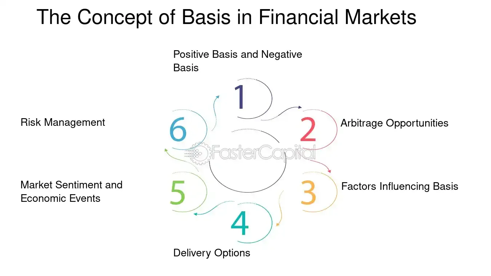

## Table of Contents

## What is a narrow basis in finance?

A narrow basis in finance refers to a small difference between the spot price of an asset and the price of its futures contract. In simpler terms, it's when the price you would pay to buy something right now is very close to the price you would agree to buy it for at a future date. This situation often happens when there's a lot of agreement among traders about what the asset's price should be, both now and in the future.

When the basis is narrow, it suggests that the market is stable and there's not much uncertainty about the asset's future value. This can be good for investors because it means less risk. However, a narrow basis can also mean that there might not be many opportunities to make big profits from price differences between the spot and futures markets.

## How does a narrow basis affect financial markets?

A narrow basis in financial markets means that the price of an asset today is very close to what people expect it to be in the future. This can make the market feel stable because it shows that everyone agrees on what the asset is worth now and later. When there's a narrow basis, it's easier for people to make plans and investments because they feel more sure about what's going to happen. This can lead to more people wanting to buy and sell, making the market more active.

However, a narrow basis can also mean fewer chances to make big profits. When the difference between today's price and the future price is small, there's less room to make money by buying low and selling high. Traders who like to take advantage of price differences might find it harder to make money when the basis is narrow. So, while a narrow basis can make the market feel safer, it might also make it less exciting for people looking for big gains.

## What are the common causes of a narrow basis?

A narrow basis often happens when there's a lot of agreement among people about what an asset is worth now and in the future. When everyone thinks the same way, the price today and the price for the future stay close together. This can happen when there's a lot of information available and everyone has a similar view on what's going to happen with the economy, interest rates, or other important things that affect prices.

Another reason for a narrow basis is when the market is very calm and not many big things are happening to shake things up. When there's not a lot of news or events that could change prices a lot, the difference between today's price and the future price stays small. This calm can make people feel more sure about what they're buying and selling, leading to a narrow basis.

## Can you explain the difference between a narrow basis and a wide basis?

A narrow basis means that the price of something today is very close to what people think it will be worth in the future. Imagine you want to buy a toy. If the toy costs $10 now and people think it will cost $10.50 in a few months, that's a narrow basis. It shows that everyone agrees on the toy's value now and later, and the market feels stable. When the basis is narrow, it's easier for people to make plans because they feel sure about what's going to happen.

On the other hand, a wide basis means there's a big difference between the price of something today and what people think it will be worth in the future. Using the same toy example, if it costs $10 now but people think it will cost $15 in a few months, that's a wide basis. This shows that people have different ideas about what the toy will be worth later. A wide basis can make the market feel less stable and more risky, but it also gives people a chance to make bigger profits if they guess right about the future price.

## How can investors identify a narrow basis in the market?

Investors can identify a narrow basis by looking at the difference between the current price of an asset and its futures price. If this difference is small, it means there's a narrow basis. For example, if a stock is trading at $100 today and its futures contract for six months from now is trading at $101, the basis is narrow. Investors can find this information on financial websites or through their trading platforms, which show both the current and future prices of assets.

Another way to spot a narrow basis is by paying attention to market sentiment and news. When the market is calm and there are no big surprises or changes expected, the basis tends to be narrow. This is because everyone has a similar view on what the asset's price will be in the future. If investors see that people are generally agreeing on the direction of the market and there's not a lot of uncertainty, it's a sign that the basis might be narrow.

## What are the potential risks associated with a narrow basis?

Even though a narrow basis can make the market feel safe and stable, it comes with some risks. One big risk is that it can make investors too comfortable. When everyone agrees on prices and the market feels calm, people might start to think nothing bad can happen. But markets can change quickly, and if something unexpected happens, the narrow basis can widen suddenly, causing big price changes that catch investors off guard.

Another risk is that a narrow basis might mean fewer chances to make money. When the difference between today's price and the future price is small, there's less room for making profits by buying and selling at the right times. Traders who like to take advantage of price differences might find it hard to make money when the basis is narrow. So, while a narrow basis can feel good, it can also make the market less exciting and limit the ways investors can earn money.

## How does a narrow basis impact trading strategies?

When there's a narrow basis, it changes how traders make their plans. A narrow basis means the price today and the price in the future are close together. This makes the market feel stable and less risky. So, traders might choose to use strategies that are more about holding onto assets for a longer time, rather than trying to make quick profits. They might feel more comfortable investing in things that will grow slowly but steadily because the market seems calm.

But a narrow basis can also make it harder to make money in certain ways. When the difference between today's price and the future price is small, there's not much room to make big profits by buying low and selling high. Traders who like to make money from these price differences might find it tough when the basis is narrow. They might need to look for other ways to earn money, like trading in different markets or using more complicated trading methods that can still work even when the basis is narrow.

## What role does a narrow basis play in arbitrage opportunities?

A narrow basis means the difference between the price of something today and its future price is small. This makes it hard for people who want to make money from arbitrage, which is buying something in one place and selling it in another for a higher price. When the basis is narrow, there's not much room to make a profit from these price differences. So, people looking for arbitrage opportunities might find fewer chances to make money when the basis is narrow.

But even with a narrow basis, there can still be some arbitrage opportunities. Traders might need to look harder or use more complicated methods to find these small differences in prices. They might need to trade in different markets or use special trading strategies that can still work even when the basis is narrow. So, while a narrow basis makes arbitrage harder, it doesn't stop it completely.

## How do regulatory changes influence the occurrence of a narrow basis?

Regulatory changes can make the basis in the market either narrow or wide. When rules change, they can make people feel more sure or less sure about what will happen to prices. If new rules make the market feel more stable and everyone agrees more on what prices should be, the basis might get narrower. For example, if the government makes new laws that help the economy grow steadily, people might think prices will stay the same, making the basis narrow.

But if the new rules make the market feel less sure or more risky, the basis might get wider. Big changes in rules can make people guess differently about what prices will be in the future. When everyone has different ideas, the difference between today's price and the future price can get bigger. So, regulatory changes can play a big role in whether the basis stays narrow or becomes wide, depending on how they affect how sure people feel about the market.

## What historical examples illustrate the effects of a narrow basis?

One historical example of a narrow basis happened in the late 1990s during the dot-com boom. At that time, the stock market was very calm and people thought the economy would keep growing. The prices of tech stocks today were very close to what people thought they would be in the future, showing a narrow basis. This made many investors feel safe and they kept buying stocks, pushing the market higher. But when the dot-com bubble burst in 2000, the narrow basis widened quickly, and many people lost a lot of money because they were not ready for the big price changes.

Another example is during the period leading up to the 2008 financial crisis. Before the crisis, the housing market seemed stable and many people thought house prices would keep going up. This led to a narrow basis in the housing market because the prices today were very close to what people expected them to be in the future. But when the crisis hit, the narrow basis turned into a wide basis very fast. House prices dropped a lot, and the sudden change caught many investors by surprise, leading to big losses.

## How can financial models be adjusted to account for a narrow basis?

When the difference between today's price and the future price of something is small, we call it a narrow basis. To make sure financial models work well even when the basis is narrow, we need to change how we think about risk and future prices. In these models, we might use numbers that show less chance of big price changes. This means the models will expect the market to stay calm and the prices to stay close together. By doing this, the models can better predict what will happen when everyone agrees on what things are worth now and in the future.

Also, financial models can be changed to look at other things that might affect the market when the basis is narrow. Since there's less chance to make big profits from price differences, the models might focus more on steady growth and long-term investments. They might also pay more attention to things like how the economy is doing overall or what new rules might come out. By thinking about these other factors, the models can give better advice on how to invest when the market feels stable and everyone has similar ideas about prices.

## What advanced techniques can be used to predict and manage a narrow basis?

To predict and manage a narrow basis, traders can use advanced techniques like machine learning algorithms. These algorithms can look at a lot of data from the past and find patterns that show when the market might have a narrow basis. They can also help predict how long the narrow basis might last and what could make it change. By using these smart tools, traders can get ready for times when the difference between today's price and the future price is small, and make plans that work well in these calm market times.

Another way to manage a narrow basis is by using options and other financial tools that can help control risk. When the basis is narrow, there's not much room to make big profits from price differences, so traders might use options to protect their investments. Options let them set prices for the future, which can be helpful when the market is stable. By using these tools, traders can make sure they don't lose money if the narrow basis suddenly changes, and they can still find ways to make some profit even when the market is calm.

## What is Understanding Narrow Basis Trading?

Narrow basis trading involves analyzing the minimal difference between the cash price and the futures price of a commodity. This close alignment signifies a highly liquid and stable market where supply and demand dynamics are in equilibrium. The basis is calculated as:

$$
\text{Basis} = \text{Cash Price} - \text{Futures Price}
$$

In a narrow basis scenario, the small spread between these prices allows traders to leverage arbitrage opportunities. Arbitrage in this context involves exploiting the price convergence between the cash market and the futures market. Traders may, for instance, buy the commodity in the cash market while simultaneously selling a futures contract if the futures price is anticipated to rise towards the cash price, thereby profiting from the price alignment.

Contrarily, a wide basis, characterized by a substantial difference between the cash and futures prices, often signals market inefficiencies. These inefficiencies might arise from factors such as transportation costs, seasonal variations, or unexpected changes in supply and demand. Despite the inefficiencies, a wide basis also offers potential [arbitrage](/wiki/arbitrage) opportunities, particularly as traders anticipate a reduction in the disparity over time, leading to profit upon convergence.

Understanding the dynamics of narrow and wide basis trading is critical for market participants aiming to optimize trading strategies and capital allocation decisions, especially in commodity markets where these strategies are frequently applied. The ability to identify and capitalize on narrow basis conditions can confer a competitive advantage, facilitating more informed and potentially profitable trading decisions.

## How can Narrow Basis Trading be integrated with Algo Trading?

Narrow basis trading strategies can be effectively integrated into algorithmic trading systems to increase market efficiency and profitability. This integration is largely based on the ability of algorithms to rapidly identify and exploit arbitrage opportunities presented by narrow basis conditions, characterized by the small difference between the cash price and the futures price of a commodity.

By utilizing algorithmic systems, traders can automate the detection of narrow basis conditions and execute trades with high precision and speed. Algorithms can be designed to continuously monitor market data and signal when a trading opportunity arises due to a narrow basis, thereby maximizing potential returns. For instance, if the basis $B$ is defined as:

$$
B = P_{\text{cash}} - P_{\text{futures}}
$$

where $P_{\text{cash}}$ is the cash price and $P_{\text{futures}}$ is the futures price, an algorithm can be programmed to trigger trades whenever $B$ falls within a specified narrow range.

The swift reaction provided by algorithms not only capitalizes on minor price differences but also reduces the impact of human error and emotional decision-making, which can be prevalent in manual trading. Moreover, algorithms can be optimized for parameter adjustments, allowing the integration of sophisticated strategies that account for variable market conditions.

The use of high-frequency trading algorithms offers an additional advantage, as they can execute trades in milliseconds, which is critical when exploiting narrow basis opportunities that may dissipate quickly. By doing so, traders are better equipped to respond to volatile market conditions, ensuring they are positioned to profit from even the smallest arbitrage margin.

Furthermore, incorporating backtesting capabilities within these algorithmic systems allows traders to refine their narrow basis trading strategies by evaluating historical data. This process ensures that the strategies are robust and effective, minimizing the risk of overfitting and improving the reliability of the trading system.

In conclusion, the integration of narrow basis trading strategies into algorithmic systems provides traders with a powerful toolset for enhancing profitability and market efficiency. By leveraging the precision and speed of algorithmic trading, traders can effectively engage with narrow basis opportunities and maintain a competitive edge in the financial markets.

## References & Further Reading

[1]: Bergstra, J., Bardenet, R., Bengio, Y., & Kégl, B. (2011). ["Algorithms for Hyper-Parameter Optimization."](https://dl.acm.org/doi/10.5555/2986459.2986743) Advances in Neural Information Processing Systems 24.

[2]: ["Advances in Financial Machine Learning"](https://www.amazon.com/Advances-Financial-Machine-Learning-Marcos/dp/1119482089) by Marcos Lopez de Prado

[3]: ["Evidence-Based Technical Analysis: Applying the Scientific Method and Statistical Inference to Trading Signals"](https://www.amazon.com/Evidence-Based-Technical-Analysis-Scientific-Statistical/dp/0470008741) by David Aronson

[4]: ["Machine Learning for Algorithmic Trading"](https://github.com/stefan-jansen/machine-learning-for-trading) by Stefan Jansen

[5]: ["Quantitative Trading: How to Build Your Own Algorithmic Trading Business"](https://www.amazon.com/Quantitative-Trading-Build-Algorithmic-Business/dp/1119800064) by Ernest P. Chan