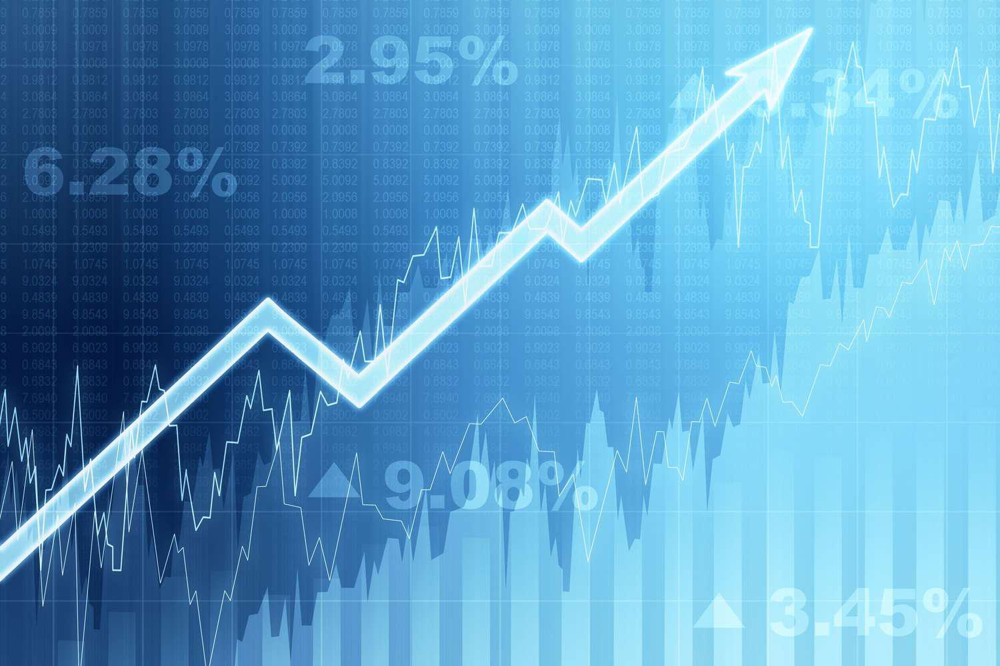

The world of finance is continuously evolving with new methods to trade and invest. Among these emerging strategies, narrow basis trading and algorithmic trading (algo trading) have proven to be particularly impactful. Narrow basis trading focuses on the small difference between the cash price and futures price of commodities, often indicating highly liquid and stable markets. This approach potentially offers traders opportunities for arbitrage, allowing them to benefit from price convergence.

Algorithmic trading, on the other hand, utilizes computer algorithms to execute trades with remarkable speed and frequency. These algorithms are designed to follow specific trading strategies based on variables like price, timing, and volume. By automating trades, algo trading aims to reduce human error, minimize biases, and increase the efficiency and precision of trading activities.



Understanding these strategies and their functionalities, benefits, and challenges is essential for traders and investors seeking to make informed decisions. As financial markets continue to rapidly change and advance, those who are adept at leveraging narrow basis and algorithmic trading can gain a competitive edge, ultimately leading to more strategic and profitable investment decisions.

## Table of Contents

## Understanding Narrow Basis Trading

Narrow basis trading involves analyzing the minimal difference between the cash price and the futures price of a commodity. This close alignment signifies a highly liquid and stable market where supply and demand dynamics are in equilibrium. The basis is calculated as:

$$
\text{Basis} = \text{Cash Price} - \text{Futures Price}
$$

In a narrow basis scenario, the small spread between these prices allows traders to leverage arbitrage opportunities. Arbitrage in this context involves exploiting the price convergence between the cash market and the futures market. Traders may, for instance, buy the commodity in the cash market while simultaneously selling a futures contract if the futures price is anticipated to rise towards the cash price, thereby profiting from the price alignment.

Contrarily, a wide basis, characterized by a substantial difference between the cash and futures prices, often signals market inefficiencies. These inefficiencies might arise from factors such as transportation costs, seasonal variations, or unexpected changes in supply and demand. Despite the inefficiencies, a wide basis also offers potential [arbitrage](/wiki/arbitrage) opportunities, particularly as traders anticipate a reduction in the disparity over time, leading to profit upon convergence.

Understanding the dynamics of narrow and wide basis trading is critical for market participants aiming to optimize trading strategies and capital allocation decisions, especially in commodity markets where these strategies are frequently applied. The ability to identify and capitalize on narrow basis conditions can confer a competitive advantage, facilitating more informed and potentially profitable trading decisions.

## Mechanics of Algo Trading

Algorithmic trading, commonly known as algo trading, employs computer algorithms to execute trades in financial markets with exceptional speed and frequency. These algorithms are sophisticated mathematical models programmed to make buy or sell decisions based on a set of predetermined criteria that may include factors such as price levels, timing, and trading volumes. 

The fundamental objective of these algorithms is to minimize human intervention, thereby reducing the likelihood of errors induced by emotional biases or cognitive limitations. This systematic approach ensures that trading decisions are consistent and adhere to the predefined strategy, regardless of the market conditions. 

Algo trading strategies are numerous, but three common categories include trend-following, arbitrage, and market-making. 

- **Trend-following strategies** are designed to capitalize on market momentum. These algorithms identify trends in price movements and attempt to exploit the continuation of these trends. The strategy typically involves buying securities that have shown an upward trend and selling those that are trending downward. This method relies heavily on technical analysis and can be implemented using simple moving averages or more complex models.

- **Arbitrage strategies** aim at identifying price disparities between related financial instruments on different markets or exchanges. By capitalizing on these inefficiencies, arbitrage algorithms can unearth risk-free or low-risk profit opportunities. A simple form can be expressed as $P_1 - P_2$, where $P_1$ and $P_2$ are the prices of the same asset on two different markets. The algorithm will execute trades to profit from the convergence of these prices.

- **Market-making strategies** involve providing liquidity to financial markets by simultaneously quoting buy and sell prices for a security, thereby capturing the bid-ask spread as profit. These strategies require real-time data feeds and ultra-fast execution capabilities to be effective, necessitating minimal latency and high-frequency trading infrastructure.

Algo trading utilizes complex data processing capabilities and advanced statistical and computational techniques. With the aid of high-performance computing and [machine learning](/wiki/machine-learning) methodologies, traders can analyze large volumes of data swiftly, enabling real-time responsiveness to market conditions. Python, for example, is widely used due to its extensive libraries and frameworks that facilitate algorithm development and [backtesting](/wiki/backtesting). A simple trend-following strategy might be coded as follows:

```python
import pandas as pd

# Assume 'data' is a pandas DataFrame with 'Close' price data
data['SMA1'] = data['Close'].rolling(window=20).mean()
data['SMA2'] = data['Close'].rolling(window=50).mean()

# Generate signals
data['Signal'] = 0
data.loc[data['SMA1'] > data['SMA2'], 'Signal'] = 1
data.loc[data['SMA1'] < data['SMA2'], 'Signal'] = -1

# Positions
data['Position'] = data['Signal'].diff()
```

The use of such automated strategies has revolutionized trading, enabling precision, speed, and efficiency that manual trading processes cannot match. However, the challenge lies in ensuring robustness and adaptability to varying market conditions, which are crucial for sustained [algorithmic trading](/wiki/algorithmic-trading) success.

## Benefits of Algo Trading

Algorithmic trading, or algo trading, offers a multitude of benefits that significantly enhance the trading process. One of the primary advantages is the improved execution speed, allowing trades to be conducted in fractions of a second. This speed is crucial in markets where price movements occur rapidly and timing can impact profitability. For example, algorithms can execute high-frequency trades that take advantage of short-lived opportunities that human traders might miss.

The precision provided by algorithmic systems cuts down on emotional decision-making and human error. Emotionally-driven decisions can lead to impulsive buys or sells, which algorithms circumvent by adhering strictly to pre-set parameters and logic. This adherence to a systematic approach ensures consistency in trade execution, minimizing the potential for costly mistakes.

Efficiency is another key benefit of algo trading. Algorithms are capable of scanning vast amounts of data across numerous markets in real-time, identifying trading opportunities that align with predefined criteria. This rapid data processing allows traders to capitalize on movements and trends that would be difficult to analyze manually.

Moreover, algo trading facilitates backtesting, which is the process of testing trading strategies on historical data before executing them in live markets. Backtesting helps determine the potential effectiveness of a strategy by simulating how it would have performed in the past. Traders can refine their strategies to improve future performance based on this analysis. Here's a simple example using Python to backtest a moving average crossover strategy:

```python
import pandas as pd

# Assume df is a DataFrame with historical data, containing columns 'Date' and 'Price'

# Calculate moving averages
df['SMA_50'] = df['Price'].rolling(window=50).mean()
df['SMA_200'] = df['Price'].rolling(window=200).mean()

# Identify signals
df['Signal'] = 0  # Hold
df.loc[df['SMA_50'] > df['SMA_200'], 'Signal'] = 1  # Buy
df.loc[df['SMA_50'] < df['SMA_200'], 'Signal'] = -1 # Sell

# Backtest strategy
df['Position'] = df['Signal'].shift()  # Avoiding lookahead bias by shifting signals
df['Strategy_Returns'] = df['Position'] * df['Price'].pct_change()

# Calculate cumulative returns
df['Cumulative_Strategy_Returns'] = (1 + df['Strategy_Returns']).cumprod()

print(df[['Date', 'Price', 'Cumulative_Strategy_Returns']].tail())
```

This backtesting capability not only aids in optimizing strategies but also instills confidence in traders that their methods are based on robust analysis rather than intuition. Such optimization also extends to risk management, as algorithms can be designed to adhere strictly to risk parameters, safeguarding assets and ensuring stable returns.

## Challenges and Considerations

Algorithmic trading, while offering numerous benefits, also encounters challenges that traders and firms must carefully navigate to ensure successful implementation. One of the primary concerns is the potential for technical failures. Algorithms rely heavily on complex software systems and real-time data feeds, any failure in these components can lead to significant trading losses or missed opportunities. The task of developing and maintaining robust algorithms necessitates a strong technological infrastructure and a team adept in both financial markets and information technology.

Another critical challenge is the risk of overfitting trading strategies. Overfitting refers to when a model learns the noise of historical data rather than the actual market patterns, resulting in strategies that perform well on past data but poorly on new, unseen data. To combat this, traders must implement rigorous backtesting and validation techniques, ensuring that algorithms perform consistently across various market conditions.

Market impact is a further consideration in algorithmic trading. When multiple strategies begin executing similar trades simultaneously, it can result in substantial price swings due to the sudden shifts in supply and demand. This is particularly evident in high-frequency trading environments where speed and [volume](/wiki/volume-trading-strategy) are integral components.

Compliance with regulatory requirements is also a pertinent consideration. Financial markets are subject to strict regulations that vary by jurisdiction. Traders must ensure that their algorithms comply with these regulations to avoid legal repercussions. Additionally, regulatory changes can affect algorithmic strategies, requiring constant updates and adjustments to trading models.

Finally, the costs associated with implementing advanced trading systems cannot be overlooked. High-performance computing infrastructure, real-time data acquisition, and continuous development efforts represent significant investments, often accessible only to larger financial institutions. Smaller firms or individual traders may face hurdles in competing at the same technological level without substantial financial resources.

Addressing these challenges requires a balanced approach, combining technological advancement with strategic risk management and adherence to regulatory standards. By doing so, algorithmic traders can mitigate potential downsides while capitalizing on the efficiencies that these systems provide.

## Integrating Narrow Basis Trading with Algo Trading

Narrow basis trading strategies can be effectively integrated into algorithmic trading systems to increase market efficiency and profitability. This integration is largely based on the ability of algorithms to rapidly identify and exploit arbitrage opportunities presented by narrow basis conditions, characterized by the small difference between the cash price and the futures price of a commodity.

By utilizing algorithmic systems, traders can automate the detection of narrow basis conditions and execute trades with high precision and speed. Algorithms can be designed to continuously monitor market data and signal when a trading opportunity arises due to a narrow basis, thereby maximizing potential returns. For instance, if the basis $B$ is defined as:

$$
B = P_{\text{cash}} - P_{\text{futures}}
$$

where $P_{\text{cash}}$ is the cash price and $P_{\text{futures}}$ is the futures price, an algorithm can be programmed to trigger trades whenever $B$ falls within a specified narrow range.

The swift reaction provided by algorithms not only capitalizes on minor price differences but also reduces the impact of human error and emotional decision-making, which can be prevalent in manual trading. Moreover, algorithms can be optimized for parameter adjustments, allowing the integration of sophisticated strategies that account for variable market conditions.

The use of high-frequency trading algorithms offers an additional advantage, as they can execute trades in milliseconds, which is critical when exploiting narrow basis opportunities that may dissipate quickly. By doing so, traders are better equipped to respond to volatile market conditions, ensuring they are positioned to profit from even the smallest arbitrage margin.

Furthermore, incorporating backtesting capabilities within these algorithmic systems allows traders to refine their narrow basis trading strategies by evaluating historical data. This process ensures that the strategies are robust and effective, minimizing the risk of overfitting and improving the reliability of the trading system.

In conclusion, the integration of narrow basis trading strategies into algorithmic systems provides traders with a powerful toolset for enhancing profitability and market efficiency. By leveraging the precision and speed of algorithmic trading, traders can effectively engage with narrow basis opportunities and maintain a competitive edge in the financial markets.

## Conclusion

Finance professionals who leverage narrow basis and algorithmic trading can gain a competitive edge in the market. These strategies facilitate enhanced decision-making by exploiting nuances in pricing and market behavior. The integration of narrow basis trading, which focuses on the minimal difference between cash and futures prices, with algorithmic trading techniques, offers an opportunity to capitalize on market efficiencies. 

Understanding the mechanics, benefits, and challenges of these strategies is crucial for effective implementation. Narrow basis trading can reveal arbitrage opportunities, while algorithmic trading provides the speed and efficiency necessary to execute these opportunities swiftly and accurately. Mastery of these strategies requires a deep comprehension of market dynamics, as well as a solid foundation in technological tools that underpin algorithmic trading systems.

As financial technology continues to advance, these trading strategies will likely evolve, offering new opportunities for traders and investors. The future may see more sophisticated algorithms that can process even larger datasets, identify patterns with greater precision, and adapt to market changes in real-time. This progression underscores the necessity for ongoing learning and adaptation by finance professionals, ensuring they remain at the forefront of trading innovation. As technology pushes the boundaries of traditional trading, those equipped with these advanced strategies will be better positioned to maximize their market prospects.

## FAQs

What is narrow basis trading? It's a condition where the cash and futures price of a commodity are closely aligned, suggesting market stability and [liquidity](/wiki/liquidity-risk-premium). This typically indicates that the cash market closely reflects the information and sentiment present in the futures market, reducing the opportunities for arbitrage.

What are the types of algo trading? Various types of algorithmic trading strategies are employed by traders, including trend-following strategies that capitalize on the [momentum](/wiki/momentum) of price movements, arbitrage strategies that exploit price discrepancies across different markets or instruments, and market-making strategies that provide liquidity by continuously quoting buy and sell prices. These strategies leverage complex algorithms to execute trades rapidly and efficiently.

What challenges exist in algo trading? While algo trading offers numerous benefits, it also poses several challenges. Technical faults, such as software bugs or network failures, can lead to significant trading errors. Overfitting strategies to historical data can result in poor performance in live markets if the models do not generalize well. Additionally, the necessity of high-tech infrastructure, including powerful computing resources and fast data connections, presents logistical and financial challenges. Ensuring regulatory compliance is another essential consideration that requires ongoing attention.

Can algo trading and narrow basis trading be used together? Yes, these strategies can be effectively integrated. By programming algorithms to detect and capitalize on the minimal pricing differences characteristic of narrow basis conditions, traders can enhance market efficiency and profitability. This integration allows for rapid response to market changes, enabling traders to exploit subtle pricing dynamics that may be imperceptible to manual trading methods.

## References & Further Reading

[1]: Bergstra, J., Bardenet, R., Bengio, Y., & Kégl, B. (2011). ["Algorithms for Hyper-Parameter Optimization."](https://dl.acm.org/doi/10.5555/2986459.2986743) Advances in Neural Information Processing Systems 24.

[2]: ["Advances in Financial Machine Learning"](https://www.amazon.com/Advances-Financial-Machine-Learning-Marcos/dp/1119482089) by Marcos Lopez de Prado

[3]: ["Evidence-Based Technical Analysis: Applying the Scientific Method and Statistical Inference to Trading Signals"](https://www.amazon.com/Evidence-Based-Technical-Analysis-Scientific-Statistical/dp/0470008741) by David Aronson

[4]: ["Machine Learning for Algorithmic Trading"](https://github.com/stefan-jansen/machine-learning-for-trading) by Stefan Jansen

[5]: ["Quantitative Trading: How to Build Your Own Algorithmic Trading Business"](https://www.amazon.com/Quantitative-Trading-Build-Algorithmic-Business/dp/1119800064) by Ernest P. Chan