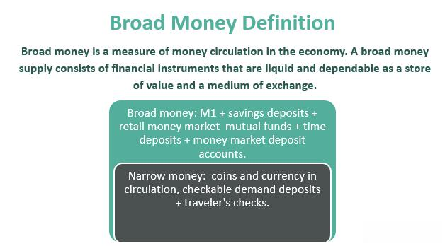

In today's financial landscape, understanding the distinctions between broad money, narrow money, and the role of algorithmic trading is vital for investors and policymakers alike. Money supply classifications are fundamental in determining the amount of liquidity and cash flow available within an economy. Narrow money, typically referred to as M1, consists of physical currency and demand deposits, providing a snapshot of the most liquid forms of money. In contrast, broad money includes various forms of deposits and financial instruments beyond M1, such as savings and time deposits, expanding the view to encompass the total money supply within an economy. This broader view integrates classifications like M2, M3, and potentially up to M4, each encompassing progressively less liquid components of the money supply.

Qualifying accounts are those that fall under these classifications and are essential in economic analysis and policy formulation. Savings and checking accounts, for example, play different roles in liquidity and, therefore, contribute differently to these money metrics. Understanding which accounts qualify under these metrics helps in assessing the economic environment, monetary policy decisions, and their implications for economic growth and stability.



Algorithmic trading represents a transformative force in modern financial markets, intricately linked with money supply metrics. By leveraging mathematical models and computational algorithms, this type of trading can enhance market efficiencies and capitalize on trends informed by fluctuations in the money supply. Algorithmic trading systems are designed to respond swiftly to market changes and exploit opportunities presented by liquidity variations, which are often indicated by changes in narrow and broad money supplies. 

Ultimately, a thorough comprehension of these factors—narrow and broad money definitions and algorithmic trading practices—not only informs investment strategies but also aids in the evaluation of economic policies. By exploring these interconnected aspects, investors and policymakers can optimize strategies favoring liquidity, stability, and growth within the financial system.

## Table of Contents

## Understanding Narrow Money

Narrow money, also known as M1, is a fundamental concept in economics representing the most liquid assets within an economy. It includes physical currency such as coins and notes, as well as demand deposits held at commercial banks. These components of M1 are readily accessible for immediate use, making them integral to daily economic transactions.

The significance of M1 as a measure of liquidity lies in its ability to serve as an indicator of the cash available for everyday economic activities. In this role, M1 provides a clear snapshot of the money actively circulating within the economy. This measurement of liquid cash is crucial because it directly correlates with the capacity of individuals and businesses to engage in transactions without needing to convert other forms of assets into cash.

Narrow money's function as the primary medium of exchange underlines its importance in facilitating commercial interactions. It enables the smooth flow of goods and services by allowing economic [agents](/wiki/agents) to execute transactions effortlessly. For example, the ease of using cash or demand deposits for purchases reduces transaction costs and enhances economic efficiency.

Moreover, understanding M1 helps in grasping how monetary policy can impact real-world economic activities. Central banks, by influencing the supply of narrow money, can enact policies that either encourage or restrain spending and investment. For instance, increasing the availability of M1 through monetary policy tools can stimulate economic activity by increasing the [liquidity](/wiki/liquidity-risk-premium) available to consumers and businesses.

In summary, narrow money (M1) plays a crucial role in an economy by providing the liquidity necessary for day-to-day transactions and serving as a gauge for economic activities. Its components, such as physical currency and demand deposits, enable seamless commercial exchanges and are a key focus for policymakers aiming to influence economic conditions.

## The Concept of Broad Money

Broad money is a comprehensive measure of a country's total money supply, inclusive of various forms of bank deposits and long-term securities, beyond what narrow money accounts for. Narrow money, or M1, primarily comprises physical currency and demand deposits, which are immediately accessible for transactions. Broad money, typically categorized as M2, M3, and up to M4, extends this concept to capture a more inclusive picture of financial liquidity within an economy.

**Expansion Beyond Narrow Money**

Broad money includes not only the components of M1, such as coins, currency, and demand deposits, but also savings deposits and time deposits, which are captured in M2. This extends the liquid assets to include those that are not immediately available for transaction but can be converted into cash relatively quickly. As the classification progresses to M3 and M4, the measure encompasses larger time deposits, institutional money market funds, and other larger liquid assets.

### Composition of Broad Money Classifications

1. **M2**: This includes all of M1 plus savings deposits, small-denomination time deposits (below a specific threshold), and retail money market mutual fund balances. M2 is an important indicator as it tends to have a correlation with economic indicators such as inflation and consumption.

2. **M3**: This builds upon M2 by adding larger time deposits, institutional money market funds, and other larger liquid assets. M3 provides an even more comprehensive view of the money supply, though some economies, including the United States, have ceased the regular publication of M3 statistics.

3. **M4**: In some economic analyses, M4 is used to include additional liquidity measures beyond M3, primarily to capture all deposits at the banking system. This includes both private sector non-bank deposits and public sector deposits.

### Economic Influence

Broad money plays a critical role in the economic landscape as it provides a comprehensive overview of the money supply that influences both consumption and investment. A broad view of money supply can reflect consumer confidence and willingness to spend, as well as signal the potential for investment by indicating the availability of funds. An increase in broad money typically suggests higher availability of capital for borrowing, potentially leading to lower interest rates which can fuel both consumer spending and business investment.

Broad money metrics are essential for central banks to set interest rates and influence inflation. An increased money supply can lead to inflationary pressures if not matched by economic growth, as more money chases the same amount of goods and services. Conversely, a contraction in the money supply can result in deflationary pressures, impacting economic growth negatively.

Overall, broad money is pivotal in understanding the economic dynamics and potential policy interventions required to maintain economic stability. Its comprehensive coverage from narrow to expansive liquid assets allows policymakers and economists to gauge the monetary backdrop against which economic activity occurs.

## Qualifying Accounts in Money Supply

In the categorization of money supply, qualifying accounts are pivotal in defining and differentiating narrow and broad money. Narrow money, often denoted as M1, consists primarily of the most liquid forms of money: physical currency and demand deposits accessible for immediate transactions. These demand deposits are typically housed in checking accounts, where funds can be withdrawn at a moment's notice, allowing these accounts to fit neatly within the narrow money classification.

Broad money, on the other hand, extends beyond the liquidity of narrow money to include various deposit accounts that provide higher levels of stability and return. These may include savings accounts, time deposits, and other long-term securities, defined under broader measures such as M2, M3, and potentially up to M4. Savings accounts, a common feature of M2 and beyond, contribute to broader money primarily due to their less liquid nature compared to checking accounts. While savings accounts offer the opportunity to earn interest, they often come with restrictions on how frequently funds can be accessed without penalty, reflecting their role as a less immediate, but stable form of money.

The liquidity requirements that differentiate these qualifying accounts are crucial for understanding their classification under narrow or broad money metrics. Checking accounts, with their high liquidity and transactional ease, emphasize immediate accessibility, making them quintessential components of M1. Meanwhile, savings accounts, while still accessible, require a trade-off between liquidity and financial yield, positioning them within broader categories of money supply.

In summary, the distinguishing [factor](/wiki/factor-investing) between these accounts lies in their liquidity: while both contribute to the overall money supply, the immediacy with which funds can be accessed and utilized defines their classification within either narrow or broad money metrics. These liquidity characteristics not only govern the financial behaviors associated with each account type but also influence economic policy considerations surrounding money supply management.

## Algorithmic Trading and Its Impact

Algorithmic trading involves using computer algorithms to automate trading decisions, thereby enhancing the efficiency and speed of trade execution. Its significance in modern financial markets is underscored by its ability to process vast amounts of data at extraordinary speeds, allowing for informed decision-making that can outpace human traders. Algorithmic trading ensures that trades are executed at the best possible prices, minimizes transaction costs, and reduces the risk of significant price changes due to large trade volumes.

The relationship between [algorithmic trading](/wiki/algorithmic-trading) and money supply metrics, such as narrow money (M1) and broad money (M2, M3, M4), is complex but critical. These metrics, which reflect the liquidity and overall money supply within an economy, can influence market conditions that algorithms utilize to execute trades. For instance, during periods of abundant liquidity, as indicated by high levels of broad money, algorithms might predict increased market activity and adjust trading strategies accordingly.

Algorithms are designed to identify and exploit market inefficiencies, such as price discrepancies, which are often influenced by changes in money supply. For example, when central banks alter interest rates, it affects broad money supply and can lead to rapid market responses. Algorithms can capitalize on these changes by quickly adjusting positions in response to anticipated market movements—increasing buying or selling activities based on predicted price shifts.

A simple Python example illustrating an algorithmic trading strategy that considers money supply metrics could involve tracking an economic indicator, such as a change in the M2 supply, and using it to trigger buy or sell orders:

```python
import pandas as pd

def trading_strategy(money_supply_change, price_data):
    signals = []

    for i in range(1, len(price_data)):
        if money_supply_change[i] > 0:
            signals.append('Buy')
        elif money_supply_change[i] < 0:
            signals.append('Sell')
        else:
            signals.append('Hold')

    return signals

# Example data
money_supply_change = pd.Series([0.01, -0.02, 0.03, 0.00, -0.01])
price_data = pd.Series([100, 102, 105, 104, 106])

signals = trading_strategy(money_supply_change, price_data)
print(signals)
```

This basic strategy exemplifies how algorithms might incorporate money supply data (e.g., increasing or decreasing M2) to inform their market actions (buy, sell, hold). Such strategies, though simplistic, are foundational to more complex algorithmic solutions that continue to evolve with advancements in technology and data analytics.

Overall, algorithmic trading plays a pivotal role in efficiently interacting with financial markets by leveraging money supply trends and market efficiencies, enhancing overall market liquidity, and reducing costs compared to traditional trading methods.

## Interconnection Between Money Supply and Algorithmic Trading

Understanding the interplay between money supply and algorithmic trading is crucial for grasping the complexities of modern financial markets. Narrow money (M1) and broad money (M2, M3, etc.) are fundamental metrics reflecting an economy's liquidity and total money supply, respectively. These measures can significantly influence algorithmic trading strategies.

**Influence of Money Supply on Algorithmic Trading Strategies**

Changes in narrow and broad money supply metrics can affect interest rates, liquidity, and ultimately financial market conditions. Algorithmic trading systems, designed to leverage market inefficiencies, use these changes to optimize trading strategies. For instance, an increase in broad money supply might signal lower interest rates and increased economic activity, encouraging algorithms to adopt bullish trading strategies. Conversely, restricted money supply growth might prompt a more conservative algorithmic approach due to anticipated liquidity constraints.

Algorithmic trading relies on precise data analysis. Algorithms may utilize [machine learning](/wiki/machine-learning) models to predict market movements based on historical money supply data. The correlation between money supply changes and market variables, such as asset prices, can inform algorithmic decision-making. For instance, if historical data show a strong positive correlation between increases in broad money and stock market performance, algorithms can be programmed to increase equity exposure following similar trends.

**Analyzing Historical Data**

Historical analysis of money supply changes illustrates how these metrics influence algorithmic trading. For example, during periods of quantitative easing, central banks inject liquidity into the economy, typically expanding broad money supply. This can lead to increased market liquidity and rising asset prices, prompting algorithms to adopt aggressive trading positions to capitalize on upward trends. By analyzing past instances, such as the post-2008 financial crisis period, traders can refine algorithms to adjust strategies based on expected monetary policy actions.

To quantitatively assess this impact, consider a simple linear regression model that predicts asset price changes based on shifts in broad money supply:

```python
import numpy as np
import pandas as pd
from sklearn.linear_model import LinearRegression

# Sample dataset of historical broad money growth and asset price changes
data = pd.DataFrame({
    'broad_money_growth': [2.3, 1.8, 3.1, 1.2, 2.7],
    'asset_price_change': [4.5, 3.9, 5.2, 2.8, 4.0]
})

# Reshaping data for linear regression
X = np.array(data['broad_money_growth']).reshape(-1, 1)
y = np.array(data['asset_price_change'])

# Fitting linear regression model
model = LinearRegression()
model.fit(X, y)

# Coefficient indicating the influence of broad money on asset prices
print(f"Coefficient: {model.coef_[0]:.2f}")
```

This example highlights the predictive power of broad money metrics on market movements, aiding algorithmic trading systems in strategy formulation.

**Future Implications**

As financial markets become increasingly automated, the interconnection between money supply and algorithmic trading is likely to grow stronger. Central banks' monetary policies will continuously impact trading algorithms. Future trends in digital currencies and changes in regulatory landscapes may also redefine these interconnections, necessitating adaptable and resilient algorithmic trading systems.

Understanding these dynamics enables traders and policymakers to better anticipate market reactions to monetary changes, optimizing strategies in a data-driven market environment. This interconnectedness continues to shape financial landscapes, pushing the boundaries of how algorithmic trading capitalizes on economic indicators.

## Conclusion

The distinction between narrow and broad money is pivotal in comprehending the economic mechanics underpinning money supply and liquidity. Narrow money (M1) includes the most liquid forms of money, such as cash and demand deposits, facilitating immediate transactions and serving as the principal medium of exchange. This liquidity is crucial for everyday economic activities, ensuring smooth commercial operations. In contrast, broad money (M2, M3, M4) encompasses not only narrow money but also savings deposits and long-term securities. This wider classification captures a more extensive view of an economy's total money supply, pivotal for understanding consumption, investment, and inflation trends.

Algorithmic trading harnesses these money supply metrics to optimize trading strategies. By analyzing fluctuations in M1 and broader monetary aggregates, algorithms ascertain market conditions, leveraging data to execute trades that capitalize on liquidity and supply trends. This enhances market efficiency by ensuring liquidity is adequately reflected in asset pricing and availability.

In crafting investment strategies or shaping economic policies, recognizing the interplay between narrow and broad money is invaluable. Algorithmic trading exemplifies the practical applications of these monetary concepts, highlighting the necessity for investors and policymakers to integrate such insights into financial decision-making processes. Understanding these interconnections facilitates strategic foresight, potentially leading to more informed and effective economic strategies and investment outcomes.

## References & Further Reading

[1]: Bagehot, W. (1873). ["Lombard Street: A Description of the Money Market."](https://www.econlib.org/library/Bagehot/bagLom.html) Henry S. King.

[2]: Mishkin, F. S. (2012). ["The Economics of Money, Banking, and Financial Markets."](https://www.pearsonhighered.com/assets/preface/0/1/3/4/0134855388.pdf) Pearson Education.

[3]: ["Advances in Financial Machine Learning"](https://www.amazon.com/Advances-Financial-Machine-Learning-Marcos/dp/1119482089) by Marcos Lopez de Prado.

[4]: Friedman, B. M., & Kuttner, K. N. (1992). ["Money, Income, Prices, and Interest Rates."](https://www.jstor.org/stable/2117316) The American Economic Review, 82(3), 472-492.

[5]: Litterman, R. B., Scheinkman, J., & Weiss, L. (1991). ["Volatility and the Yield Curve."](https://www.semanticscholar.org/paper/Volatility-and-the-Yield-Curve-Litterman-Scheinkman/5f9c5f23a5d01b47e26a06ec08d4fac740910474) The Journal of Fixed Income, 1(1), 49-53.

[6]: ["Quantitative Trading: How to Build Your Own Algorithmic Trading Business"](https://books.google.com/books/about/Quantitative_Trading.html?id=j70yEAAAQBAJ) by Ernest P. Chan.

[7]: King, M. A. (2002). ["No Money, No Inflation - The Role of Money in the Economy."](https://www.bankofengland.co.uk/quarterly-bulletin/2002/q2/no-money-no-inflation-the-role-of-money-in-the-economy) Quarterly Bulletin, Bank of England.