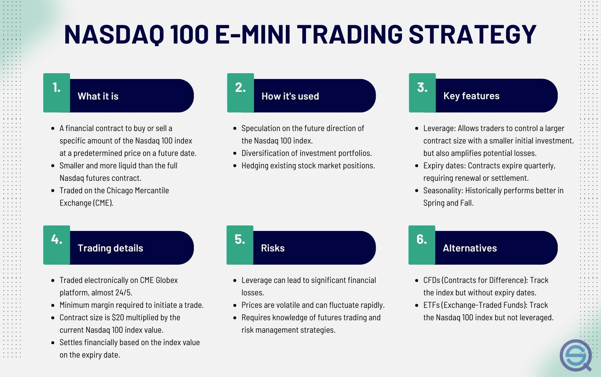

## Table of Contents

## What is the NASDAQ-100 and how does it differ from the NASDAQ Composite?

The NASDAQ-100 is an index made up of the 100 largest non-financial companies listed on the NASDAQ stock exchange. These companies come from various industries like technology, healthcare, and consumer goods. The index is used to show how these big companies are doing in the market. It's a popular way for investors to see how the tech sector and other major industries are performing because many of the companies in the NASDAQ-100 are leaders in their fields.

The NASDAQ Composite, on the other hand, is a much broader index that includes almost all the stocks listed on the NASDAQ exchange. This means it covers more than just the 100 biggest non-financial companies; it includes thousands of stocks from different sizes and sectors, including financial companies. The main difference is that the NASDAQ Composite gives a more complete picture of the entire NASDAQ market, while the NASDAQ-100 focuses on the performance of the largest and most influential companies outside of the financial sector.

## What are E-mini futures and why might they be used for trading the NASDAQ-100?

E-mini futures are smaller-sized futures contracts that let traders buy or sell an asset at a set price in the future. They are called "E-mini" because they are smaller than the standard futures contracts, making them easier for individual traders to handle. The E-mini NASDAQ-100 futures, for example, are based on the NASDAQ-100 index and allow traders to bet on the future performance of the companies in that index.

Traders might use E-mini NASDAQ-100 futures because they offer a way to trade the overall market without having to buy individual stocks. This can be useful for hedging against market risks or for speculating on where they think the market is headed. Since these futures are smaller, they require less money to trade, which means more people can participate. Plus, they are very liquid, meaning they can be bought and sold easily, which is important for traders who want to get in and out of positions quickly.

## How can a beginner start trading NASDAQ-100 E-mini futures?

To start trading NASDAQ-100 E-mini futures, a beginner first needs to open a futures trading account with a brokerage firm that offers futures trading. This type of account is different from a regular stock trading account, so make sure to choose a broker that supports futures trading. Once the account is set up, the beginner will need to deposit money into it as a margin, which is a smaller amount of money that acts as a good faith deposit to cover potential losses. The margin for E-mini futures is usually lower than for regular futures, making it more accessible for new traders.

After setting up the account and depositing the margin, the beginner can start trading by using a trading platform provided by the broker. It's important to learn how to use the platform and understand the basics of futures trading, like how to place orders and manage risk. Many brokers offer educational resources and demo accounts where beginners can practice trading without risking real money. As the beginner gains more confidence and knowledge, they can start placing real trades on the NASDAQ-100 E-mini futures, always keeping in mind the importance of risk management to protect their investment.

## What are the basic principles of a trading strategy for NASDAQ-100 E-mini futures?

A good trading strategy for NASDAQ-100 E-mini futures starts with understanding the market and setting clear goals. You need to know why you're trading - whether it's to make money, to hedge against other investments, or just to learn. Once you have your goals, you can set up a plan that includes when to buy and sell. Many traders use technical analysis, which means looking at charts and patterns to guess where the market might go next. Others use [fundamental analysis](/wiki/fundamental-analysis), which involves studying news and economic reports to understand what might affect the NASDAQ-100 companies. Your strategy should also include rules for how much money you're willing to risk on each trade, known as risk management.

Another key part of a trading strategy is deciding how long you'll hold your trades. Some traders like to buy and sell quickly, maybe even within the same day. This is called [day trading](/wiki/day-trading-spy). Others might hold their trades for weeks or months, which is known as swing trading. Your choice will depend on your goals and how much time you can spend watching the market. No matter what, always make sure you have a plan for when things go wrong. This could mean setting stop-loss orders, which automatically sell your futures if they drop to a certain price, to limit your losses. A solid trading strategy for NASDAQ-100 E-mini futures combines clear goals, careful analysis, and smart risk management to help you navigate the market successfully.

## What technical indicators are commonly used in NASDAQ-100 E-mini trading strategies?

Traders often use several technical indicators when trading NASDAQ-100 E-mini futures. One popular indicator is the Moving Average, which helps smooth out price data to show the overall direction of the market. There are different types of moving averages, like the Simple Moving Average (SMA) and the Exponential Moving Average (EMA). Traders might look at the crossover of a short-term moving average (like a 50-day EMA) and a long-term moving average (like a 200-day EMA) to decide when to buy or sell. Another commonly used indicator is the Relative Strength Index (RSI), which measures how fast prices are moving to see if a market is overbought or oversold. If the RSI is above 70, it might mean the market is overbought and could soon drop. If it's below 30, it might mean the market is oversold and could soon rise.

Another useful indicator is the MACD (Moving Average Convergence Divergence), which shows the relationship between two moving averages of a security's price. Traders use the MACD to spot trends and predict possible changes in the market's direction. The MACD line crossing above or below the signal line can be a sign to buy or sell. Bollinger Bands are also popular; they consist of a middle band (usually a moving average) and two outer bands that are standard deviations away from the middle band. When the price touches the upper band, it might be overbought, and when it touches the lower band, it might be oversold. By using these indicators together, traders can get a better picture of the market and make more informed decisions when trading NASDAQ-100 E-mini futures.

## How does market volatility affect NASDAQ-100 E-mini trading strategies?

Market [volatility](/wiki/volatility-trading-strategies) can really shake things up when you're trading NASDAQ-100 E-mini futures. When the market is swinging a lot, it means the prices can change quickly. This can be good if you're looking to make money fast, but it can also be risky. You might see big gains, but you could also lose money just as fast. Because of this, traders often need to change their strategies. They might use tighter stop-loss orders to limit their losses or trade smaller amounts to keep their risk low. They also pay more attention to technical indicators that help them spot when the market might be getting too wild.

Even though volatility can make trading trickier, some traders actually like it because it can create more chances to make money. They might look for times when the market is especially jumpy to trade more often, hoping to catch those big swings. But to do this well, they need to be really good at reading the market and managing their risks. Using tools like the VIX, which measures how much people expect the market to move, can help traders decide if the market is too risky or just right for their strategy. So, while volatility can make trading NASDAQ-100 E-mini futures more challenging, it also offers new ways to make profits if you're ready for it.

## What are some common entry and exit strategies for NASDAQ-100 E-mini trading?

When trading NASDAQ-100 E-mini futures, common entry strategies often involve using technical indicators to find the right time to buy or sell. Traders might use moving averages to spot trends. For example, if a short-term moving average crosses above a long-term one, it could be a signal to buy because it suggests the market might be starting to go up. Another popular entry strategy is to look at the RSI. If the RSI goes below 30, it might mean the market is oversold and could soon rise, so that could be a good time to buy. Traders also watch for patterns like support and resistance levels. If the price bounces off a support level, that might be a signal to enter a trade.

For exiting trades, traders use different strategies to lock in profits or limit losses. A common [exit](/wiki/exit-strategy) strategy is setting stop-loss orders. This means if the price drops to a certain level, the trade automatically closes to prevent bigger losses. Another way to exit is by setting a take-profit order, which sells the futures when they reach a target price to secure gains. Some traders also use trailing stops, which move up as the price goes up, helping to lock in profits while still giving the trade room to grow. The key is to have clear rules for when to get out of a trade, whether it's going well or not, so you can manage your risks and keep your trading plan on track.

## How can risk management be incorporated into a NASDAQ-100 E-mini trading strategy?

Risk management is super important when you're trading NASDAQ-100 E-mini futures. One way to manage risk is by setting stop-loss orders. This means you decide on a price level where, if the market goes against you, your trade will close automatically to stop you from losing too much money. Another way is to only trade with a small part of your money at a time, so if one trade goes wrong, you still have most of your cash safe. It's also smart to think about how much you're willing to lose on each trade before you even start trading. This helps you stay calm and stick to your plan, even when the market gets wild.

Another part of risk management is using position sizing. This means deciding how many contracts to trade based on how much money you have and how much risk you're okay with. If you're new to trading, you might want to start with just one contract to keep things simple and safe. Also, diversifying can help manage risk. Instead of putting all your money into E-mini futures, you could also trade other things or invest in different markets. This way, if something bad happens to the NASDAQ-100, you won't lose everything. By using these strategies, you can protect your money and trade more confidently.

## What are the differences between day trading and swing trading strategies for NASDAQ-100 E-mini futures?

Day trading and swing trading are two different ways to trade NASDAQ-100 E-mini futures. Day traders buy and sell their futures within the same day. They want to make quick profits from small price changes. Day traders need to watch the market closely all day because they're trying to catch those fast moves. They use charts and technical indicators to help them decide when to trade. Day trading can be exciting, but it's also risky because the market can change quickly.

Swing trading, on the other hand, is a bit slower. Swing traders hold their trades for a few days or even weeks. They're looking to make money from bigger price swings that happen over time. Swing traders don't need to watch the market all day like day traders do. They might use both technical and fundamental analysis to pick the right times to buy and sell. Swing trading can be less stressful than day trading, but it still needs careful planning and risk management to work well.

## How can algorithmic trading enhance a NASDAQ-100 E-mini trading strategy?

Algorithmic trading can really help make trading NASDAQ-100 E-mini futures better. It uses computer programs to buy and sell futures based on rules you set up. This means you don't have to watch the market all the time. The computer can do the trading for you, even when you're not around. It can also look at lots of data really fast, like price charts and news, to find the best times to trade. This can help you catch good chances to make money that you might miss if you were trading by yourself.

Another way [algorithmic trading](/wiki/algorithmic-trading) helps is by taking the feelings out of trading. Sometimes, people get scared or too excited and make bad choices. But a computer just follows the rules you give it, so it won't make mistakes because of feelings. It can also trade in a way that's more organized and consistent. This means it can stick to your plan better than a person might. By using algorithmic trading, you can make your NASDAQ-100 E-mini trading strategy work smoother and maybe make more money.

## What are advanced techniques for optimizing a NASDAQ-100 E-mini trading strategy?

To optimize a NASDAQ-100 E-mini trading strategy, you can use something called [backtesting](/wiki/backtesting). This means you take your trading rules and test them on old market data to see how they would have worked in the past. By doing this, you can find out what parts of your strategy work well and what parts need fixing. You might also want to try different settings for your technical indicators or change your rules for entering and exiting trades to see if that makes your strategy better. Another cool thing you can do is use [machine learning](/wiki/machine-learning). This is when you let a computer learn from the data and find new patterns that you might not see yourself. It can help make your trading strategy even smarter.

Another advanced technique is to use multiple timeframes when you're looking at the market. This means you can look at short-term charts, like hourly ones, and long-term charts, like daily ones, at the same time. This can help you see both the big picture and the small details, so you can make better choices about when to trade. Also, think about using different kinds of orders, like iceberg orders, which hide part of your trade size from other traders. This can help you trade without moving the market too much. By mixing these advanced techniques into your NASDAQ-100 E-mini trading strategy, you can make it work better and maybe make more money.

## How do macroeconomic factors influence NASDAQ-100 E-mini trading strategies?

Macroeconomic factors like interest rates, inflation, and employment rates can really change how the NASDAQ-100 E-mini futures move. When interest rates go up, borrowing money gets more expensive, and this can slow down the economy. Companies in the NASDAQ-100 might not do as well because people and businesses might spend less. On the other hand, if the economy is growing fast and inflation is low, that can be good for the market. Traders need to keep an eye on these big economic changes because they can affect which way the market goes and how much risk they should take.

News about the economy can also make the market move a lot. For example, if there's a big report saying that more people are out of work, the market might drop because people worry about the economy. Or if there's good news about new jobs and strong growth, the market might go up. Traders who watch these reports can use them to decide when to buy or sell their E-mini futures. By understanding how these big economic factors work, traders can change their strategies to make the most of what's happening in the economy.

## How is Deep Reinforcement Learning Implemented?

Deep Reinforcement Learning (DRL) has emerged as a powerful method to tackle high-dimensional data and complex decision-making processes, extending traditional Q-learning techniques. In financial trading contexts like NQ futures, the ability to autonomously adapt to market fluctuations offers a distinct advantage.

To implement DRL in NQ futures trading, the process begins by defining a robust trading environment. This environment simulates market conditions, integrating historical and real-time data streams. It includes components such as state representation, which captures elements like price levels, volumes, and technical indicators, and action space, detailing possible trading actions such as buy, sell, or hold. The reward function, a critical aspect, quantifies trading performance, incentivizing profitable trades while penalizing losses.

The next step involves building a Dueling DQN (Deep Q-Network) model. This architecture enhances traditional DQN by separating state-value and advantage functions, allowing more stable and precise value estimations. The dueling architecture is defined as follows:

$$
Q(s, a; \theta, \alpha, \beta) = V(s; \theta, \beta) + \left( A(s, a; \theta, \alpha) - \frac{1}{|\mathcal{A}|} \sum_{a'} A(s, a'; \theta, \alpha) \right)
$$

where $Q$ represents the action-value function, $V$ is the state-value function, and $A$ is the advantage function. Parameters $\theta, \alpha, \text{ and } \beta$ are derived during training.

Training the Dueling DQN involves iterations over episodes where the agent interacts with the trading environment. The main loop comprises:

1. **Experience Replay:** Collecting experiences of (state, action, reward, next state) tuples over multiple episodes and storing them in a replay buffer. This aids the network in relieving correlations in data which can destabilize the learning process.

2. **Batch Learning:** Sampling random mini-batches from the replay buffer to minimize the loss function, 
$$
   L(\theta) = \mathbb{E}_{(s,a,r,s') \sim U(\mathcal{D})}\left[(r + \gamma \max_{a'} Q(s', a'; \theta^{-}) - Q(s, a; \theta))^2\right]

$$
   where $\gamma$ is the discount factor and $\theta^{-}$ are the target network parameters, updated less frequently for stability.

3. **Policy Update:** Adjusting the policy network parameters $\theta$ to reduce the difference between predicted and actual returns.

DRL algorithms adapt to market conditions by continuously integrating new data, enabling traders to respond to dynamic environments effectively. The flexibility and precision offered by DRL models make them well-suited for the intricacies of trading NQ futures, providing an edge over traditional trading methods. With ongoing advancements in computational resources and algorithmic innovations, DRL remains a promising frontier in algorithmic trading.

## References & Further Reading

[1]: ["Advances in Financial Machine Learning"](https://www.amazon.com/Advances-Financial-Machine-Learning-Marcos/dp/1119482089) by Marcos Lopez de Prado

[2]: ["Evidence-Based Technical Analysis: Applying the Scientific Method and Statistical Inference to Trading Signals"](https://www.amazon.com/Evidence-Based-Technical-Analysis-Scientific-Statistical/dp/0470008741) by David Aronson

[3]: ["Machine Learning for Algorithmic Trading"](https://github.com/PacktPublishing/Machine-Learning-for-Algorithmic-Trading-Second-Edition) by Stefan Jansen

[4]: ["Quantitative Trading: How to Build Your Own Algorithmic Trading Business"](https://www.amazon.com/Quantitative-Trading-Build-Algorithmic-Business/dp/1119800064) by Ernest P. Chan

[5]: ["Algorithms for Hyper-Parameter Optimization"](https://papers.nips.cc/paper/4443-algorithms-for-hyper-parameter-optimization.pdf) by Bergstra, J., Bardenet, R., Bengio, Y., & Kégl, B. in Advances in Neural Information Processing Systems 24.