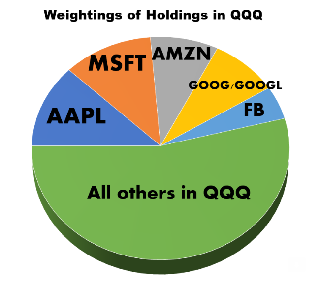

The world of stock market index trading offers numerous opportunities for investors looking to diversify their portfolios. Indices act as benchmarks for the performance of specific segments of the stock market, offering a means for traders to engage with a wide array of sectors through a single financial instrument. Among the various indices available, the Nasdaq-100 stands out due to its representation of the most significant non-financial companies in the Nasdaq stock exchange. This index encapsulates sectors such as technology, healthcare, and consumer discretionary, capturing a significant portion of the modern economic landscape. Companies such as Apple, Microsoft, and Amazon are among those represented, underscoring the Nasdaq-100's significance as a measure of broader market trends excluding financial institutions.

In recent years, algorithmic trading has revolutionized how traders interact with stock indices, providing faster and more efficient trading solutions. By leveraging complex algorithms and mathematical models, traders can automate decision-making processes, executing trades at high speed and with high precision. This technological advancement has democratized trading, enabling individual investors and institutional traders alike to harness sophisticated tools once reserved for only the most well-funded trading firms.



This article explores the concept of trading the Nasdaq-100 index through algorithmic trading strategies. By automating trades, algorithms reduce human error, offering the potential for both increased accuracy and efficiency. Our goal is to provide insights into the mechanisms, benefits, and strategies behind successful algo trading in the Nasdaq-100 market. Through a detailed examination, we aim to delineate the advantages of adopting such technologies in trading strategies, while also addressing the challenges and risks that come with this advanced trading methodology. This exploration encompasses both the potential benefits and inherent risks associated with incorporating algorithmic strategies into Nasdaq-100 trading practices, paving the way for informed decision-making and optimized trading outcomes.

## Table of Contents

## Understanding the Nasdaq-100 Index

The Nasdaq-100 is a prominent stock index that represents the 100 largest non-financial companies listed on the Nasdaq stock market. It serves as a barometer for the performance of key sectors such as technology, healthcare, consumer discretionary, and more, while deliberately excluding financial institutions. This exclusion allows the index to focus on industries that are largely seen as growth drivers in the modern economy.

Weighted by market capitalization, the Nasdaq-100 ensures that companies with larger market caps have a more significant influence on the index's price movements. This weighting method can be expressed as:

$$

\text{Index Weight}_i = \left( \frac{\text{Market Cap}_i}{\sum_{j=1}^{100} \text{Market Cap}_j} \right)
$$

where $\text{Market Cap}_i$ is the market capitalization of company $i$, and the sum is over all 100 companies in the index. Such a methodology aligns the index's movements closely with those of the largest publicly traded companies, magnifying the impact of major market players.

To maintain balance and reflect the evolving market landscape, the Nasdaq-100 undergoes periodic adjustments, such as rebalancing and reconstitution. These adjustments ensure that the index remains representative of the current market and industry dynamics.

Notable companies in the Nasdaq-100 include tech giants such as Apple, Microsoft, and Amazon, which are renowned for their market leadership and influence in their respective sectors. These firms drive substantial portions of the index's performance due to their vast market capitalizations, and they continue to play pivotal roles in shaping the trajectory of the global economy.

## What is Algorithmic Trading?

Algorithmic trading utilizes computer algorithms to automate the execution of trading orders, offering a systematic and efficient approach to trading in financial markets. This method relies on mathematical models and computational algorithms to make swift trading decisions, thereby optimizing the execution process. The automation inherent in [algorithmic trading](/wiki/algorithmic-trading) reduces the time lag between identifying a trading opportunity and executing the corresponding order, which is crucial in fast-paced markets.

The core of algorithmic trading lies in its use of quantitative analysis and pre-defined instructions, which guide the algorithms in executing trades based on various market indicators, such as price, [volume](/wiki/volume-trading-strategy), or timing. For example, an algorithm might be programmed to execute a buy order when a stock's simple moving average (SMA) over 10 days crosses above its SMA over 50 days, indicating a potential uptrend.

Another significant advantage of algorithmic trading is its precision and consistency. Unlike human traders, algorithms are not subject to emotional biases or fatigue, enabling them to process large volumes of transactions with greater accuracy. This precision is further enhanced by [backtesting](/wiki/backtesting), a process where algorithms are tested against historical market data to evaluate their potential performance and refine their parameters before implementation in live trading.

Algorithmic trading also substantially reduces transaction costs by optimizing the timing and size of trades. It enables traders to execute complex and high-frequency trading strategies that would be impractical manually. High-frequency trading ([HFT](/wiki/high-frequency-trading-strategies)), a subset of algorithmic trading, can involve executing thousands of trades per second, capitalizing on minute price discrepancies that exist only for fractions of a second.

In conclusion, the efficiency and computational power of algorithmic trading have made it a prevalent choice for investors and traders seeking to leverage market data in sophisticated ways. By automating trading processes, this method helps achieve strategic goals with precision and speed.

## Benefits of Algo Trading in the Nasdaq-100

Algorithmic trading in the Nasdaq-100 index offers several advantages, primarily through its ability to handle extensive data sets at incredible speeds. This rapid processing capability significantly improves the accuracy of trading decisions by enabling traders to analyze a multitude of variables almost instantaneously. As a result, traders can make more informed and timely decisions compared to manual trading.

One of the most critical advantages of algo trading is its ability to minimize human errors and emotional biases that often cloud judgment in manual trading scenarios. By deploying pre-defined algorithms, trading decisions are made based on computational logic rather than human intuition or emotion, reducing the risk of impulsive or irrational actions that might arise in volatile markets.

Traders also benefit from the ability to backtest algorithms on historical data from the Nasdaq-100, an essential step in refining and validating trading strategies before deploying them in live markets. Backtesting involves applying a trading strategy to historical data to assess its viability and potential profitability, effectively allowing traders to gauge the performance of their strategies under past market conditions.

Moreover, algo trading facilitates high-frequency trading (HFT), where large numbers of orders are executed at extremely high speeds. HFT algorithms can detect and exploit minute price inefficiencies or [arbitrage](/wiki/arbitrage) opportunities that are typically beyond the reach of human traders. These algorithms can operate on the order of milliseconds, enabling them to capitalize on fleeting market opportunities that arise from small price movements.

For instance, consider a simple Python code snippet for backtesting an algorithm on historical Nasdaq-100 data using a mean reversion strategy:

```python
import pandas as pd
import numpy as np

# Load historical data
data = pd.read_csv('nasdaq100_historical.csv', parse_dates=True, index_col='Date')

# Calculate moving averages
data['SMA_50'] = data['Close'].rolling(window=50).mean()
data['SMA_200'] = data['Close'].rolling(window=200).mean()

# Identify buy and sell signals
data['Signal'] = np.where(data['SMA_50'] > data['SMA_200'], 1, 0)

# Calculate returns
data['Returns'] = data['Close'].pct_change()
data['Strategy_Returns'] = data['Signal'].shift(1) * data['Returns']

# Calculate cumulative returns
data['Cumulative_Strategy_Returns'] = (1 + data['Strategy_Returns']).cumprod()

print(data['Cumulative_Strategy_Returns'].iloc[-1])
```

This example demonstrates how historical moving averages can be used to generate buy and sell signals and subsequently calculate the strategy's hypothetical performance over time. Such backtesting procedures allow traders to refine strategies and increase their probabilities of success in the live market environment.

In essence, algorithmic trading in the Nasdaq-100 offers traders a sophisticated toolset to optimize their strategies through speed, accuracy, and advanced data analysis techniques, ultimately leading to more efficient and lucrative trading outcomes.

## Popular Algo Trading Strategies for the Nasdaq-100

Mean Reversion Strategy: Mean reversion is predicated on the assumption that security prices and returns eventually move back towards their historical average or mean level. In the context of the Nasdaq-100, mean reversion algorithms identify stocks that have deviated significantly from their typical price range. Traders buy undervalued stocks--whose prices have fallen below their historical mean--in anticipation of a price increase, and sell overvalued stocks--those trading above their mean--expecting a price decline. This strategy often involves statistical analysis, employing z-scores or Bollinger Bands to determine the degree of overvaluation or undervaluation. 

Trend Following Strategy: Trend following algorithms are designed to capitalize on [momentum](/wiki/momentum) within the Nasdaq-100. These algorithms identify persistent upward or downward trends and execute trades following the trend's direction. Commonly used tools within these algorithms are moving averages (simple or exponential), moving average convergence divergence (MACD), and relative strength index (RSI). The goal is to participate in sustained price movements, entering trades near the start of a trend and exiting before or as it reverses.

Arbitrage Strategy: Arbitrage exploits the price inefficiencies among Nasdaq-100 stocks and correlated financial instruments, such as related derivatives or equivalent stocks in other indices. Algorithms rapidly detect discrepancies and execute simultaneous buy-sell orders across markets to lock in profit. Consider the price difference between an exchange-traded fund ([ETF](/wiki/etf-trading-strategies)) tracking the Nasdaq-100 and its underlying securities. When the ETF’s price diverges from the aggregated price of its components, arbitrage algorithms execute trades to capture the discrepancy.

Sentiment Analysis Strategy: Sentiment analysis utilizes natural language processing (NLP) and [machine learning](/wiki/machine-learning) models to gauge investor sentiment from various data sources including news articles, financial reports, and social media platforms. Algorithms analyze this sentiment data to predict future price movements of Nasdaq-100 stocks. For example, an algorithm might evaluate the frequency and nature of mentions of a particular stock on social media. A sudden spike in positive commentary might trigger a buy signal, whereas negative sentiment might prompt a sell decision.

These strategies, while distinct in their approaches, share a common reliance on historical data and sophisticated computational models, enabling traders to make informed decisions in the dynamic environment of Nasdaq-100 trading.

## Challenges and Risks of Algo Trading

Algorithmic trading, while advantageous in many respects, is not free from inherent risks and challenges that can affect its effectiveness in the Nasdaq-100 market. One of the foremost concerns is technical failures. These failures may arise from bugs in the algorithm's code, hardware malfunctions, or network outages. Such technical glitches can result in significant financial losses by either executing trades incorrectly or failing to execute them altogether.

Programming errors are another critical risk [factor](/wiki/factor-investing). An algorithm that has not been properly programmed or backtested can generate unintended trading outcomes. For instance, a trader might design an algorithm with the intention of capturing small market inefficiencies, but if incorrect assumptions or calculations underpin its logic, the algorithm could systematically accrue losses instead of profits. The programming of some strategies necessitates intricate logic and conditions, creating potential for human error. Using Python for backtesting, traders can employ libraries like `pandas` and `numpy` to simulate historical performance:

```python
import pandas as pd

# Example of loading historical data and calculating moving averages
data = pd.read_csv('nasdaq100_historical.csv')
data['Short_MA'] = data['Close'].rolling(window=50).mean()
data['Long_MA'] = data['Close'].rolling(window=200).mean()

# Sample trading logic to identify buy/sell signals
data['Signal'] = 0
data.loc[data['Short_MA'] > data['Long_MA'], 'Signal'] = 1  # Buy signal
data.loc[data['Short_MA'] < data['Long_MA'], 'Signal'] = -1  # Sell signal

# Backtesting and evaluating the strategy could identify potential errors or points of overfitting
```

The danger of overfitting strategies to historical data is another prominent challenge. Overfitting occurs when an algorithm is excessively tailored to past data, capturing noise as if it were meaningful patterns. Consequently, such an algorithm may not perform well under new, real-time market conditions. Traders must strike a balance between optimizing strategies for historical success and maintaining adaptability to future market dynamics.

Additionally, the rapid and dynamic nature of financial markets means that algorithms must be constantly updated and recalibrated to remain effective. Market conditions, such as [volatility](/wiki/volatility-trading-strategies) and [liquidity](/wiki/liquidity-risk-premium), can change quickly, necessitating adaptive and responsive algorithmic approaches. A previously successful algorithm might fail or underperform if it does not account for the evolving market landscape. This requires traders to continually monitor and revise their strategies to ensure continued relevance and effectiveness.

In conclusion, while algorithmic trading presents opportunities for efficiency and profitability, it demands rigorous monitoring, regular updates, and meticulous programming to mitigate the associated risks and challenges.

## Conclusion

The integration of algorithmic trading in Nasdaq-100 index trading offers a notable combination of innovation and efficiency. Algorithmic trading's ability to execute transactions at unprecedented speeds and with precision transforms traditional practices, creating substantial profit opportunities. However, its advantages come with inherent challenges and risks that traders must carefully navigate. 

One of the critical elements for successful algo trading is proper execution. This involves configuring algorithms capable of handling large volumes of data and executing trades in alignment with predefined strategies. Regular strategy updates are essential to ensure that algorithms remain effective amid evolving market conditions. Traders must consistently refine their algorithms, adapting them to accommodate new information and changing patterns within the Nasdaq-100 index. 

Robust risk management is vital for mitigating potential pitfalls. This includes the implementation of safeguards to protect against technical failures and market volatility. Since algorithms can malfunction or produce unintended consequences if not correctly programmed, it is imperative to conduct comprehensive backtesting and continual monitoring. Moreover, overfitting strategies to historical data without considering real-time market dynamics can lead to underperformance, underscoring the need for balanced approaches.

As technology continues to advance, the prospects for algorithmic trading in stock markets, particularly indices like the Nasdaq-100, are promising. The potential for greater automation capabilities and sophisticated algorithms suggests enhanced opportunities for traders to capitalize on market movements. Looking forward, the evolution of computational techniques and data analytics is likely to further reshape trading landscapes, reinforcing algorithmic trading's pivotal role in modern finance.

## References & Further Reading

[1]: ["Advances in Financial Machine Learning"](https://www.amazon.com/Advances-Financial-Machine-Learning-Marcos/dp/1119482089) by Marcos Lopez de Prado

[2]: ["Quantitative Trading: How to Build Your Own Algorithmic Trading Business"](https://www.amazon.com/Quantitative-Trading-Build-Algorithmic-Business/dp/1119800064) by Ernest P. Chan

[3]: ["Machine Learning for Algorithmic Trading"](https://github.com/PacktPublishing/Machine-Learning-for-Algorithmic-Trading-Second-Edition) by Stefan Jansen

[4]: ["Evidence-Based Technical Analysis: Applying the Scientific Method and Statistical Inference to Trading Signals"](https://www.amazon.com/Evidence-Based-Technical-Analysis-Scientific-Statistical/dp/0470008741) by David Aronson

[5]: Bergstra, J., Bardenet, R., Bengio, Y., & Kégl, B. (2011). ["Algorithms for Hyper-Parameter Optimization."](https://dl.acm.org/doi/10.5555/2986459.2986743) Advances in Neural Information Processing Systems 24.