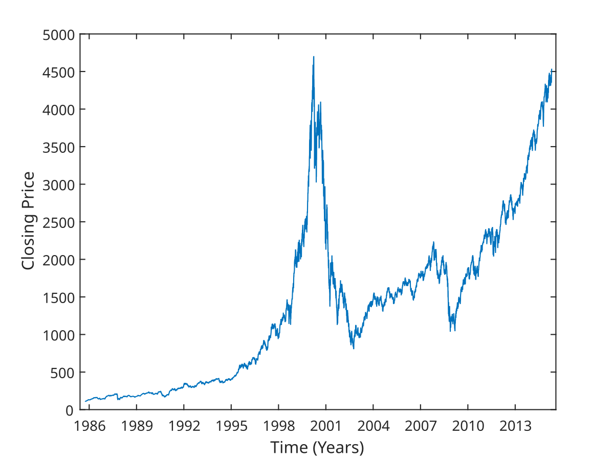

## Table of Contents

## What is the Nasdaq-100 Index?

The Nasdaq-100 Index is a stock market index made up of 100 of the largest non-financial companies listed on the Nasdaq stock exchange. It includes companies from different industries like technology, retail, and healthcare. The index is used as a way to measure how well these big companies are doing in the market. People often use it to see how the technology sector is performing because many tech companies are part of it.

The Nasdaq-100 Index is important for investors because it gives them a quick way to see how these major companies are doing without looking at each one separately. It's also used as a benchmark, which means investors compare their own investments to see if they are doing better or worse than the index. If the Nasdaq-100 goes up, it usually means these big companies are doing well, and if it goes down, it might mean they are not doing so well.

## How is the Nasdaq-100 Index different from the Nasdaq Composite?

The Nasdaq-100 Index and the Nasdaq Composite are both important stock market indexes, but they are different in what they include and measure. The Nasdaq-100 Index includes 100 of the largest non-financial companies listed on the Nasdaq stock exchange. These companies come from various industries, but many are from the technology sector. On the other hand, the Nasdaq Composite includes almost all the companies listed on the Nasdaq, which is over 3,000 companies. This means the Nasdaq Composite gives a broader view of the market because it includes more companies.

Another key difference is that the Nasdaq-100 does not include financial companies, while the Nasdaq Composite does. This makes the Nasdaq-100 more focused on industries like technology, retail, and healthcare. Because the Nasdaq-100 is made up of fewer, but larger companies, it can be more affected by the performance of these big companies. The Nasdaq Composite, with its broader range of companies, can be influenced by a wider variety of factors. So, while the Nasdaq-100 might be a good indicator of how big tech companies are doing, the Nasdaq Composite gives a more general picture of the overall market performance on the Nasdaq exchange.

## What types of companies are included in the Nasdaq-100 Index?

The Nasdaq-100 Index includes 100 of the biggest companies that are not in the finance industry and are listed on the Nasdaq stock exchange. These companies come from many different areas like technology, retail, and healthcare. The index is well-known for having a lot of technology companies, which makes it a good way to see how the tech industry is doing.

Because the Nasdaq-100 focuses on big companies outside of finance, it gives investors a clear view of how these major players are performing. This can be helpful for people who want to know how industries like technology or healthcare are doing without looking at each company one by one. The index is used as a benchmark, which means people compare their own investments to see if they are doing better or worse than these big companies.

## How are companies selected for inclusion in the Nasdaq-100 Index?

Companies are chosen for the Nasdaq-100 Index based on a few important rules. The main rule is that the company must be one of the biggest non-financial companies listed on the Nasdaq stock exchange. They look at how much the company is worth, which is called its market value. The 100 companies with the highest market values that meet these rules get to be in the index.

Another rule is that the company can't be in the finance industry, like banks or insurance companies. This is why the Nasdaq-100 is known for having a lot of technology, retail, and healthcare companies. The index is checked every year in December, and they might add or remove companies to make sure it still has the 100 biggest non-financial companies. If a company gets too small or stops meeting the rules, it might be taken out of the index.

## What is the weighting methodology used in the Nasdaq-100 Index?

The Nasdaq-100 Index uses a modified capitalization weighting method. This means that the bigger a company is, the more it affects the index. But it's not just about size. They make some changes to make sure no single company has too much power over the index. They do this by setting a limit on how much any one company can influence the index, which is called a cap. This way, even if a company is huge, it won't make the whole index move too much by itself.

This method helps keep the index balanced. It gives a good picture of how the 100 biggest non-financial companies on the Nasdaq are doing, without letting any one company take over. The weights are checked and can be changed every quarter to make sure they still fit the rules. This helps the Nasdaq-100 stay a useful tool for investors who want to see how these big companies are doing overall.

## How often is the Nasdaq-100 Index rebalanced?

The Nasdaq-100 Index is rebalanced every quarter. This means they check and adjust the weights of the companies in the index four times a year. They do this to make sure the index still follows its rules and that no single company has too much power over the index.

During the rebalance, they look at the size of each company and might change how much each company affects the index. This helps keep the index fair and useful for investors who want to see how the big non-financial companies on the Nasdaq are doing.

## What are the historical performance trends of the Nasdaq-100 Index?

The Nasdaq-100 Index has had a lot of ups and downs over the years. It started in 1985 and has grown a lot since then. In the late 1990s, the index saw huge growth because of the internet boom. Many tech companies were doing really well, and this made the Nasdaq-100 go up a lot. But then, in 2000, there was a big drop called the dot-com bubble burst. A lot of tech companies lost value, and the index fell sharply. After that, it took a while for the Nasdaq-100 to recover, but it did, and it kept growing over time.

In more recent years, the Nasdaq-100 has had some big jumps and falls too. During the 2008 financial crisis, the index went down a lot because the whole economy was struggling. But after that, it started to go up again. In the last few years, especially since 2020, the Nasdaq-100 has seen big gains. This is because of things like the growth of big tech companies and the rise of new technologies like AI and cloud computing. But it's important to remember that the stock market can be unpredictable, and the Nasdaq-100 can go up and down based on many different things.

## How does the Nasdaq-100 Index impact the broader financial markets?

The Nasdaq-100 Index has a big impact on the broader financial markets because it includes many of the biggest and most important companies, especially in the technology sector. When the Nasdaq-100 goes up or down, it can affect how people feel about the whole market. If the index is doing well, it can make investors feel more confident and they might be more willing to invest in other parts of the market too. On the other hand, if the Nasdaq-100 goes down a lot, it can make people worried and they might start selling their investments, which can cause other parts of the market to go down too.

The Nasdaq-100 also acts like a guide for investors. Many people use it to see how the tech industry is doing, and this can influence where they choose to put their money. For example, if the Nasdaq-100 is growing, investors might decide to buy more tech stocks or invest in funds that follow the index. This can lead to more money flowing into the tech sector and other related industries. Overall, the performance of the Nasdaq-100 can shape how the whole market moves and where investors decide to put their money.

## What are the major ETFs and mutual funds that track the Nasdaq-100 Index?

There are several major ETFs and mutual funds that track the Nasdaq-100 Index. One of the most popular is the Invesco QQQ Trust (QQQ), which is an ETF that tries to match the performance of the Nasdaq-100. It's very popular with investors because it's easy to buy and sell, and it gives them a way to invest in the big companies in the index without having to buy each stock separately. Another ETF that tracks the Nasdaq-100 is the Invesco NASDAQ 100 ETF (QQQM), which is similar to QQQ but has lower fees.

There are also mutual funds that follow the Nasdaq-100 Index. One example is the Fidelity Nasdaq Composite Index Fund (FNCMX), which, while not exactly tracking the Nasdaq-100, closely follows the broader Nasdaq Composite, which includes the Nasdaq-100 companies. These mutual funds can be a good choice for people who want to invest in the Nasdaq-100 but prefer the structure and management of a mutual fund. Both ETFs and mutual funds that track the Nasdaq-100 give investors a way to spread their money across many big companies and benefit from their growth.

## How can investors use the Nasdaq-100 Index to diversify their portfolios?

Investors can use the Nasdaq-100 Index to diversify their portfolios by investing in funds that track the index, like ETFs or mutual funds. This means they can own a little bit of all the big companies in the Nasdaq-100 without having to buy each stock one by one. By doing this, investors spread their money across different industries like technology, retail, and healthcare. This can help lower the risk because if one company or industry doesn't do well, the others might still be okay.

Using the Nasdaq-100 for diversification is also good because it focuses on non-financial companies. This means investors can balance their portfolios by adding non-financial stocks if they already have a lot of financial stocks. Plus, since the Nasdaq-100 has a lot of tech companies, it can help investors get exposure to the technology sector, which is known for growth. By investing in a Nasdaq-100 fund, investors can enjoy the growth of these big companies while keeping their investments spread out.

## What are the key risks associated with investing in the Nasdaq-100 Index?

Investing in the Nasdaq-100 Index comes with some risks that investors should know about. One big risk is that the index is heavily focused on the technology sector. This means if tech companies don't do well, the whole index can go down a lot. Since a few big tech companies have a lot of power over the index, if something bad happens to one of those big companies, it can really hurt the index's performance. Also, because the Nasdaq-100 doesn't include financial companies, it might not give investors a full picture of the market, which could be a problem if other parts of the economy are doing better.

Another risk is that the stock market can be unpredictable. The Nasdaq-100 can go up and down based on things like economic news, changes in interest rates, or even world events. This means investors might see big changes in the value of their investments. If the market goes down a lot, it can be scary and some people might sell their investments at a bad time, which can lead to losses. It's important for investors to be ready for these ups and downs and think about how much risk they are comfortable with before they invest in the Nasdaq-100.

## How do global economic factors influence the performance of the Nasdaq-100 Index?

Global economic factors can have a big impact on the Nasdaq-100 Index. When the world economy is doing well, companies in the Nasdaq-100, especially the big tech companies, often see more people buying their products and services. This can make their stock prices go up and the whole index do better. But if there are problems in the global economy, like a slowdown or a crisis, it can hurt these companies. They might sell less, and their stock prices can go down, which makes the Nasdaq-100 go down too.

Things like changes in interest rates, trade policies, and currency values can also affect the Nasdaq-100. For example, if interest rates go up in a big country like the United States, it can make borrowing money more expensive for companies. This can slow down their growth and hurt their stock prices. Also, if there are new trade rules or tariffs, it can make it harder for companies to sell their products in other countries, which can affect their profits and the index's performance. So, keeping an eye on what's happening around the world is important for understanding how the Nasdaq-100 might do.

## What are NASDAQ-100 Index Products?

### NASDAQ-100 Index Products

The NASDAQ-100 Index provides various financial products for investors, enabling diverse investment strategies and exposure to this significant segment of the stock market.

**Exchange-Traded Funds (ETFs):** 

Exchange-Traded Funds (ETFs) linked to the NASDAQ-100 Index have become popular among investors for their [liquidity](/wiki/liquidity-risk-premium), accessibility, and lower expense ratios. In the United States, prominent ETFs tracking the NASDAQ-100 include the Invesco QQQ Trust, Series 1 (commonly known as QQQ). This [ETF](/wiki/etf-trading-strategies) provides exposure to the largest non-financial companies listed on the NASDAQ Stock Market. Internationally, ETFs listed in Europe and Asia, such as the Lyxor NASDAQ-100 UCITS ETF and the iShares NASDAQ-100 UCITS ETF, also offer opportunities for overseas investors to participate in the performance of the NASDAQ-100 Index.

**NASDAQ-100 Futures and Futures Options:**

The CME Group provides NASDAQ-100 Futures and Futures Options, which are vital tools for managing risk and leveraging exposure to the index. Futures contracts on the NASDAQ-100 allow investors to speculate on the future value of the index, while futures options offer the right, but not the obligation, to purchase or sell a futures contract at a predetermined strike price before a specified expiration date. The calculation of the profit or loss for a futures contract can be represented as:

$$
\text{Profit/Loss} = (\text{Selling Price} - \text{Buying Price}) \times \text{Contract Size}
$$

These derivatives enable investors to hedge against market risk, effectively providing a buffer against unfavorable price movements.

**NASDAQ-100 Index Options:**

NASDAQ-100 Index Options trade on multiple exchanges, including the Chicago Board Options Exchange (CBOE) and the NASDAQ Options Market. These options are European in style, meaning they can only be exercised at expiration, providing strategic flexibilities such as hedging and speculating on index movements.

Options offer intrinsic benefits, such as defining maximum loss, which can be represented mathematically:

$$
\text{Maximum Loss} = \text{Premium Paid}
$$

This characteristic makes them attractive for investors looking to manage investment risks effectively. Additionally, these options are utilized by portfolio managers to replicate the performance of the NASDAQ-100 Index, contributing to efficient fund management.

In conclusion, the NASDAQ-100 Index Products cater to a diverse range of investor needs, from tactical trading to comprehensive risk management strategies. By providing broad exposure to major technology-driven companies while offering robust financial instruments, these products play a critical role in modern investment portfolios.

## References & Further Reading

[1]: Fabozzi, F. J., & Francis, J. C. (1977). ["Market Indexes and Investment Management."](https://onlinelibrary.wiley.com/doi/book/10.1002/9781118267028) The Journal of Finance.

[2]: Lam, K. Y., Li, K., & So, M. K. (2010). ["The Value of Information in NASDAQ-100 Index Options."](https://pubmed.ncbi.nlm.nih.gov/30523741/) The Journal of Futures Markets.

[3]: ["Algorithms for High-Frequency Trading"](https://www.schwab.com/learn/story/high-frequency-algorithmic-trading) by Irene Alda

[4]: Kearney, C., & Liu, S. (2014). ["Textual Sentiment in Finance: A Survey of Methods and Current Trading Strategies."](https://www.sciencedirect.com/science/article/pii/S1057521914000295) International Review of Financial Analysis, 33.

[5]: ["Advances in Financial Machine Learning"](https://www.amazon.com/Advances-Financial-Machine-Learning-Marcos/dp/1119482089) by Marcos Lopez de Prado

[6]: Bloomberg. ["Indices and Product Info."](https://www.bloomberg.com/professional/products/indices/) 

[7]: CME Group. ["Nasdaq-100 Futures and Options."](https://www.cmegroup.com/markets/equities/nasdaq.html)

[8]: Ruan, J., & Wang, K. Q. (2006). ["Rebalancing Weightings of Stock Index Futures."](https://www.sciencedirect.com/science/article/pii/S0147651325000296) Review of Derivatives Research.

[9]: Schumaker, R. P., & Chen, H. (2009). ["Textual Analysis of Stock Market Prediction Using Financial News."](https://dl.acm.org/doi/10.1145/1462198.1462204) ACM Transactions on Information Systems.