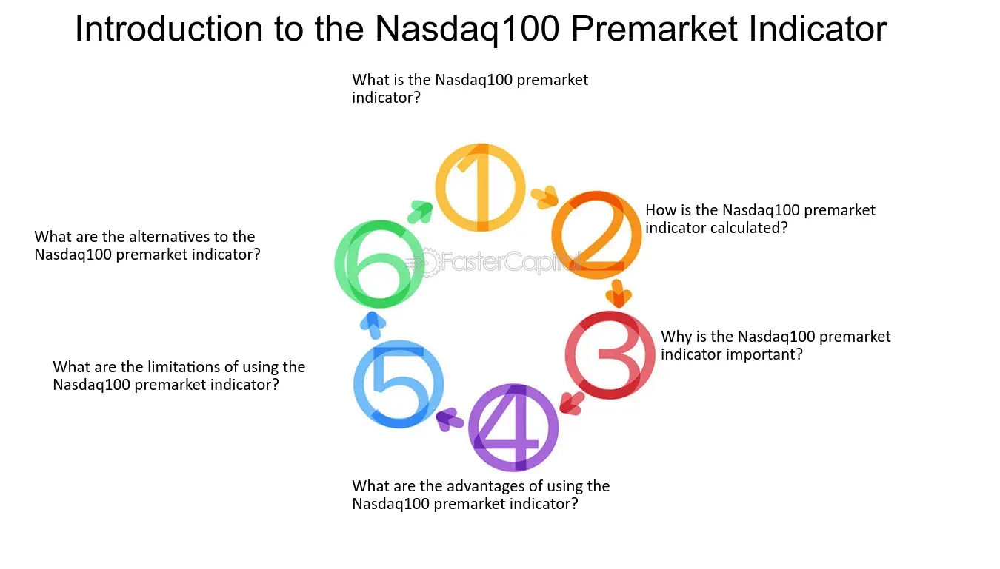

## Table of Contents

## What is the Nasdaq-100?

The Nasdaq-100 is a stock market index made up of 100 of the largest companies listed on the Nasdaq stock exchange. These companies come from different industries, but many are in technology and internet sectors. The index is used to show how these big companies are doing in the stock market. It's a way for investors to see if the tech and other major industries are growing or shrinking.

People can invest in the Nasdaq-100 through something called an exchange-traded fund (ETF), like the Invesco QQQ. This ETF tries to match the performance of the Nasdaq-100. When the index goes up, the ETF usually goes up too, and when the index goes down, the ETF goes down. This makes it easy for people to invest in a lot of big companies at once, without having to buy each stock separately.

## What is a pre-market indicator?

A pre-market indicator is a tool that helps investors see how the stock market might open before it actually starts trading. It shows what's happening with stock prices before the regular trading hours begin, usually between 4:00 AM and 9:30 AM Eastern Time. This can be useful because it gives a sneak peek into what investors might expect when the market opens.

These indicators are based on the buying and selling of stocks that happens before the market officially opens. They can be influenced by news, earnings reports, or other events that happen overnight or early in the morning. By looking at pre-market indicators, investors can make more informed decisions about buying or selling stocks when the market starts.

## How does the Nasdaq-100 Pre-Market Indicator work?

The Nasdaq-100 Pre-Market Indicator shows what might happen to the Nasdaq-100 index before the market opens. It works by looking at the trades that happen early in the morning, from 4:00 AM to 9:30 AM Eastern Time. If people are buying more stocks than selling, the indicator will show that the Nasdaq-100 might go up when the market opens. If more people are selling, it might go down. This helps investors guess what the market will do at the start of the day.

The indicator is important because it can be affected by news or events that happen overnight or early in the morning. For example, if a big company in the Nasdaq-100 announces good news before the market opens, more people might want to buy that company's stock, which would make the pre-market indicator go up. By watching the pre-market indicator, investors can get ready for the day's trading and make better choices about buying or selling stocks when the market starts.

## Why is the Nasdaq-100 Pre-Market Indicator important for investors?

The Nasdaq-100 Pre-Market Indicator is important for investors because it gives them a sneak peek at how the market might open. It shows what's happening with stock prices before the regular trading hours start, usually between 4:00 AM and 9:30 AM Eastern Time. By looking at this indicator, investors can get an idea if the Nasdaq-100 index might go up or down when trading begins. This helps them prepare for the day's trading and make better decisions about buying or selling stocks.

The indicator is influenced by news or events that happen overnight or early in the morning. For example, if a big company in the Nasdaq-100 releases good news before the market opens, more people might want to buy that company's stock, which would make the pre-market indicator go up. By watching the pre-market indicator, investors can react quickly to these changes and adjust their investment strategies accordingly. This can be a big help in making smart choices and possibly [earning](/wiki/earning-announcement) more money in the stock market.

## What types of data does the Nasdaq-100 Pre-Market Indicator use?

The Nasdaq-100 Pre-Market Indicator uses data from trades that happen before the market opens. This includes the buying and selling of stocks between 4:00 AM and 9:30 AM Eastern Time. The indicator looks at how many stocks are being bought compared to how many are being sold. If more stocks are being bought, it suggests that the Nasdaq-100 might go up when the market opens. If more are being sold, it might go down.

This pre-market data can be influenced by news or events that happen overnight or early in the morning. For example, if a company in the Nasdaq-100 announces good news, more people might want to buy its stock, which would affect the pre-market indicator. By using this data, the indicator gives investors an early look at what might happen when the market starts trading.

## How can the Nasdaq-100 Pre-Market Indicator influence trading decisions?

The Nasdaq-100 Pre-Market Indicator can help investors make better trading decisions by giving them an early look at what might happen when the market opens. If the indicator shows that more people are buying stocks before the market starts, it might mean that the Nasdaq-100 will go up when trading begins. This can encourage investors to buy stocks early in the day, hoping to benefit from the expected rise in prices. On the other hand, if the indicator shows more selling, it might suggest that the index could go down, prompting investors to sell their stocks or wait before making new purchases.

The indicator is influenced by news and events that happen overnight or early in the morning. For example, if a big company in the Nasdaq-100 announces good news, like better-than-expected earnings, more people might want to buy its stock. This increased buying activity would be reflected in the pre-market indicator, signaling a possible upward trend at the market's open. By paying attention to the pre-market indicator, investors can adjust their trading strategies based on this early information, potentially leading to more informed and profitable decisions.

## What are the limitations of the Nasdaq-100 Pre-Market Indicator?

The Nasdaq-100 Pre-Market Indicator can help investors guess what might happen when the market opens, but it's not perfect. One big problem is that it only shows what's happening before the market starts. Things can change a lot once trading begins. News or events that happen right after the market opens can make stock prices go up or down in ways the pre-market indicator didn't predict.

Another limitation is that the pre-market trading [volume](/wiki/volume-trading-strategy) is usually lower than during regular trading hours. This means the indicator might not show the full picture of what investors really think. Also, the pre-market indicator can be affected by big trades from just a few people, which might not represent what most investors want to do. So, while it's a helpful tool, investors should use it along with other information to make the best choices.

## How accurate is the Nasdaq-100 Pre-Market Indicator in predicting market trends?

The Nasdaq-100 Pre-Market Indicator gives investors a good guess about what might happen when the market opens, but it's not always right. It looks at the buying and selling of stocks before the market starts, usually between 4:00 AM and 9:30 AM Eastern Time. If more people are buying stocks, the indicator might say the market will go up. If more people are selling, it might say it will go down. This can help investors decide whether to buy or sell stocks early in the day.

However, the pre-market indicator has its limits. It only shows what's happening before the market opens, and things can change a lot once trading starts. News or events that happen right after the market opens can make stock prices move in ways the indicator didn't predict. Also, the trading volume before the market opens is usually lower, so the indicator might not show what most investors really think. It's a useful tool, but investors should use it along with other information to make the best choices.

## Can the Nasdaq-100 Pre-Market Indicator be used for algorithmic trading?

The Nasdaq-100 Pre-Market Indicator can be used for [algorithmic trading](/wiki/algorithmic-trading), but it has its challenges. Algorithmic trading uses computer programs to buy and sell stocks based on certain rules. The pre-market indicator gives these programs early information about what might happen when the market opens. If the indicator shows more buying than selling, the algorithm might decide to buy stocks, hoping to make money when the market goes up. But, the indicator is not always right because things can change a lot once trading starts.

Because of this, using the pre-market indicator for algorithmic trading needs careful planning. The indicator only shows what's happening before the market opens, and the trading volume is usually lower. This means the information might not be as reliable as during regular trading hours. Also, big trades from just a few people can affect the indicator a lot. So, while it can be a helpful tool, algorithms should use it along with other data to make the best trading decisions.

## How does the Nasdaq-100 Pre-Market Indicator compare to other market indicators?

The Nasdaq-100 Pre-Market Indicator is one of many tools investors use to predict how the stock market might open. It looks at the buying and selling of stocks before the market starts, usually between 4:00 AM and 9:30 AM Eastern Time. This gives investors an early look at what might happen when trading begins. Other market indicators, like the Dow Jones Industrial Average Pre-Market Indicator or the S&P 500 Pre-Market Indicator, do similar things but focus on different groups of stocks. The Nasdaq-100 Pre-Market Indicator is especially useful for people interested in tech and internet companies because the Nasdaq-100 includes many of these types of companies.

However, the Nasdaq-100 Pre-Market Indicator has some differences from other indicators. It might be more affected by big news from tech companies because they make up a large part of the index. Also, the trading volume before the market opens can be lower, which means the indicator might not always show what most investors think. Other indicators, like the VIX (Volatility Index), look at different things, like how much the market might move up or down, rather than just the direction of the market. So, while the Nasdaq-100 Pre-Market Indicator is helpful, it's good to use it along with other indicators to get a full picture of what might happen in the market.

## What historical data is available for the Nasdaq-100 Pre-Market Indicator?

Historical data for the Nasdaq-100 Pre-Market Indicator can be found going back many years. This data shows how the indicator performed before the market opened each day. You can see what the indicator predicted and then compare it to what actually happened when the market started trading. This helps people understand how accurate the indicator has been over time. Websites like Nasdaq's official site, financial news services, and data providers like Bloomberg or Yahoo Finance often have this information available.

Looking at past data can show patterns and trends. For example, you might see that the indicator is more accurate on certain days or during certain times of the year. This can help investors make better guesses about what might happen next. However, it's important to remember that past performance doesn't always tell us what will happen in the future. The market can be unpredictable, and other factors can change things quickly. So, while historical data is useful, it should be used along with other information to make the best decisions.

## How has the functionality of the Nasdaq-100 Pre-Market Indicator evolved over time?

The Nasdaq-100 Pre-Market Indicator has changed a lot over the years to help investors better. At first, it just showed what was happening with stock prices before the market opened. But now, it uses more data and better technology to give a clearer picture. It looks at more things like how many stocks are being bought and sold, and it can even show how news or events might affect the market. This makes it easier for investors to guess what might happen when trading starts.

Over time, the way people can use the Nasdaq-100 Pre-Market Indicator has also gotten better. Now, you can find the indicator's data on many websites and through different services. This means more people can see it and use it to make decisions. Also, the indicator now works with other tools and data, so investors can use it along with other information to get a full view of the market. This has made the Nasdaq-100 Pre-Market Indicator a more useful tool for anyone trying to understand what might happen in the stock market.

## References & Further Reading

[1]: ["How to Use the Pre-Market Indicator"](https://www.youtube.com/watch?v=eK-txfazEiQ) on Nasdaq.com

[2]: Lopez de Prado, M. (2018). ["Advances in Financial Machine Learning,"](https://www.amazon.com/Advances-Financial-Machine-Learning-Marcos/dp/1119482089) Wiley.

[3]: Chan, E. P. (2008). ["Quantitative Trading: How to Build Your Own Algorithmic Trading Business."](https://github.com/ftvision/quant_trading_echan_book) Wiley.

[4]: Jansen, S. (2020). ["Machine Learning for Algorithmic Trading: Predictive models to extract signals from market and alternative data for systematic trading strategies with Python."](https://github.com/stefan-jansen/machine-learning-for-trading) Packt Publishing.

[5]: Aronson, D. R. (2007). ["Evidence-Based Technical Analysis: Applying the Scientific Method and Statistical Inference to Trading Signals."](https://onlinelibrary.wiley.com/doi/book/10.1002/9781118268315) Wiley.